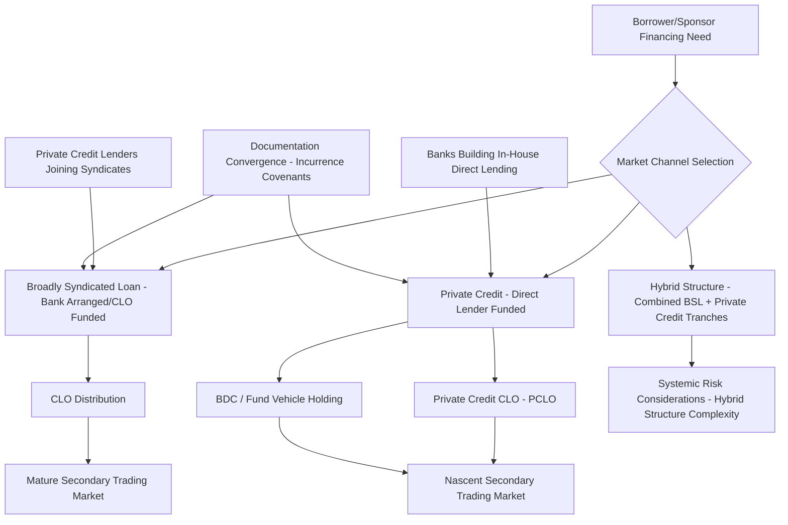

## Private Credit and Broadly Syndicated Loan Market Convergence

### Overview

Private credit and broadly syndicated loan (BSL) market convergence refers to the accelerating blending of two historically distinct leveraged finance channels: bank-arranged, widely-distributed syndicated loans (funded largely through CLOs and institutional investors) and privately negotiated, non-bank direct lending (historically funded by dedicated private credit funds and business development companies). By 2026, market participants and structurers increasingly treat these as **interconnected components of a single financing ecosystem** rather than as discrete, competing alternatives, with direct lending having grown to roughly match the BSL market in size (both estimated in the $1.5–2 trillion range, with private credit forecast to reach approximately $3 trillion by 2028). Direct lending has grown to match the broadly syndicated loan market at roughly $1.5–2 trillion in size and is forecast to reach $3 trillion by 2028, with private credit having expanded beyond direct lending into strategies including asset-backed finance and debt-equity hybrid capital. [Cleary Gottlieb](https://www.clearygottlieb.com/news-and-insights/publication-listing/outlook-for-private-credit-in-2026)

### Key Drivers of Convergence

#### 1. Banks Building Direct Lending Capabilities In-House

Rather than ceding the direct lending market entirely to non-bank funds, major banks have moved to build parallel private credit capacity alongside their traditional syndication franchises. J.P. Morgan announced a $50 billion expansion of its direct lending commitment from its own balance sheet, plus nearly $15 billion from co-lenders, explicitly to extend its direct lending capabilities and provide tailored private credit solutions alongside its existing syndicated loan and bond products. A subsequent commitment brought the firm's total direct lending allocation to $65 billion, with continued emphasis on pairing its origination platform with a broad lender client base to deliver scale for borrowers. [J.P. Morgan](https://www.jpmorgan.com/about-us/corporate-news/2025/jpmorgan-increases-direct-lending-commitment-to-50-billion)[Alternatives Watch](https://www.alternativeswatch.com/2025/02/24/jp-morgan-commits-65bn-to-expand-private-credit-capabilities/)

This is not purely a defensive move. JPMorgan's direct lending build-out has been housed within its asset management fixed-income business rather than its alternatives operations, reflecting an institutional view that public and private credit markets are destined to converge, with commercial bankers sourcing loans that the asset management arm then takes positions in. [Advisor Perspectives](https://www.advisorperspectives.com/articles/2026/04/23/jpmorgan-readies-private-credit-push-needling-market)

#### 2. Private Credit Participation Alongside Arrangers in Syndicated Deals

Private credit lenders increasingly participate alongside traditional arrangers in complex syndicated transactions, and borrowers now routinely evaluate both markets in parallel when structuring a financing. This has given rise to **hybrid financing structures** that combine syndicated tranches with privately placed tranches in a single capital structure. [Legal 500](https://www.legal500.com/guides/hot-topic/us-recent-trends-in-private-credit-and-syndicated-loan-markets/)

#### 3. Documentation and Terms Convergence at the Upper End

Gradual convergence is expected at the upper end of the sponsor-backed market, particularly regarding incurrence-based covenant terms, while middle-market private credit is likely to remain differentiated by relationship-driven controls and a greater prevalence of maintenance covenants even as sponsors push for harmonized documentation across both channels. [Legal 500](https://www.legal500.com/guides/hot-topic/us-recent-trends-in-private-credit-and-syndicated-loan-markets/)

#### 4. Regulatory Retrenchment on the Bank Side

In a notable regulatory shift, the OCC and FDIC formally withdrew the 2013 Interagency Leveraged Lending Guidance and its related 2014 FAQs in December 2025, with the agencies stating the prior framework was overly restrictive and overly broad. This withdrawal removes a supervisory constraint that had historically pushed some higher-leverage transactions away from regulated banks and toward private credit, potentially reshaping the competitive balance between the two channels going forward. [Inference: the practical effect of this withdrawal on bank risk appetite and deal flow will depend on how examiners apply remaining safety-and-soundness expectations in practice, and should be monitored as the change is recent.] [Legal 500](https://www.legal500.com/guides/hot-topic/us-recent-trends-in-private-credit-and-syndicated-loan-markets/)

### Structural Segment Where Private Credit Has Gained Ground

**Key Points**

- Private credit lending has exceeded broadly syndicated loan issuance for 'B-' and below-rated borrowers for four consecutive years, with private credit reaching nearly $146 billion in 2025 compared to approximately $85 billion in broadly syndicated lending for that ratings segment. [spglobal](https://press.spglobal.com/2026-02-17-Private-Credit,-Tech-Issuance-fuelled-by-AI,-and-Increasing-Leverage-Among-Key-Driving-Factors-Impacting-Credit-Market-Liquidity-in-2026-according-to-S-P-Global-Ratings)
- U.S. maturities of 'B-' and below-rated debt are projected to surge to a peak of $215 billion in 2028, up from $56.6 billion in 2026, creating significant refinancing pressure for leveraged borrowers in exactly the segment where private credit has become dominant. [spglobal](https://press.spglobal.com/2026-02-17-Private-Credit,-Tech-Issuance-fuelled-by-AI,-and-Increasing-Leverage-Among-Key-Driving-Factors-Impacting-Credit-Market-Liquidity-in-2026-according-to-S-P-Global-Ratings)
- This concentration of private credit in lower-rated credits means that as convergence proceeds, banks and CLO-funded syndication desks are increasingly competing directly with direct lenders precisely in the riskier part of the leveraged finance spectrum, rather than the two markets remaining cleanly segmented by borrower quality.

### Market Bifurcation Coexisting With Convergence

**Key Points**

- Credit markets became increasingly bifurcated in 2026, with capital flowing to higher-quality borrowers while sponsor-backed, software, and lower-rated credits faced greater pricing pressure and tighter financing conditions. [Sikich](https://www.sikich.com/insight/q2-2026-credit-market-update/)
- Corporate borrowers sustained leveraged loan issuance even as private equity activity slowed, demonstrating resilience in the broadly syndicated loan market, while private credit entered a more disciplined phase marked by slower deal activity, wider spreads, and growing emphasis on underwriting quality as the market recalibrated. [Sikich](https://www.sikich.com/insight/q2-2026-credit-market-update/)
- Software's share of broadly syndicated loan issuance fell sharply to 8.8% year-to-date in 2026, down from 17.6% in 2025 and its lowest level since 2013, illustrating how sector-specific credit stress can reroute issuance flow between the two channels. [Sikich](https://www.sikich.com/insight/q2-2026-credit-market-update/)
- Convergence, in other words, is occurring alongside a widening quality divide — the two markets are more interconnected in mechanism and participants even as they diverge in which borrowers each channel is willing to serve on favorable terms.

### Hybrid Financing Structures in Practice

**Key Points**

- Mega deals increasingly rely on hybrid financing that combines syndicated loans and private credit, even as traditional LBO volumes remain subdued, with sponsor-to-sponsor transactions, dividend recapitalizations, and strategic add-ons sustaining overall deal activity. [Moody's](https://www.moodys.com/web/en/us/creditview/blog/leveraged-finance-and-clo-2026.html)
- The convergence of private credit and BSL markets raises systemic risk considerations, with the bankruptcies of Tricolor and First Brands underscoring vulnerabilities in hybrid financing structures that combine public and private debt. [Inference: the specific causal role of hybrid structuring in these individual bankruptcy cases is a matter of ongoing market and regulatory analysis rather than a settled, uniformly agreed conclusion.] [Moody's](https://www.moodys.com/web/en/us/creditview/blog/leveraged-finance-and-clo-2026.html)
- **Private Credit CLOs (PCLOs)**: an emerging securitization structure adapting the CLO technology historically used for broadly syndicated loans to private credit collateral pools, extending the funding and distribution mechanics of the BSL market into the direct lending space. One major bank completed what it described as the largest PCLO of 2025, a $1.25 billion deal, reflecting the underpinnings of the public broadly syndicated loan market's CLO technology being adapted for private credit assets. [J.P. Morgan](https://www.jpmorgan.com/insights/podcast-hub/market-matters/private-credit-branches-out)

### Secondary Market Liquidity: A Key Remaining Divergence

**Key Points**

- Private credit's secondary trading market remains in its early stages, with trading practices still not fully standardized; borrowers value the relationship stability and confidentiality that private markets provide relative to public markets, and private credit lenders may be reluctant to mark their portfolios to reflect market prices, particularly where the market is illiquid or non-transparent. [Cleary Gottlieb](https://www.clearygottlieb.com/news-and-insights/publication-listing/outlook-for-private-credit-in-2026)
- This stands in contrast to the broadly syndicated loan market's mature secondary trading infrastructure (standardized LSTA/LMA trading documentation, established mark-to-market conventions, and active dealer intermediation), representing one of the most persistent structural differences even as origination-side convergence accelerates.

### Diagram: Convergence Mechanisms Between BSL and Private Credit

### Diagram: Market Size and Segment Convergence (svg_diagram)

<svg xmlns="http://www.w3.org/2000/svg" viewBox="0 0 800 320">
<text x="400" y="24" text-anchor="middle" font-size="16" font-weight="bold" fill="#1a1a1a">BSL and Private Credit Convergence Zones (svg_diagram)</text>
<ellipse cx="280" cy="170" rx="220" ry="120" fill="#bee3f8" opacity="0.55" stroke="#2b6cb0" />
<text x="180" y="120" font-size="13" fill="#1a365d">Broadly Syndicated</text>
<text x="180" y="138" font-size="13" fill="#1a365d">Loans (BSL)</text>
<ellipse cx="520" cy="170" rx="220" ry="120" fill="#fed7d7" opacity="0.55" stroke="#c53030" />
<text x="580" y="120" font-size="13" fill="#742a2a">Private Credit /</text>
<text x="580" y="138" font-size="13" fill="#742a2a">Direct Lending</text>

<text x="400" y="175" text-anchor="middle" font-size="12" fill="`#22543d`" font-weight="bold">Convergence Zone</text>

<text x="400" y="193" text-anchor="middle" font-size="11" fill="`#22543d`">Hybrid Deals, PCLOs,</text>

<text x="400" y="209" text-anchor="middle" font-size="11" fill="`#22543d`">Bank Direct Lending Arms,</text>

<text x="400" y="225" text-anchor="middle" font-size="11" fill="`#22543d`">Documentation Harmonization</text>

<text x="140" y="270" font-size="12" fill="`#1a365d`">Mature Secondary Trading</text>

<text x="580" y="270" font-size="12" fill="`#742a2a`">Nascent Secondary Trading</text>

<text x="140" y="290" font-size="12" fill="`#1a365d`">CLO-Funded Distribution</text>

<text x="580" y="290" font-size="12" fill="`#742a2a`">Fund/BDC-Held, Relationship-Driven</text>

</svg>

### Example: A Sponsor Weighing BSL vs. Private Credit vs. Hybrid Structuring

**Example**

A sponsor evaluating a $1.2B financing for a leveraged buyout of a software company faces a market where software issuance in the BSL market has contracted sharply. The sponsor's advisors run parallel processes: a broadly syndicated term loan B (offering potentially tighter pricing if a syndicate can be formed, but subject to rating-agency timelines and market execution risk) and a direct lending club solution from two to three private credit funds (offering speed, certainty of execution, and more flexible EBITDA addback treatment, at a wider spread). Given current bifurcation trends disfavoring lower-quality and software-sector BSL issuance, the sponsor ultimately structures a hybrid solution: a smaller syndicated first-lien tranche placed with a handful of CLO managers already comfortable with the credit, combined with a larger private credit unitranche piece providing the bulk of the debt capital and execution certainty — reflecting the broader market pattern of mega and near-mega deals increasingly blending both channels rather than choosing one exclusively.

### Implications for Lead Arrangers and Syndication Desks

**Key Points**

- Arrangers increasingly act as intermediaries across both channels rather than pure BSL specialists, originating a credit and then determining — sometimes deal-by-deal — whether syndicated distribution, direct private placement, or a hybrid split best serves execution certainty and pricing.
- Competitive dynamics mean arrangers must maintain relationships with both traditional institutional BSL investors (CLOs, loan mutual funds) and private credit fund counterparts to offer sponsors optionality, rather than being confined to a single distribution channel.
- The regulatory withdrawal of the 2013 leveraged lending guidance may reduce one historical friction point that pushed higher-leverage deals toward private credit, potentially shifting some deal flow back toward bank-led syndication over time, though the durability and magnitude of this effect remains to be seen in practice.

### Common Pitfalls

- Treating BSL and private credit as permanently separate, non-competing markets when current structuring practice increasingly blends the two within a single capital structure.
- Assuming documentation terms are converging uniformly across the market, when convergence is concentrated at the upper end of the sponsor-backed market while middle-market private credit retains distinct maintenance-covenant-driven structures.
- Overlooking those secondary market liquidity and mark-to-market practices remain a genuine, unresolved structural difference between the two channels even as primary-market origination converges.
- Underestimating how sector-specific bifurcation (e.g., the sharp decline in software's BSL share) can shift issuance volume between channels independent of overall convergence trends.

### Related Topics

**Related Topics**

- Private Credit Collateralized Loan Obligations (PCLOs) — Structuring and Investor Base
- Unitranche Facility Mechanics and Agent-Among-Lenders (AAL) Arrangements
- Bank-Fund Co-Lending Partnership Models (Balance-Sheet-to-Fund Origination)
- Documentation Harmonization Trends: Incurrence vs. Maintenance Covenant Convergence
- Withdrawal of the 2013 Interagency Leveraged Lending Guidance and Its Effect on Bank Underwriting Appetite
- Secondary Market Liquidity Development in Private Credit: Trading Standardization Challenges