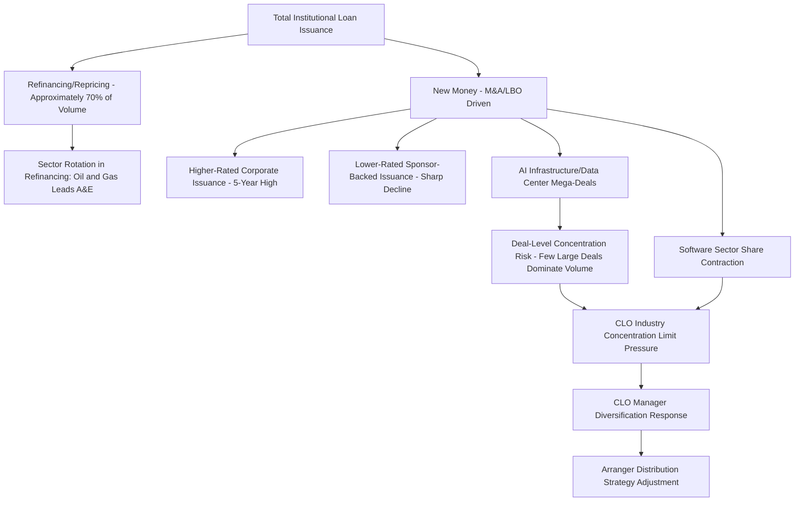

## Sector Rotation and Concentration in Institutional Loan Issuance

### Overview

Sector rotation and concentration in institutional loan issuance describes how the composition of the institutional term loan market (the segment of leveraged loans structured for CLOs and other institutional investors, as distinct from pro rata bank/finance-company debt) shifts across industries and credit-quality tiers over time, and how that shifting composition can create pockets of correlated risk within CLO portfolios and syndication pipelines. In 2026, this dynamic has been particularly pronounced, marked by a pronounced bifurcation between higher-rated and lower-rated/sponsor-backed issuance, a sharp contraction in software-sector volume, and growing concentration around a small number of mega-deals and AI-infrastructure-linked financings.

### Institutional vs. Pro Rata Issuance: The Base Distinction

**Key Points**

- Institutional debt consists of term loans (typically Term Loan B) structured specifically for institutional investors, including CLOs, while pro rata debt typically entails amortizing revolving credit facilities and term loan A tranches traditionally syndicated to finance companies and banks.
- Year-to-date in 2026, the distribution between institutional amend-and-extend (A&E) issuance ($36.2 billion) and pro rata A&E issuance ($42.7 billion) has been fairly balanced, though the composition shifts month to month — for example, one month's A&E activity was heavily concentrated in institutional deals ($15.7 billion versus $9.7 billion in pro rata volume).
- This distinction matters for concentration analysis because institutional (CLO-eligible) paper is the segment most exposed to sector and credit-quality concentration risk within CLO portfolios, since CLO managers face their own diversification and concentration limit tests under deal documentation.

### The 2026 Bifurcation Pattern

**Key Points**

- The leveraged loan market has been notably bifurcated by credit quality: issuance of new loans by lower-rated companies backed by private-equity sponsors declined sharply (down roughly 33% in one quarter, the lowest reading since Q4 2023), while higher-rated corporate borrowers raised a five-year-high volume in the same period, a 41% year-over-year increase, including a $13 billion loan for a major media/entertainment issuer that stood as the largest institutional loan since 2008.
- Total institutional loan activity ran at approximately $224 billion in Q2 2026, modestly below the roughly $240 billion recorded in Q1 2026, with refinancing and repricing activity accounting for around 70% of total volume rather than new-money issuance.
- Overall leveraged loan primary market activity started 2026 roughly 34% behind the prior year's pace, with the shortfall concentrated in the more opportunistic categories — refinancings trailing by about 42% and repricings by about 39% relative to the same period in 2025.
- M&A-driven broadly syndicated loan issuance reached a four-year high in one quarter, but that headline figure masked notable underlying concentration in both a handful of mega-deals and in higher-rated borrowers specifically, rather than reflecting broad-based issuance strength.

### Sector-Level Rotation Patterns

**Key Points**

- **Software's sharp contraction**: software's share of broadly syndicated loan issuance fell to just 8.8% year-to-date in 2026, down from 17.6% in 2025 and its lowest level since 2013, reflecting sector-specific stress and AI-related disruption concerns affecting software-sector credit.
- **Oil & Gas leading refinancing activity**: the Oil & Gas sector topped amend-and-extend volume year-to-date at 16% of activity, followed by Retail and Services & Leasing at 9% each, indicating these sectors have been proactively addressing upcoming maturities ahead of a maturity wall.
- **AI infrastructure as an emerging concentration point**: AI infrastructure, power, and data center investment represent an increasingly important source of financing demand, with large individual financings — including a data-center-linked loan package exceeding $38 billion for one issuer and a roughly $5 billion facility backing a business-process acquisition — illustrating how a small number of very large, thematically related deals can constitute a meaningful share of total quarterly issuance.
- **Retail & Consumer Products flagged as most distress-prone**: in an industry survey, Retail & Consumer Products was cited as the sector most likely to experience distress in 2026, with more survey respondents naming it as the top distress risk than in the prior year's survey.
- **Chemicals and building materials softness**: pockets of weakness were also flagged in the chemicals and building materials sectors, alongside company-specific idiosyncratic risks, even as the broader market outlook remained comparatively steady.

### Maturity Wall Concentration as a Forward-Looking Concentration Risk

**Key Points**

- A growing concentration of 2028 debt maturities among sponsor-backed and lower-rated issuers is driving elevated refinancing and extension activity well ahead of the actual maturity dates, as issuers and arrangers proactively manage the wall rather than waiting.
- U.S. maturities of 'B-' and below-rated debt are projected to surge to a peak of $215 billion in 2028, up sharply from $56.6 billion in 2026, meaning the market's current refinancing-heavy composition is itself a response to anticipated future concentration in lower-quality maturities.
- Understanding why maturities are being pulled forward, and how CLO reinvestment capacity interacts with refinancing needs, is described by market analysts as essential for forecasting issuance volumes, assessing market liquidity, and managing sector-specific risk where maturity concentration is most acute.

### Quantitative Framing: Concentration Metrics Applied to Issuance Composition

#### Sector Share of Issuance

$$\text{Sector Share}_i = \frac{\text{Institutional Issuance Volume}_i}{\text{Total Institutional Issuance Volume}}$$

Tracking this ratio over time (as with the software sector's decline from 17.6% to 8.8%) is the most direct measure of sector rotation within the primary institutional loan market.

#### Herfindahl-Hirschman Index Applied to Deal-Level Concentration

As with portfolio concentration analysis generally:

$$HHI_{issuance} = \sum_{i=1}^{n} s_i^2$$

where $s_i$ is a single deal's share of total quarterly institutional issuance. A quarter where a handful of mega-deals (e.g., a large data-center financing package alongside a landmark media-sector loan) constitute an outsized share of total volume produces a materially higher HHI than a quarter with broadly distributed issuance across many mid-sized deals — precisely the pattern observed when M&A-driven issuance reaching a multi-year high was described as masking underlying deal-count concentration.

### Interaction With CLO Manager Behavior

**Key Points**

- CLO documentation typically imposes industry concentration limits (e.g., caps on exposure to any single Moody's or S&P industry classification) precisely to prevent a CLO portfolio from becoming overly exposed to sector-level rotation risk of the kind observed in software or energy.
- Market commentary for 2026 explicitly frames the environment as favoring CLO managers who avoid excessive concentration and instead focus on credit selection to mitigate downside risk, given tight valuations and a technical backdrop of strong ETF and institutional demand alongside high redemption and amortization volumes.
- Borrowers are increasingly shopping between the broadly syndicated loan and private credit markets, leveraging competitive pricing and flexible terms, which can itself concentrate certain sectors or credit-quality tiers into one channel or the other depending on relative execution certainty and pricing at a given time — for instance, weaker sponsor-backed issuance moving toward private credit while higher-rated corporate issuance concentrates in the broadly syndicated channel.

### Example: A Syndication Desk Managing Sector Rotation Risk

**Example**

A lead arranger's institutional loan desk observes that software-sector deal flow has contracted to roughly half its prior-year share of total issuance, while AI-infrastructure and data-center financings have grown to represent an outsized portion of large new-money transactions. Recognizing that several CLO accounts in its typical distribution base are approaching their internal technology-sector concentration limits due to prior software-heavy vintages, the desk proactively diversifies its origination pipeline toward higher-rated corporate issuers and energy-sector refinancing mandates (where amend-and-extend activity remains robust) to maintain distribution capacity. For an upcoming AI-infrastructure-linked mega-deal, the desk anticipates that a subset of its usual CLO buyers may have limited remaining capacity given sector and single-name concentration limits tied to other large technology-infrastructure exposures already in their portfolios, and adjusts its target investor list accordingly — including exploring private credit co-investment for a portion of the facility to avoid overloading any single CLO manager's sector bucket.

### Diagram: Sector Rotation Dynamics in Institutional Loan Issuance

### Diagram: 2026 Sector Share Shift — Software vs. Broader Market (svg_diagram)

<svg xmlns="http://www.w3.org/2000/svg" viewBox="0 0 800 300">
<text x="400" y="24" text-anchor="middle" font-size="16" font-weight="bold" fill="#1a1a1a">Software Share of BSL Issuance: 2025 vs 2026 YTD (svg_diagram)</text>
<line x1="80" y1="250" x2="720" y2="250" stroke="#333" stroke-width="1.5" />
<line x1="80" y1="250" x2="80" y2="60" stroke="#333" stroke-width="1.5" />
<rect x="180" y="90" width="120" height="160" fill="#bee3f8" stroke="#2b6cb0" />
<text x="240" y="80" text-anchor="middle" font-size="13" fill="#1a365d">17.6%</text>
<text x="240" y="270" text-anchor="middle" font-size="12" fill="#1a1a1a">2025</text>
<rect x="420" y="200" width="120" height="50" fill="#fed7d7" stroke="#c53030" />
<text x="480" y="190" text-anchor="middle" font-size="13" fill="#742a2a">8.8%</text>
<text x="480" y="270" text-anchor="middle" font-size="12" fill="#1a1a1a">2026 YTD</text>

<text x="400" y="290" text-anchor="middle" font-size="11" fill="`#4a5568`">Lowest level since 2013</text>

</svg>

### Common Pitfalls

- Interpreting a strong headline issuance quarter as evidence of broad market health without checking whether volume is concentrated in a small number of mega-deals or a narrow set of higher-rated issuers.
- Assuming sector rotation trends are stable; software's rapid share decline in 2026 illustrates how quickly sector composition can shift within a single year.
- Overlooking that a growing forward maturity wall (particularly 2028 lower-rated maturities) is itself a source of concentration risk being addressed proactively through 2026 refinancing rather than a future-only concern.
- Failing to consider CLO-level industry concentration limits when assessing an arranger's realistic distribution capacity for a large sector-concentrated deal.
- Treating pro rata and institutional issuance data as interchangeable when they represent structurally distinct investor bases (banks/finance companies vs. CLOs/institutional investors) with different concentration dynamics.

### Related Topics

**Related Topics**

- CLO Industry and Obligor Concentration Limit Tests and Compliance Mechanics
- Amend-and-Extend (A&E) Transaction Structuring as a Maturity Wall Management Tool
- AI Infrastructure and Data Center Financing as an Emerging Leveraged Finance Segment
- Credit Quality Bifurcation: Higher-Rated vs. Sponsor-Backed Lower-Rated Issuance Trends
- Software Sector Credit Stress and Its Effect on Institutional Loan Pricing
- Liability Management Exercises (LMEs) as a Restructuring Tool in a Bifurcated Market