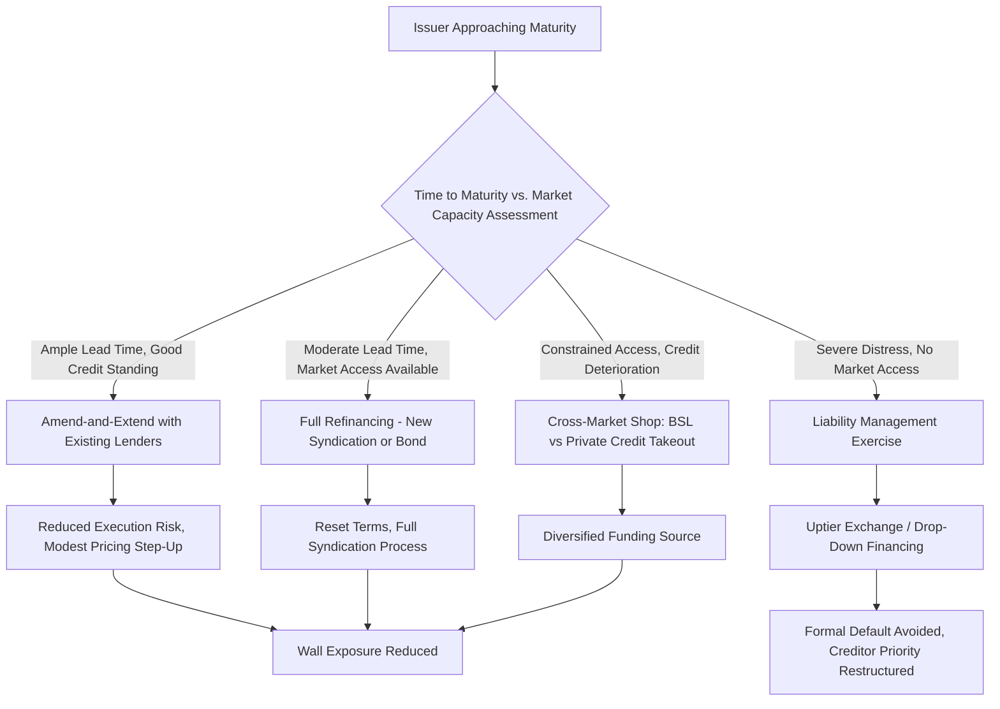

## The Leveraged Loan Maturity Wall and Refinancing Risk

### Overview

The leveraged loan maturity wall refers to the concentration of outstanding leveraged loan principal scheduled to come due within a specific, relatively narrow future window, creating a structural refinancing risk if issuers, arrangers, and CLO capacity cannot absorb that volume smoothly. Refinancing risk is the associated possibility that an issuer cannot replace maturing debt on acceptable terms — due to market access, credit deterioration, or capacity constraints — forcing distressed exchanges, liability management exercises, or default. As of 2026, market participants are focused on a maturity wall building toward 2028, concentrated disproportionately among sponsor-backed and lower-rated issuers, and issuers/arrangers are proactively addressing it years in advance through amend-and-extend activity.

### The 2026–2028 Maturity Wall Profile

**Key Points**

- A growing concentration of 2028 debt maturities among sponsor-backed and lower-rated issuers is driving elevated refinancing and extension activity well ahead of actual maturity dates, reflecting proactive wall management rather than issuers waiting until maturities are imminent.
- U.S. maturities of 'B-' and below-rated debt are projected to surge to a peak of $215 billion in 2028, up sharply from approximately $56.6 billion in 2026 — nearly a fourfold increase concentrated in exactly the credit-quality tier least able to easily access capital markets on favorable terms.
- Refinancing and repricing activity has already become the dominant driver of institutional loan issuance well ahead of the 2028 peak, accounting for roughly 70% of total institutional loan volume in a recent quarter, reflecting the market's response to the approaching wall rather than new-money, M&A-driven issuance.
- Limited near-term refinancing pressure has been noted in some markets (for example, one European market analysis pointed to only about €9 billion of loans coming due across the next two years in a specific segment), illustrating that the maturity wall's severity is geographically and segment-specific rather than uniform across the entire global leveraged loan market. [Inference: precise regional and segment-level maturity wall figures vary by data provider and update frequently; current figures should be checked against the latest market data before being used for specific transaction planning.]

### Mechanisms for Managing the Wall

#### 1. Amend-and-Extend (A&E) Transactions

The primary tool issuers use to push out maturities without a full refinancing: existing lenders agree to extend the maturity date of an existing facility, typically in exchange for a modest pricing adjustment or fee, avoiding the execution risk and cost of a brand-new syndication.

- Year-to-date in 2026, institutional A&E issuance ($36.2 billion) and pro rata A&E issuance ($42.7 billion) have been fairly balanced, though the composition shifts by month and sector.
- A&E activity is not evenly distributed by sector: Oil & Gas topped year-to-date A&E volume at 16%, followed by Retail and Services & Leasing at 9% each, suggesting issuers in maturity-sensitive sectors are moving earlier to de-risk their capital structures.

#### 2. Refinancing via New Syndication or Bond Issuance

Where an A&E is not available or desirable (e.g., due to lender fatigue, deteriorating credit metrics, or a desire to reset terms more substantially), issuers pursue a full refinancing through a new institutional term loan syndication or a high-yield bond issuance, subject to prevailing market conditions and investor appetite for the specific credit.

#### 3. Liability Management Exercises (LMEs)

For issuers unable to refinance on acceptable terms, liability management exercises — including uptier exchanges, drop-down financings, and other creditor-on-creditor structures — have remained a primary restructuring mechanism even as overall default volumes showed improvement, reflecting a market pattern where distressed issuers increasingly address maturity and liquidity pressure through negotiated exchanges rather than formal bankruptcy.

#### 4. Private Credit Refinancing/Takeout

Borrowers increasingly shop between the broadly syndicated loan and private credit markets when approaching a maturity, leveraging competitive pricing and flexible terms across both channels; prospective interest rate cuts could accelerate broadly syndicated loan takeouts of existing private credit facilities, illustrating that the maturity wall is being addressed through cross-market refinancing flows, not solely within a single channel.

### Quantitative Framing: Refinancing Risk Assessment

#### Weighted Average Maturity Concentration

A basic diagnostic used by CLO managers and syndication desks to assess a portfolio's or pipeline's exposure to the wall:

$$\text{Maturity Concentration}_{t} = \frac{\text{Principal Maturing in Year } t}{\text{Total Outstanding Principal}}$$

Tracking this ratio across forward years reveals whether a portfolio's maturity profile is smoothly laddered or dangerously concentrated in a specific window (such as the 2028 peak currently anticipated for lower-rated issuers).

#### Refinancing Capacity Gap

A simple framing used to assess systemic refinancing risk for a cohort of issuers:

$$\text{Capacity Gap} = \text{Projected Maturing Volume} - \text{Estimated Absorbable New-Issue Capacity}$$

where estimated absorbable capacity reflects CLO reinvestment period availability, private credit dry powder, and expected new CLO formation. A materially positive gap signals systemic refinancing stress risk for the cohort, particularly for lower-rated credits with fewer alternative funding sources.

#### Yield-to-Maturity Trend as a Refinancing Cost Indicator

The average yield to maturity for refinancing institutional term loans via syndication stood at approximately 6.7% in 2026, down from 7.4% in 2025 and 8.6% in 2024, but still elevated relative to the years spanning 2011–2022 — indicating that while refinancing costs have improved from recent peaks, they remain structurally higher than the pre-2022 environment, which affects the economics of proactively refinancing well ahead of maturity.

### Interaction With CLO Reinvestment Capacity

**Key Points**

- CLO reinvestment period availability and timing directly affects how much refinancing volume the institutional market can absorb at any given time; understanding how CLO capacity interacts with refinancing needs is described by market analysts as essential for forecasting issuance volumes, assessing market liquidity, and managing sector-specific concentration risk tied to the maturity wall.
- Full-year CLO issuance reaching a very high level in the prior year (with one dataset citing over $472 billion in broadly syndicated loan CLO issuance across roughly 1,045 transactions) expands the pool of committed reinvestment capital available to absorb refinancing volume as the wall approaches, acting as a mitigating technical factor.
- A "hidden leverage" concern has also been flagged for 2026: heightened risk as off-balance-sheet structures and NAV lending become more prevalent, potentially masking the true leverage profile of issuers approaching their maturity wall and complicating accurate refinancing risk assessment. [Inference: the scale and systemic significance of NAV lending and off-balance-sheet leverage as a maturity-wall risk amplifier is an area of active market debate rather than a settled quantitative consensus.]

### Sponsor-Backed vs. Non-Sponsored Issuer Dynamics

**Key Points**

- The sponsored share of leveraged loan issuance has ticked back up from 38% in 2025, moving closer to the elevated levels seen during a spike in sponsored issuance in 2023–2024, and running above the decade's average of roughly 38%.
- Because the 2028 maturity wall is concentrated disproportionately among sponsor-backed and lower-rated issuers, private equity sponsors face increasing pressure to address portfolio company refinancing needs proactively, particularly where investment periods are maturing and sponsors may also be evaluating exit or recapitalization options concurrently with refinancing decisions.
- Higher-rated corporate (often non-sponsored) borrowers have meanwhile been raising record volumes in the new-money market, meaning refinancing risk associated with the maturity wall is heavily concentrated in the sponsor-backed segment of the market rather than spread evenly across all issuer types.

### Example: An Arranger Managing a Client's Maturity Wall Exposure

**Example**

A lead arranger's portfolio review identifies that a sponsor-backed portfolio company's $800M term loan B matures in 2028, squarely within the identified peak maturity window for lower-rated issuers. Given the credit's current 'B-' rating and the anticipated surge in same-year refinancing demand from similarly rated peers, the arranger recommends the sponsor pursue an amend-and-extend transaction 18–24 months ahead of maturity rather than waiting, securing extended terms from the existing lender base at a modest pricing step-up while capacity remains available, rather than competing for refinancing capacity alongside a much larger cohort of similarly situated issuers closer to the 2028 peak. The arranger also evaluates whether a partial private credit takeout of a portion of the facility could diversify the issuer's refinancing sources ahead of the wall, reducing reliance on a single distribution channel that may face capacity constraints as 2028 approaches.

### Diagram: Maturity Wall Management Decision Flow

### Diagram: Projected B-and-Below Maturity Wall, 2026 vs 2028 (svg_diagram)

<svg xmlns="http://www.w3.org/2000/svg" viewBox="0 0 800 300">
<text x="400" y="24" text-anchor="middle" font-size="16" font-weight="bold" fill="#1a1a1a">US 'B-' and Below Maturities: 2026 vs 2028 (svg_diagram)</text>
<line x1="80" y1="250" x2="720" y2="250" stroke="#333" stroke-width="1.5" />
<line x1="80" y1="250" x2="80" y2="50" stroke="#333" stroke-width="1.5" />
<rect x="200" y="220" width="140" height="30" fill="#bee3f8" stroke="#2b6cb0" />
<text x="270" y="210" text-anchor="middle" font-size="13" fill="#1a365d">\$56.6B</text>
<text x="270" y="270" text-anchor="middle" font-size="12" fill="#1a1a1a">2026</text>
<rect x="440" y="70" width="140" height="180" fill="#fed7d7" stroke="#c53030" />
<text x="510" y="60" text-anchor="middle" font-size="13" fill="#742a2a">\$215B</text>
<text x="510" y="270" text-anchor="middle" font-size="12" fill="#1a1a1a">2028</text>

<text x="400" y="292" text-anchor="middle" font-size="11" fill="`#4a5568`">Roughly 4x increase concentrated in lower-rated, sponsor-backed issuers</text>

</svg>

### Common Pitfalls

- Treating the maturity wall as a single global figure rather than recognizing it is heavily concentrated by rating tier (lower-rated/sponsor-backed) and can vary substantially by region and market segment.
- Assuming current low default rates mean refinancing risk has been resolved, when much of the apparent stability reflects proactive amend-and-extend activity years ahead of actual maturity, not underlying credit improvement.
- Overlooking CLO reinvestment period timing and capacity when assessing whether a wave of maturities can be smoothly absorbed by the institutional market.
- Failing to account for off-balance-sheet and NAV lending exposure when assessing an issuer's true leverage and refinancing capacity ahead of a maturity date.
- Waiting until a maturity is imminent to begin refinancing discussions, rather than acting early to avoid competing for capacity alongside a large cohort of similarly situated issuers at the peak of the wall.

### Related Topics

**Related Topics**

- Amend-and-Extend (A&E) Transaction Mechanics and Lender Consent Thresholds
- Liability Management Exercises: Uptier Exchanges and Drop-Down Financing Structures
- CLO Reinvestment Period Mechanics and Their Effect on Primary Market Absorption Capacity
- NAV Lending and Off-Balance-Sheet Leverage as Emerging Risk Factors
- Private Credit Takeout Financing of Broadly Syndicated Facilities
- Credit Rating Migration Analysis for Sponsor-Backed Leveraged Loan Issuers