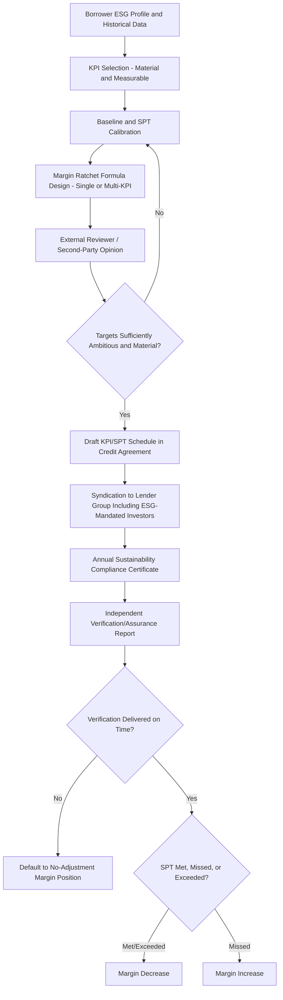

## Sustainability-Linked and ESG-Linked Loan Structuring

### Overview

Sustainability-linked and ESG-linked loan structuring refers to the design of financing instruments where the borrower's cost of credit (typically via a margin ratchet) is tied to its performance against predefined sustainability key performance indicators (KPIs), as distinct from "green" or "social" loans, which restrict use of proceeds to specific eligible projects. This structuring discipline blends standard credit structuring with ESG-specific mechanics: KPI selection, target calibration, verification protocols, and pricing adjustment formulas, all layered onto an otherwise conventional syndicated credit agreement.

### Sustainability-Linked Loans vs. Green/Social Loans: Structural Distinction

**Key Points**

- **Sustainability-Linked Loans (SLLs)**: general corporate purpose facilities where pricing is linked to the borrower's overall sustainability performance against KPIs, with no restriction on use of proceeds — the loan can fund any legitimate corporate purpose.
- **Green Loans / Social Loans**: proceeds-restricted facilities where the loan amount must be applied exclusively to specified eligible green or social projects, tracked through a management-of-proceeds mechanism analogous to green bond structures.
- The choice between the two structures depends on whether the borrower has a discrete, trackable green/social project to finance (favoring a Green/Social Loan) versus a desire to link general financing to entity-wide sustainability improvement (favoring an SLL) — many large corporate borrowers favor SLLs specifically because they do not require proceeds tracing across a diversified balance sheet.

### The Five Core Components of Sustainability-Linked Loan Principles (SLLP)

#### 1. Selection of Key Performance Indicators (KPIs)

KPIs should be material to the borrower's core business, measurable on a consistent methodological basis, externally verifiable, and benchmarkable against a baseline or peer set. Common KPI categories include:

- Greenhouse gas (GHG) emissions intensity (Scope 1, 2, and increasingly Scope 3)
- Renewable energy usage or capacity
- Water usage intensity or waste diversion rates
- Diversity, equity, and workforce-related metrics
- Supply chain sustainability audit coverage

#### 2. Calibration of Sustainability Performance Targets (SPTs)

Targets should be ambitious relative to a borrower's historical trajectory, aligned where possible with recognized external benchmarks (e.g., science-based decarbonization pathways), and set for each measurement period through the facility's tenor — typically annually.

#### 3. Loan Characteristics (Pricing Mechanism)

The margin ratchet structure connecting KPI/SPT performance to the applicable interest rate margin, discussed in detail below.

#### 4. Reporting

Borrowers commit to report KPI performance at least annually, typically via a dedicated sustainability compliance certificate delivered alongside (or as an extension of) the standard financial compliance certificate.

#### 5. Verification

Independent external verification of the borrower's performance against each SPT, generally required at least annually, with the standard of assurance and the identity of eligible verifiers specified in the credit agreement.

### Margin Ratchet Mechanics

#### Single-KPI Structure

$$\text{Applicable Margin} = \text{Base Margin} + \Delta_{ESG}$$

where $\Delta_{ESG}$ is a defined adjustment (commonly a modest number of basis points, with exact calibration varying widely by deal and negotiated bilaterally) that decreases the margin if the SPT is met and increases it if missed, relative to the base case.

#### Multi-KPI Weighted Structure

For facilities incorporating multiple KPIs:

$$\Delta_{ESG} = \sum_{i=1}^{n} w_i \times \delta_i$$

where $w_i$ is the negotiated weight assigned to KPI $i$ (with $\sum w_i = 1$) and $\delta_i$ is the margin adjustment triggered by performance on that specific KPI, typically subject to an overall cap on the aggregate possible adjustment in either direction.

#### Symmetric vs. Asymmetric Ratchets

- **Symmetric structures**: the margin can move up or down by an equal magnitude depending on whether targets are met, missed, or exceeded.
- **Asymmetric structures**: some facilities are structured with only a downward adjustment (a discount for meeting targets, with no penalty for missing them) or only an upward adjustment (a penalty for missing targets, with no reward for meeting them), reflecting differing negotiating leverage and market practice preferences between borrower and lender group.

### Documentation Architecture

**Key Points**

- **KPI/SPT Schedule**: a dedicated schedule to the credit agreement defining each KPI's precise calculation methodology, data sources, historical baseline, and the annual target trajectory through maturity.
- **Sustainability Compliance Certificate**: a periodic certification (typically annual) confirming KPI performance for the relevant test period, generally requiring attachment of, or reference to, the external verifier's assurance report.
- **Verification Failure/Delay Provisions**: address the consequence if a borrower fails to deliver timely third-party verification — market practice commonly defaults the margin to the "no adjustment" position for that period, or occasionally to the "penalty" position, rather than triggering a default, preserving the loan's status as a standard facility rather than escalating a reporting delay into an event of default.
- **Recalibration/Amendment Mechanics**: provisions addressing how KPIs or SPTs are adjusted following a material acquisition, divestiture, accounting standard change, or change in the underlying calculation methodology that would otherwise distort the baseline against which performance is measured.
- **"Sleeping" SLL Features**: some facilities are structured to allow ESG-linked pricing to be layered on post-signing via a defined amendment mechanism, avoiding the need to finalize the full KPI/SPT framework before the underwriting and closing timeline, useful where ESG data or target-setting work is not yet complete at signing.

### Greenwashing Risk and Market Integrity

**Key Points**

- The central market integrity concern in sustainability-linked lending is **greenwashing** — the risk that an SLL label is applied to a facility whose KPIs are immaterial to the borrower's actual environmental or social footprint, or whose targets are insufficiently ambitious (e.g., already substantially achieved at signing), such that the "sustainability-linked" designation overstates genuine behavioral change.
- This concern has driven successive tightening of KPI materiality and target ambition standards under updates to the LMA/LSTA/APLMA sustainability-linked loan principles, and has increased the role of external reviewers and second-party opinion providers in scrutinizing target calibration during structuring, before a deal is marketed to ESG-focused lenders.
- Reputational and, in some cases, legal risk associated with overstated sustainability claims is a live and evolving area of market and regulatory attention; specific enforcement trends and case outcomes change quickly and should be verified against current sources rather than assumed static. [Unverified: greenwashing-related regulatory and litigation developments evolve rapidly and specific current examples should be checked against up-to-date reporting.]

### Investor and Syndication Considerations

**Key Points**

- ESG-mandated institutional lenders — certain pension funds, insurance companies, and dedicated sustainable finance vehicles — may have investment mandates requiring a minimum allocation to green, social, or sustainability-linked assets, meaning a credible SLL structure can genuinely broaden the investor base and support pricing, not merely satisfy a compliance checkbox.
- Conversely, a poorly calibrated or perceived-as-greenwashed structure can deter ESG-focused lenders from participating and create reputational exposure for the arranger's own sustainable finance credentials, providing a market-based incentive (independent of any regulatory mandate) for rigorous KPI design.
- In cross-border syndicates, differing ESG disclosure baselines across lender jurisdictions (for example, EU lenders operating under CSRD-driven reporting expectations versus non-EU lenders with different disclosure norms) can create friction in agreeing acceptable KPI verification standards and reporting formats across the syndicate.

### Example: Structuring a Sustainability-Linked Revolving Facility

**Example**

A consumer goods company negotiates a $500M revolving credit facility with a sustainability-linked margin mechanism built around two KPIs: (1) Scope 1 and 2 GHG emissions intensity per unit of production, weighted 50%, with annual targets declining in line with a recognized science-based decarbonization pathway, and (2) percentage of packaging sourced from recycled or renewable materials, weighted 50%, with targets set against the company's three-year historical baseline. The credit agreement specifies annual third-party verification under a limited assurance standard, with margin adjustments capped at ±7.5 basis points in aggregate. To mitigate greenwashing risk ahead of syndication, the arranger commissions an external second-party opinion confirming both KPIs are material to the company's core operations and that the targets represent a genuine acceleration versus historical trend, rather than simply codifying an already-expected trajectory — a step taken specifically to ensure ESG-mandated institutional lenders in the syndicate would view the structure as credible.

### Diagram: Sustainability-Linked Loan Structuring Workflow

### Diagram: SLL vs Green Loan Structural Comparison (svg_diagram)

<svg xmlns="http://www.w3.org/2000/svg" viewBox="0 0 800 280">
<text x="400" y="24" text-anchor="middle" font-size="16" font-weight="bold" fill="#1a1a1a">Sustainability-Linked Loan vs Green Loan (svg_diagram)</text>
<rect x="60" y="60" width="320" height="180" rx="8" fill="#bee3f8" stroke="#2b6cb0" />
<text x="220" y="90" text-anchor="middle" font-size="14" font-weight="bold" fill="#1a365d">Sustainability-Linked Loan</text>
<text x="220" y="120" text-anchor="middle" font-size="12" fill="#1a365d">General Corporate Purpose</text>
<text x="220" y="145" text-anchor="middle" font-size="12" fill="#1a365d">Pricing Linked to KPI/SPT</text>
<text x="220" y="170" text-anchor="middle" font-size="12" fill="#1a365d">Entity-Wide Performance</text>
<text x="220" y="195" text-anchor="middle" font-size="12" fill="#1a365d">No Use-of-Proceeds Restriction</text>
<rect x="420" y="60" width="320" height="180" rx="8" fill="#c6f6d5" stroke="#2f855a" />
<text x="580" y="90" text-anchor="middle" font-size="14" font-weight="bold" fill="#22543d">Green / Social Loan</text>
<text x="580" y="120" text-anchor="middle" font-size="12" fill="#22543d">Proceeds Restricted to Eligible Projects</text>
<text x="580" y="145" text-anchor="middle" font-size="12" fill="#22543d">Management of Proceeds Tracking</text>
<text x="580" y="170" text-anchor="middle" font-size="12" fill="#22543d">Project-Level Reporting</text>
<text x="580" y="195" text-anchor="middle" font-size="12" fill="#22543d">No Pricing-Performance Link Required</text>
</svg>

### Common Pitfalls

- Selecting KPIs that are immaterial to the borrower's core business or already substantially achieved at signing, exposing the transaction to greenwashing criticism from ESG-focused investors and market commentators alike.
- Failing to specify a clear fallback mechanism (e.g., defaulting to "no adjustment") if a borrower fails to deliver timely third-party verification, leaving ambiguity that can complicate compliance certificate review.
- Confusing sustainability-linked and green/social loan structures, applying use-of-proceeds tracking mechanics to a general-purpose SLL or, conversely, applying margin-ratchet KPI mechanics to a proceeds-restricted green loan where they are not the natural fit.
- Omitting recalibration mechanics for SPTs, leaving targets trivially easy or unachievable following a material M&A event that shifts the borrower's operational baseline.
- Underestimating the increased scrutiny external reviewers and ESG-focused lenders now apply to target ambition, potentially slowing syndication if KPI calibration is perceived as insufficiently rigorous.

### Related Topics

**Related Topics**

- Green Loan Principles and Green Bond Principles Comparative Structuring
- Second-Party Opinion Providers and External Review Standards in Sustainable Finance
- Science-Based Targets initiative (SBTi) Methodology for Calibrating Emissions KPIs
- Climate and ESG Disclosure Requirements Feeding Loan-Level KPI Data
- Greenwashing Risk Mitigation in Labeled Loan Products
- Cross-Border ESG Data Standardization Challenges in Syndicated Sustainability-Linked Facilities