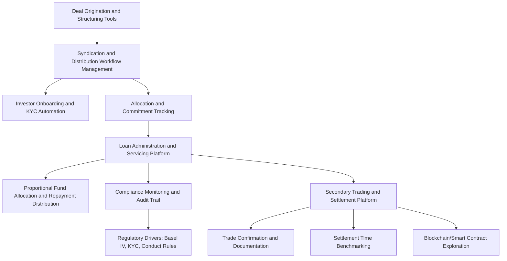

## Digital Syndication Platforms and Loan Trading Technology

### Overview

Digital syndication platforms and loan trading technology encompass the software infrastructure used to originate, distribute, administer, and trade syndicated loans across the deal lifecycle — from initial deal structuring and investor onboarding through allocation, settlement, and ongoing servicing. This technology layer has become increasingly central to syndication economics as loan volumes grow and manual, paper-and-email-based workflows struggle to scale, particularly given the operational complexity of multi-lender structures, cross-border participants, and the persistent settlement-time challenges that have long characterized secondary loan trading.

### Market Scale and Adoption

**Key Points**

- The global syndicated loans market was projected to grow from approximately $778.26 billion in 2025 to around $891.5 billion in 2026, with rising demand for large-scale corporate financing, expanding non-bank lender participation, and increased adoption of technology-enabled syndication platforms cited as key growth drivers.
- Approximately 60–65% of global syndicated loan origination volume was managed through digital syndication platforms in 2026, with penetration exceeding 85–90% among tier-one global banks but only 35–40% among mid-market banks — indicating a substantial adoption gap between the largest institutions and smaller participants. [Unverified: specific market-sizing and penetration percentages originate from industry research reports and should be treated as estimates subject to methodology differences across providers.]
- The dedicated syndicated loans platform technology market itself was valued at approximately $4.2 billion in 2025 and is projected to reach $9.1 billion by 2034, reflecting a compound annual growth rate near 9.8%, with North America representing the largest regional share given the concentration of major global financial institutions headquartered there.

### Core Functional Categories of Digital Syndication Platforms

#### 1. Deal Origination and Structuring Tools

Platforms supporting the front-end structuring process — deal team collaboration, term sheet drafting, structuring scenario analysis, and coordination between arrangers ahead of launch.

#### 2. Syndication and Distribution Workflow Management

Tools managing the actual syndication process: investor targeting, allocation tracking, commitment management, and communication with prospective syndicate members during the marketing period — functionally the digital equivalent of the traditional roadshow and book-building process.

#### 3. Loan Administration and Servicing Platforms

Comprehensive lifecycle management systems (loan origination through long-term servicing) supporting proportional fund allocation, automated repayment distribution across syndicate members, compliance monitoring, and participant reporting — core infrastructure for agent banks managing ongoing facility administration. Loan syndication software of this kind manages the full lifecycle of multi-lender credit facilities, from investor onboarding and loan pool creation through proportional fund allocation, automated repayment distribution, compliance monitoring, and participant reporting that manual processes cannot scale efficiently as volumes grow.

#### 4. Secondary Trading and Settlement Platforms

Specialized infrastructure supporting the trade confirmation, documentation, and settlement process for secondary loan sales — historically one of the most persistent operational pain points in the loan market given the bespoke, negotiated nature of individual credit agreements compared to more standardized securities.

### Notable Platform Categories and Vendors

**Key Points**

- **Comprehensive commercial lending platforms**: vendors such as Finastra (Loan IQ), nCino, and Abrigo offer end-to-end functionality spanning bilateral loans, syndicated transactions, specialty lending, and increasingly private credit within a single technology ecosystem; Finastra's Loan IQ is reported to be used by 21 of the 25 largest syndicated lenders globally.
- **Specialized syndication and participation management tools**: platforms such as SyndTrak, Lendsuite, and Nortridge focus more narrowly on the servicing layer, supporting complex loan structures, participations, syndications, variable rates, and custom payment structures with strong configurability for specialty lending programs.
- **Settlement-focused infrastructure**: S&P Global's ClearPar platform is a widely referenced settlement system in the secondary loan trading market, with the LSTA using ClearPar's proprietary trade-lifecycle data to benchmark settlement timing and identify sources of delay across the market each year.
- **Emerging settlement innovators**: newer entrants such as HashLynx have positioned themselves around redefining loan settlement to be faster, cheaper, and easier, while established players like Lamina (a West Monroe company) focus on streamlining multi-lender loan management workflows across banks, credit unions, and specialty lenders.

### Persistent Settlement Challenges

**Key Points**

- Settlement processes in the syndicated loan market remain complex and error-prone, particularly across multi-lender and multi-agent structures, with industry panels continuing to focus on improving settlement reliability, speed, accuracy, and transparency through process standardization, automation, and revised trade documentation protocols.
- Industry conferences have specifically addressed best practices for both actively traded syndicated loans and less liquid private credit facilities, highlighting that settlement friction is not confined to the traditional BSL market but extends into the growing private credit segment as well.
- Recurring settlement improvement themes include streamlining consent tracking, agreement updates, and lender communications — process areas requiring coordination across legal, operations, and technology teams rather than a single point solution, reflecting the inherently cross-functional nature of loan settlement compared to more automated securities settlement.

### Blockchain and Distributed Ledger Technology in Loan Markets

**Key Points**

- The concept of a "smart loan" — where the borrower, arranger, and lenders agree on credit agreement terms that are then coded and recorded on a blockchain — has been explored as a way to address long-standing industry inefficiencies including long trade settlement times, low automation, and manual reconciliation, with a single shared source of truth reducing time and cost across a syndicate.
- In a fully realized smart loan structure, contract signing would trigger automatic assignment of collateral to syndicate members and disbursement of funds, and over the life of the loan the smart contract would automatically debit borrower payments and extinguish loan liability on the blockchain in real time.
- Despite this conceptual promise being explored by the LSTA for several years, actual deployment of blockchain-based settlement remains limited relative to the concept's potential, and separate digital asset market forums have discussed adapting traditional loan market documentation standards (drawing explicit comparisons to LSTA and ISDA frameworks) to reduce friction in tokenized and digital-asset lending markets — suggesting cross-pollination between traditional loan market infrastructure standards and emerging digital asset market structures. [Inference: the pace and extent of actual blockchain adoption in mainstream syndicated loan settlement, as opposed to conceptual exploration and digital-asset-adjacent markets, appears to remain gradual; current deployment status should be verified against the latest LSTA publications.]

### Artificial Intelligence and Agentic Technology in Lending Platforms

**Key Points**

- AI-driven decisioning and workflow automation are increasingly embedded directly into commercial lending platforms, including automated credit analysis, decisioning support, and relationship/portfolio insights layered onto core lending infrastructure.
- Some lending technology vendors have introduced agentic AI features — role-based AI agents integrated into core platforms to support specific workflow functions — reflecting a broader trend of embedding autonomous or semi-autonomous AI assistance directly into loan origination and servicing platforms rather than treating AI as a separate analytics layer.
- Industry conferences have begun dedicating specific sessions to AI's implications for the loan market, indicating growing institutional attention to how AI will reshape syndication workflows, credit analysis, and data management going forward. [Inference: the maturity and standardization of specific AI use cases within syndication workflows is still developing, and concrete adoption benchmarks should be checked against current industry data rather than assumed from vendor marketing claims alone.]

### Regulatory Drivers of Technology Investment

**Key Points**

- Regulatory frameworks — including Basel IV capital requirements, conduct rules such as those adjacent to MiFID II, and evolving KYC mandates — are cited as structural tailwinds for platform providers, since banks increasingly need technology infrastructure capable of automatically capturing, validating, and auditing loan syndication activities to satisfy these overlapping compliance requirements.
- This regulatory-technology linkage means digital syndication platform investment is driven not purely by operational efficiency goals but also by the practical necessity of producing auditable, automatically captured compliance records across an increasingly complex regulatory landscape spanning capital, conduct, and financial crime domains.

### Example: A Syndication Desk Evaluating Platform Investment

**Example**

A mid-market bank's syndication desk, currently relying on spreadsheet-based allocation tracking and email-driven investor communication, evaluates whether to invest in a dedicated digital syndication platform as deal volume grows. Given that mid-market bank platform penetration remains substantially lower than at tier-one institutions, the desk's technology committee weighs a comprehensive ecosystem platform (offering broad functionality but a longer, planning-heavy implementation) against a modular, servicing-focused tool better suited to their narrower need for improved participant allocation tracking and automated repayment distribution. The desk ultimately prioritizes settlement and KYC-related workflow automation first, given that increasing regulatory scrutiny around auditable compliance records is a more immediate driver than broader front-end origination tooling, and plans a phased rollout starting with secondary trade settlement before expanding into full origination workflow digitization.

### Diagram: Digital Syndication Platform Functional Stack

### Diagram: Platform Adoption Gap by Institution Tier (svg_diagram)

<svg xmlns="http://www.w3.org/2000/svg" viewBox="0 0 800 300">
<text x="400" y="24" text-anchor="middle" font-size="16" font-weight="bold" fill="#1a1a1a">Digital Syndication Platform Penetration by Bank Tier (svg_diagram)</text>
<line x1="80" y1="250" x2="720" y2="250" stroke="#333" stroke-width="1.5" />
<line x1="80" y1="250" x2="80" y2="50" stroke="#333" stroke-width="1.5" />
<rect x="200" y="70" width="140" height="180" fill="#bee3f8" stroke="#2b6cb0" />
<text x="270" y="60" text-anchor="middle" font-size="13" fill="#1a365d">85-90%</text>
<text x="270" y="270" text-anchor="middle" font-size="12" fill="#1a1a1a">Tier-One Global Banks</text>
<rect x="440" y="175" width="140" height="75" fill="#fed7d7" stroke="#c53030" />
<text x="510" y="165" text-anchor="middle" font-size="13" fill="#742a2a">35-40%</text>
<text x="510" y="270" text-anchor="middle" font-size="12" fill="#1a1a1a">Mid-Market Banks</text>
</svg>

### Common Pitfalls

- Assuming digital platform adoption is uniform across the market; the adoption gap between tier-one and mid-market institutions remains substantial and should factor into competitive and vendor-selection analysis.
- Treating blockchain/smart contract loan settlement as an imminent, widely deployed solution rather than a still-developing concept with limited current mainstream adoption relative to its long-discussed potential.
- Overlooking that settlement friction persists even in mature secondary markets and extends into private credit, meaning platform investment should not be viewed as a solved problem simply because BSL trading infrastructure is comparatively established.
- Selecting a comprehensive ecosystem platform without evaluating implementation timeline and complexity against actual near-term operational priorities, particularly for institutions with more modest technology budgets.
- Underestimating the degree to which platform investment decisions are driven by regulatory audit and compliance requirements (Basel IV, KYC, conduct rules) rather than purely operational efficiency considerations.

### Related Topics

**Related Topics**

- Loan Trade Settlement Benchmarking and ClearPar Lifecycle Analytics
- Smart Contract and Tokenized Loan Structures: Current State and Adoption Barriers
- Agentic AI Applications in Credit Analysis and Syndication Workflow Automation
- KYC Utility Platforms and Standardized Information-Sharing Protocols in Syndication
- Loan Administration Platform Selection Criteria for Mid-Market Institutions
- Regulatory Technology (Regtech) Investment Drivers in Capital Markets Compliance