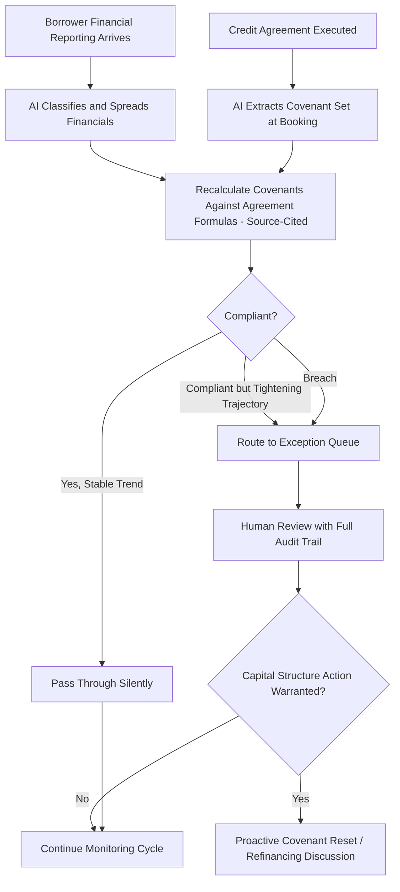

## AI-Driven Covenant Monitoring and Capital Structure Optimization

### Overview

AI-driven covenant monitoring and capital structure optimization refers to the application of artificial intelligence — document extraction, automated financial spreading, pattern-based early warning detection, and portfolio-level analytics — to the ongoing surveillance of loan covenant compliance and to decisions about how a portfolio's or issuer's capital structure should evolve over time. This has become a distinct area of focus in 2026 because underwriting-side AI adoption has significantly outpaced monitoring-side adoption, creating what industry researchers term a "monitoring gap" at precisely the point in the credit cycle where early detection matters most.

### The Monitoring Gap: Underwriting vs. Ongoing Surveillance

**Key Points**

- A 2026 survey of more than 120 credit portfolio managers found that 54% are most likely to apply AI in underwriting, while only 16% treat AI-enabled portfolio management, including monitoring, as a current priority — a 38-point spread industry researchers have labeled the "monitoring gap."
- This gap has opened at a structurally unfavorable time: covenant-lite structures grew from 4% to 21% of private credit deals between 2023 and 2025, caps on EBITDA add-backs have been eroding, and payment-in-kind (PIK) interest structures convert what would otherwise be a cash-flow stress signal into financial silence, all of which reduce the natural early-warning signals monitoring teams have historically relied upon.
- Private credit assets under management were expected to pass $2 trillion in 2026 and approach $4 trillion by 2030, meaning the absolute scale of exposure requiring monitoring is growing rapidly even as the proportion of deals with weaker maintenance-covenant protection increases. [Inference: these figures originate from industry forecasts and research reports current as of mid-2026 and should be checked against updated data given the pace of change in this market.]

### Core AI Covenant Monitoring Architecture

#### 1. Covenant Extraction at Booking

Modern AI-driven monitoring systems extract the covenant set directly from the executed credit agreement at the time of booking, rather than relying on a separately maintained manual covenant summary — creating a source-traceable link between the original legal document and every subsequent compliance test.

#### 2. Automated Financial Spreading and Recalculation

Inbound borrower financials are classified, spread into normalized line items, and recalculated against the credit agreement's actual covenant formulas, with source-page citations attached to every calculated number — an approach that ties each output back to a specific location in the original financial statement or agreement.

#### 3. Exception-Based Review Workflow

Rather than requiring uniform human review of every compliance cycle, the AI-driven approach lets compliant cycles pass through with minimal manual intervention, while tightening trajectories, treatment differences, and outright breaches are routed into an exception queue with the underlying calculation math attached for human review.

#### 4. Continuous vs. Quarterly Monitoring Cadence

A central shift enabled by this technology is the move from quarterly spot-checks to continuous monitoring — recalculating covenant compliance on every new financial delivery rather than only at scheduled test dates, since headroom compression, margin slippage, and working capital stress typically show up in monthly reporting one to two quarters before an actual covenant breach occurs.

#### 5. Pattern Detection and Early Warning Signals

AI systems are used to uncover hidden risk through pattern detection and early warning signals based on a wide range of performance indicators, with notifications triggered when changing dynamics breach an institution's predefined tolerance levels, enabling faster response than traditional periodic review cycles.

### Regulatory Context for Monitoring Automation

**Key Points**

- U.S. banking regulators have issued updated interagency guidance addressing covenant and portfolio monitoring practices, with one referenced framework citing an April 2026 revised interagency guidance issued through SR 26-2 and OCC Bulletin 2026-13, alongside separate OCC guidance governing community-bank proportionality in applying these expectations. [Unverified: specific guidance document numbers and their precise scope should be confirmed against the primary regulatory source, as this area is subject to ongoing refinement.]
- Examiners reviewing automated covenant monitoring programs are described as expecting a complete end-to-end audit trail for every test on every borrower: the source document, the specific page, the formula applied, the calculated value, the borrower-reported value, the disposition, and the identity of the human who approved the result — reflecting a supervisory expectation that automation does not eliminate accountability or traceability.
- This audit-trail expectation shapes vendor architecture choices, favoring systems built on a "source-traceable engine" that maintains a clear chain from the original credit agreement and financial statements through to the final compliance determination, rather than opaque model outputs that cannot be independently verified.

### Capital Structure Optimization Applications

**Key Points**

- Beyond compliance monitoring, AI-driven portfolio analytics are used for capital allocation optimization — identifying highest-return opportunities and the most efficient risk-adjusted capital deployment strategies by analyzing historical performance across loan characteristics and market conditions to recommend optimal portfolio composition and pricing strategies.
- Financial ratio calculation and covenant compliance monitoring occurring automatically as new borrower data arrives allows credit teams to shift from reactive loss management toward proactive risk mitigation, since deteriorating trends can inform capital structure decisions (additional equity cushion requests, covenant reset negotiations, or proactive refinancing) before a formal breach forces the issue.
- For portfolio-level capital structure optimization, AI-assisted risk-rating migration tracking allows institutions to monitor a larger loan book with a smaller team without losing signal on individual credit deterioration, directly supporting more dynamic, continuously informed capital allocation decisions across a portfolio rather than static point-in-time assessments.

### Human Oversight and the Limits of Automation

**Key Points**

- Industry practitioners consistently emphasize that AI assembles the inputs while people make the final risk-rating determination — framing automation as augmenting rather than replacing the judgment component of credit monitoring, particularly for the final classification of a credit's risk migration.
- Borrower financial data confidentiality is treated as a significant constraint on tool selection: guidance in this space recommends keeping such data on platforms that do not train on client data, or deploying custom agents within an institution's own cloud environment, reflecting heightened sensitivity around proprietary borrower information flowing through third-party AI systems.
- The specialized tooling landscape for this function includes purpose-built portfolio monitoring platforms, paired with dedicated document extraction tools and credit intelligence data providers, reflecting a multi-vendor stack approach rather than a single all-in-one solution as the current market norm. [Inference: the specific vendor landscape referenced here reflects the market as of mid-2026 and is likely to continue evolving; current tool selection should be based on up-to-date vendor evaluation.]

### Market Backdrop Motivating Adoption

**Key Points**

- The Proskauer default index rose for three consecutive quarters as of mid-2026, reinforcing the urgency of closing the monitoring gap given a deteriorating credit backdrop for at least part of the leveraged finance market.
- Loan spread compression and AI-driven market dislocation contributed to volatility in leveraged loan pricing in late 2025 into early 2026, with the Morningstar LSTA US Leveraged Loan Index falling from a price of 97.06% to a low of 94.17% before partially recovering, alongside an approximate 20-point decrease in median U.S. CLO equity net asset values over the same period — illustrating the kind of market stress that makes early covenant-based warning signals more valuable to portfolio managers.
- Financial covenants continue to anchor the vast majority of private credit structures despite competitive pressure introducing incremental documentation flexibility, meaning covenant-based monitoring remains a foundational — not a legacy — risk management tool that AI is being layered onto rather than replacing.

### Example: Applying AI Monitoring to a Capital Structure Decision

**Example**

A direct lending portfolio manager's AI-driven monitoring system flags that a portfolio company's headroom against its leverage covenant has compressed from 25% to 8% over three consecutive monthly reporting cycles, well before the next scheduled quarterly test date, driven by margin slippage the system's pattern detection identified as consistent with input cost pressure rather than a one-time event. Rather than waiting for the formal quarterly compliance certificate, the lender's credit team proactively engages the sponsor to discuss a covenant reset or an equity cure, informed by the AI system's continuously recalculated headroom trend rather than a lagging quarterly snapshot. This early intervention — made possible by continuous rather than quarterly monitoring — allows the capital structure to be renegotiated on a cooperative basis while the issuer still has negotiating leverage, rather than facing a binary breach/no-breach determination at the next formal test date with less room to maneuver.

### Diagram: AI-Driven Covenant Monitoring Workflow

### Diagram: The AI Monitoring Gap (svg_diagram)

<svg xmlns="http://www.w3.org/2000/svg" viewBox="0 0 800 300">
<text x="400" y="24" text-anchor="middle" font-size="16" font-weight="bold" fill="#1a1a1a">AI Adoption: Underwriting vs Portfolio Monitoring (svg_diagram)</text>
<line x1="80" y1="250" x2="720" y2="250" stroke="#333" stroke-width="1.5" />
<line x1="80" y1="250" x2="80" y2="50" stroke="#333" stroke-width="1.5" />
<rect x="200" y="115" width="140" height="135" fill="#bee3f8" stroke="#2b6cb0" />
<text x="270" y="105" text-anchor="middle" font-size="13" fill="#1a365d">54%</text>
<text x="270" y="270" text-anchor="middle" font-size="12" fill="#1a1a1a">AI Priority in Underwriting</text>
<rect x="440" y="210" width="140" height="40" fill="#fed7d7" stroke="#c53030" />
<text x="510" y="200" text-anchor="middle" font-size="13" fill="#742a2a">16%</text>
<text x="510" y="270" text-anchor="middle" font-size="12" fill="#1a1a1a">AI Priority in Monitoring</text>

<text x="400" y="292" text-anchor="middle" font-size="11" fill="`#4a5568`">38-point "monitoring gap"</text>

</svg>

### Common Pitfalls

- Treating AI-driven covenant monitoring as a substitute for the human risk-rating judgment rather than as a tool that surfaces deterioration for human decision-making.
- Underestimating how covenant-lite structures, disappearing EBITDA add-back caps, and PIK interest reduce the natural signal available to any monitoring system, AI-enabled or not — automation cannot generate a signal from data the covenant package no longer requires.
- Failing to maintain the full audit trail (source document, page, formula, calculated and reported values, disposition, and approver) that examiners expect, which can undermine confidence in an otherwise sophisticated automated program during regulatory review.
- Deploying borrower financial data on AI platforms without confirming data confidentiality practices, given the sensitivity of proprietary borrower information and the recommendation to favor platforms that do not train on client data.
- Continuing quarterly-only review cadences after adopting monitoring technology capable of continuous recalculation, thereby forfeiting the primary early-warning advantage the technology is meant to provide.

### Related Topics

**Related Topics**

- Covenant Headroom Calculation Methodologies Across DSCR, FCCR, and Leverage Tests
- Payment-in-Kind (PIK) Interest Structures and Their Effect on Cash-Flow Signal Quality
- Covenant-Lite Structure Growth in Private Credit and Its Monitoring Implications
- Risk-Rating Migration Tracking and Early Warning Indicator Design
- Regulatory Expectations for Automated Compliance Audit Trails (Interagency Guidance)
- Portfolio-Level Capital Allocation Optimization Using Predictive Credit Analytics