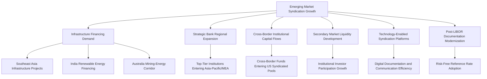

## Emerging Market Syndication Growth

### Overview

Emerging market syndication growth refers to the expansion of syndicated loan activity across developing and fast-growing economies — particularly in Asia-Pacific, the Middle East and Africa (MEA), and Latin America — as infrastructure financing needs, cross-border institutional participation, and sponsor-backed deal flow increasingly extend beyond the traditional North American and European core of the global syndicated loan market. This growth is occurring alongside, and is partly driven by, broader structural trends reshaping global leveraged finance: technology-enabled syndication platforms, the post-LIBOR transition to risk-free reference rates, and strategic expansion by global banking institutions into new regional markets.

### Overall Market Growth Context

**Key Points**

- Global syndicated loan market estimates vary by research provider, but multiple sources point to substantial near-term growth: one estimate places the market at $778.26 billion in 2025 growing to $891.5 billion in 2026 (a 14.6% CAGR), with continued expansion to approximately $1.52 trillion by 2030 at a similar growth rate; another estimate cites growth from $782.79 billion in 2025 to $912.6 billion in 2026. [Unverified: syndicated loan market sizing estimates differ meaningfully across research providers depending on methodology and scope definitions; figures here should be treated as directional rather than precise, and cross-checked against a specific provider's current methodology for any analytical use.]
- Cited growth drivers for the historic period include growth in corporate mergers and acquisitions, expansion of capital-intensive infrastructure projects, increasing globalization of corporate operations, and rising refinancing of existing corporate debt — with expansion of cross-border lending activities and increasing complexity of corporate funding requirements specifically cited as forward-looking drivers relevant to emerging market growth.
- Asia-Pacific has been specifically identified as the fastest-growing region within the global syndicated loan market, with increasing interest in revolving loan structures, in contrast to North America's continued dominance in overall market size and term loan demand.

### Asia-Pacific: The Leading Emerging Market Growth Engine

**Key Points**

- The Asia-Pacific syndicated loans market was valued at approximately $1.35 trillion in 2026 and is projected to expand to roughly $2.36 trillion by 2035, advancing at approximately a 6.40% CAGR over that period.
- Infrastructure projects across Southeast Asia are specifically cited as accelerating adoption of syndicated credit facilities in the region, reflecting the capital-intensive nature of infrastructure development as a natural fit for the risk-sharing structure syndication provides.
- Demand within the region concentrates notably in Australia's mining-energy corridor and India's renewable energy financing sector, indicating that emerging market syndication growth is not evenly distributed but rather concentrated around specific resource and energy-transition financing needs in particular sub-regions.
- The transition from LIBOR to risk-free reference rates (such as SOFR, SONIA, and regional equivalents) is reshaping loan documentation standards across the region, meaning Asia-Pacific market growth is occurring concurrently with a broader documentation modernization process rather than on a static, legacy documentation base.

### Strategic Bank Expansion Into Emerging Markets

**Key Points**

- Approximately 19% of top-tier financial institutions expanded operations into Asia-Pacific and MEA specifically, driven by rising demand for sponsor-backed financing in those regions, with this expansion contributing to an estimated 15% increase in regional participation in syndicated structures.
- Nearly 29% of cross-border funds were reported entering US-based syndicated pools, illustrating that emerging market capital flows into syndication are not unidirectional — capital from various emerging and developed markets increasingly flows both into and out of established syndication markets like the U.S., reflecting a genuinely global rather than purely regional capital-raising dynamic. [Inference: the specific percentage figures cited in industry market-sizing reports should be treated as illustrative of directional trends rather than precise, universally agreed statistics, given methodological variation across providers.]

### Secondary Market Development Supporting Emerging Market Growth

**Key Points**

- Secondary loan trading grew by approximately 22% as more institutional investors entered the market, a development cited as increasing liquidity and improving risk distribution across diversified, sponsor-backed portfolios — a secondary market maturation trend that supports the broader case for continued growth in primary emerging market syndication by giving institutional investors an exit or repositioning mechanism once they participate.
- Technology-enabled loan syndication and digital platforms are specifically cited as facilitating more efficient communication and documentation processes among lenders and borrowers, a trend with particular relevance to emerging market syndication given the cross-border coordination challenges inherent in assembling multi-jurisdictional syndicates.

### Interaction With Global Market Dynamics

**Key Points**

- Broadly syndicated loan issuance regained momentum in some markets during 2025, recapturing share from private credit as lower pricing attracted sponsor-backed borrowers — a dynamic that, where it extends into emerging markets, could support renewed BSL-channel growth there as well, though the balance between bank-led syndication and private credit in specific emerging markets varies by region and local banking sector development. [Inference: the precise regional balance between BSL and private credit growth in emerging markets specifically, as opposed to developed markets, requires region-specific data verification rather than extrapolation from global aggregate trends.]
- CLO issuance trends in developed markets (a record or near-record year for broadly syndicated loan CLO issuance) indirectly support emerging market syndication by expanding the pool of institutional capital available globally for loan investment, even where that CLO capital itself remains concentrated in developed-market collateral.
- Around 51% of large leveraged transactions in one specific market analysis were reported to rely on syndicated participation, with close to 55% of major corporate financing deals in another analysis supported by syndicated loan models, underscoring how central the syndication structure has become to large-scale corporate financing generally — a structural feature likely to extend as emerging market corporate financing needs scale toward levels requiring multi-lender risk-sharing.

### Example: A Bank Evaluating Emerging Market Syndication Expansion

**Example**

A global bank's syndications desk evaluates expanding its footprint into Southeast Asian infrastructure financing, having observed accelerating adoption of syndicated credit facilities for regional infrastructure projects. The desk's regional strategy specifically targets India's renewable energy financing sector and Australia's mining-energy corridor as the two sub-regional concentrations of demand identified in current market analysis, rather than pursuing broad, undifferentiated regional expansion. Recognizing that loan documentation in the region is simultaneously transitioning away from LIBOR-based conventions toward risk-free reference rates, the desk invests in updated documentation templates and reference-rate mechanics before launching its first regional syndication, to avoid the operational friction of retrofitting legacy LIBOR-based agreements mid-transition. The desk also evaluates whether to build direct regional origination capacity or to co-lead with an established regional bank partner, given that cross-border syndication in a new region typically benefits from a local partner's borrower relationships and regulatory familiarity.

### Diagram: Emerging Market Syndication Growth Drivers

### Diagram: Asia-Pacific Syndicated Loan Market Growth Trajectory (svg_diagram)

<svg xmlns="http://www.w3.org/2000/svg" viewBox="0 0 800 300">
<text x="400" y="24" text-anchor="middle" font-size="16" font-weight="bold" fill="#1a1a1a">Asia-Pacific Syndicated Loans: 2026 to 2035 (svg_diagram)</text>
<line x1="80" y1="250" x2="720" y2="250" stroke="#333" stroke-width="1.5" />
<line x1="80" y1="250" x2="80" y2="50" stroke="#333" stroke-width="1.5" />
<rect x="200" y="130" width="140" height="120" fill="#bee3f8" stroke="#2b6cb0" />
<text x="270" y="120" text-anchor="middle" font-size="13" fill="#1a365d">$1.35T</text>
<text x="270" y="270" text-anchor="middle" font-size="12" fill="#1a1a1a">2026</text>
<rect x="440" y="70" width="140" height="180" fill="#fed7d7" stroke="#c53030" />
<text x="510" y="60" text-anchor="middle" font-size="13" fill="#742a2a">$2.36T</text>
<text x="510" y="270" text-anchor="middle" font-size="12" fill="#1a1a1a">2035</text>

<text x="400" y="292" text-anchor="middle" font-size="11" fill="`#4a5568`">Approximately 6.40% CAGR</text>

</svg>

### Common Pitfalls

- Treating "emerging market syndication growth" as a uniform regional phenomenon, when demand is concentrated in specific sub-regional pockets (India renewable energy, Australia mining-energy, Southeast Asian infrastructure) rather than spread evenly.
- Relying on a single market-sizing estimate without noting that syndicated loan market figures vary meaningfully by research provider methodology, which can materially affect strategic planning if treated as a single, precise consensus figure.
- Underestimating the operational impact of the ongoing post-LIBOR documentation transition when planning entry into a new regional market, particularly where legacy reference-rate conventions may still be in partial use.
- Assuming secondary market liquidity is uniformly developing across all emerging markets at the same pace observed in more mature institutional investor bases.
- Overlooking that global CLO and institutional capital trends (developed-market-centric) do not automatically translate into equivalent capital availability for emerging market collateral without dedicated regional investor development.

### Related Topics

**Related Topics**

- Asia-Pacific Loan Market Association (APLMA) Documentation Standards and Regional Adaptation
- Infrastructure and Project Finance Syndication Structuring in Southeast Asia
- Post-LIBOR Reference Rate Transition Across Emerging Market Currencies
- Renewable Energy Project Finance Syndication in India
- Cross-Border Institutional Investor Development for Emerging Market Loan Collateral
- Regional Bank Partnership Models for Market Entry in Emerging Market Syndication