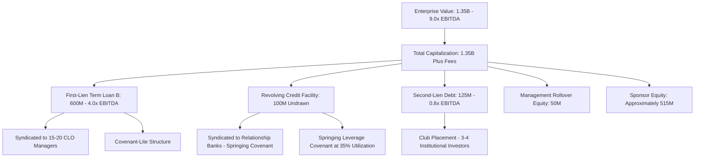

## Case Study: Structuring a Leveraged Buyout Capital Structure

### Overview

This case study walks through the process of structuring the capital stack for a leveraged buyout (LBO), synthesizing the sourcing, sizing, and negotiation decisions a sponsor and lead arranger jointly work through from initial mandate to final syndication. Rather than treating capital structure as a static output, the case illustrates how leverage capacity, tranche selection, pricing, and covenant negotiation are determined iteratively as diligence findings, market conditions, and rating agency feedback develop over the deal timeline.

### The Illustrative Transaction

**Example**

A private equity sponsor is acquiring "TargetCo," a business services company with $150M of pro forma adjusted EBITDA, for an enterprise value of $1.35B (a 9.0x EBITDA multiple). The sponsor's investment thesis assumes moderate organic growth and margin expansion from operational improvements, with an anticipated 5-year hold. The financing requirement is approximately $1.0B of total capital (debt plus sponsor equity), with the remainder funded through a combination of sponsor equity and rollover equity from the existing management team.

### Step 1: Determining Total Leverage Capacity

#### Initial Leverage Sizing

The sponsor and lead arranger begin by benchmarking total leverage against comparable transactions and the borrower's specific cash-flow characteristics:

$$\text{Total Debt} = \text{Total Leverage Multiple} \times \text{EBITDA}$$

For TargetCo, the arranger's credit committee, informed by leveraged lending guidance principles discussed elsewhere in this material (total leverage benchmarks around 4.0x–5.0x for a business-services credit of this profile), proposes a total leverage of 5.5x EBITDA, or approximately $825M of total debt, reflecting the business's relatively stable, contracted revenue base that supports leverage modestly above the general guidance benchmark.

#### Sizing the Equity Check

$$\text{Sponsor Equity} = \text{Enterprise Value} + \text{Transaction Fees} - \text{Total Debt} - \text{Rollover Equity}$$

With enterprise value of $1.35B, estimated transaction fees and expenses of $40M, total debt of $825M, and $50M of management rollover equity, the sponsor's required cash equity contribution is approximately $515M — implying an equity contribution of roughly 47% of total capitalization, consistent with post-2022 market norms favoring higher equity cushions than the pre-2022 low-rate environment.

### Step 2: Designing the Capital Stack — Tranche Selection

#### Tranche A: First-Lien Term Loan B

- **Size**: $600M (approximately 4.0x EBITDA)
- **Structure**: institutional term loan, 7-year tenor, priced at a spread over SOFR, syndicated primarily to CLOs
- **Rationale**: forms the core, lowest-cost layer of the debt stack, sized to be attractive to the broadest possible institutional investor base without requiring the highest tier of covenant protection

#### Tranche B: Revolving Credit Facility

- **Size**: $100M (undrawn at close)
- **Structure**: pro rata facility syndicated to relationship banks, used for working capital and liquidity support, typically carrying a springing leverage covenant tested only when utilization exceeds a specified threshold
- **Rationale**: provides operational liquidity without adding to funded leverage at close, while giving relationship banks a role in the transaction that supports the sponsor's broader banking relationships

#### Tranche C: Second-Lien or Subordinated Debt (if utilized)

- **Size**: $125M (approximately 0.8x EBITDA), bringing total funded debt to 5.5x EBITDA excluding the undrawn revolver
- **Structure**: second-lien term loan or subordinated notes, priced at a wider spread reflecting subordination, held by a smaller group of institutional or private credit investors comfortable with the junior position
- **Rationale**: extends total leverage capacity beyond what the first-lien market alone would support, while preserving the first-lien tranche's more conservative leverage profile for CLO distribution

### Step 3: Evaluating BSL vs. Private Credit vs. Hybrid Execution

**Key Points**

- Given current market bifurcation trends (where sponsor-backed, lower-rated issuance faces more selective execution conditions than higher-rated corporate issuance), the arranger runs a dual-track process: soliciting indicative terms from both the broadly syndicated loan market and private credit direct lenders for the full $725M funded debt package.
- The private credit alternative offers a single-tranche unitranche structure at a blended rate wider than the BSL structure's blended cost, but with greater EBITDA addback flexibility, faster execution certainty, and no reliance on CLO market conditions at the time of syndication.
- The sponsor and arranger ultimately select the syndicated BSL structure given TargetCo's stable, well-understood business model and the arranger's confidence in successful syndication, but structure the commitment letter with contractual flex language allowing pricing and terms to adjust if syndication proves more difficult than anticipated — preserving optionality without fully committing to the private credit alternative unless needed.

### Step 4: Covenant Package Negotiation

**Key Points**

- The first-lien term loan B is negotiated as **covenant-lite** (no maintenance financial covenant, only incurrence-based covenants tested upon specific actions like incurring additional debt or making restricted payments), consistent with prevailing market practice for institutional term loans of this size and credit profile.
- The revolving credit facility carries a **springing leverage covenant**, tested only if revolver utilization exceeds 35% of commitments at a quarter-end, giving relationship lenders a monitoring mechanism without imposing an active maintenance test on the sponsor absent meaningful revolver draw.
- EBITDA addback provisions are negotiated to include run-rate cost synergies (subject to a cap, typically 15-25% of EBITDA, and a sunset period, typically 12-24 months, for realization), reflecting standard current market practice while avoiding the kind of unsubstantiated addback inflation that would draw heightened scrutiny under leveraged lending guidance principles.
- A sustainability-linked pricing feature is considered but ultimately structured as a "sleeping" feature — the KPI/SPT framework is negotiated and included in the credit agreement schedule, but the margin ratchet mechanism activates only after the first full fiscal year, giving the borrower time to establish a reliable KPI baseline before pricing is affected.

### Step 5: Syndication Strategy and Distribution

**Key Points**

- The lead arranger targets a syndicate of approximately 15-20 CLO managers for the first-lien term loan B, with individual allocations sized to avoid excessive concentration in any single CLO manager's portfolio, informed by concentration risk management principles.
- Given current sector rotation dynamics favoring higher-rated and less cyclical credits, the arranger's marketing materials emphasize TargetCo's contracted, recurring revenue base and limited cyclicality to differentiate the credit from more discretionary business-services or consumer-facing comparables facing tighter execution conditions.
- The second-lien tranche is placed through a more targeted, club-style process with 3-4 institutional investors comfortable with subordinated risk at this leverage level, reflecting the smaller, less liquid nature of that market segment compared to the broadly syndicated first-lien tranche.

### Step 6: AML/KYC and Documentation Coordination

**Key Points**

- Given the sponsor's fund structure involves a Cayman-domiciled fund vehicle with a Luxembourg intermediate holding company (consistent with common private equity fund structuring), the arranger's compliance team completes beneficial ownership tracing through the fund's general partner ahead of syndication, distributing a coordinated KYC package to prospective syndicate lenders to avoid duplicative diligence requests slowing the syndication timeline.
- Credit agreement documentation is based on LSTA (New York law) templates given the transaction's U.S. domicile, with standard sanctions representations and a borrower covenant to provide reasonably requested KYC information to facilitate future secondary trading and lender assignments.

### Diagram: TargetCo LBO Capital Structure

### Diagram: TargetCo Capital Stack Waterfall (svg_diagram)

<svg xmlns="http://www.w3.org/2000/svg" viewBox="0 0 700 380">
<text x="350" y="24" text-anchor="middle" font-size="16" font-weight="bold" fill="#1a1a1a">TargetCo LBO Capital Stack (svg_diagram)</text>
<rect x="200" y="50" width="300" height="220" fill="none" stroke="#333" stroke-width="1" />
<rect x="200" y="50" width="300" height="120" fill="#bee3f8" stroke="#2b6cb0" />
<text x="350" y="105" text-anchor="middle" font-size="13" fill="#1a365d">First-Lien Term Loan B</text>
<text x="350" y="123" text-anchor="middle" font-size="12" fill="#1a365d">$600M (4.0x EBITDA)</text>
<rect x="200" y="170" width="300" height="60" fill="#fed7d7" stroke="#c53030" />
<text x="350" y="197" text-anchor="middle" font-size="13" fill="#742a2a">Second-Lien Debt</text>
<text x="350" y="215" text-anchor="middle" font-size="12" fill="#742a2a">$125M (0.8x EBITDA)</text>
<rect x="200" y="230" width="300" height="40" fill="#faf089" stroke="#b7791f" />
<text x="350" y="255" text-anchor="middle" font-size="12" fill="#744210">Management Rollover: $50M</text>
<rect x="200" y="270" width="300" height="80" fill="#c6f6d5" stroke="#2f855a" />
<text x="350" y="305" text-anchor="middle" font-size="13" fill="#22543d">Sponsor Equity</text>
<text x="350" y="323" text-anchor="middle" font-size="12" fill="#22543d">Approximately $515M</text>

<text x="150" y="115" text-anchor="end" font-size="11" fill="`#4a5568`">Senior/Lowest Cost</text>

<text x="150" y="305" text-anchor="end" font-size="11" fill="`#4a5568`">Junior/Highest Cost</text>

<text x="350" y="365" text-anchor="middle" font-size="11" fill="`#4a5568`">Revolving Credit Facility ($100M, undrawn at close) sits alongside, not shown to scale</text>

</svg>

### Key Structuring Trade-Offs Illustrated by the Case

**Key Points**

- **Leverage vs. Distribution Risk**: pushing total leverage higher (via the second-lien tranche) allows a smaller sponsor equity check but narrows the pool of investors willing to hold the junior tranche, illustrating the direct tension between capital efficiency for the sponsor and the arranger's underwriting and distribution risk.
- **Covenant Flexibility vs. Pricing**: the covenant-lite first-lien structure supports broad CLO distribution and tighter pricing but limits the lender group's ability to intervene early if performance deteriorates, a trade-off the arranger and sponsor must weigh against the revolver's springing covenant, which provides some monitoring capability without affecting the core term loan's covenant-lite status.
- **BSL vs. Private Credit Optionality**: maintaining a dual-track process and flex language preserves execution optionality but requires additional arranger effort and cost in running parallel processes — a trade-off increasingly common given current BSL/private credit convergence dynamics.
- **Speed vs. Diligence Thoroughness**: the beneficial ownership tracing and KYC coordination work, while necessary given the fund's multi-jurisdictional structure, adds time to the pre-syndication timeline that must be planned for rather than treated as a final-stage formality.

### Common Pitfalls Illustrated by This Case

- Sizing total leverage purely by reference to market comparables without adjusting for the specific borrower's cash-flow stability and the current bifurcated market environment's effect on execution feasibility for a given credit profile.
- Underestimating the time required for AML/KYC beneficial ownership tracing in a sponsor structure involving multiple fund and holding company layers, causing late-stage syndication timeline pressure.
- Treating the covenant-lite vs. springing-covenant distinction between the term loan and revolver as merely a documentation detail rather than a meaningful risk allocation and monitoring design choice.
- Failing to negotiate EBITDA addback caps and sunset provisions with sufficient rigor, risking the kind of addback scrutiny that leveraged lending guidance principles specifically flag as a supervisory concern.
- Committing fully to one execution channel (BSL or private credit) too early in the process, forfeiting the negotiating leverage and risk mitigation that a well-structured dual-track process provides.

### Related Topics

**Related Topics**

- EBITDA Addback Negotiation and Quality-of-Earnings Diligence in Practice
- Covenant-Lite vs. Springing Covenant Structures: Comparative Risk Allocation
- Dual-Track BSL/Private Credit Process Design and Execution Timing
- Second-Lien and Subordinated Debt Placement Strategies for Club Investors
- Sponsor Equity Contribution Trends and Historical Benchmarking
- Sustainability-Linked "Sleeping" Feature Structuring in New-Issue Credit Agreements