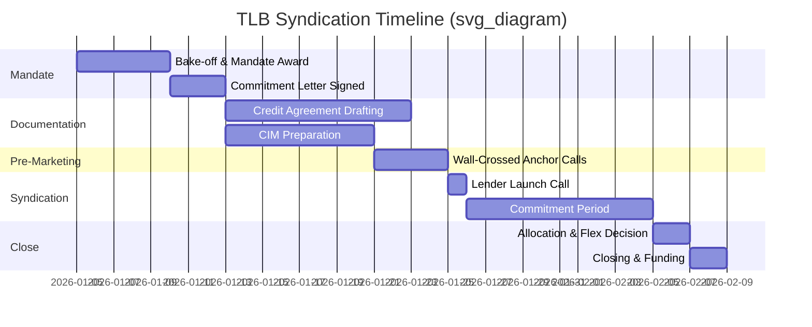
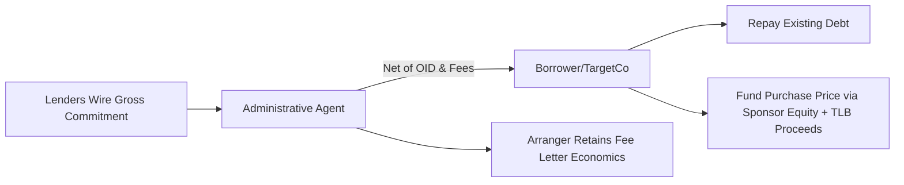

## Case Study: Syndicating a Term Loan B from Mandate to Close

### Case Overview and Learning Objectives

This case study traces a hypothetical **$500 million Term Loan B (TLB)** financing a leveraged buyout, following the transaction sequentially from initial mandate award through allocation and closing. The objective is to illustrate how theoretical syndication mechanics translate into the operational, negotiation, and documentation decisions that arise at each stage.

**Key Points**

- The case assumes a sponsor-backed LBO of a mid-cap industrial services company ("TargetCo") with approximately $75 million of pro forma EBITDA
- Total leverage is structured at 5.5x EBITDA, with the TLB representing the senior secured tranche alongside a smaller revolving credit facility
- The transaction is marketed to institutional term loan investors (CLOs, loan mutual funds, separately managed accounts) rather than a broad bank syndicate
- Timeline compression is a deliberate teaching element: the case runs on a ~5-week timeline from launch to close, reflecting a competitive, well-prepared process rather than an average one

### Stage 1: Mandate and Structuring

**Sponsor Selection of Lead Arranger(s)**

TargetCo's financial sponsor runs a competitive "bake-off" among three investment banks, evaluating:

- Underwriting commitment levels and flex terms proposed
- Fee economics (arrangement fee, upfront OID assumptions)
- Distribution capability into the institutional term loan investor base
- Certainty of execution, referencing the bank's recent track record in comparable credits
- Cross-sell considerations (M&A advisory, equity capital markets relationships)

The sponsor selects a **single lead left arranger** with joint bookrunner status shared with one additional bank, avoiding an overly fragmented syndicate that could dilute accountability.

**Commitment Letter and Fee Letter**

The arranger issues a commitment letter with:

- A "certain funds" commitment for the full $500 million, subject to customary conditions precedent
- Market flex language permitting adjustment of pricing (typically ±50-75 bps), OID, and certain terms if syndication demand requires
- A confidential fee letter specifying the arrangement fee (typically 1.00%-1.50% of commitment) and any flex fee mechanics

**Key Points**

- Market flex is the arranger's primary risk-mitigation tool; the case highlights the tension between the sponsor wanting flex capped tightly and the arranger wanting broad flex to protect against a soft market
- The commitment letter is negotiated in parallel with, but is legally distinct from, the credit agreement itself

**Preliminary Term Sheet Structuring**

The arranger and sponsor agree preliminary terms:

| Term | Preliminary Level |
| --- | --- |
| Facility | $500mm Term Loan B, 7-year tenor |
| Pricing | SOFR + 375 bps, 0.50% SOFR floor |
| OID | 99.00-99.50 |
| Call Protection | 101 soft call for 6 months |
| Leverage (Total Net) | 5.5x |
| Financial Covenant | None (covenant-lite) |
| Amortization | 1% per annum |

### Stage 2: Documentation and Due Diligence Preparation

**Credit Agreement Drafting**

Lead counsel for the arranger circulates an initial draft credit agreement, typically based on a "precedent" document from a recent comparable transaction. Key negotiated provisions in this stage include:

- **Covenant package**: EBITDA add-back definitions, restricted payment baskets, incremental debt capacity (including "incremental equivalent debt" and ratio-based incremental facilities)
- **MFN (Most Favored Nation) protection**: sunset period (commonly 12-18 months) and threshold for triggering MFN pricing adjustments on future incremental debt
- **Excess cash flow sweep**: percentage stepped based on leverage (e.g., 50% at >4.0x, 25% at 3.0x-4.0x, 0% below 3.0x)
- **EBITDA addback flexibility**: negotiated cap on pro forma cost-saving addbacks (a frequent point of investor pushback discussed later)

**Lender Presentation (Bank Book) Preparation**

The arranger compiles the **Confidential Information Memorandum (CIM)** or lender presentation, including:

- Business overview, industry positioning, and competitive dynamics
- Historical and projected financial statements
- Sponsor's investment thesis and value-creation plan
- Adjusted EBITDA reconciliation with detailed addback schedules
- Sources and uses, and pro forma capitalization table

**Illustrative Sources & Uses**

$$\text{Total Uses} = \text{Purchase Price} + \text{Refinanced Debt} + \text{Transaction Fees} = \text{Total Sources}$$

| Sources ($mm) | Uses ($mm) |
| --- | --- |
| Term Loan B: 500 | Purchase of Equity: 900 |
| Revolver (undrawn): 0 | Refinance Existing Debt: 150 |
| Sponsor Equity: 575 | Transaction Fees & Expenses: 25 |
| **Total: 1,075** | **Total: 1,075** |

### Stage 3: Launch and Market Sounding

**Pre-Marketing / Wall-Crossing**

Prior to broad syndication, the arranger conducts **early looks** with a small group of anchor institutional investors, often on a private-side (restricted) basis, to:

- Gauge appetite for leverage and pricing
- Identify potential covenant or documentation objections early
- Secure informal anchor orders to build launch momentum

**Key Points**

- Anchor orders reduce execution risk but require careful information barrier management, since wall-crossed investors cannot trade the sponsor's or TargetCo's public securities (if any exist) until cleansed
- The case illustrates a scenario where one anchor CLO manager flags the EBITDA addback cap as a hold-up issue pre-launch, prompting the arranger to tighten the addback definition before general syndication to avoid a repeat objection later

**Lender Call and Launch**

The transaction formally launches via a lender call, at which:

- Management presents the business plan and projections
- The arranger distributes the term sheet and CIM to the full target investor list
- A commitment deadline is set (in this case, 10 business days from launch)

### Stage 4: Bookbuilding and Price Discovery

**Order Book Dynamics**

As commitments are received, the arranger maintains a real-time order book tracking:

- Investor name, order size, and any conditions attached to the order ("subject to final documentation," "subject to pricing at OID 99")
- Cumulative subscription level relative to the $500 million target

**Illustrative Order Book Progression**

| Day | Cumulative Orders ($mm) | Subscription |
| --- | --- | --- |
| Day 1 (launch) | 180 | 36% |
| Day 4 | 410 | 82% |
| Day 7 | 620 | 124% |
| Day 10 (deadline) | 780 | 156% |

**Key Points**

- Oversubscription at 156% gives the arranger negotiating leverage to exercise **reverse flex** (tightening pricing in the issuer's favor)
- The case models the arranger reducing spread from SOFR+375 to SOFR+350 and tightening OID from 99.00 to 99.50, consistent with the flex parameters set in the commitment letter
- Oversubscription also allows the arranger to reduce or eliminate the amount of any bridge/backstop paper originally contemplated

**Reverse Flex Mechanics**

$$\text{Flexed Yield} = \left(\text{SOFR} + \text{Spread}\right) + \frac{100 - \text{OID}}{\text{Weighted Average Life}}$$

This approximate yield-to-maturity calculation is used informally by investors to compare the flexed terms against alternative comparable credits before deciding whether to remain in the deal at the tightened terms.

[Inference] Some oversubscribed investors, particularly those with smaller orders, may reduce their commitment size in response to reverse flex if the tightened yield falls below their return hurdle, since actual investor behavior in response to flex is not contractually determined and varies by mandate.

### Stage 5: Allocation

**Allocation Philosophy**

Because the deal is oversubscribed, the arranger must scale back orders. Allocation is not proportional by default; it reflects a blend of factors:

- **Anchor order priority**: investors who provided pre-launch anchor commitments typically receive full or near-full allocation as a relationship incentive
- **Relationship weighting**: investors with a history of participating in the sponsor's or arranger's prior deals may receive preferential scaling
- **Order timing**: early orders are sometimes favored over last-minute orders, particularly "auction" orders placed only to test final terms
- **Investor type diversification**: the arranger may deliberately balance CLO participation against mutual fund/SMA participation to support a diversified post-close holder base, which can aid secondary market liquidity and reduce amend-and-extend friction later

**Illustrative Allocation Outcome**

| Investor Type | Orders ($mm) | Allocated ($mm) | Scale-Back |
| --- | --- | --- | --- |
| Anchor CLOs (3 accounts) | 220 | 210 | ~5% |
| Other CLOs | 340 | 175 | ~49% |
| Loan Mutual Funds | 150 | 75 | ~50% |
| SMAs / Other | 70 | 40 | ~43% |
| **Total** | **780** | **500** | **~36% avg** |

**Key Points**

- Scale-back percentages are disclosed to investors, though the arranger typically does not disclose other investors' individual order sizes
- Disputes over allocation are among the most common friction points in this stage; the case highlights a scenario where a large mutual fund complains about a 50% scale-back despite an early order, and the arranger's response emphasizes total relationship value across multiple funds rather than this single order

### Stage 6: Final Documentation and Closing Conditions

**Conditions Precedent to Closing**

Before funding, the credit agreement's conditions precedent must be satisfied, typically including:

- Execution of all definitive loan documentation and perfection of collateral (UCC filings, mortgages if applicable)
- Delivery of a solvency certificate
- No Material Adverse Effect (MAC) bring-down
- Completion of the equity contribution from the sponsor
- Delivery of a borrowing base certificate or compliance certificate, where applicable
- KYC/AML documentation for all lenders of record

**"SunGard" / Certain Funds Provisions**

[Unverified] In many sponsor-backed LBO financings, the credit agreement incorporates limited conditionality provisions (sometimes referred to informally by reference to a well-known precedent litigation) restricting the lenders' ability to refuse funding based on target-level MAC outside a narrow definition, though the precise scope of these provisions is heavily negotiated deal-by-deal and varies by jurisdiction and sponsor leverage, so this should not be treated as a standardized market term.

**Funding Mechanics**

On the closing date:

1. Lenders wire their allocated commitment amounts to the administrative agent
2. The administrative agent funds the borrower net of OID and upfront fees
3. Existing debt being refinanced is repaid concurrently
4. The credit agreement, security documents, and intercreditor agreement (if a separate revolver lender group exists) become effective simultaneously

### Post-Closing: Secondary Market Considerations

**Key Points**

- Within days of closing, the TLB typically begins trading in the secondary market; the case notes an illustrative opening secondary quote of 99.75/100.25, modestly above the 99.50 OID, reflecting the reverse-flexed tightening and healthy technical demand
- Allocation decisions made during syndication directly influence secondary liquidity: a broadly diversified holder base generally trades more actively than a concentrated one
- The administrative agent transitions to ongoing roles including covenant compliance monitoring, LIBOR/SOFR-related notices (legacy transactions), and processing any assignments or participations in secondary trading

### Discussion Questions for Case Analysis

1. Evaluate the sponsor's decision to award a single lead-left mandate rather than a club of arrangers. What execution risks does this concentrate, and how does the market flex provision mitigate them?
2. Given the 156% oversubscription, was the arranger's magnitude of reverse flex (25 bps tightening, 50 bps OID improvement) appropriately aggressive, or could greater value have been captured for the sponsor?
3. Assess the allocation methodology's fairness and commercial rationale. How should an arranger balance anchor-investor loyalty against pro-rata fairness to the broader order book?
4. How does the covenant-lite structure and EBITDA addback flexibility negotiated in Stage 2 affect the credit's risk profile as perceived by CLO managers versus mutual fund investors, given their differing regulatory and mandate constraints?

**Next Steps**

- Cross-Border Syndication Structures and Currency Tranching
- Amend-and-Extend (A&E) Transactions in the Secondary Market
- Intercreditor Agreements: TLB and Revolver Priority Mechanics
- CLO Investment Criteria and Their Influence on Primary Market Terms
- Distressed Term Loan Restructuring and Lender Group Dynamics