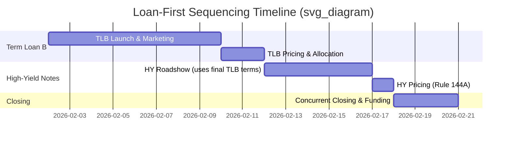
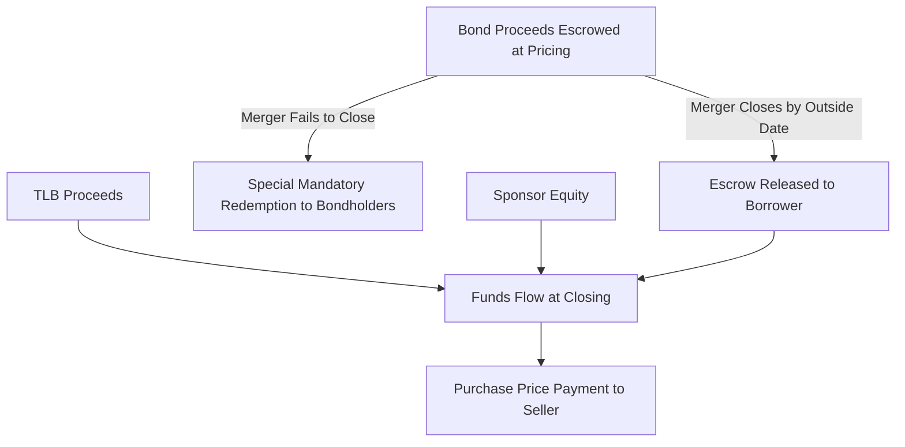

## Case Study: Structuring a High-Yield Bond and Term Loan B Combination

### Case Overview and Learning Objectives

This case study examines a hypothetical **$900 million financing** for a leveraged buyout, split between a **$500 million Term Loan B (TLB)** and a **$400 million senior unsecured High-Yield (HY) Bond**, structured concurrently ("split-rated, split-market" execution). The objective is to illustrate how relative pricing, timing sequencing, and structural subordination decisions are negotiated when two distinct investor bases must be marketed simultaneously.

**Key Points**

- The sponsor's target company ("HoldCo Industries") has approximately $110 million of pro forma EBITDA, with total leverage structured at 6.5x
- The TLB is secured on a first-lien basis; the HY bond is structurally or contractually subordinated, unsecured, and sits behind the TLB in the capital structure
- The two instruments are marketed to substantially different investor bases (leveraged loan investors vs. high-yield bond accounts), each with distinct return requirements, covenant expectations, and timing conventions
- The case emphasizes the sequencing decision (loan-first vs. bond-first vs. simultaneous) as the central structuring choice, since it materially affects execution risk and relative pricing power

### Stage 1: Capital Structure Design

**Determining the Split Between Loan and Bond**

The arranger and sponsor evaluate several allocation splits between secured loan and unsecured bond capacity, balancing:

- **Cost of capital**: the TLB is priced tighter (lower coupon) due to its senior secured position; the HY bond carries a higher coupon to compensate for structural subordination
- **Covenant flexibility**: bond covenants (incurrence-based) are generally more permissive on an ongoing basis than loan covenants, even in a covenant-lite loan structure, which matters for the sponsor's post-close flexibility around dividends and acquisitions
- **Prepayment flexibility**: the TLB permits repayment at any time without penalty after the initial call period (101 soft call), while the HY bond carries a longer non-call period (typically non-call for the first half of its tenor) with a fixed premium schedule thereafter
- **Rating agency considerations**: the mix of secured/unsecured debt directly affects the notching between the corporate family rating and the instrument-specific rating on each tranche

**Illustrative Capital Structure**

| Tranche | Amount ($mm) | Security | Tenor | Indicative Pricing |
| --- | --- | --- | --- | --- |
| Revolving Credit Facility | 75 (undrawn) | 1st Lien | 5-year | SOFR + 350 |
| Term Loan B | 500 | 1st Lien | 7-year | SOFR + 400, 0.50% floor |
| Senior Unsecured Notes | 400 | Unsecured | 8-year (NC-4) | 8.25% fixed coupon |
| Sponsor Equity | 425 | — | — | — |
| **Total Capitalization** | **1,400** |  |  |  |

$$\text{Total Net Leverage} = \frac{\text{TLB} + \text{Notes} - \text{Cash}}{\text{EBITDA}} = \frac{500 + 400 - 10}{110} \approx 8.1x$$

[Inference] The leverage multiple used for marketing purposes is often quoted on a gross or "through" basis at each tranche (e.g., "4.5x through the loan, 8.1x total"), since the specific convention for calculating and presenting leverage varies by arranger and is not standardized across all deals.

### Stage 2: Rating Agency Process

**Corporate and Instrument Ratings**

Both Moody's and S&P (or similar agencies) are engaged to provide:

- A **corporate family rating (CFR)** or issuer rating reflecting overall credit quality
- **Instrument-level ratings** for the TLB and the HY notes separately, which typically diverge due to differing recovery expectations in a default scenario

**Notching Mechanics**

Rating agencies apply notching based on expected loss severity:

- The secured TLB, benefiting from a priority claim on collateral, is typically notched **above** the CFR (e.g., CFR of B2 with TLB rated B1)
- The unsecured HY notes, being structurally subordinated to both the TLB and any operating company liabilities, are typically notched **below** the CFR (e.g., B2 CFR with notes rated B3 or Caa1)

**Key Points**

- The magnitude of notching depends heavily on the proportion of secured debt in the structure; a capital structure with a larger secured tranche relative to total debt produces wider notching between loan and bond ratings, since the unsecured layer absorbs a larger share of loss severity in a stress scenario
- [Unverified] Specific notching outcomes are agency-specific and can vary based on qualitative factors (industry cyclicality, asset intensity) beyond the pure quantitative loss-given-default calculation, so this case's illustrative notching should not be read as a universal formula

### Stage 3: Sequencing Strategy

**Loan-First vs. Bond-First vs. Simultaneous Marketing**

The case walks through three sequencing options considered by the arranger:

**Option A: Loan-First Sequencing**

- The TLB launches and prices first; final loan terms (spread, OID) are locked before the bond roadshow begins
- Advantage: bond investors can underwrite off a known, finalized senior capital structure, reducing execution uncertainty on the bond side
- Disadvantage: extends overall timeline, and loan market conditions at launch may not reflect bond market sentiment a week later

**Option B: Bond-First Sequencing**

- The HY notes price first via a Rule 144A offering; the TLB is marketed once bond terms are set
- Advantage: locks in the more execution-sensitive, market-volatility-exposed instrument (bonds typically have less flex tolerance once priced) before finalizing the loan
- Disadvantage: loan investors must underwrite based on a bond coupon that increases effective leverage cost, without the reverse benefit

**Option C: Simultaneous/Parallel Marketing**

- Both instruments launch concurrently with a joint roadshow covering both investor bases, pricing on the same day or within a tight window
- Advantage: shortest overall timeline, single unified message to the market on business fundamentals
- Disadvantage: higher execution risk if one market (loan or bond) experiences a technical disruption during the shared window, since neither tranche has a "known" reference price for the other

The case selects **Option A (loan-first)**, reflecting a scenario where loan market technicals are strong (CLO reinvestment period demand) while high-yield primary issuance calendar is congested, making it advantageous to lock the loan before bond investors assess relative value.

### Stage 4: High-Yield Bond Marketing Mechanics

**Rule 144A Offering Process**

Since the HY notes are typically sold without SEC registration at issuance, the offering proceeds under **Rule 144A** with registration rights:

- An **offering memorandum (OM)** is prepared, distinct from (though overlapping in content with) the loan's CIM, containing audited financials, risk factors, and use of proceeds
- The notes are initially sold to qualified institutional buyers (QIBs) under Rule 144A, with a **registration rights agreement** obligating the issuer to later conduct an exchange offer for SEC-registered notes with identical economic terms
- A roadshow is conducted for bond investors (high-yield mutual funds, insurance companies, hedge funds), distinct from the bank-loan lender roadshow, even where the same underlying business is presented

**Key Points**

- Bond investors generally place greater emphasis on the incurrence covenant package (restricted payments basket, debt incurrence ratio tests, change-of-control put) than loan investors, since bonds lack the ongoing maintenance covenant discipline sometimes found in loan structures
- The **change-of-control put** at 101% of par is a standard bond feature generally absent from term loan documentation in comparable form, reflecting the bond market's greater sensitivity to structural changes post-issuance given the illiquidity of direct bondholder remedies compared to a lender group's amendment mechanics

**Illustrative Bond Covenant Summary**

| Covenant | Mechanic |
| --- | --- |
| Restricted Payments | Builder basket = 50% of cumulative net income + equity issuance proceeds |
| Debt Incurrence | Fixed Charge Coverage Ratio test of 2.0x for incremental debt outside baskets |
| Change of Control | Put at 101% of par |
| Asset Sales | Proceeds reinvestment or offer to repurchase at 100% of par if not reinvested within 365 days |

### Stage 5: Intercreditor Arrangements

**Structural Subordination vs. Contractual Subordination**

Where the HY notes are unsecured and issued at the same corporate entity as the TLB, subordination is achieved primarily through the **absence of collateral** (structural seniority of the loan via security interest) rather than a formal subordination agreement. Where the notes are issued by a holding company one level above the TLB borrower, subordination is reinforced through **structural** seniority of the loan (operating company debt structurally senior to holdco-level unsecured notes).

**Key Points**

- No formal intercreditor agreement is typically required between an unsecured bondholder group and a secured lender group, since the bonds have no lien to subordinate; the capital structure achieves the desired priority purely through the collateral package and (if applicable) structural placement of the issuing entity
- This contrasts with a **first-lien/second-lien** structure (not used in this case but relevant for comparison), which does require a negotiated intercreditor agreement governing lien priority, standstill periods, and payment blockage

### Stage 6: Pricing Coordination and Relative Value

**Cross-Market Pricing Feedback Loop**

Even under loan-first sequencing, the case illustrates that bond investors' preliminary price talk feeds back into the loan syndication process:

- If early bond investor soundings suggest the HY notes will price at a wide coupon (indicating market caution on the credit), the loan arranger may face reduced institutional demand, since loan investors monitor the "cost of the balance of the capital structure" as a proxy for overall credit risk
- Conversely, strong anchor demand on the loan can be referenced (informally, subject to compliance with securities law information-sharing restrictions) to bond investors as a positive signal on senior lender conviction

**Illustrative Final Pricing Outcome**

| Tranche | Initial Talk | Final Pricing | Direction |
| --- | --- | --- | --- |
| TLB | SOFR + 425, OID 99 | SOFR + 400, OID 99.5 | Tightened (reverse flex) |
| HY Notes | 8.75% area | 8.25% | Tightened |

[Inference] The parallel tightening of both tranches in this scenario suggests favorable overall market technicals rather than idiosyncratic credit improvement, though attributing pricing moves to a single cause is inherently an interpretive judgment rather than a directly observable fact.

### Stage 7: Closing Coordination

**Concurrent Closing Conditions**

Because sponsor equity funding, loan proceeds, and bond proceeds must all be available simultaneously to fund the LBO purchase price, the transaction requires tightly coordinated closing mechanics:

1. Bond proceeds are typically held in an **escrow account** if the notes price before the overall M&A transaction is certain to close (common in acquisition financings), releasing only upon satisfaction of a "special mandatory redemption" escape clause if the merger fails to close by an outside date
2. TLB funding occurs directly to the borrower on the closing date since loan commitments are typically not escrowed in the same manner
3. The administrative agent (for the loan) and the trustee (for the bonds) coordinate the closing date funds flow with the sponsor's equity contribution

### Discussion Questions for Case Analysis

1. Compare the trade-offs of loan-first, bond-first, and simultaneous sequencing given the market technical conditions described. Under what conditions would bond-first sequencing have been preferable?
2. How does the notching differential between the TLB and HY notes influence each investor base's required return, and how should the arranger use this in setting initial price talk?
3. Evaluate the use of a bond escrow structure in this case. What specific risks does the special mandatory redemption provision transfer from the issuer to bondholders, and how is this typically priced into the bond coupon?
4. If loan market technicals had been weak at launch (undersubscription) while bond demand was strong, how might the sponsor's optimal sequencing and structuring decisions have changed?

**Related Topics**

- First-Lien/Second-Lien Structures and Intercreditor Agreements
- Bridge-to-Bond Financing and Backstop Commitment Mechanics
- Covenant Comparison: Incurrence-Based vs. Maintenance-Based Frameworks
- Rule 144A/Regulation S Offering Mechanics and Registration Rights
- Cross-Border High-Yield Issuance and Currency-Matched Tranching