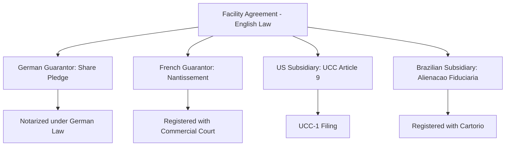

## Case Study: Cross-Border Syndicated Facility Structuring

### Case Overview and Learning Objectives

This case study examines a hypothetical **€750 million equivalent multi-currency syndicated facility** for "EuroTech Group," a European industrial manufacturer with operating subsidiaries in Germany, France, the United States, and Brazil. The facility combines a term loan and revolving credit facility drawable in multiple currencies, syndicated to a mixed lender group spanning European relationship banks, U.S. institutional term loan investors, and regional banks in Brazil. The objective is to illustrate how currency risk, jurisdictional legal frameworks, tax withholding, and cross-border security enforcement shape facility structuring decisions that do not arise in a single-jurisdiction financing.

**Key Points**

- The facility must accommodate borrowings in EUR, USD, and BRL, each with distinct reference rate conventions, settlement mechanics, and lender appetite
- Security is granted across multiple jurisdictions, each with different perfection requirements, insolvency regimes, and enforcement timelines
- Withholding tax exposure differs by lender jurisdiction and borrower jurisdiction, requiring a negotiated tax gross-up and tax indemnity framework
- The lender group spans banks operating under different regulatory capital regimes (Basel-based European/U.S. banks vs. Brazilian banks subject to local central bank requirements), affecting each lender's cost of capital and therefore pricing sensitivity

### Stage 1: Multi-Currency Facility Design

**Currency Tranching Structure**

The arranger structures the facility as a single facility agreement with multiple currency options rather than separate parallel facilities, to preserve a unified covenant package and cross-default framework:

| Tranche | Currency | Amount (EUR equivalent) | Reference Rate | Borrower |
| --- | --- | --- | --- | --- |
| Term Loan A | EUR | 400mm | €STR + margin | EuroTech Group (Germany) |
| Revolving Facility | Multi-currency (EUR/USD) | 250mm | €STR / SOFR + margin | EuroTech Group + US Subsidiary |
| Term Loan B (local) | BRL | 100mm equiv. | CDI + margin | Brazilian Subsidiary |

**Key Points**

- The BRL tranche is often structured as a **local currency facility** funded by Brazilian lenders directly, rather than cross-border USD/EUR lending converted to BRL, since local funding avoids the borrower bearing FX conversion risk on debt service and sidesteps Brazilian exchange control registration requirements that apply to certain cross-border loans
- Each reference rate (€STR for euro borrowings, SOFR for dollar borrowings, CDI for Brazilian real borrowings) reflects the post-LIBOR transition landscape; the credit agreement must define fallback mechanics independently for each currency, since a single fallback waterfall drafted around one benchmark does not automatically extend to the others

**Currency Fallback and Screen Rate Mechanics**

$$\text{All-in Rate}_{\text{currency}} = \text{Reference Rate}_{\text{currency}} + \text{Applicable Margin} + \text{Mandatory Cost (if applicable)}$$

[Unverified] "Mandatory Cost" or similar regulatory cost pass-through provisions are common in facilities involving European bank lenders subject to reserve asset requirements, but the precise mechanics and whether such a provision is included at all depends on the specific lender group's regulatory status and is heavily negotiated rather than standardized.

### Stage 2: Governing Law and Documentation Framework

**Choice of Governing Law**

The syndicate must select a governing law for the facility agreement itself, distinct from the governing law of local security documents:

- The facility agreement is governed by **English law**, reflecting its common use as a neutral, creditor-familiar framework for cross-border European syndications (via LMA-style documentation) with a well-developed body of case law on syndicated lending disputes
- Local law security documents (German land charges, French *nantissement*, Brazilian *alienação fiduciária*) remain governed by the law of the jurisdiction where the underlying asset is located, since most jurisdictions require security over local assets to be perfected under local law regardless of the facility agreement's governing law

**Key Points**

- [Unverified] The choice between English law (LMA-based) and New York law (LSTA-based) documentation is frequently driven by which lender group represents the larger or more influential share of the syndicate, and by the borrower's primary listing/operating jurisdiction, though this is a market practice tendency rather than a fixed rule
- Where U.S. institutional term loan investors participate alongside European relationship banks in the same tranche, the credit agreement may need to reconcile LMA-style transfer/assignment mechanics with the more liquid, standardized LSTA-style assignment provisions U.S. investors expect for secondary trading

### Stage 3: Security Package Across Jurisdictions

**Jurisdiction-by-Jurisdiction Security Analysis**

| Jurisdiction | Security Type | Perfection Method | Key Consideration |
| --- | --- | --- | --- |
| Germany | Share pledge, global assignment of receivables | Notarization (share pledge); notification (receivables) | Financial assistance rules limit upstream guarantees from operating subsidiaries |
| France | Pledge over business (*nantissement de fonds de commerce*), share pledge | Registration with commercial court registry | Hardening period risk if security granted close to insolvency filing |
| United States | UCC Article 9 security interest | UCC-1 financing statement filing | Well-developed, efficient perfection regime relative to civil law jurisdictions |
| Brazil | Fiduciary assignment (*alienação fiduciária*), share pledge | Registration with local notary/registry (*cartório*) | Registration costs and delays can be material; local counsel essential |

**Key Points**

- **Financial assistance restrictions**, present in various forms across EU jurisdictions, limit the ability of a target or subsidiary to provide security or guarantees supporting the acquisition of its own shares, requiring careful structuring of guarantee scope by entity and, in some jurisdictions, formal whitewash procedures
- Agreed security principles are typically negotiated upfront (often as a schedule to the commitment letter) to cap the scope of security diligence and perfection effort relative to the practical enforcement value obtained, avoiding disproportionate legal cost in jurisdictions where security has limited incremental credit value
- [Inference] The relative cost and delay of perfecting security in each jurisdiction likely influences which assets the arranger prioritizes for full perfection versus accepting a best-efforts or unsecured guarantee instead, though this trade-off is negotiated case-by-case rather than following a fixed cost-benefit formula

### Stage 4: Tax Structuring and Withholding

**Withholding Tax Exposure by Payment Flow**

Interest payments crossing borders may trigger withholding tax depending on the payer's jurisdiction, the payee lender's jurisdiction, and applicable double tax treaties:

- Interest paid by the German borrower to a non-EU lender may be subject to German withholding tax absent treaty relief or an EU interest/royalties directive exemption
- Interest paid by the Brazilian subsidiary to foreign lenders is generally subject to Brazilian withholding tax (IRRF), with rates varying by whether the arrangement qualifies under specific registered-loan regimes

**Tax Gross-Up and Qualifying Lender Provisions**

The credit agreement includes:

- A **tax gross-up clause** obligating the borrower to gross up payments if withholding tax applies, so the lender receives the same net amount as if no withholding had occurred
- A **"Qualifying Lender" concept**, restricting the tax gross-up obligation to lenders that meet defined criteria (treaty-eligible, or falling within a domestic exemption), which incentivizes assignments/transfers to be structured through qualifying lending offices
- **FATCA and CRS compliance provisions**, allocating responsibility for information reporting and addressing potential withholding under U.S. FATCA rules on payments to non-compliant foreign financial institutions

**Key Points**

- Non-qualifying lender status can materially affect a prospective assignee's economics in the secondary market, since the assignor/assignee typically bears any incremental withholding cost created by a transfer to a non-qualifying lender, which the LMA-style documentation usually addresses through a specific indemnity allocation

### Stage 5: Syndication to a Cross-Jurisdictional Lender Group

**Differentiated Investor Appetite**

- **European relationship banks** typically price the EUR tranches based on relationship-driven considerations (ancillary business, deposit relationships, cross-sell) and may accept tighter margins than a pure credit-risk-based institutional investor would require
- **U.S. institutional term loan investors** participating in the multi-currency revolver or a USD-denominated tranche apply CLO-style credit analysis and require LSTA-consistent transfer mechanics for portfolio liquidity
- **Brazilian local banks** funding the BRL tranche operate under Brazilian Central Bank capital and reserve requirements, and their pricing reflects local funding costs (CDI-linked) rather than a globally blended cost of funds

**Key Points**

- Bookrunners often allocate a target percentage of each tranche to each investor category upfront, negotiating with the borrower on the acceptable mix, since an overly bank-heavy syndicate limits future secondary flexibility while an overly institutional syndicate may reduce the ancillary banking relationships the borrower values
- Currency-matching between lender and tranche is common but not universal: a European bank may still participate in the BRL tranche via its Brazilian branch or a correspondent banking arrangement, adding a layer of intra-group funding complexity not present in a single-currency deal

### Stage 6: Intercreditor and Cross-Default Provisions

**Cross-Default and Cross-Acceleration Across Currencies**

Because the facility is structured as a single agreement, a default under any currency tranche (e.g., non-payment on the BRL tranche by the Brazilian subsidiary) typically triggers cross-default provisions affecting the entire facility, subject to negotiated materiality thresholds and cure periods.

**Key Points**

- Materiality thresholds for cross-default are often expressed in a single reference currency (e.g., EUR equivalent) with an agreed FX conversion mechanism and conversion date, to avoid disputes over which exchange rate applies when translating a BRL or USD default amount
- [Inference] Multi-currency facilities likely include more detailed FX conversion and rounding mechanics throughout the agreement (for covenant testing, cross-default thresholds, and voting thresholds) than single-currency facilities, since nearly every quantitative threshold requires a defined currency conversion methodology, though the specific drafting approach varies by law firm and precedent used

### Stage 7: Closing and Ongoing Administration

**Closing Coordination Across Time Zones and Registries**

Closing a multi-jurisdictional facility requires sequencing local security registration and legal opinion delivery across different business hours and registry systems:

1. Legal opinions are obtained from local counsel in each jurisdiction (Germany, France, US, Brazil) confirming valid execution, authority, and enforceability of local documents
2. Security perfection steps requiring registration (French *nantissement*, Brazilian *cartório* registration) may not complete on the closing date itself, requiring the credit agreement to permit funding against an undertaking to complete perfection within an agreed post-closing period
3. The administrative agent coordinates funds flow across currencies, often using correspondent banking networks for BRL settlement given more limited direct EUR/BRL settlement infrastructure compared to EUR/USD

**Ongoing Administration**

- The administrative agent monitors compliance certificates that must aggregate financial results across subsidiaries reporting in different functional currencies, requiring a defined "Agreed Accounting Principles" and consistent FX translation methodology period-over-period
- Local security may require periodic re-registration or renewal filings (relevant in certain civil law jurisdictions), which the agent or borrower's local counsel tracks separately from the main facility's compliance calendar

### Discussion Questions for Case Analysis

1. Evaluate the decision to fund the Brazilian tranche locally in BRL rather than through a cross-border USD loan converted at the subsidiary level. What risks does this structure transfer away from the borrower group, and what risks does it retain?
2. How should the arranger balance the perfection cost and enforcement value of security across jurisdictions with materially different legal infrastructure (e.g., Germany vs. Brazil)? Where might an agreed security principles schedule appropriately limit diligence scope?
3. Assess the tax gross-up and Qualifying Lender framework from the perspective of a U.S. institutional investor considering purchasing a EUR tranche position in the secondary market. What due diligence would this investor need beyond a typical domestic term loan trade?
4. Discuss how reconciling LMA-style and LSTA-style documentation conventions within a single syndicate could create friction points in a covenant default or amendment/waiver scenario.

**Next Steps**

- LMA vs. LSTA Documentation Standards: Comparative Analysis
- Post-LIBOR Benchmark Transition Mechanics Across Currencies (SOFR, €STR, CDI)
- EU Financial Assistance Rules and Whitewash Procedures
- Emerging Market Local Currency Financing Structures
- Intercreditor Agreements in Multi-Jurisdictional Security Structures