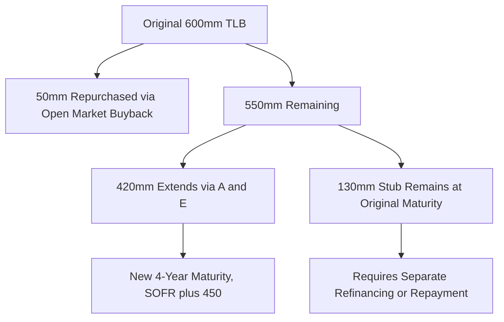

## Case Study: Distressed Refinancing and Liability Management Response

### Case Overview and Learning Objectives

This case study examines a hypothetical company, "RetailCo Holdings," facing an approaching maturity wall on its capital structure amid deteriorating operating performance. RetailCo carries a **$600 million Term Loan B** maturing in 14 months and a **$300 million senior unsecured notes** tranche maturing 18 months later, against trailing EBITDA that has declined from $140 million to $95 million over two years, pushing total net leverage from 4.5x to approximately 7.9x. The objective is to illustrate the sequence of liability management tools available to a sponsor and company facing refinancing risk, and the negotiation dynamics between the company, its existing lender group, and opportunistic third-party capital providers.

**Key Points**

- The case distinguishes **refinancing risk** (inability to repay or extend maturing debt through conventional markets) from **insolvency risk** (inability to meet ongoing obligations), though the two are related and can compound each other
- The company's credit agreement contains standard covenant-lite terms, meaning no maintenance financial covenant currently constrains it, but the approaching maturity itself creates going-concern disclosure risk regardless of covenant compliance
- The case sequences through escalating liability management responses: proactive open-market repurchases, an amend-and-extend transaction, a priming "uptier" transaction, and finally a negotiated out-of-court restructuring, reflecting how a real situation often moves through less invasive tools before reaching more aggressive ones

### Stage 1: Early Warning Signs and Initial Response

**Identifying the Maturity Wall**

RetailCo's treasury and the sponsor's portfolio team identify the refinancing risk approximately 18 months before the TLB maturity, triggered by:

- Trading levels on the TLB dropping from par to the low-80s in the secondary market, signaling market skepticism about refinancing at par
- Widening CDS-implied or bond-implied credit spreads relative to sector peers
- Covenant headroom analysis showing the company would breach a springing covenant (typically a maximum net leverage test on the revolver, tested only if revolver utilization exceeds a threshold, commonly 35-40%) if RevCredit drawings increased

**Key Points**

- Secondary trading levels are often the earliest visible signal of refinancing concern, since they reflect real-time market pricing of both credit risk and, more specifically, the market's view on refinancing feasibility at maturity
- [Inference] A widening gap between the TLB's trading price and the notes' trading price can signal market expectations about relative recovery in a downside scenario, since investors price each instrument according to its position in the capital structure, though translating this gap into a specific probability-weighted outcome requires additional analysis beyond price alone

**Open-Market Debt Repurchases**

As an initial, lower-risk response, the sponsor authorizes RetailCo to repurchase a portion of its own TLB debt in the open market at a discount, using available cash:

$$\text{Debt Discount Capture} = (\text{Par Value} - \text{Purchase Price}) \times \text{Face Amount Repurchased}$$

If RetailCo repurchases $50 million face value of TLB at 82 cents on the dollar, it retires the debt for $41 million, capturing a $9 million discount while reducing gross debt and future interest expense.

**Key Points**

- Most credit agreements permit open-market purchases below par via a **"Dutch auction"** or **open market purchase basket**, subject to conditions such as pro rata offering to all lenders or a cap on the aggregate amount purchasable
- Discounted debt buybacks can trigger cancellation of debt income (CODI) tax consequences for the borrower, which the case notes as a consideration requiring tax advisor input before execution, without asserting a specific tax outcome since treatment depends on the borrower's specific tax attributes

### Stage 2: Amend-and-Extend (A&E) Transaction

**A&E Structure and Mechanics**

With the discount buyback providing only modest relief, RetailCo pursues an amend-and-extend transaction on the remaining TLB, offering existing lenders the option to extend their maturity in exchange for enhanced economics:

| Term | Original TLB | Extended Tranche (A&E) |
| --- | --- | --- |
| Maturity | 14 months remaining | Extended 4 years |
| Spread | SOFR + 350 | SOFR + 450 |
| OID/Extension Fee | — | 50 bps extension fee |
| Call Protection | 101 soft call expired | New 101 soft call, 1 year |

**Key Points**

- A&E transactions require lender consent, typically structured to require only a majority or "Required Lenders" threshold (commonly 50.1%) under the existing credit agreement's amendment provisions, rather than unanimous consent, since maturity extension for consenting lenders alone (leaving non-extending lenders on the original maturity) is often structured as a technical amendment rather than a change requiring 100% consent
- Non-extending lenders remain outstanding on the original tranche at the original maturity, creating a **"stub" tranche** that must still be refinanced or repaid separately, meaning an A&E does not necessarily solve the entire maturity problem if extension participation is incomplete
- [Unverified] The specific consent threshold required to implement an extension amendment (as opposed to amendments requiring unanimous or affected-lender consent, such as reducing principal or extending maturity for non-consenting lenders) depends on the precise "sacred rights" provisions drafted into that credit agreement, and this varies meaningfully across precedents

**Illustrative A&E Participation Outcome**

| Lender Response | Amount ($mm) | Resulting Tranche |
| --- | --- | --- |
| Extended (new terms) | 420 | Extended TLB (4-year maturity) |
| Declined to Extend | 130 | Original TLB (stub, 14-month maturity) |
| **Total** | **550** |  |

### Stage 3: Escalation — Priming "Uptier" Transaction

**Uptier Exchange Mechanics**

When the stub tranche cannot be refinanced through conventional means and operating performance continues to deteriorate, the sponsor explores a more aggressive liability management transaction: an **uptier priming exchange**, in which a subset of existing lenders provide new money and receive superpriority debt that primes the remaining (non-participating) lenders.

The transaction sequence typically involves:

1. A cooperation agreement among a majority lender group ("ad hoc group") agreeing to support the transaction and refrain from individual action
2. An amendment to the credit agreement, passed by the Required Lenders threshold, that creates capacity for new superpriority debt and/or releases collateral from the existing lien to facilitate the new priming tranche
3. Non-participating lenders' existing debt is effectively subordinated in priority (though not necessarily in stated ranking) behind the new superpriority tranche

**Key Points**

- Uptier transactions have been the subject of significant litigation in recent U.S. distressed debt precedents, with non-participating lenders arguing that such transactions violate implied covenants of good faith or "sacred rights" protections against non-pro-rata treatment
- [Unverified] Case law on the enforceability of uptier transactions has continued to develop and has produced differing outcomes depending on the specific credit agreement's amendment provisions and the jurisdiction's interpretation of implied covenant claims; this case study does not take a position on the current state of the law, and any real transaction of this type requires current legal analysis rather than reliance on general precedent
- The reputational and future-market-access cost of executing a non-pro-rata priming transaction (potential exclusion from future syndications by aggrieved lenders) is a material commercial consideration for the sponsor beyond the immediate legal risk

**Illustrative Uptier Structure**

| Tranche | Amount | Priority | Participants |
| --- | --- | --- | --- |
| New Superpriority Term Loan | $75mm new money | 1st out (primes existing TLB) | Ad hoc group (75% of stub + extended tranche) |
| Existing TLB (rolled) | Remaining balance | 2nd out (primed) | Ad hoc group (rolled into new tranche) |
| Existing TLB (non-participating) | Remainder | 3rd out (effectively subordinated) | Non-participating lenders |

### Stage 4: Out-of-Court Restructuring Negotiation

**Restructuring Support Agreement (RSA)**

As leverage remains unsustainable even after the uptier transaction provides near-term liquidity, RetailCo's advisors (investment bank and restructuring counsel) negotiate a comprehensive out-of-court restructuring with a majority of the lender group, documented through a **Restructuring Support Agreement (RSA)**:

- Existing term loan debt is partially converted to equity, deleveraging the balance sheet
- Remaining debt is reinstated or reissued at a reduced principal amount and/or extended maturity
- The sponsor's existing equity is diluted or, in some scenarios, substantially eliminated, reflecting the "fulcrum security" analysis showing enterprise value breaks within the term loan tranche rather than reaching the sponsor's equity

**Key Points**

- The RSA typically includes lock-up provisions binding signatory lenders to vote in favor of the transaction (and, if applicable, an in-court plan of reorganization) provided agreed terms and milestones are met, with termination rights if milestones are missed
- **Fulcrum security analysis** — identifying which tranche in the capital structure will receive the residual equity value based on a reorganization enterprise value estimate — is central to determining which creditor class holds negotiating leverage; in this case, if enterprise value is estimated at $520 million against $550 million of term loan claims, the term loan (not the unsecured notes) becomes the fulcrum

$$\text{Recovery}_{\text{TLB}} = \min\left(1, \frac{\text{Enterprise Value}}{\text{TLB Claims}}\right), \quad \text{Recovery}_{\text{Notes}} = \max\left(0, \frac{\text{Enterprise Value} - \text{TLB Claims}}{\text{Notes Claims}}\right)$$

- An out-of-court restructuring avoids the cost, delay, and public disclosure of a Chapter 11 filing, but requires sufficiently high consent thresholds among affected creditors to be practical, since dissenting creditors retain their original claims in full unless a subsequent in-court process compels their participation

### Stage 5: Comparative Analysis — Out-of-Court vs. Prepackaged Chapter 11

**Decision Framework**

| Factor | Out-of-Court Restructuring | Prepackaged Chapter 11 |
| --- | --- | --- |
| Consent Threshold Needed | Effectively unanimous (or near) for full efficacy | Statutory cramdown available (majority in number, 2/3 in amount per class) |
| Timeline | Weeks to months, no court process | Typically 30-60 days in court once RSA is signed |
| Public Disclosure | Minimal | Court filings are public record |
| Contract/Lease Rejection | Not available | Available under Section 365 |
| Cost | Lower (no bankruptcy court/UST fees) | Higher (professional fees, UST fees) |
| Holdout Risk | Higher (dissenters retain full claims) | Lower (binding cramdown on dissenting classes within a consenting class) |

**Key Points**

- The case illustrates RetailCo ultimately achieving sufficient consent (over 95% of term loan claims by amount) to proceed out-of-court, avoiding a prepackaged filing, though the RSA explicitly preserves the option to file a prepackaged Chapter 11 as a backstop if consent thresholds had not been reached
- [Inference] The availability of a credible in-court backstop option likely strengthens the company's negotiating position in obtaining out-of-court consent, since dissenting creditors face the prospect of cramdown treatment with less negotiating input if the process moves in-court, though the degree of leverage this provides depends on the specific facts of each case

### Discussion Questions for Case Analysis

1. Evaluate the sequencing of liability management tools in this case (buyback → A&E → uptier → out-of-court restructuring). Was this sequence value-maximizing for the sponsor, or could an earlier, more decisive restructuring have preserved more value?
2. Analyze the uptier transaction from the perspective of a non-participating lender. What contractual protections, if drafted into the original credit agreement, could have prevented or limited this outcome?
3. Using the fulcrum security framework, explain why the sponsor's original equity likely receives minimal or no recovery in this scenario, and how this affects the sponsor's incentives throughout the negotiation.
4. Compare the holdout risk in the out-of-court restructuring to the cramdown mechanics available in a prepackaged Chapter 11. At what consent percentage might the company's advisors recommend switching strategies?

**Related Topics**

- Sacred Rights and Amendment Provisions in Credit Agreement Drafting
- Cooperation Agreements Among Ad Hoc Creditor Groups
- Chapter 11 Cramdown Mechanics and Absolute Priority Rule
- Distressed Debt Investing: Loan-to-Own Strategies
- Covenant Design Lessons from Liability Management Litigation