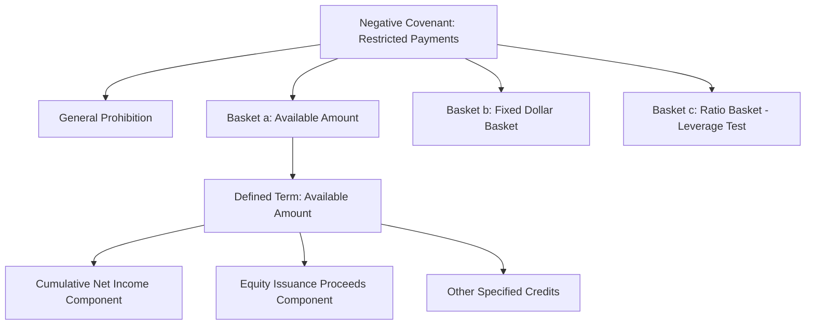

## Reading and Interpreting a Credit Agreement

### Purpose and Structural Orientation

A syndicated credit agreement is a long, cross-referential document, typically 150-300+ pages for a leveraged transaction, organized so that most of its economic substance sits in a small number of heavily negotiated definitions rather than in the operative sections themselves. Effective reading requires understanding this architecture before attempting to parse any single clause in isolation.

**Key Points**

- The operative provisions (Article/Section headings such as "The Commitments," "Repayment," "Conditions") are often short and formulaic; the actual risk allocation lives in the **Definitions** article, particularly in defined terms like "EBITDA," "Permitted Indebtedness," and "Change of Control"
- Reading a credit agreement effectively means reading it non-linearly: starting from an operative covenant, then tracing every capitalized defined term it references back to its definition, and often tracing baskets and carve-outs within those definitions to still further defined terms
- [Inference] Experienced credit analysts likely read the definitions section first and build a mental (or written) glossary before reading the covenants themselves, since covenants read in isolation without their definitional context can appear far more or less restrictive than they actually are, though individual reading approaches vary

### Standard Document Architecture

**Typical Article Structure**

| Article | Content |
| --- | --- |
| Article 1 | Definitions and Interpretation |
| Article 2 | The Commitments (facility amounts, borrowing mechanics) |
| Article 3 | Payments of Principal and Interest |
| Article 4 | Taxes, Increased Costs, Illegality |
| Article 5 | Conditions Precedent |
| Article 6 | Representations and Warranties |
| Article 7 | Affirmative Covenants |
| Article 8 | Negative Covenants |
| Article 9 | Financial Covenants (if applicable) |
| Article 10 | Events of Default |
| Article 11 | Administrative Agent Provisions |
| Article 12 | Miscellaneous (assignments, amendments, governing law) |

**Key Points**

- The order above is a common convention (particularly in LSTA-influenced U.S. documents) but is not universal; some documents integrate financial covenants into the negative covenants article rather than isolating them, and LMA-based documents follow a related but distinct sectional convention
- The **Schedules** and **Exhibits** at the end of the document often contain critical operative content, not just administrative boilerplate: the Schedule of Existing Indebtedness, the form of Compliance Certificate, and the Agreed Security Principles are all frequently found here rather than in the main body

### Reading the Definitions Article

**The Centrality of the EBITDA Definition**

The definition of "Consolidated EBITDA" (or equivalent) is typically the single most heavily negotiated definition in the document, since it serves as the denominator or reference point for nearly every financial threshold in the agreement: leverage-based baskets, the leverage-based excess cash flow sweep percentage, incremental facility capacity, and (if present) financial maintenance covenants.

**Illustrative EBITDA Definition Structure**

$$\text{Consolidated EBITDA} = \text{Net Income} + \text{Interest Expense} + \text{Taxes} + \text{D\&A} + \sum \text{Addbacks}$$

Typical addback categories to trace within the "Addbacks" component include:

- Non-recurring, extraordinary, or unusual items
- Restructuring and integration costs
- Pro forma cost savings and synergies from acquisitions or restructuring initiatives, often subject to a **cap** (e.g., a stated percentage of EBITDA per year) and a **sunset period** (e.g., realizable within 18-24 months)
- Non-cash items (stock-based compensation, non-cash losses)
- Sponsor management fees

**Key Points**

- The specific cap and sunset terms on synergy/cost-saving addbacks are a primary point of negotiation between sponsors (seeking maximum addback flexibility to increase covenant headroom) and lenders (seeking to limit "adjusted EBITDA inflation" that does not reflect sustainable cash-generating capacity)
- A reader assessing actual credit risk should typically calculate a "clean" or unadjusted EBITDA figure alongside the covenant-defined EBITDA, since the gap between the two — sometimes called the "EBITDA bridge" — is itself a useful diagnostic of aggressive addback usage

**Tracing Basket Capacity Through Definitions**

Negative covenant baskets frequently combine a **fixed dollar amount** with a **percentage-of-EBITDA "grower" component**, taking the greater or lesser of the two depending on the basket's purpose:

$$\text{Available Basket} = \max(\text{Fixed Amount}, \; X\% \times \text{Consolidated EBITDA})$$

A "grower" basket (using $\max$) expands automatically as the company grows, providing the sponsor increasing flexibility over time without requiring an amendment; a capped basket (using $\min$, or simply a fixed dollar figure with no grower alternative) is more restrictive by design.

### Reading Negative Covenants: The Basket-and-Carve-Out Method

**Standard Negative Covenant Structure**

Each negative covenant (e.g., "Limitation on Indebtedness," "Limitation on Restricted Payments," "Limitation on Liens") follows a consistent drafting pattern:

1. A **general prohibition** stated broadly (e.g., "The Borrower shall not, and shall not permit any Restricted Subsidiary to, incur any Indebtedness")
2. A list of **permitted baskets and carve-outs**, introduced by "except" or "other than," enumerating specific categories of permitted activity (e.g., "(a) Indebtedness under the Loan Documents; (b) Indebtedness existing on the Closing Date and set forth on Schedule X; (c) Permitted Refinancing Indebtedness...")
3. Cross-references within individual baskets to other defined terms (e.g., a Restricted Payments basket permitting distributions "not to exceed the Available Amount," which is itself a separately defined, cumulatively built-up term)

**Key Points**

- The practical effect of a negative covenant is determined almost entirely by the breadth of its carve-outs, not by the general prohibition; a covenant with a short general prohibition but twenty-five lettered exceptions can be far more permissive than its headline title suggests
- The **"Available Amount"** or equivalent builder basket (sometimes called the "cumulative credit" or "CNI basket") is one of the most consequential defined terms in a covenant-lite structure, since it typically accumulates over the life of the facility based on retained net income, equity issuance proceeds, and other credits, providing growing capacity for restricted payments (dividends, investments) without requiring a separate amendment

### Reading Events of Default and Cure Mechanics

**Standard Events of Default Categories**

| Category | Illustrative Trigger |
| --- | --- |
| Payment Default | Failure to pay principal when due (no grace period); failure to pay interest (typically 5-business-day grace period) |
| Covenant Default | Breach of a negative covenant or (if applicable) financial covenant, subject to notice and cure period for certain covenants |
| Cross-Default / Cross-Acceleration | Default under other material indebtedness above a specified threshold amount |
| Representation Breach | A representation proves materially incorrect when made |
| Insolvency/Bankruptcy | Voluntary or involuntary bankruptcy filing, subject to a grace period for involuntary filings to be dismissed |
| Change of Control | Defined ownership threshold breach by the sponsor or a specified group |
| Judgment Default | Unsatisfied final judgment above a specified dollar threshold |

**Key Points**

- Distinguishing **cross-default** (any default under other debt triggers a default here) from **cross-acceleration** (only an actual acceleration of other debt triggers a default here) is important, since cross-acceleration is meaningfully more borrower-friendly, giving other creditors' forbearance the practical effect of preserving this facility's status even if a technical default exists elsewhere
- The **financial covenant cure right** (an "equity cure"), where present, permits the sponsor to inject equity that is deemed to increase EBITDA (not reduce debt) for covenant testing purposes, subject to limits on frequency (e.g., no more than twice in any four-quarter period) and aggregate usage over the facility's life

### Reading Conditions Precedent and Representations

**Conditions Precedent to Initial Borrowing**

Distinguish between conditions precedent to the **initial** borrowing (closing conditions, often extensive) and conditions precedent to **each subsequent** borrowing (typically limited to bring-down of representations and no continuing default, especially under "certain funds" or limited conditionality provisions common in acquisition financings).

**Representations and Warranties: "Deemed Repeated" Mechanics**

Most representations are deemed repeated (or "bring-down") on each borrowing date and sometimes on each interest payment date. A reader should identify which representations are subject to a **materiality qualifier** ("no Material Adverse Effect has occurred") versus stated as absolute facts, since this affects how easily a breach could be asserted by lenders seeking to avoid a further funding obligation.

### Practical Reading Workflow

**Recommended Sequential Approach**

1. **Read the definitions of EBITDA, Indebtedness, and any leverage or coverage ratio first**, since nearly everything else depends on these
2. **Read the negative covenants**, focusing on the breadth of baskets rather than the general prohibition language
3. **Read Events of Default**, focusing on cross-default thresholds, cure rights, and grace periods
4. **Read the amendment provisions** (Section on "Amendments and Waivers") to identify which changes require unanimous, affected-lender, or simple majority ("Required Lenders") consent — this determines what protections are truly binding versus subject to majority override
5. **Cross-check the Schedules** for existing debt, existing liens, and agreed security principles, since these often modify or limit what the main body suggests

**Key Points**

- The amendment provisions section (often called "sacred rights") is disproportionately important relative to its typical brevity, since it determines whether a lender's other negotiated protections can be altered without that lender's individual consent — a lesson directly relevant to understanding liability management transactions such as uptier exchanges
- [Inference] A reader focused solely on pricing and headline leverage without tracing the EBITDA definition's addback provisions and the negative covenants' basket capacity is likely to materially misjudge the credit's actual risk profile, since two facilities with identical headline leverage and pricing can have very different practical flexibility embedded in their definitions

### Common Interpretive Pitfalls

**Key Points**

- **Defined term capitalization**: in credit agreement drafting convention, a capitalized term (e.g., "Indebtedness") refers to the specific defined meaning in Article 1, which may differ substantially from the term's ordinary-language meaning (e.g., typically excluding trade payables or operating leases depending on the specific definition's carve-outs)
- **"Including" is typically non-exclusive**: most credit agreements include an interpretive provision stating that "including" means "including without limitation," so an illustrative list does not restrict the general category to only the listed items — a rule that fundamentally changes how enumerated examples within a definition should be read
- **Baskets often layer and stack**: a transaction may be permitted to use capacity from multiple baskets simultaneously (e.g., a portion of a dividend from a fixed-dollar basket and a portion from the Available Amount), so basket capacity should not be assessed on a single-basket basis when evaluating maximum permitted flexibility, unless the specific covenant expressly restricts stacking

### Discussion Questions for Practice

1. Select a negative covenant baskets section and identify at least three distinct defined terms it cross-references. Trace each to its definition and assess how the combination affects the covenant's practical restrictiveness.
2. Compare a covenant-lite credit agreement's Restricted Payments covenant to one containing a maintenance financial covenant. How does the absence of an ongoing leverage test change the analytical weight placed on incurrence-based baskets?
3. Identify the equity cure provision in a sample credit agreement (or this case's illustrative structure) and assess its limitations (frequency cap, aggregate cap, look-back mechanics). How much genuine covenant relief does it provide in a sustained downturn versus a single bad quarter?
4. Locate the amendment/sacred rights section and classify at least five categories of amendment by required consent threshold (unanimous, affected lender, Required Lenders). What does this classification reveal about which lender protections are most durable?

**Next Steps**

- EBITDA Addback Analysis and Adjusted Earnings Quality Assessment
- Negative Covenant Basket Design: Sponsor vs. Lender Negotiating Priorities
- Amendment and Waiver Mechanics: Sacred Rights in Practice
- Comparing LMA and LSTA Credit Agreement Drafting Conventions
- Equity Cure Rights and Financial Covenant Testing Mechanics