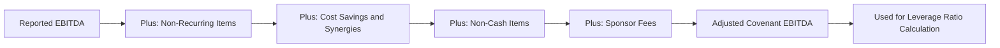

## Building an Investor Presentation for a Syndication Roadshow

### Purpose and Audience Calibration

An investor presentation (often called a lender presentation, bank book, or roadshow deck) is the primary marketing document used to convert an arranger's underwriting commitment into distributed syndicate participation. Unlike an equity roadshow deck, this presentation must simultaneously serve a credit-analysis audience (assessing downside protection and repayment capacity) rather than a growth-and-multiple-expansion audience, which shapes every structural and tonal decision in its construction.

**Key Points**

- The presentation's core objective is to give a prospective lender enough information to complete internal credit approval within the syndication timeline, typically 1-3 weeks, without requiring extensive follow-up diligence for a "flex-to-market" institutional term loan investor
- The audience is heterogeneous: CLO managers focused on structural protections and EBITDA quality, high-yield accounts focused on the equity cushion and covenant flexibility, and relationship banks focused on ancillary business and sponsor relationship value — the deck must address all three without appearing to favor one
- Public-side versus private-side (restricted) versions are typically prepared in parallel: the public-side deck omits material non-public information (detailed projections, specific synergy assumptions) so that investors who wish to remain unrestricted for trading purposes can still participate

### Standard Deck Architecture

**Typical Section Sequence**

| Section | Purpose |
| --- | --- |
| Executive Summary / Transaction Overview | Facility size, use of proceeds, key terms, sponsor identity |
| Investment Highlights | 4-6 thesis points on why the credit is attractive |
| Business Overview | Products, end markets, competitive positioning |
| Industry Overview | Market size, growth drivers, competitive landscape |
| Financial Overview | Historical performance, EBITDA bridge, projections |
| Sources & Uses / Pro Forma Capitalization | Transaction funding and resulting leverage |
| Credit Highlights / Structural Protections | Collateral package, covenant summary, security |
| Management Team | Bios and relevant experience |
| Appendix | Detailed financial schedules, addback detail, glossary |

**Key Points**

- The **Investment Highlights** section functions as the thesis outline for the entire deck; every subsequent section should substantiate one or more of these points rather than introducing new, unrelated themes
- [Inference] Decks that front-load structural protections and covenant summary ahead of the growth narrative are more common in credits with elevated leverage or cyclicality concerns, since the ordering signals to sophisticated investors what the arranger anticipates will be scrutinized first, though ordering conventions vary by arranger and are not governed by a fixed rule

### Executive Summary and Transaction Overview

**Core Content Requirements**

The opening summary should allow an investor to assess basic fit against their mandate within 60 seconds, typically including:

- Borrower name, sponsor, transaction type (LBO, refinancing, dividend recapitalization, acquisition financing)
- Facility size and tranche structure
- Use of proceeds
- Pricing (spread, floor, OID)
- Tenor, amortization, call protection
- Target close date and key syndication dates (launch, commitment deadline)

**Illustrative Transaction Overview Table**

| Item | Detail |
| --- | --- |
| Borrower | TargetCo Industries, LLC |
| Sponsor | [Financial Sponsor Name] |
| Transaction Type | Leveraged Buyout |
| Facility | $500mm Term Loan B, 7-year tenor |
| Use of Proceeds | Fund acquisition, refinance existing debt, pay fees |
| Pricing | SOFR + 375, 0.50% floor, 99.00-99.50 OID |
| Leverage | 5.5x Total Net Leverage |
| Lead Arranger | [Bank Name] |
| Commitment Deadline | [Date] |

### Investment Highlights Construction

**Thesis Point Development**

Each investment highlight should be a single, defensible assertion supported by data presented elsewhere in the deck, not a vague qualitative claim. Common categories include:

- **Market leadership**: defensible position measured by market share, scale advantages, or barriers to entry
- **Diversification**: customer, geographic, or end-market diversification reducing single-point-of-failure risk
- **Recurring or contracted revenue**: visibility into future cash flows via long-term contracts, subscription models, or high customer retention rates
- **Margin resilience**: historical evidence of margin stability or expansion through prior economic cycles
- **Deleveraging trajectory**: a credible, quantified path from closing leverage to a lower leverage level over a defined period, typically driven by EBITDA growth and mandatory amortization/cash sweep
- **Sponsor track record**: the sponsor's history of value creation and, where relevant, prior successful exits or refinancings in the same sector

**Key Points**

- Highlights should be prioritized in the order most likely to address the specific concerns of the target investor base identified during pre-marketing sounding, rather than a generic "greatest hits" ordering
- Overstating a highlight that is later contradicted by data in the appendix undermines credibility across the entire deck; investors specifically cross-reference the highlights section against the detailed financial appendix as a due diligence step

### Financial Overview and EBITDA Bridge Presentation

**Historical and Projected Financial Presentation**

The financial section typically presents 3 years of historical financials alongside a 3-5 year projection period, with particular emphasis on the **adjusted EBITDA bridge** reconciling reported/GAAP figures to the covenant-defined EBITDA used for leverage calculations.

**Illustrative EBITDA Bridge**

| Component | $mm |
| --- | --- |
| Reported EBITDA | 68.0 |
| Non-Recurring Items | 3.5 |
| Cost Savings / Synergies (capped) | 5.0 |
| Stock-Based Compensation | 2.0 |
| Sponsor Management Fee Addback | 1.5 |
| **Adjusted (Covenant) EBITDA** | **80.0** |

$$\text{Total Net Leverage} = \frac{\text{Total Debt} - \text{Cash}}{\text{Adjusted EBITDA}} = \frac{500 - 10}{80} = 6.1x$$

**Key Points**

- Transparency in the EBITDA bridge is a credibility signal; a deck that discloses each addback category explicitly (rather than presenting only the final adjusted figure) is generally viewed more favorably by sophisticated institutional investors who will reconstruct this bridge independently regardless of how it is presented
- Projections should be presented with clearly stated key assumptions (revenue growth drivers, margin assumptions, capex requirements) rather than as unsupported output figures, since investors will stress-test the projections against the stated assumptions during their credit approval process

### Credit Highlights and Structural Protections Section

**Content Requirements**

This section directly addresses the lender's downside-protection analysis and typically includes:

- Collateral package summary (asset types securing the facility, guarantor scope)
- Leverage through each tranche (first-lien leverage, total leverage) presented against relevant enterprise value or asset coverage benchmarks
- Covenant summary (maintenance vs. incurrence, key basket sizes, MFN sunset)
- Call protection and prepayment terms
- Comparison of the credit's leverage and structure against relevant recent precedent transactions in the same sector or rating category

**Illustrative Structural Summary**

| Protection | Detail |
| --- | --- |
| Security | First-priority lien on substantially all assets |
| Guarantors | All material domestic subsidiaries |
| First-Lien Leverage | 5.5x |
| Financial Covenant | Springing net leverage covenant (revolver only), tested at >35% utilization |
| Call Protection | 101 soft call, 6 months |
| MFN Sunset | 12 months |

**Key Points**

- Presenting leverage "through" each tranche (e.g., "4.2x through the first lien, 6.1x through the notes") helps investors quickly locate where their specific tranche sits in the capital structure's loss-absorption sequence
- Precedent transaction comparisons should use genuinely comparable credits (similar sector, similar leverage profile, similar vintage) rather than aspirational comparisons to higher-rated or lower-leverage peers, since experienced investors will independently identify and discount an unconvincing comparison set

### Management Presentation and Q&A Preparation

**Live Roadshow Session Structure**

Beyond the written deck, the roadshow typically includes a live (or recorded) management presentation and Q&A session, structured as:

1. Sponsor/arranger introduction and transaction overview (5-10 minutes)
2. Management presentation on business strategy and financial performance (20-30 minutes)
3. Live Q&A session addressing investor questions submitted in advance or raised live

**Key Points**

- Anticipated questions should be prepared in advance based on issues identified during pre-marketing wall-crossed investor sounding, particularly around any EBITDA addback that received pushback, competitive threats, or customer concentration
- [Inference] Management credibility during the live Q&A session likely carries meaningful weight in final allocation decisions for larger or more discretionary orders, since it is one of the few elements of the syndication process that cannot be fully assessed from the written materials alone, though this influence is difficult to isolate from the underlying credit fundamentals in practice

### Public-Side vs. Private-Side Version Control

**Information Barrier Considerations**

Because material non-public information (MNPI) in the private-side deck can restrict a recipient's ability to trade the sponsor's or borrower's public securities, arrangers typically prepare two parallel versions:

| Element | Public-Side Version | Private-Side Version |
| --- | --- | --- |
| Detailed Projections | Excluded or high-level only | Full 5-year model included |
| Specific Synergy Assumptions | Excluded | Detailed by category |
| Customer Names | Anonymized or excluded if sensitive | May be included where relevant to credit assessment |
| Management Guidance Commentary | Excluded | Included |

**Key Points**

- Investors electing to remain public-side (unrestricted) forgo access to the full projection detail and must rely on the public-side deck plus their own independent analysis to reach a credit decision, which is a deliberate trade-off some investors accept to preserve trading flexibility
- The arranger's legal and compliance teams typically review both versions before distribution to confirm the public-side version does not inadvertently disclose MNPI through indirect means (e.g., back-calculating projections from disclosed ratio covenants)

### Design and Formatting Conventions

**Key Points**

- Charts and tables generally take precedence over narrative prose in credit-focused decks, since institutional lender audiences typically scan for specific data points (leverage, coverage ratios, maturity schedule) rather than reading a narrative in full
- A maturity schedule chart (showing the pro forma debt maturity profile after the transaction) is a standard visual element demonstrating that the transaction does not create a concentrated near-term refinancing risk elsewhere in the capital structure
- Consistency in defined terms and figures between the investor presentation and the credit agreement/CIM is essential; discrepancies discovered by investors during diligence (e.g., a leverage figure that doesn't tie to the credit agreement's EBITDA definition) can materially damage the arranger's credibility mid-syndication

### Discussion Questions for Practice

1. Draft three investment highlights for a hypothetical credit with high customer concentration (top customer = 30% of revenue) but strong long-term contracts. How would you frame the concentration risk honestly while still supporting a positive thesis?
2. Evaluate the trade-off an institutional investor faces in choosing to remain public-side versus going private-side (restricted) for a given syndication. Under what circumstances would each choice be more rational?
3. Given a scenario where pre-marketing sounding revealed investor skepticism about a specific EBITDA addback category, how should the deck's EBITDA bridge section and anticipated Q&A preparation be adjusted in response?
4. Compare the structural protections section's role in an institutional TLB deck versus a high-yield bond offering memorandum. What content might a bond-focused OM prioritize differently given the different covenant package and lack of maintenance covenant?

**Related Topics**

- Confidential Information Memorandum (CIM) Drafting Standards
- Pre-Marketing and Wall-Crossing Procedures
- MNPI and Information Barrier Management in Syndication
- Precedent Transaction Analysis for Credit Comparables
- Lender Q&A Management and Objection Handling in Live Roadshows