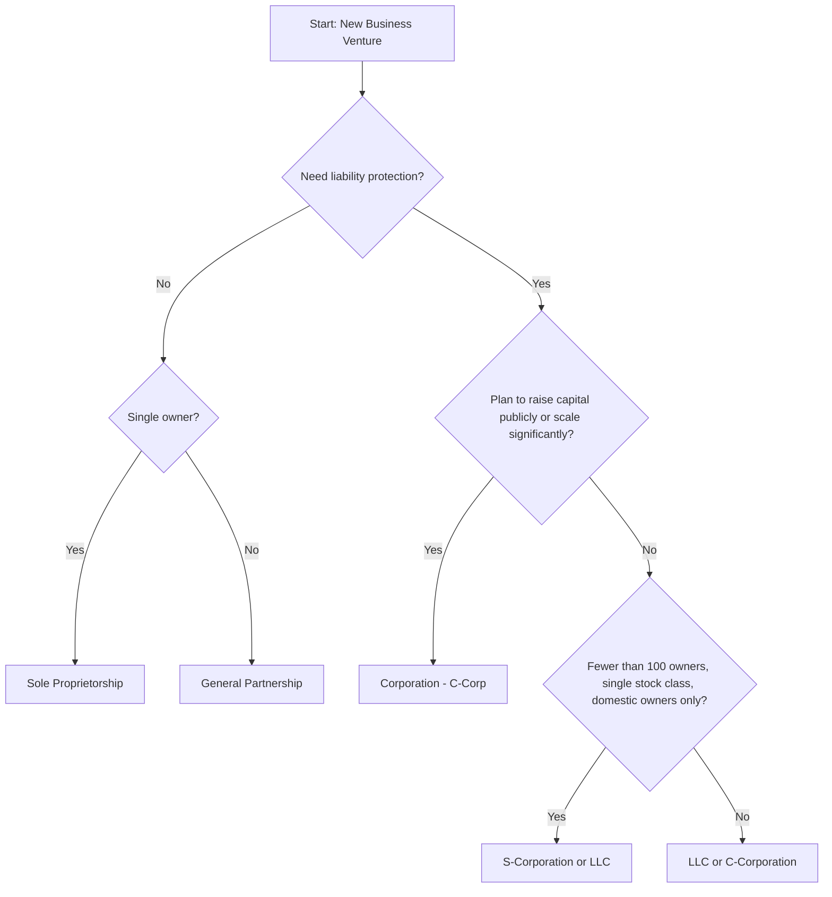

## The Corporation and Other Forms of Business Organization

### Overview

Business organization refers to the legal structure a firm adopts to conduct operations, own assets, incur liabilities, raise capital, and allocate profits and losses among its owners. The choice of organizational form affects taxation, owner liability, access to capital markets, decision-making control, and the ease of transferring ownership. In corporate finance, this choice is foundational because it determines the constraints and opportunities the firm faces when making investment, financing, and payout decisions.

The primary forms covered are: sole proprietorships, partnerships (general and limited), limited liability companies (LLCs), and corporations (C-corporations and S-corporations).

---

### Sole Proprietorship

**Definition**: A business owned and operated by a single individual, with no legal distinction between the owner and the business.

**Key Points**

- Easiest and least costly form to establish; often requires no formal registration beyond local licensing.
- The owner has **unlimited personal liability** for all business debts and obligations.
- Business income is taxed once, as personal income to the owner (pass-through taxation).
- The business has **no perpetual existence** — it terminates upon the owner's death or decision to cease operations.
- Ownership transfer is difficult since the business and owner are legally inseparable.
- Capital raising is limited to the owner's personal wealth, personal borrowing capacity, and retained earnings.

**Example**

A freelance consultant operating under their own name, using personal savings and a personal bank loan to fund equipment purchases, is a sole proprietorship. If a client sues the business, the consultant's personal assets (home, personal savings) are exposed to claims.

---

### Partnership

**Definition**: A business owned by two or more individuals who share profits, losses, and management responsibilities according to a partnership agreement.

#### General Partnership

**Key Points**

- All partners share **unlimited liability**, and each partner can be held liable for the actions and debts of the other partners (joint and several liability in most jurisdictions).
- Pass-through taxation: profits/losses flow to partners' personal tax returns; the partnership itself does not pay entity-level income tax.
- Dissolves upon the death, withdrawal, or bankruptcy of any partner, unless the partnership agreement specifies continuation terms.
- Capital-raising capacity exceeds a sole proprietorship because multiple partners can contribute capital and borrowing capacity.

#### Limited Partnership (LP)

**Key Points**

- Composed of at least one **general partner** (unlimited liability, manages the business) and one or more **limited partners** (liability capped at their capital contribution, no management role).
- Common structure in private equity, venture capital, and real estate investment vehicles, where the general partner (GP) manages the fund and limited partners (LPs) are passive investors.
- If a limited partner takes an active management role, they risk losing their limited-liability protection [Inference: exact rules depend on jurisdiction-specific statutes, such as the Revised Uniform Limited Partnership Act in the U.S.].

---

### Limited Liability Company (LLC)

**Definition**: A hybrid business structure combining the liability protection of a corporation with the pass-through taxation of a partnership.

**Key Points**

- Owners (called "members") have liability limited to their investment in the company.
- Can elect to be taxed as a sole proprietorship, partnership, or corporation, offering significant flexibility.
- Fewer formal governance requirements than a corporation (no mandatory board of directors or annual shareholder meetings in most jurisdictions).
- Ownership transfer can be more restrictive than corporate stock, often requiring consent of other members per the operating agreement.
- Increasingly used for closely held businesses, joint ventures, and special-purpose vehicles (SPVs) in project finance.

---

### The Corporation

**Definition**: A legal entity distinct and separate from its owners (shareholders), created under state or national law, capable of owning assets, entering contracts, suing and being sued, and existing independently of any single owner.

#### Defining Characteristics

**Key Points**

- **Separate legal entity**: The corporation itself, not its shareholders, is liable for its debts and obligations.
- **Limited liability**: Shareholders' losses are capped at the amount they invested in the firm's shares; personal assets are shielded from corporate creditors.
- **Perpetual existence**: The corporation continues to exist independent of changes in ownership (death of a shareholder, sale of shares).
- **Separation of ownership and control**: Shareholders (owners) elect a board of directors, who in turn appoint officers (management) to run daily operations. This separation is central to the study of agency theory.
- **Ease of ownership transfer**: Shares of stock can typically be bought and sold without disrupting business operations, particularly for publicly traded firms.
- **Double taxation** (for C-corporations): Corporate profits are taxed at the entity level, and dividends distributed to shareholders are taxed again at the individual level.

#### Formation

Corporations are formed by filing **articles of incorporation** (or a corporate charter) with the relevant government authority, which typically specify:

- The corporation's name and purpose
- Authorized number of shares
- Registered agent and office
- Initial board of directors

Governance is further defined by **bylaws**, which establish internal rules for shareholder meetings, director elections, and officer duties.

#### C-Corporation vs. S-Corporation (U.S. Context)

| Feature | C-Corporation | S-Corporation |
| --- | --- | --- |
| Taxation | Double taxation (entity + shareholder) | Pass-through (shareholder level only) |
| Ownership limits | Unlimited shareholders | Limited to 100 shareholders (U.S. rule) |
| Shareholder eligibility | Any individual or entity | U.S. citizens/residents only, individuals (generally) |
| Stock classes | Multiple classes permitted | Single class of stock only |
| Suitability | Large, publicly traded firms | Small, closely held firms |

[Unverified: specific numeric thresholds and eligibility rules are subject to periodic legislative change and vary by jurisdiction; figures reflect commonly cited U.S. tax code provisions as of general knowledge.]

#### Agency Relationships in the Corporate Form

The separation of ownership and control in corporations gives rise to the **principal-agent problem**: shareholders (principals) delegate decision-making authority to managers (agents), whose interests may diverge from shareholders' wealth-maximization goal.

**Key Points**

- **Agency costs** include monitoring costs (audits, board oversight), bonding costs (contracts aligning manager incentives), and residual loss (value lost despite monitoring and bonding).
- Common mitigation mechanisms: performance-based compensation (stock options, bonuses tied to firm value), an independent board of directors, market discipline (threat of takeover), and debt covenants that constrain managerial discretion.
- A parallel agency conflict exists between shareholders and bondholders, since shareholders may favor riskier projects that transfer wealth from creditors (asset substitution problem).

---

### Comparative Summary

| Attribute | Sole Proprietorship | General Partnership | LLC | Corporation |
| --- | --- | --- | --- | --- |
| Liability | Unlimited | Unlimited (joint & several) | Limited | Limited |
| Taxation | Pass-through | Pass-through | Flexible (elective) | Double (C-corp) or pass-through (S-corp) |
| Life span | Tied to owner | Tied to partners | Perpetual (jurisdiction-dependent) | Perpetual |
| Ease of ownership transfer | Difficult | Difficult | Moderate | Easy (public); moderate (private) |
| Access to capital | Limited | Moderate | Moderate | High (especially if public) |
| Formation cost/complexity | Low | Low–Moderate | Moderate | High |

---

### Organizational Structure Diagram (svg_diagram)

<svg xmlns="http://www.w3.org/2000/svg" viewBox="0 0 800 420">
<rect x="0" y="0" width="800" height="420" fill="#ffffff" />
<text x="400" y="30" font-family="Arial, sans-serif" font-size="18" font-weight="bold" text-anchor="middle" fill="#1a1a1a">Corporate Governance Structure (svg_diagram)</text>
<rect x="300" y="60" width="200" height="55" rx="6" fill="#dbeafe" stroke="#1e40af" stroke-width="2" />
<text x="400" y="93" font-family="Arial, sans-serif" font-size="15" text-anchor="middle" fill="#1e3a8a">Shareholders</text>
<line x1="400" y1="115" x2="400" y2="150" stroke="#333333" stroke-width="2" />
<text x="415" y="138" font-family="Arial, sans-serif" font-size="11" fill="#555555">elect</text>
<rect x="300" y="150" width="200" height="55" rx="6" fill="#dcfce7" stroke="#166534" stroke-width="2" />
<text x="400" y="183" font-family="Arial, sans-serif" font-size="15" text-anchor="middle" fill="#14532d">Board of Directors</text>
<line x1="400" y1="205" x2="400" y2="240" stroke="#333333" stroke-width="2" />
<text x="425" y="228" font-family="Arial, sans-serif" font-size="11" fill="#555555">appoints</text>
<rect x="300" y="240" width="200" height="55" rx="6" fill="#fef3c7" stroke="#92400e" stroke-width="2" />
<text x="400" y="273" font-family="Arial, sans-serif" font-size="15" text-anchor="middle" fill="#78350f">Officers / Management</text>
<line x1="400" y1="295" x2="400" y2="330" stroke="#333333" stroke-width="2" />
<text x="420" y="318" font-family="Arial, sans-serif" font-size="11" fill="#555555">directs</text>
<rect x="300" y="330" width="200" height="55" rx="6" fill="#fce7f3" stroke="#9d174d" stroke-width="2" />
<text x="400" y="363" font-family="Arial, sans-serif" font-size="15" text-anchor="middle" fill="#831843">Firm Operations</text>
<path d="M 300 87 Q 150 87 150 180 Q 150 260 295 262" fill="none" stroke="#999999" stroke-width="1.5" stroke-dasharray="4,3" />
<text x="60" y="180" font-family="Arial, sans-serif" font-size="11" fill="#777777">Agency</text>
<text x="60" y="195" font-family="Arial, sans-serif" font-size="11" fill="#777777">relationship</text>
<rect x="580" y="150" width="180" height="90" rx="6" fill="#f3f4f6" stroke="#4b5563" stroke-width="1.5" />
<text x="670" y="172" font-family="Arial, sans-serif" font-size="12" font-weight="bold" text-anchor="middle" fill="#1f2937">Limited Liability</text>
<text x="670" y="192" font-family="Arial, sans-serif" font-size="11" text-anchor="middle" fill="#374151">Shareholder loss capped</text>
<text x="670" y="208" font-family="Arial, sans-serif" font-size="11" text-anchor="middle" fill="#374151">at capital invested;</text>
<text x="670" y="224" font-family="Arial, sans-serif" font-size="11" text-anchor="middle" fill="#374151">personal assets shielded</text>
</svg>

---

### Decision Flow: Choosing an Organizational Form

---

### Practical Application: Valuation and Financing Implications

**Example**

A founder starting a technology venture expecting rapid growth and eventual venture capital investment will typically incorporate as a C-corporation, since:

1. VC funds (structured as limited partnerships) generally require investees to issue **preferred stock**, a security class unavailable to sole proprietorships, partnerships, or S-corporations.
2. Perpetual existence and free transferability of shares facilitate multiple financing rounds and eventual exit via IPO or acquisition.
3. Limited liability protects both founders and outside investors from claims exceeding their invested capital.

By contrast, a local retail business with modest capital needs and no plan to raise outside equity may reasonably operate as an LLC or sole proprietorship, minimizing formation and compliance costs while retaining some liability protection (LLC) or accepting full personal exposure (sole proprietorship) in exchange for administrative simplicity.

---

### Conclusion

The choice of business organization form is a foundational corporate finance decision that shapes a firm's tax burden, risk exposure for owners, capacity to raise capital, and governance structure. The corporate form — particularly the C-corporation — dominates among large, capital-intensive firms because it uniquely combines limited liability, perpetual life, and efficient capital-raising mechanisms (public equity and debt markets), at the cost of double taxation and agency costs arising from the separation of ownership and control. Smaller and closely held businesses often favor pass-through entities (sole proprietorships, partnerships, LLCs, S-corporations) to avoid double taxation when the benefits of public capital markets are not required.

**Related Topics**

- Agency theory and the principal-agent problem
- Goals of the corporation and shareholder wealth maximization
- Corporate governance mechanisms and board structure
- Capital structure decisions (debt vs. equity financing)
- Initial public offerings (IPOs) and the transition to public ownership
- Taxation of business entities (corporate tax, pass-through taxation)
- Limited partnerships in private equity and venture capital fund structures
- Stakeholder theory vs. shareholder primacy