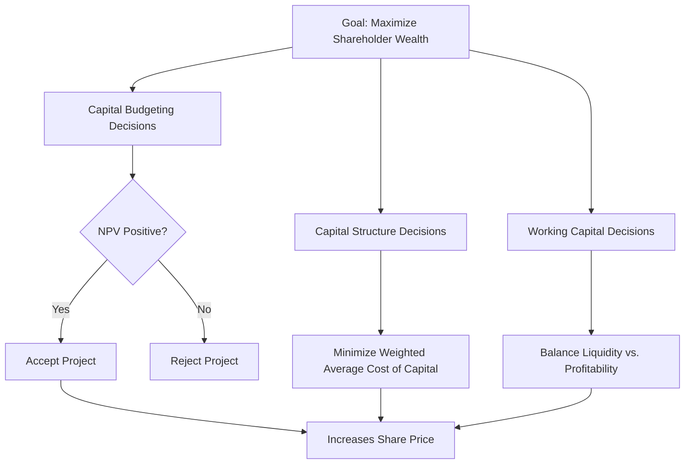

## Goals of the Firm and Shareholder Value Maximization

### Overview

The normative objective assumed throughout most of corporate finance theory is that managers should make decisions to **maximize shareholder wealth**, typically operationalized as maximizing the market value of the firm's common stock (or, for private firms, the intrinsic value of equity). This objective provides a single, quantifiable, and theoretically defensible criterion for evaluating investment, financing, and operating decisions, distinguishing it from alternative and competing goals such as profit maximization, market share maximization, or stakeholder welfare maximization.

---

### Why Shareholder Wealth Maximization Is the Standard Objective

**Key Points**

- **Residual claimant status**: Shareholders are the residual claimants on the firm's cash flows — they are paid only after all other stakeholders (employees, suppliers, debt holders, tax authorities) have been satisfied. Because their claim is variable and paid last, shareholders bear the firm's marginal risk, giving them the strongest incentive to ensure resources are used efficiently.
- **Accounts for risk and timing**: Unlike profit maximization, shareholder value maximization explicitly incorporates the **time value of money** and the **risk** of future cash flows, since market value is determined by discounting expected future cash flows at a rate reflecting their risk.
- **Long-term horizon**: Share price reflects the present value of all expected future cash flows, not just current-period earnings, discouraging managers from sacrificing long-term value for short-term accounting profit.
- **Market discipline**: Publicly traded share prices provide continuous, objective, third-party feedback on the quality of managerial decisions, which is unavailable under vaguer goals like "maximizing firm growth" or "market share."

---

### Alternative (Flawed) Objectives

#### Profit Maximization

**Key Points**

- Ambiguous: does not specify *which* profit — this year's, five-year average, accounting profit, or economic profit?
- Ignores the **timing** of cash flows: $1 million earned this year is not equivalent to $1 million earned in ten years, but profit maximization treats them as comparable if cumulative totals are equal.
- Ignores **risk**: two projects with identical expected profit but different risk profiles are treated as equally desirable, which contradicts the risk-averse preferences of most investors.
- Ignores the difference between accounting profit and cash flow (e.g., non-cash items like depreciation, or the exclusion of the cost of equity capital from accounting profit).

#### Market Share or Sales Maximization

**Key Points**

- Can be pursued through value-destroying means, such as underpricing products below sustainable margins or over-investing in growth financed by excessive debt.
- Does not account for the cost of capital required to generate that growth.

#### Firm Size / Empire Building

**Key Points**

- Reflects manager self-interest (larger firms often correlate with higher managerial compensation and prestige) rather than owner interest — a direct manifestation of the **agency problem**.
- Frequently associated with value-destroying mergers and acquisitions pursued for growth rather than synergy.

---

### Shareholder Value Maximization vs. Stakeholder Theory

**Key Points**

- **Shareholder primacy view**: The firm's objective is to maximize equity value; other stakeholders (employees, customers, suppliers, communities) are protected via contracts, regulation, and market mechanisms (e.g., reputational capital, labor markets), not via managerial discretion over firm objectives.
- **Stakeholder theory**: Argues managers should explicitly balance the interests of all stakeholders, not just shareholders, when making decisions.
- **Reconciliation in practice**: Most corporate finance theory holds that **long-run** shareholder value maximization is generally consistent with fair treatment of other stakeholders, since a firm that mistreats employees, customers, or suppliers will typically suffer reputational and operational costs that reduce its long-term cash flows and, therefore, its value. [Inference: This reconciliation is a widely taught theoretical position; the extent to which it holds in specific real-world cases is empirically debated and depends on market completeness, regulatory enforcement, and information asymmetries.]

---

### The Agency Problem and Its Relationship to the Firm's Goal

**Key Points**

- Managers (agents) may not naturally pursue shareholder wealth maximization because their personal incentives (job security, perquisites, empire-building, risk aversion regarding their own employment) can diverge from those of shareholders (principals).
- This divergence generates **agency costs**:
  - **Monitoring costs**: audits, board oversight, financial reporting requirements.
  - **Bonding costs**: costs borne by managers to credibly commit to shareholder-aligned behavior (e.g., accepting compensation contracts tied to stock performance).
  - **Residual loss**: the remaining value loss even after optimal monitoring and bonding.
- **Alignment mechanisms**:
  - Equity-based compensation (stock options, restricted stock units) ties manager wealth to shareholder wealth.
  - Independent boards of directors with fiduciary duties to shareholders.
  - The market for corporate control (threat of hostile takeover disciplines underperforming management).
  - Debt covenants and leverage, which constrain free cash flow available for managerial discretion (per Jensen's free cash flow hypothesis).

---

### Managerial Decision Criterion: Net Present Value

**Key Points**

- The mechanism by which managers translate the abstract goal of "maximize shareholder value" into concrete decisions is the **Net Present Value (NPV) rule**: accept projects with positive NPV, reject those with negative NPV.
- NPV directly measures the increase in shareholder wealth a project is expected to generate, incorporating both the time value of money and risk (via the discount rate).

$$NPV = \sum_{t=0}^{n} \frac{CF_t}{(1+r)^t}$$

Where $CF_t$ is the cash flow in period $t$, $r$ is the risk-adjusted discount rate (cost of capital), and $n$ is the project's life.

**Example**

A firm evaluates a new product line requiring an initial investment of $5 million, expected to generate $1.2 million in after-tax cash flow annually for 6 years. At a cost of capital of 10%:

$$NPV = -5{,}000{,}000 + \sum_{t=1}^{6} \frac{1{,}200{,}000}{(1.10)^t} \approx -5{,}000{,}000 + 5{,}226{,}000 \approx \$226{,}000$$

Since NPV is positive, the project is expected to increase shareholder wealth and should be accepted, consistent with the firm's overarching objective.

---

### Corporate Objective and the Three Core Decisions of Corporate Finance

**Key Points**

Shareholder value maximization is the unifying thread across the three central decision areas of corporate finance:

1. **Capital budgeting (investment decision)**: Which real assets should the firm invest in? Governed by the NPV rule.
2. **Capital structure (financing decision)**: How should the firm finance its investments (debt vs. equity) to minimize the cost of capital and maximize value?
3. **Working capital management**: How should the firm manage short-term assets and liabilities to ensure liquidity while not tying up excess capital unproductively?

Each decision is evaluated against the same criterion: does it increase the market value of shareholders' equity?

---

### Diagram: The Firm's Objective Function

---

### Diagram: Residual Claims and Risk-Bearing Hierarchy (svg_diagram)

<svg xmlns="http://www.w3.org/2000/svg" viewBox="0 0 800 380">
<rect x="0" y="0" width="800" height="380" fill="#ffffff" />
<text x="400" y="28" font-family="Arial, sans-serif" font-size="17" font-weight="bold" text-anchor="middle" fill="#1a1a1a">Priority of Claims on Firm Cash Flows (svg_diagram)</text>
<rect x="250" y="50" width="300" height="45" fill="#e0f2fe" stroke="#0369a1" stroke-width="1.5" />
<text x="400" y="78" font-family="Arial, sans-serif" font-size="13" text-anchor="middle" fill="#075985">1. Employees / Suppliers (Wages, Payables)</text>
<rect x="250" y="100" width="300" height="45" fill="#dbeafe" stroke="#1e40af" stroke-width="1.5" />
<text x="400" y="128" font-family="Arial, sans-serif" font-size="13" text-anchor="middle" fill="#1e3a8a">2. Government (Taxes)</text>
<rect x="250" y="150" width="300" height="45" fill="#ede9fe" stroke="#6d28d9" stroke-width="1.5" />
<text x="400" y="178" font-family="Arial, sans-serif" font-size="13" text-anchor="middle" fill="#5b21b6">3. Debt Holders (Interest, Principal)</text>
<rect x="250" y="200" width="300" height="45" fill="#fce7f3" stroke="#9d174d" stroke-width="1.5" />
<text x="400" y="228" font-family="Arial, sans-serif" font-size="13" text-anchor="middle" fill="#831843">4. Preferred Shareholders (Dividends)</text>
<rect x="250" y="250" width="300" height="50" fill="#fee2e2" stroke="#b91c1c" stroke-width="2" />
<text x="400" y="272" font-family="Arial, sans-serif" font-size="13" font-weight="bold" text-anchor="middle" fill="#7f1d1d">5. Common Shareholders</text>
<text x="400" y="290" font-family="Arial, sans-serif" font-size="11" text-anchor="middle" fill="#7f1d1d">(Residual Claimants)</text>
<path d="M 560 60 L 620 60 L 620 280 L 560 280" fill="none" stroke="#333333" stroke-width="1.5" />
<text x="700" y="90" font-family="Arial, sans-serif" font-size="12" fill="#374151">Increasing</text>
<text x="700" y="106" font-family="Arial, sans-serif" font-size="12" fill="#374151">risk borne</text>
<text x="700" y="240" font-family="Arial, sans-serif" font-size="12" fill="#374151">Increasing</text>
<text x="700" y="256" font-family="Arial, sans-serif" font-size="12" fill="#374151">upside potential</text>
<path d="M 650 70 L 650 270" stroke="#333333" stroke-width="1.5" marker-end="url(#arrowhead)" />
</svg>

---

### Common Misconceptions

**Key Points**

- Shareholder value maximization does **not** mean maximizing short-term stock price through earnings manipulation or underinvestment — efficient markets generally impound the long-term consequences of such actions into price once discovered, eroding the very value the action was meant to create. [Unverified: the speed and completeness with which markets impound such information depends on market efficiency assumptions and available information, which vary across contexts and are subject to ongoing empirical debate.]
- It does **not** imply disregard for ethics, legality, or other stakeholders — value-destroying reputational, legal, and regulatory consequences are real costs the objective already accounts for in a well-functioning market.
- It is **not** equivalent to maximizing accounting earnings per share (EPS), since EPS can be manipulated (e.g., via buybacks financed with debt) without a corresponding genuine increase in intrinsic value.

---

### Conclusion

The maximization of shareholder wealth serves as the central organizing objective in corporate finance because it is the only commonly proposed goal that simultaneously accounts for the magnitude, timing, and risk of the cash flows generated by the firm's decisions. It provides a consistent, market-verifiable benchmark — the NPV rule — for evaluating investment, financing, and operating choices, while the agency problem and its associated costs represent the central practical challenge in ensuring managers actually pursue this objective on behalf of shareholders.

**Related Topics**

- Agency theory and corporate governance mechanisms
- The Net Present Value (NPV) rule and capital budgeting criteria
- Efficient Market Hypothesis and its implications for managerial decision-making
- Executive compensation design and pay-for-performance
- Jensen's free cash flow hypothesis
- Stakeholder theory vs. shareholder primacy debate
- The corporation and separation of ownership and control
- Cost of capital and the Weighted Average Cost of Capital (WACC)