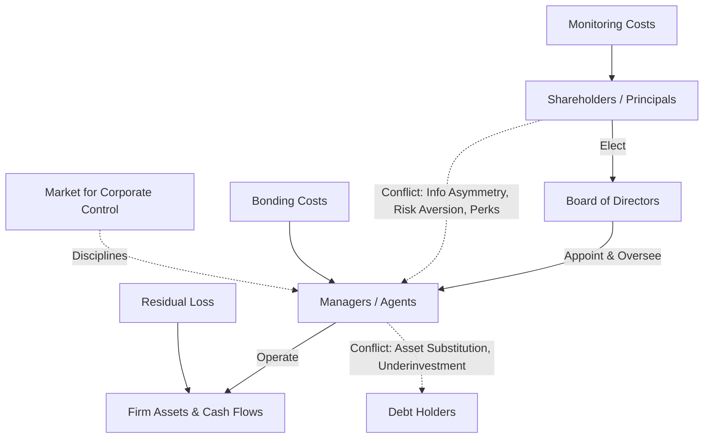

## Agency Theory and the Separation of Ownership and Control

### Overview

Agency theory examines the conflicts of interest that arise when one party (the **principal**) delegates decision-making authority to another party (the **agent**) who is expected to act on the principal's behalf. In the corporate context, the most significant agency relationship is between **shareholders** (principals, who own the firm) and **managers** (agents, who control and operate the firm). This separation of ownership and control — a defining feature of the modern corporation, formally articulated by Berle and Means (1932) — creates the potential for managers to pursue their own interests at the expense of shareholder wealth, giving rise to **agency costs**.

---

### The Nature of the Agency Relationship

**Key Points**

- An **agency relationship** exists whenever a principal engages an agent to perform a service involving delegation of decision-making authority.
- In a corporation, shareholders cannot practically manage day-to-day operations of a large, complex firm, especially when ownership is widely dispersed across thousands of individual and institutional investors. They delegate operating authority to professional managers via the board of directors.
- This delegation is efficient in principle: it allows specialization (professional managers run operations) and risk diversification (shareholders can hold small stakes across many firms rather than concentrating wealth and effort in one enterprise).
- The efficiency gain comes at a cost: managers, once given control, may not act purely in shareholders' interests because their incentives are not perfectly aligned with those of owners.

---

### Sources of the Principal-Agent Conflict

**Key Points**

- **Information asymmetry**: Managers possess more and better information about the firm's operations, prospects, and risks than shareholders, making it difficult for shareholders to fully monitor managerial actions and decisions.
- **Divergent risk preferences**: Managers often hold concentrated, undiversified exposure to firm-specific risk (via employment, reputation, and sometimes equity compensation), making them more risk-averse than diversified shareholders regarding firm-level decisions. This can lead managers to reject positive-NPV but risky projects (**managerial risk aversion**).
- **Divergent time horizons**: Managers nearing retirement or facing near-term performance evaluation may favor projects with quick payoffs over longer-term value-maximizing investments (**horizon problem**).
- **Perquisite consumption**: Managers may consume excessive perquisites (lavish offices, corporate jets, expense accounts) that provide managers private benefits but do not enhance — and may reduce — shareholder value.
- **Empire building**: Managers may pursue growth (via acquisitions or overinvestment) beyond the value-maximizing scale because firm size often correlates with managerial compensation, power, and prestige, independent of whether growth is value-creating.
- **Entrenchment**: Managers may take actions to reduce the likelihood of being removed (e.g., resisting takeovers that would benefit shareholders, structuring the board to favor incumbent management) even when replacement would increase firm value.

---

### Agency Costs: Definition and Components

**Key Points**

Michael Jensen and William Meckling's seminal 1976 framework decomposes total agency costs into three components:

1. **Monitoring costs**: Expenditures by the principal (shareholders) to observe, measure, and constrain agent behavior — e.g., costs of independent audits, board oversight, financial reporting requirements, and analyst coverage.
2. **Bonding costs**: Expenditures by the agent (management) to credibly commit to acting in the principal's interest — e.g., accepting performance-based compensation contracts, agreeing to non-compete or non-disclosure covenants, or submitting to external audits voluntarily.
3. **Residual loss**: The remaining reduction in firm value that persists even after optimal monitoring and bonding expenditures, reflecting the fact that perfect alignment of interests is prohibitively costly or impossible to achieve.

$$\text{Total Agency Cost} = \text{Monitoring Costs} + \text{Bonding Costs} + \text{Residual Loss}$$

**Example**

A firm's board commissions an independent compensation consultant and requires quarterly third-party audits (monitoring costs of $500,000/year). The CEO agrees to a five-year non-compete clause and accepts a compensation package with a large equity component (bonding cost, reflected in potentially lower cash salary demanded). Despite these measures, the CEO still approves a marginally value-reducing acquisition to expand the firm's market footprint — this remaining value destruction is the residual loss.

---

### Agency Costs of Equity vs. Agency Costs of Debt

**Key Points**

- **Agency costs of equity (outside equity)**: Arise between shareholders and managers, as described above. Jensen and Meckling note these costs increase as the fraction of equity owned by managers themselves decreases, since managers with little "skin in the game" bear less of the cost of value-destroying perks or shirking.
- **Agency costs of debt**: Arise between shareholders and debt holders once a firm has leverage. Because shareholders bear limited liability and are residual claimants, they may have incentives to:
  - **Asset substitution (risk-shifting)**: Shift to riskier investments after debt is issued, since shareholders capture the upside while debt holders bear increased downside risk.
  - **Underinvestment problem (debt overhang)**: Reject positive-NPV projects if too much of the benefit would accrue to existing debt holders rather than shareholders.
  - **Excessive dividend payouts**: Pay out cash to shareholders that reduces the asset base available to satisfy debt holders' claims.
- Debt holders anticipate these behaviors and respond with **protective covenants**, higher required yields, or collateral requirements, which are themselves forms of monitoring/bonding costs embedded in the cost of debt.

---

### Mechanisms to Mitigate Agency Costs

**Key Points**

1. **Managerial compensation contracts**
   - Stock options, restricted stock units (RSUs), and performance shares tie manager wealth directly to shareholder wealth.
   - Bonus plans linked to accounting or operational metrics (ROE, EPS growth, EVA) align short-term incentives with performance, though these can be manipulated (see "Common Misconceptions" in related topics).
2. **Board of directors oversight**
   - Independent (non-executive) directors are intended to provide unbiased oversight of management.
   - Separation of CEO and Chairman roles reduces concentration of power.
   - Board committees (audit, compensation, nominating) with independent membership strengthen oversight of specific agency-prone areas.
3. **Market for corporate control**
   - The threat of a **hostile takeover** disciplines underperforming management: if a firm's stock is undervalued due to poor management, acquirers can buy control, replace management, and capture the value improvement.
   - Reduces agency slack because managers who destroy value make their firms attractive takeover targets.
4. **Concentrated ownership / large shareholders**
   - Institutional investors, activist shareholders, or block holders with large stakes have both the incentive and the voting power to monitor management more closely than atomized small shareholders (who face free-rider problems in monitoring).
5. **Leverage as a disciplining device**
   - Jensen's **free cash flow hypothesis** argues that debt reduces the discretionary cash flow available to managers for wasteful spending, since fixed interest and principal obligations must be met, effectively "bonding" managers to distribute cash rather than retain and misuse it.
6. **Legal and regulatory mechanisms**
   - Fiduciary duty requirements (duty of care, duty of loyalty) impose legal liability on directors and officers who act against shareholder interests.
   - Securities regulation (mandatory disclosure requirements) reduces information asymmetry.
7. **Reputational capital**
   - Managers seeking future employment or board positions have incentives to build a reputation for shareholder-friendly conduct, as inefficient management damages long-term career prospects.

---

### The Free-Rider Problem in Monitoring

**Key Points**

- When ownership is widely dispersed, no single small shareholder has sufficient incentive to bear the cost of monitoring management, since the benefits of improved performance are shared by all shareholders proportionally, while the monitoring costs are borne entirely by the monitoring shareholder.
- This creates a **collective action problem**: shareholders individually prefer that *someone else* monitor management, leading to systematic underinvestment in monitoring relative to the socially optimal level.
- Institutional investors (mutual funds, pension funds) partially mitigate this problem because their large stakes make monitoring costs worthwhile relative to the benefits they capture.

---

### Diagram: Agency Relationships and Conflict Points

---

### Diagram: Agency Cost Components (svg_diagram)

<svg xmlns="http://www.w3.org/2000/svg" viewBox="0 0 800 340">
<rect x="0" y="0" width="800" height="340" fill="#ffffff" />
<text x="400" y="28" font-family="Arial, sans-serif" font-size="17" font-weight="bold" text-anchor="middle" fill="#1a1a1a">Components of Total Agency Cost (svg_diagram)</text>
<rect x="50" y="70" width="200" height="90" rx="6" fill="#dbeafe" stroke="#1e40af" stroke-width="2" />
<text x="150" y="100" font-family="Arial, sans-serif" font-size="14" font-weight="bold" text-anchor="middle" fill="#1e3a8a">Monitoring Costs</text>
<text x="150" y="122" font-family="Arial, sans-serif" font-size="11" text-anchor="middle" fill="#1e3a8a">Audits, board</text>
<text x="150" y="138" font-family="Arial, sans-serif" font-size="11" text-anchor="middle" fill="#1e3a8a">oversight, reporting</text>
<rect x="300" y="70" width="200" height="90" rx="6" fill="#dcfce7" stroke="#166534" stroke-width="2" />
<text x="400" y="100" font-family="Arial, sans-serif" font-size="14" font-weight="bold" text-anchor="middle" fill="#14532d">Bonding Costs</text>
<text x="400" y="122" font-family="Arial, sans-serif" font-size="11" text-anchor="middle" fill="#14532d">Equity comp,</text>
<text x="400" y="138" font-family="Arial, sans-serif" font-size="11" text-anchor="middle" fill="#14532d">covenants</text>
<rect x="550" y="70" width="200" height="90" rx="6" fill="#fee2e2" stroke="#b91c1c" stroke-width="2" />
<text x="650" y="100" font-family="Arial, sans-serif" font-size="14" font-weight="bold" text-anchor="middle" fill="#7f1d1d">Residual Loss</text>
<text x="650" y="122" font-family="Arial, sans-serif" font-size="11" text-anchor="middle" fill="#7f1d1d">Remaining value</text>
<text x="650" y="138" font-family="Arial, sans-serif" font-size="11" text-anchor="middle" fill="#7f1d1d">loss despite controls</text>
<line x1="150" y1="160" x2="380" y2="220" stroke="#333333" stroke-width="1.5" />
<line x1="400" y1="160" x2="400" y2="220" stroke="#333333" stroke-width="1.5" />
<line x1="650" y1="160" x2="420" y2="220" stroke="#333333" stroke-width="1.5" />
<rect x="300" y="230" width="200" height="55" rx="6" fill="#fef9c3" stroke="#92400e" stroke-width="2" />
<text x="400" y="255" font-family="Arial, sans-serif" font-size="13" font-weight="bold" text-anchor="middle" fill="#78350f">Total Agency Cost</text>
<text x="400" y="273" font-family="Arial, sans-serif" font-size="11" text-anchor="middle" fill="#78350f">Sum of all three</text>
</svg>

---

### Empirical and Practical Considerations

**Key Points**

- Firms with higher managerial equity ownership tend to exhibit closer alignment between managerial decisions and shareholder interests, though at very high ownership concentrations, entrenchment effects can offset alignment benefits since dominant insider-owners become difficult to discipline through normal governance channels. [Inference: This "convergence-of-interest vs. entrenchment" relationship is a widely cited empirical finding in corporate finance literature, but the precise ownership thresholds at which entrenchment dominates vary across studies and time periods.]
- Behavior may vary meaningfully across governance regimes, jurisdictions, and firm-specific board structures; the mechanisms above represent general theoretical patterns rather than guarantees of specific outcomes in any individual firm.
- Agency theory also extends beyond shareholder-manager and shareholder-debtholder conflicts to relationships such as controlling shareholders vs. minority shareholders in concentrated-ownership firms, which is a distinct but related area of corporate governance research.

---

### Conclusion

Agency theory formalizes the central governance challenge created by the separation of ownership and control in the modern corporation: managers, entrusted with decision-making authority over shareholders' capital, may pursue objectives that diverge from shareholder wealth maximization due to information asymmetries, differing risk preferences, and personal incentives. The resulting agency costs — monitoring, bonding, and residual loss — represent real, quantifiable reductions in firm value. A range of governance mechanisms, including performance-based compensation, independent board oversight, the market for corporate control, and financial leverage, have evolved specifically to narrow this gap between managerial and shareholder interests, though no mechanism eliminates agency costs entirely.

**Related Topics**

- Jensen and Meckling's theory of the firm (1976)
- Free cash flow hypothesis and the disciplinary role of debt
- Executive compensation structures and pay-for-performance sensitivity
- Corporate governance: board composition and independence
- Market for corporate control and hostile takeovers
- Asset substitution and debt overhang (underinvestment problem)
- Institutional investor activism and shareholder monitoring
- Goals of the firm and shareholder value maximization