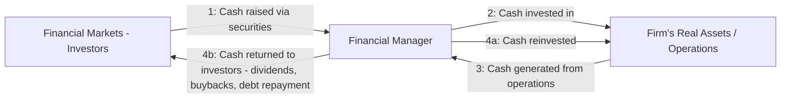

## The Role of the Financial Manager

### Overview

The financial manager is the individual (or function) within a firm responsible for making decisions regarding the acquisition and allocation of capital in a manner consistent with the firm's objective of maximizing shareholder wealth. This role bridges the firm's real operations (production, sales, investment in assets) and financial markets (where the firm raises capital and where its securities are priced), positioning the financial manager as an intermediary who translates operating decisions into financial outcomes and financial market signals back into operating strategy.

---

### The Financial Manager's Position in the Firm

**Key Points**

- In most corporations, the senior financial manager is the **Chief Financial Officer (CFO)**, who typically oversees two principal subordinate functions:
  - **Treasurer**: Responsible for cash management, capital raising (issuing debt and equity), banking relationships, credit management, and managing financial risk (e.g., interest rate and foreign exchange exposure).
  - **Controller**: Responsible for accounting functions, including financial reporting, tax compliance, internal auditing, and cost accounting/budgeting.
- The financial manager reports to the CEO and the board of directors, and works closely with other functional areas (operations, marketing, strategy) since nearly all major business decisions have financial implications.
- In smaller firms, these functions may be combined into a single finance role or even performed by the owner directly (particularly in sole proprietorships and small partnerships).

---

### Core Responsibilities

The financial manager's responsibilities map directly onto the three central decision areas of corporate finance.

#### 1. Capital Budgeting (Investment Decisions)

**Key Points**

- Identifying, evaluating, and selecting long-term investment projects (real assets) the firm should undertake.
- Applying valuation techniques such as Net Present Value (NPV), Internal Rate of Return (IRR), and payback period to assess whether prospective investments will increase shareholder wealth.
- Estimating relevant incremental cash flows for each project, incorporating opportunity costs, sunk cost exclusion, and side effects (cannibalization, synergies).
- Assessing project-specific risk and applying an appropriate risk-adjusted discount rate.

**Example**

A financial manager evaluating whether to build a new manufacturing plant estimates the plant's expected incremental after-tax cash flows over its useful life, discounts them at the firm's risk-adjusted cost of capital, and recommends approval only if the resulting NPV is positive.

#### 2. Capital Structure (Financing Decisions)

**Key Points**

- Determining the optimal mix of debt and equity financing to fund the firm's investments while minimizing the overall cost of capital.
- Deciding the specific instruments to use — public bond issuance, bank loans, common stock, preferred stock, convertible securities — and the timing of issuance relative to market conditions.
- Managing the trade-off between the tax benefits of debt (interest tax shield) and the costs of financial distress associated with higher leverage.
- Maintaining relationships with credit rating agencies, investment banks, and institutional lenders to ensure continued access to capital markets on favorable terms.

#### 3. Working Capital Management (Short-Term Financial Decisions)

**Key Points**

- Managing the firm's short-term assets (cash, marketable securities, accounts receivable, inventory) and short-term liabilities (accounts payable, short-term debt) to ensure sufficient liquidity for ongoing operations.
- Optimizing the **cash conversion cycle** — minimizing the time between paying cash for inputs and collecting cash from sales — to reduce the firm's need for external short-term financing.
- Establishing credit policies for customers, managing supplier payment terms, and maintaining adequate but not excessive cash reserves.

---

### The Financial Manager as Intermediary Between the Firm and Financial Markets

**Key Points**

- A central conceptual framework in corporate finance depicts the financial manager as standing between the firm's **real asset operations** and the **financial markets**, managing two-directional cash flows:
  1. Cash flows **raised from investors** in financial markets (issuing stocks and bonds) to fund the firm's investments in real assets.
  2. Cash flows **generated by real asset operations**, which are either reinvested in the firm or **returned to investors** (as dividends, share repurchases, or debt repayment).
- This flow of funds framework underscores that the financial manager must satisfy financial markets' pricing of the firm's securities as an ongoing constraint and information source, not merely as a one-time capital-raising event.

---

### Diagram: The Flow of Funds Through the Financial Manager

---

### Diagram: Position of the Financial Manager in Corporate Structure (svg_diagram)

<svg xmlns="http://www.w3.org/2000/svg" viewBox="0 0 800 400">
<rect x="0" y="0" width="800" height="400" fill="#ffffff" />
<text x="400" y="28" font-family="Arial, sans-serif" font-size="17" font-weight="bold" text-anchor="middle" fill="#1a1a1a">Financial Manager Organizational Position (svg_diagram)</text>
<rect x="300" y="55" width="200" height="50" rx="6" fill="#dbeafe" stroke="#1e40af" stroke-width="2" />
<text x="400" y="86" font-family="Arial, sans-serif" font-size="14" text-anchor="middle" fill="#1e3a8a">Board of Directors</text>
<line x1="400" y1="105" x2="400" y2="135" stroke="#333333" stroke-width="1.5" />
<rect x="300" y="135" width="200" height="50" rx="6" fill="#dcfce7" stroke="#166534" stroke-width="2" />
<text x="400" y="166" font-family="Arial, sans-serif" font-size="14" text-anchor="middle" fill="#14532d">CEO</text>
<line x1="400" y1="185" x2="400" y2="215" stroke="#333333" stroke-width="1.5" />
<rect x="300" y="215" width="200" height="50" rx="6" fill="#fef3c7" stroke="#92400e" stroke-width="2" />
<text x="400" y="246" font-family="Arial, sans-serif" font-size="14" text-anchor="middle" fill="#78350f">CFO / Financial Manager</text>
<line x1="330" y1="265" x2="200" y2="310" stroke="#333333" stroke-width="1.5" />
<line x1="470" y1="265" x2="600" y2="310" stroke="#333333" stroke-width="1.5" />
<rect x="100" y="310" width="200" height="60" rx="6" fill="#fce7f3" stroke="#9d174d" stroke-width="2" />
<text x="200" y="335" font-family="Arial, sans-serif" font-size="13" font-weight="bold" text-anchor="middle" fill="#831843">Treasurer</text>
<text x="200" y="353" font-family="Arial, sans-serif" font-size="10.5" text-anchor="middle" fill="#831843">Cash, capital raising, risk mgmt</text>
<rect x="500" y="310" width="200" height="60" rx="6" fill="#ede9fe" stroke="#6d28d9" stroke-width="2" />
<text x="600" y="335" font-family="Arial, sans-serif" font-size="13" font-weight="bold" text-anchor="middle" fill="#5b21b6">Controller</text>
<text x="600" y="353" font-family="Arial, sans-serif" font-size="10.5" text-anchor="middle" fill="#5b21b6">Reporting, tax, audit</text>
</svg>

---

### The Financial Manager and Risk Management

**Key Points**

- Beyond the three core decision areas, financial managers increasingly bear responsibility for identifying, measuring, and managing financial risks that could impair firm value, including:
  - **Interest rate risk**: exposure from floating-rate debt or duration mismatches between assets and liabilities.
  - **Foreign exchange risk**: exposure from international operations, sales, or financing denominated in foreign currencies.
  - **Commodity price risk**: exposure from input costs or output prices tied to volatile commodity markets.
  - **Credit risk**: exposure from customer receivables or counterparty exposure in financial contracts.
- Common risk management tools include derivatives (forwards, futures, options, swaps), natural hedging (matching currency of revenues and costs), and insurance.

---

### Ethical and Fiduciary Dimensions of the Role

**Key Points**

- Financial managers, particularly officers and directors, generally owe **fiduciary duties** to the corporation and its shareholders, including a duty of care (exercising reasonable diligence in decision-making) and a duty of loyalty (avoiding self-dealing and conflicts of interest).
- The financial manager's decisions are subject to the agency problem: because the financial manager is themselves an agent of shareholders, compensation structures and governance oversight (discussed under agency theory) apply directly to this role.
- Financial managers are also responsible for the accuracy and integrity of financial reporting, which is subject to regulatory oversight (e.g., securities law disclosure requirements) and external audit.

---

### Skills and Analytical Tools Required

**Key Points**

- Proficiency in time value of money calculations, discounted cash flow analysis, and risk-adjusted valuation techniques.
- Understanding of financial statement analysis to assess firm and counterparty performance and creditworthiness.
- Familiarity with capital markets, including debt and equity instrument structures, pricing mechanisms, and investor relations.
- Quantitative skills in statistics and financial modeling to forecast cash flows, assess risk (e.g., sensitivity analysis, scenario analysis, Monte Carlo simulation), and value derivative instruments used in hedging.
- Behavior and outcomes associated with any specific analytical tool may vary depending on firm context, data quality, and market conditions; techniques described here reflect standard practice rather than guaranteed results.

---

### Conclusion

The financial manager occupies a pivotal role at the intersection of a firm's operations and the financial markets, translating the abstract goal of shareholder wealth maximization into concrete decisions across capital budgeting, capital structure, and working capital management. By managing the flow of funds between investors and the firm's real assets, evaluating investment opportunities using rigorous valuation techniques, and balancing the trade-offs inherent in financing and liquidity decisions, the financial manager directly shapes the firm's capacity to create long-term value, while remaining subject to the same governance and agency constraints that apply to all corporate management.

**Related Topics**

- Capital budgeting techniques (NPV, IRR, payback period)
- Capital structure theory and the cost of capital
- Working capital management and the cash conversion cycle
- Agency theory and the separation of ownership and control
- Corporate risk management and the use of derivatives
- Financial statement analysis
- The Treasurer and Controller functions in corporate finance
- Goals of the firm and shareholder value maximization