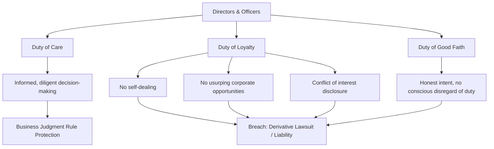

## Ethics and Fiduciary Duty in Financial Decision Making

### Overview

Ethics and fiduciary duty establish the normative and legal constraints within which financial managers, directors, and officers must pursue the objective of shareholder wealth maximization. While corporate finance theory prescribes value maximization as the firm's goal, this goal is not pursued without limit — it operates within a framework of legal obligations (fiduciary duties owed to shareholders and, in some contexts, other stakeholders) and ethical standards that govern how decisions are made, how conflicts of interest are managed, and how information is disclosed. Failures in this domain — from accounting fraud to undisclosed conflicts of interest — have historically produced some of the most damaging corporate collapses and have shaped subsequent regulation of corporate governance and financial reporting.

---

### Fiduciary Duty: Legal Foundations

**Definition**: A fiduciary duty is a legal obligation of one party (the fiduciary) to act in the best interest of another party (the beneficiary), arising from a relationship of trust and confidence. In the corporate context, directors and officers are fiduciaries who owe duties to the corporation and its shareholders.

#### Duty of Care

**Key Points**

- Requires directors and officers to make informed decisions with the same diligence and prudence a reasonably careful person would exercise in similar circumstances.
- Includes obligations to attend meetings, review relevant information before voting on major decisions, and seek expert advice (legal, financial, technical) when necessary.
- The **business judgment rule** generally protects directors from liability for honest mistakes in judgment made in good faith, with due care, and without conflicts of interest — courts generally do not second-guess reasonable business decisions made through a proper process, even if the outcome is poor. [Inference: The precise scope and application of the business judgment rule vary by jurisdiction and specific case law; this describes the general principle as commonly taught rather than a guarantee of protection in any specific circumstance.]

#### Duty of Loyalty

**Key Points**

- Requires directors and officers to act in the best interests of the corporation and its shareholders, rather than in their own personal interest, when those interests conflict.
- Prohibits **self-dealing**: using corporate position for personal gain at the corporation's expense (e.g., approving a contract with a company the director personally owns without proper disclosure and independent approval).
- Prohibits **usurping corporate opportunities**: directors and officers who become aware of a business opportunity in their corporate capacity generally cannot take that opportunity for themselves before offering it to the corporation.
- Governs the handling of **conflicts of interest**, typically requiring disclosure and approval by disinterested directors or shareholders when a transaction involves a director's personal interest.

#### Duty of Good Faith

**Key Points**

- Sometimes treated as a component of the duty of loyalty rather than a fully independent duty, this requires directors to act honestly and with a genuine belief that their actions serve the corporation's best interests, rather than through intentional misconduct, knowing violation of law, or conscious disregard of known duties.

---

### The Relationship Between Fiduciary Duty and the Agency Problem

**Key Points**

- Fiduciary duty is the **legal mechanism** through which the agency relationship (discussed elsewhere) is given binding force: it converts the economic expectation that agents act on behalf of principals into an enforceable legal obligation.
- Breach of fiduciary duty gives shareholders legal remedies, including derivative lawsuits (shareholders suing on behalf of the corporation against directors/officers) and, in egregious cases, criminal liability for officers and directors.
- Fiduciary duty complements, but does not replace, the economic alignment mechanisms discussed under agency theory (equity compensation, board oversight, market discipline) — it provides a legal backstop for situations where those economic incentives fail to prevent harmful self-interested behavior.

---

### Ethical Dimensions Beyond Legal Minimums

**Key Points**

- Legal compliance represents a **floor**, not a ceiling, for ethical conduct: actions can be technically legal while still being ethically questionable or damaging to long-term firm reputation and stakeholder trust.
- Ethical considerations commonly arising in financial decision-making include:
  - **Earnings management**: Using discretion within accounting rules to smooth or inflate reported earnings, which may be legal but can mislead investors about the firm's true economic performance.
  - **Insider trading**: Trading securities based on material non-public information, which is illegal in most jurisdictions but also raises fundamental fairness concerns regarding equal access to information among market participants.
  - **Related-party transactions**: Business dealings between the firm and parties connected to its management or directors, which require careful disclosure and independent scrutiny to avoid disguised self-dealing.
  - **Short-termism**: Prioritizing decisions that boost near-term metrics (quarterly earnings, stock price) at the expense of long-term value creation, sometimes driven by misaligned compensation incentives.
  - **Disclosure and transparency**: The ethical obligation to provide accurate, timely, and complete information to investors, even when unfavorable, versus the temptation to obscure or delay negative news.

---

### Case Illustration: Consequences of Fiduciary and Ethical Failures

**Example**

Corporate accounting scandals in the early 2000s (widely covered in financial history) typically involved a common pattern: management manipulated financial statements to meet earnings targets and support inflated stock-based compensation, external auditors failed to detect or challenge the manipulation, and boards failed to provide adequate independent oversight. Such episodes resulted in shareholder losses, bankruptcy in extreme cases, and led directly to the enactment of the **Sarbanes-Oxley Act of 2002** in the United States, which introduced enhanced requirements for financial disclosure accuracy, internal control certification by CEOs and CFOs, auditor independence, and criminal penalties for fraudulent financial reporting.

[Unverified: this describes a general pattern commonly cited in corporate governance literature regarding early-2000s scandals; the specific facts and legal outcomes of any individual case should be verified against primary sources if cited for academic or professional purposes.]

---

### Regulatory and Governance Responses

**Key Points**

- **Sarbanes-Oxley Act (SOX)**: Established requirements including CEO/CFO certification of financial statements, enhanced internal control assessment and disclosure, restrictions on auditor-provided non-audit services, and criminal penalties for document destruction and fraud.
- **Independent audit committees**: Composed of independent directors, tasked with overseeing the integrity of financial reporting and the relationship with external auditors, reducing the risk of management undue influence over the audit process.
- **Say-on-pay provisions**: Give shareholders a non-binding (in many jurisdictions) advisory vote on executive compensation, intended to increase accountability for pay structures perceived as excessive or poorly aligned with performance.
- **Whistleblower protections**: Legal protections and, in some jurisdictions, financial incentives for employees who report fraud or violations of securities law, intended to counteract the internal pressures against disclosure.
- Behavior and enforcement of these mechanisms vary by jurisdiction, and specific regulatory requirements are subject to periodic legislative revision. [Unverified: readers should confirm current regulatory requirements against official regulatory sources, as this content reflects general, commonly taught frameworks rather than current legal text.]

---

### Diagram: Fiduciary Duty Framework

---

### Diagram: Ethics as a Constraint on the Value Maximization Objective (svg_diagram)

<svg viewBox="0 0 800 340" xmlns="http://www.w3.org/2000/svg">
<rect x="0" y="0" width="800" height="340" fill="#ffffff"/>
<text x="400" y="28" font-family="Arial, sans-serif" font-size="17" font-weight="bold" text-anchor="middle" fill="#1a1a1a">Ethical and Legal Constraints on Firm Objectives (svg_diagram)</text>
<circle cx="400" cy="190" r="130" fill="#fee2e2" stroke="#b91c1c" stroke-width="2"/>
<text x="400" y="120" font-family="Arial, sans-serif" font-size="13" font-weight="bold" text-anchor="middle" fill="#7f1d1d">All Conceivable Actions</text>
<circle cx="400" cy="200" r="95" fill="#fef3c7" stroke="#92400e" stroke-width="2"/>
<text x="400" y="130" font-family="Arial, sans-serif" font-size="12" text-anchor="middle" fill="#78350f">Legally Permissible</text>
<circle cx="400" cy="210" r="60" fill="#dcfce7" stroke="#166534" stroke-width="2"/>
<text x="400" y="205" font-family="Arial, sans-serif" font-size="12" font-weight="bold" text-anchor="middle" fill="#14532d">Ethical &</text>
<text x="400" y="222" font-family="Arial, sans-serif" font-size="12" font-weight="bold" text-anchor="middle" fill="#14532d">Fiduciary-Compliant</text>

<text x="400" y="300" font-family="Arial, sans-serif" font-size="12" text-anchor="middle" fill="`#374151`">Value maximization is pursued only within the innermost region</text>

</svg>

---

### Practical Guidance for Financial Decision Makers

**Key Points**

- When facing a decision with potential conflicts of interest, the standard prescribed process involves: full disclosure of the conflict, recusal from voting where appropriate, and approval by disinterested, informed decision-makers.
- Financial managers should document the decision-making process (information reviewed, alternatives considered, rationale) to demonstrate compliance with the duty of care, independent of the ultimate outcome of the decision.
- Ethical decision-making frameworks commonly taught in this context include considering: legality, transparency (would this withstand public disclosure), fairness to affected stakeholders, and consistency with the firm's stated values and long-term reputation.
- These are general practices; specific fiduciary and ethical obligations depend on the applicable legal jurisdiction, the firm's governing documents, and the specific facts of a given situation, and should not be treated as a substitute for qualified legal counsel in real decision-making contexts.

---

### Conclusion

Ethics and fiduciary duty function as the binding constraints within which the pursuit of shareholder wealth maximization must operate. Fiduciary duties of care and loyalty translate the economic expectation of agent alignment with principal interests into enforceable legal obligations, while broader ethical standards address conduct that may be technically legal but nonetheless damaging to stakeholder trust and long-term firm value. Historical failures in this domain have repeatedly demonstrated that breaches of fiduciary duty and ethical lapses impose substantial costs — legal, financial, and reputational — reinforcing that value maximization pursued outside these constraints is neither sustainable nor consistent with the legitimate interests of shareholders themselves.

**Related Topics**

- Agency theory and the separation of ownership and control
- Corporate governance and board independence
- Sarbanes-Oxley Act and financial reporting regulation
- Executive compensation and say-on-pay provisions
- Insider trading law and securities regulation
- Earnings management and financial statement quality
- Whistleblower protections and corporate compliance programs
- Goals of the firm and shareholder value maximization