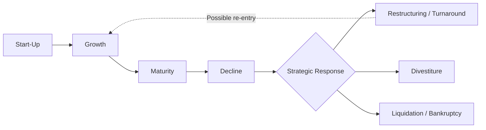

## The Corporate Life Cycle

### Overview

The corporate life cycle describes the sequence of distinct stages a firm typically passes through from inception to maturity (and potentially decline), each characterized by differing patterns of cash flow, profitability, risk, financing needs, and appropriate financial policy. Understanding the life cycle stage a firm occupies is central to corporate finance because the optimal capital structure, dividend policy, valuation approach, and investment strategy differ substantially across stages. A financing or payout policy well-suited to a mature firm may be entirely inappropriate — even value-destroying — for a firm in an early growth stage, and vice versa.

---

### Stages of the Corporate Life Cycle

#### 1. Start-Up / Introduction Stage

**Key Points**

- The firm is newly formed, typically with an unproven product or business model, minimal or negative revenue, and negative operating cash flow.
- **Financing sources** are limited primarily to founder capital, friends and family, angel investors, and early-stage venture capital, since the firm lacks the track record, collateral, or predictable cash flows needed for conventional bank debt or public capital markets access.
- **Risk** is at its highest: high probability of business failure, uncertain product-market fit, and no diversification across product lines.
- **Valuation** is highly uncertain and often relies on qualitative assessment of the team, market opportunity, and comparable early-stage transactions rather than discounted cash flow analysis, given the absence of reliable historical cash flows.
- **Dividend policy**: Firms in this stage virtually never pay dividends; all available cash is retained or reinvested, and cash needs typically exceed internally generated funds, requiring continuous external equity infusions.

#### 2. Growth Stage

**Key Points**

- The firm has established product-market fit and is experiencing rapid revenue growth, though profitability may still be low, negative, or highly variable as the firm invests aggressively to capture market share.
- **Financing sources** expand to include later-stage venture capital, private equity growth investors, and potentially early access to public equity markets (IPO) if the firm reaches sufficient scale and investor demand exists.
- **Capital expenditure and working capital needs** are typically very high relative to internally generated cash flow, since growth in revenue requires proportional (or greater) investment in receivables, inventory, and capacity.
- **Risk** remains elevated but is lower than the start-up stage, as the business model has been validated; systematic risk (beta) is often still high due to sensitivity to economic and competitive conditions.
- **Dividend policy**: Generally continues to be zero or minimal, as reinvestment opportunities with high expected returns remain abundant relative to available capital (consistent with the residual dividend model).

#### 3. Maturity / Steady-State Stage

**Key Points**

- Revenue growth slows to rates closer to overall economic or industry growth rates; the firm has established a stable market position and predictable cash flow generation.
- **Profitability and free cash flow** are typically at their highest relative to revenue, since capital expenditure needs decline relative to operating cash flow (fewer high-return reinvestment opportunities remain).
- **Financing sources** broaden to include full access to public debt and equity markets, investment-grade credit ratings (for well-managed firms), and lower-cost bank financing given established collateral and cash flow history.
- **Capital structure** decisions become more central, as the firm can support higher leverage given stable, predictable cash flows, and the tax benefits of debt become more relevant relative to earlier stages where the firm may not have had sufficient taxable income to use interest deductions fully.
- **Dividend policy**: Mature firms with fewer positive-NPV reinvestment opportunities typically begin paying dividends and/or conducting share repurchases, returning excess free cash flow to shareholders rather than reinvesting at below-required returns (again, consistent with the residual dividend/free cash flow framework).
- **Agency costs of free cash flow** (per Jensen's hypothesis) become a more prominent concern at this stage, since mature firms often generate cash flow exceeding positive-NPV investment opportunities, creating temptation for value-destroying empire-building or overinvestment absent strong governance or leverage discipline.

#### 4. Decline Stage

**Key Points**

- Revenue and profitability shrink, often due to technological obsolescence, changing consumer preferences, increased competition, or secular industry decline.
- **Strategic options** include harvesting the business (maximizing near-term cash extraction while minimizing further investment), divesting business units, restructuring operations, or in severe cases, liquidation or bankruptcy.
- **Financing** becomes more constrained: credit ratings may deteriorate, access to capital markets narrows, and the cost of both debt and equity capital typically rises to reflect increased financial distress risk.
- **Dividend policy**: Firms may need to cut or eliminate dividends to preserve cash, particularly if operating cash flow deteriorates faster than anticipated; alternatively, some declining firms in a "harvest" strategy may pay out unusually high dividends if they have limited remaining productive uses for cash and no growth prospects to fund.

---

### Diagram: The Corporate Life Cycle

---

### Diagram: Revenue, Cash Flow, and Risk Across the Life Cycle (svg_diagram)

<svg xmlns="http://www.w3.org/2000/svg" viewBox="0 0 800 420">
<rect x="0" y="0" width="800" height="420" fill="#ffffff" />
<text x="400" y="28" font-family="Arial, sans-serif" font-size="17" font-weight="bold" text-anchor="middle" fill="#1a1a1a">Corporate Life Cycle: Revenue and Cash Flow Patterns (svg_diagram)</text>
<line x1="70" y1="350" x2="750" y2="350" stroke="#333333" stroke-width="1.5" />
<line x1="70" y1="60" x2="70" y2="350" stroke="#333333" stroke-width="1.5" />
<text x="410" y="385" font-family="Arial, sans-serif" font-size="12" text-anchor="middle" fill="#374151">Time / Life Cycle Stage</text>
<text x="35" y="205" font-family="Arial, sans-serif" font-size="12" text-anchor="middle" fill="#374151" transform="rotate(-90 35 205)">Revenue / Cash Flow</text>
<path d="M 70 340 Q 200 330 280 250 Q 380 130 480 90 Q 600 70 750 110" fill="none" stroke="#1e40af" stroke-width="2.5" />
<text x="620" y="70" font-family="Arial, sans-serif" font-size="11" fill="#1e40af">Revenue</text>
<path d="M 70 345 Q 200 348 280 320 Q 380 250 480 180 Q 600 140 750 150" fill="none" stroke="#166534" stroke-width="2.5" stroke-dasharray="6,3" />
<text x="620" y="175" font-family="Arial, sans-serif" font-size="11" fill="#166534">Free Cash Flow</text>
<line x1="200" y1="60" x2="200" y2="350" stroke="#999999" stroke-width="1" stroke-dasharray="3,3" />
<line x1="420" y1="60" x2="420" y2="350" stroke="#999999" stroke-width="1" stroke-dasharray="3,3" />
<line x1="600" y1="60" x2="600" y2="350" stroke="#999999" stroke-width="1" stroke-dasharray="3,3" />

<text x="135" y="370" font-family="Arial, sans-serif" font-size="12" font-weight="bold" text-anchor="middle" fill="`#1f2937`">Start-Up</text>

<text x="310" y="370" font-family="Arial, sans-serif" font-size="12" font-weight="bold" text-anchor="middle" fill="`#1f2937`">Growth</text>

<text x="510" y="370" font-family="Arial, sans-serif" font-size="12" font-weight="bold" text-anchor="middle" fill="`#1f2937`">Maturity</text>

<text x="680" y="370" font-family="Arial, sans-serif" font-size="12" font-weight="bold" text-anchor="middle" fill="`#1f2937`">Decline</text>

</svg>

---

### Financing and Payout Policy Summary by Stage

| Stage | Revenue Growth | Free Cash Flow | Typical Financing | Dividend Policy | Key Risk |
| --- | --- | --- | --- | --- | --- |
| Start-Up | Minimal/negative | Strongly negative | Founder capital, angel, early VC | None | Business failure |
| Growth | High | Negative to modest | VC, growth equity, early debt/IPO | None to minimal | Execution, competition |
| Maturity | Moderate/stable | Strongly positive | Public debt & equity, bank credit | Dividends, buybacks | Agency costs of FCF |
| Decline | Negative | Variable (may spike in harvest) | Constrained, higher cost | Cut or high "harvest" payout | Financial distress, insolvency |

---

### Valuation Implications Across the Life Cycle

**Key Points**

- Early-stage firms are often valued using methods that do not rely heavily on near-term cash flow projections (e.g., venture capital method, comparable transaction multiples, real options analysis for underlying technology or market potential), since discounted cash flow models are highly sensitive to assumptions when cash flows are distant, uncertain, or negative.
- Growth-stage and mature firms are more amenable to standard discounted cash flow valuation, since historical operating data provides a firmer basis for projecting future cash flows and estimating an appropriate discount rate.
- The **terminal value** assumption in a discounted cash flow model implicitly embeds an assumption about the firm's eventual transition to a stable, mature growth rate — reflecting the life cycle framework directly within standard valuation methodology.
- Valuation approaches and their reliability may vary considerably depending on data availability, industry context, and the specific maturity of the firm being analyzed; the frameworks described here represent general practice rather than a guarantee of accuracy in any specific valuation exercise.

---

### Conclusion

The corporate life cycle framework provides a structural lens for understanding how a firm's financing needs, risk profile, and optimal capital structure and payout policy evolve as it moves from start-up through growth, maturity, and potential decline. Recognizing which stage a firm occupies helps financial managers and analysts apply appropriate valuation techniques, anticipate financing constraints, and design dividend and capital structure policies consistent with the firm's actual reinvestment opportunities and risk characteristics, rather than applying a one-size-fits-all financial policy across fundamentally different business contexts.

**Related Topics**

- Capital structure theory and the trade-off between debt and equity
- Dividend policy and the residual dividend model
- Venture capital and private equity financing stages
- Discounted cash flow valuation and terminal value estimation
- Jensen's free cash flow hypothesis and agency costs
- Financial distress and corporate bankruptcy
- Initial public offerings (IPOs) and the transition to public markets
- Goals of the firm and shareholder value maximization