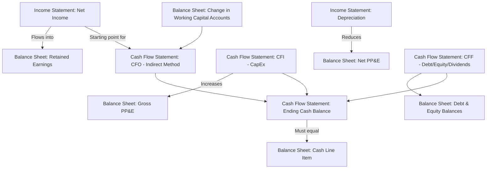

## The Balance Sheet, Income Statement, and Cash Flow Statement

### Overview

The three core financial statements — the balance sheet, income statement, and cash flow statement — form the foundational data set for financial analysis, valuation, and corporate decision-making. Each statement captures a distinct dimension of a firm's financial condition: the balance sheet presents a snapshot of assets, liabilities, and equity at a point in time; the income statement summarizes profitability over a period; and the cash flow statement reconciles the movement of actual cash over that same period. Together, they are interlinked through a set of articulation relationships that allow analysts to cross-check consistency and understand how operating, investing, and financing decisions flow through to the firm's financial position.

---

### The Balance Sheet

**Definition**: A statement of a firm's financial position at a specific point in time, presenting what the firm owns (assets), what it owes (liabilities), and the residual claim of owners (shareholders' equity).

**Key Points**

- Governed by the fundamental accounting identity:

$$\text{Assets} = \text{Liabilities} + \text{Shareholders' Equity}$$

- **Assets** are typically presented in order of liquidity, divided into:
  - **Current assets**: Cash, marketable securities, accounts receivable, inventory — expected to be converted to cash or consumed within one year or one operating cycle.
  - **Non-current (long-term) assets**: Property, plant, and equipment (PP&E), intangible assets (patents, goodwill), and long-term investments.
- **Liabilities** are similarly divided by maturity:
  - **Current liabilities**: Accounts payable, short-term debt, accrued expenses, current portion of long-term debt — due within one year.
  - **Non-current (long-term) liabilities**: Long-term debt, deferred tax liabilities, pension obligations.
- **Shareholders' equity** represents the residual claim of owners after all liabilities are satisfied, comprising common stock (par value), additional paid-in capital, retained earnings, and other comprehensive income/loss items.
- The balance sheet reflects **historical cost accounting** for many asset categories (particularly PP&E), meaning book values often diverge materially from current market values — a key distinction relevant to financial analysis and valuation.

**Example**

| Assets | Amount | Liabilities & Equity | Amount |
| --- | --- | --- | --- |
| Cash | $50,000 | Accounts Payable | $40,000 |
| Accounts Receivable | $80,000 | Short-Term Debt | $30,000 |
| Inventory | $70,000 | **Total Current Liabilities** | $70,000 |
| **Total Current Assets** | $200,000 | Long-Term Debt | $150,000 |
| Net PP&E | $300,000 | **Total Liabilities** | $220,000 |
| **Total Assets** | $500,000 | Common Stock & Retained Earnings | $280,000 |
|  |  | **Total Liabilities & Equity** | $500,000 |

---

### The Income Statement

**Definition**: A statement summarizing a firm's revenues, expenses, and resulting profit or loss over a specified period (quarterly or annually), measuring operating performance under **accrual accounting** principles.

**Key Points**

- Follows a standard cascading structure from revenue down to net income:

$$\text{Net Income} = \text{Revenue} - \text{COGS} - \text{Operating Expenses} - \text{Interest} - \text{Taxes}$$

- Key line items and subtotals, in typical order:
  - **Revenue (Sales)**: Total amount earned from the sale of goods/services during the period.
  - **Cost of Goods Sold (COGS)**: Direct costs attributable to producing goods/services sold.
  - **Gross Profit** = Revenue − COGS.
  - **Operating Expenses**: Selling, general, and administrative expenses (SG&A), research and development (R&D), depreciation and amortization (if not included in COGS).
  - **Operating Income (EBIT)**: Earnings Before Interest and Taxes = Gross Profit − Operating Expenses.
  - **Interest Expense**: Cost of debt financing.
  - **Pre-Tax Income (EBT)** = EBIT − Interest Expense.
  - **Income Tax Expense**.
  - **Net Income**: The "bottom line" — EBT − Taxes, available to common shareholders (before any preferred dividends).
- **Earnings Per Share (EPS)** = Net Income (available to common shareholders) / Weighted Average Shares Outstanding, a widely used (though imperfect) summary profitability metric.
- Accrual accounting recognizes revenue when earned and expenses when incurred, **regardless of when cash is actually received or paid** — a critical distinction from the cash flow statement.

**Example**

| Income Statement | Amount |
| --- | --- |
| Revenue | $1,000,000 |
| Cost of Goods Sold | ($600,000) |
| **Gross Profit** | $400,000 |
| SG&A Expenses | ($150,000) |
| Depreciation | ($50,000) |
| **Operating Income (EBIT)** | $200,000 |
| Interest Expense | ($30,000) |
| **Pre-Tax Income** | $170,000 |
| Income Tax (25%) | ($42,500) |
| **Net Income** | $127,500 |

---

### The Cash Flow Statement

**Definition**: A statement reconciling the change in a firm's cash balance over a period by categorizing all cash inflows and outflows into three activities: operating, investing, and financing.

**Key Points**

- Addresses the key limitation of the income statement: accrual-based net income does not equal actual cash generated, due to non-cash expenses (depreciation, amortization), timing differences (changes in receivables, payables, inventory), and items excluded from the income statement entirely (capital expenditures, debt issuance/repayment, dividend payments).

#### Cash Flow from Operating Activities (CFO)

**Key Points**

- Captures cash generated or used by the firm's core business operations.
- Most commonly presented using the **indirect method**, which starts from net income and adjusts for non-cash items and changes in working capital:

$$CFO = \text{Net Income} + \text{Depreciation \& Amortization} - \Delta \text{Working Capital (non-cash)}$$

- An increase in current assets (e.g., receivables, inventory) is a **use** of cash (subtracted); an increase in current liabilities (e.g., payables) is a **source** of cash (added).

#### Cash Flow from Investing Activities (CFI)

**Key Points**

- Captures cash flows related to the acquisition and disposal of long-term assets.
- Includes capital expenditures (purchases of PP&E, typically the largest outflow), proceeds from asset sales, and purchases/sales of long-term investments or acquisitions of other businesses.
- Typically negative for growing firms making ongoing capital investments.

#### Cash Flow from Financing Activities (CFF)

**Key Points**

- Captures cash flows between the firm and its capital providers (debt holders and shareholders).
- Includes proceeds from issuing debt or equity, repayment of debt principal, share repurchases, and dividend payments.

$$\Delta \text{Cash Balance} = CFO + CFI + CFF$$

**Example**

| Cash Flow Statement | Amount |
| --- | --- |
| Net Income | $127,500 |
| + Depreciation | $50,000 |
| − Increase in Accounts Receivable | ($20,000) |
| + Increase in Accounts Payable | $15,000 |
| **CFO** | $172,500 |
| Capital Expenditures | ($100,000) |
| **CFI** | ($100,000) |
| Debt Repayment | ($25,000) |
| Dividends Paid | ($30,000) |
| **CFF** | ($55,000) |
| **Net Change in Cash** | $17,500 |

---

### Articulation Between the Three Statements

**Key Points**

- **Net income** from the income statement flows into **retained earnings** on the balance sheet (adjusted for dividends paid): $\text{Ending RE} = \text{Beginning RE} + \text{Net Income} - \text{Dividends}$.
- **Net income** is also the starting point for the indirect-method cash flow statement.
- The **ending cash balance** on the cash flow statement must equal the **cash line item** on the balance sheet as of period-end.
- Changes in balance sheet working capital accounts (receivables, payables, inventory) between two periods directly determine the working capital adjustments in the operating section of the cash flow statement.
- Capital expenditures on the cash flow statement increase **gross PP&E** on the balance sheet, while depreciation (an income statement expense) reduces **net PP&E** on the balance sheet.

---

### Diagram: Articulation of the Three Financial Statements

---

### Diagram: Structure and Linkage of the Three Statements (svg_diagram)

<svg xmlns="http://www.w3.org/2000/svg" viewBox="0 0 800 400">
<rect x="0" y="0" width="800" height="400" fill="#ffffff" />
<text x="400" y="26" font-family="Arial, sans-serif" font-size="16" font-weight="bold" text-anchor="middle" fill="#1a1a1a">The Three Financial Statements (svg_diagram)</text>
<rect x="30" y="55" width="220" height="300" rx="6" fill="#dbeafe" stroke="#1e40af" stroke-width="2" />
<text x="140" y="80" font-family="Arial, sans-serif" font-size="13" font-weight="bold" text-anchor="middle" fill="#1e3a8a">Balance Sheet</text>
<text x="140" y="100" font-family="Arial, sans-serif" font-size="10.5" text-anchor="middle" fill="#1e3a8a">(Point in Time)</text>
<text x="140" y="130" font-family="Arial, sans-serif" font-size="11" text-anchor="middle" fill="#1e3a8a">Assets</text>
<text x="140" y="150" font-family="Arial, sans-serif" font-size="11" text-anchor="middle" fill="#1e3a8a">= Liabilities</text>
<text x="140" y="170" font-family="Arial, sans-serif" font-size="11" text-anchor="middle" fill="#1e3a8a">+ Equity</text>
<text x="140" y="210" font-family="Arial, sans-serif" font-size="10" text-anchor="middle" fill="#1e3a8a">Cash, Receivables,</text>
<text x="140" y="226" font-family="Arial, sans-serif" font-size="10" text-anchor="middle" fill="#1e3a8a">Inventory, PP&amp;E,</text>
<text x="140" y="242" font-family="Arial, sans-serif" font-size="10" text-anchor="middle" fill="#1e3a8a">Debt, Retained Earnings</text>
<rect x="290" y="55" width="220" height="300" rx="6" fill="#dcfce7" stroke="#166534" stroke-width="2" />
<text x="400" y="80" font-family="Arial, sans-serif" font-size="13" font-weight="bold" text-anchor="middle" fill="#14532d">Income Statement</text>
<text x="400" y="100" font-family="Arial, sans-serif" font-size="10.5" text-anchor="middle" fill="#14532d">(Period, Accrual Basis)</text>
<text x="400" y="130" font-family="Arial, sans-serif" font-size="11" text-anchor="middle" fill="#14532d">Revenue − COGS</text>
<text x="400" y="150" font-family="Arial, sans-serif" font-size="11" text-anchor="middle" fill="#14532d">− OpEx − Interest</text>
<text x="400" y="170" font-family="Arial, sans-serif" font-size="11" text-anchor="middle" fill="#14532d">− Taxes = Net Income</text>
<rect x="550" y="55" width="220" height="300" rx="6" fill="#fef3c7" stroke="#92400e" stroke-width="2" />
<text x="660" y="80" font-family="Arial, sans-serif" font-size="13" font-weight="bold" text-anchor="middle" fill="#78350f">Cash Flow Statement</text>
<text x="660" y="100" font-family="Arial, sans-serif" font-size="10.5" text-anchor="middle" fill="#78350f">(Period, Cash Basis)</text>
<text x="660" y="130" font-family="Arial, sans-serif" font-size="11" text-anchor="middle" fill="#78350f">Operating (CFO)</text>
<text x="660" y="150" font-family="Arial, sans-serif" font-size="11" text-anchor="middle" fill="#78350f">Investing (CFI)</text>
<text x="660" y="170" font-family="Arial, sans-serif" font-size="11" text-anchor="middle" fill="#78350f">Financing (CFF)</text>
<path d="M 400 190 L 400 210 L 660 210 L 660 190" fill="none" stroke="#374151" stroke-width="1.5" />
<text x="530" y="205" font-family="Arial, sans-serif" font-size="10" text-anchor="middle" fill="#374151">Net Income →CFO</text>
<path d="M 660 250 L 660 280 L 140 280 L 140 260" fill="none" stroke="#374151" stroke-width="1.5" />
<text x="400" y="295" font-family="Arial, sans-serif" font-size="10" text-anchor="middle" fill="#374151">Ending Cash = Balance Sheet Cash</text>
</svg>

---

### Relevance to Corporate Finance

**Key Points**

- Financial managers rely on all three statements jointly to assess liquidity (balance sheet current ratios), profitability (income statement margins), and the firm's actual cash-generating capacity (cash flow statement), which is the basis for free cash flow used in valuation.
- The cash flow statement is particularly critical for corporate finance analysis because valuation models (e.g., discounted cash flow) are built on **free cash flow**, not accounting net income, given that net income can be distorted by non-cash accounting choices while cash flow more directly reflects economic value creation.
- Analysts and financial managers should be aware that specific presentation formats, line-item classifications, and permissible accounting choices vary across accounting standards (e.g., GAAP vs. IFRS) and may change with accounting standard updates; the general structure described here reflects widely used conventions rather than a single universally mandated format. [Unverified: exact classification rules for certain items, such as interest paid/received under the cash flow statement, differ between GAAP and IFRS and should be confirmed against current applicable accounting standards.]

---

### Conclusion

The balance sheet, income statement, and cash flow statement together provide a complete, interlinked picture of a firm's financial position, operating performance, and cash-generating ability. The balance sheet captures a snapshot of what the firm owns and owes; the income statement measures accrual-based profitability over time; and the cash flow statement bridges the gap between accrual accounting and actual cash movement, categorizing flows into operating, investing, and financing activities. Mastery of how these statements articulate with one another is a prerequisite for financial statement analysis, ratio analysis, and the free cash flow estimation that underlies corporate valuation and capital budgeting decisions.

**Related Topics**

- Free cash flow calculation and its use in valuation
- Financial ratio analysis (liquidity, profitability, leverage, efficiency ratios)
- Accrual accounting vs. cash accounting
- Working capital management and the cash conversion cycle
- GAAP vs. IFRS differences in financial reporting
- Common-size and trend analysis of financial statements
- Depreciation methods and their effect on reported earnings
- DuPont analysis and return on equity decomposition