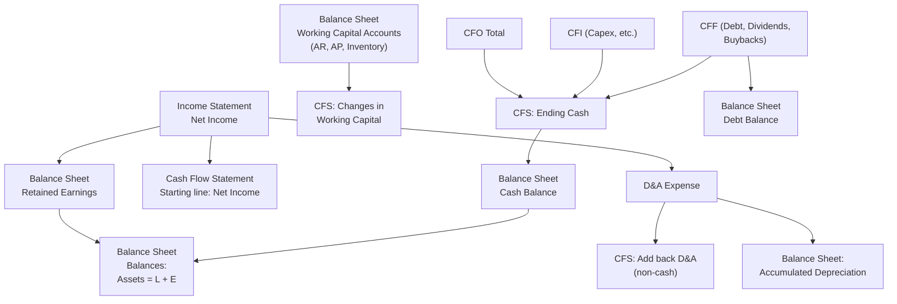

## Linking the Three Financial Statements

### Overview

The three financial statements — Income Statement, Balance Sheet, and Cash Flow Statement — are not independent documents. They are mechanically interlinked through specific line items, such that a change in one flows through to the other two. Building an integrated three-statement model means constructing these linkages so the statements update dynamically and remain internally consistent (i.e., the Balance Sheet balances) in every period.

### Why the Statements Must Be Linked

**Key Points**

- The Income Statement measures profitability over a period (accrual-based)
- The Balance Sheet is a snapshot of financial position at a point in time
- The Cash Flow Statement reconciles accrual-based Net Income to actual cash movement
- Linking them enforces the accounting identity: $Assets = Liabilities + Equity$ must hold every period
- Without linkage, an analyst could double-count, omit non-cash items, or produce a Balance Sheet that fails to balance

### The Core Linkage Map

### Linkage 1: Income Statement to Balance Sheet (via Retained Earnings)

Net Income flows into Retained Earnings on the equity side of the Balance Sheet:

$$RE_t = RE_{t-1} + NetIncome_t - Dividends_t$$

**Example**

If beginning Retained Earnings is $500,000, Net Income for the period is $120,000, and $30,000 in dividends is paid:

$$RE_t = \$500{,}000 + \$120{,}000 - \$30{,}000 = \$590{,}000$$

This ending balance becomes the new Retained Earnings line on the Balance Sheet for that period.

### Linkage 2: Income Statement to Cash Flow Statement

The Cash Flow Statement (indirect method) starts with Net Income from the Income Statement and adjusts it for non-cash items and working capital changes to arrive at Cash Flow from Operations (CFO):

$$CFO = NetIncome + D\&A + \Delta NWC + \text{other non-cash adjustments}$$

**Key Points**

- Depreciation & Amortization (D&A) is subtracted on the Income Statement (reducing Net Income) but added back on the CFS because it is a non-cash expense
- Stock-based compensation, deferred taxes, and impairment charges follow the same add-back logic
- Interest expense (already embedded in Net Income) is why CFO differs from EBITDA-based cash measures

### Linkage 3: Balance Sheet to Cash Flow Statement (Working Capital)

Changes in current operating assets and liabilities on the Balance Sheet directly drive the working capital adjustments in CFO:

| Balance Sheet Account | Increase Effect on Cash | CFS Treatment |
| --- | --- | --- |
| Accounts Receivable (Asset) | Decreases cash (sale made, not yet collected) | Subtract the increase |
| Inventory (Asset) | Decreases cash (cash tied up in stock) | Subtract the increase |
| Accounts Payable (Liability) | Increases cash (delaying payment) | Add the increase |
| Accrued Expenses (Liability) | Increases cash | Add the increase |

**Example**

If Accounts Receivable increases by $40,000 during the period:

$$\Delta NWC_{effect} = -\$40{,}000 \text{ (subtracted in CFO)}$$

This is because the company recognized revenue (boosting Net Income) but has not yet collected the cash — the Balance Sheet and Cash Flow Statement must reflect this timing gap consistently.

### Linkage 4: Cash Flow Statement to Balance Sheet (Ending Cash)

The three sections of the CFS sum to the net change in cash, which rolls into the Balance Sheet cash balance:

$$Cash_t = Cash_{t-1} + CFO + CFI + CFF$$

Where:

- **CFO** (Operations) — Net Income + non-cash add-backs +/- working capital changes
- **CFI** (Investing) — Capital expenditures, acquisitions, asset sales
- **CFF** (Financing) — Debt issuance/repayment, equity issuance, dividends, buybacks

This ending cash figure becomes the Cash line on the Balance Sheet for the same period, and PP&E, Debt, and Equity balances are similarly rolled forward using CFI and CFF detail.

### Linkage 5: PP&E Roll-Forward (Capex and Depreciation)

Property, Plant & Equipment on the Balance Sheet connects Capex (from CFI) and Depreciation (from the Income Statement):

$$PP\&E_t = PP\&E_{t-1} + Capex_t - Depreciation_t$$

**Example**

Beginning PP&E of $1,000,000, Capex of $150,000 (an outflow on CFI), and Depreciation expense of $80,000 (on the Income Statement):

$$PP\&E_t = \$1{,}000{,}000 + \$150{,}000 - \$80{,}000 = \$1{,}070{,}000$$

### Linkage 6: Debt Schedule to Interest Expense (Circularity)

Debt balances on the Balance Sheet determine interest expense on the Income Statement, but interest expense affects Net Income, which affects cash available to pay down debt (via CFF), which affects the debt balance — creating **circularity**.

$$InterestExpense_t = Rate \times \frac{Debt_{t-1} + Debt_t}{2}$$

**Key Points**

- This is typically resolved in spreadsheet models using an average-balance method or a circularity breaker (a switch that zeroes out the circular loop to avoid #REF/iterative errors)
- Revolver mechanics (a revolving credit facility that draws or repays based on the cash shortfall/surplus) are the most common source of circularity in an operating model
- [Unverified] Exact circularity-handling conventions vary by firm and modeling template; some prefer beginning-of-period debt balances specifically to avoid circular references altogether

### Step-by-Step Construction Order

1. Build the Income Statement down to Net Income
2. Build supporting schedules: Depreciation schedule, Debt schedule, Working Capital schedule
3. Build the Cash Flow Statement starting with Net Income, add back non-cash items, apply working capital changes
4. Calculate CFI and CFF from the supporting schedules
5. Roll forward the Balance Sheet: Cash (from CFS), PP&E (from Capex/D&A), Debt (from CFF), Retained Earnings (from Net Income less dividends)
6. Check that Assets = Liabilities + Equity; if not, trace the discrepancy back through the linkages

### The Balance Check

Every completed period should be tested:

$$TotalAssets_t - (TotalLiabilities_t + TotalEquity_t) = 0$$

**Key Points**

- A non-zero balance check almost always traces to one of three causes: a Balance Sheet item that was updated without a corresponding CFS entry, a sign error in a working capital adjustment, or a missing linkage (e.g., forgetting to flow stock-based compensation through both the IS add-back and the equity account)
- Building a "Balance Check" row directly into the model (as a formula, not a manual override) is standard practice so errors surface immediately

### Common Linkage Errors

- Treating Capex as an Income Statement expense instead of capitalizing it to PP&E and depreciating over time
- Forgetting to reduce cash for dividends paid while still reducing Retained Earnings
- Double-counting a non-cash charge (e.g., subtracting it in Net Income and again in the CFS without the add-back)
- Omitting deferred tax assets/liabilities from the CFS non-cash adjustments
- Using ending, rather than average, debt balances inconsistently between the interest calculation and the debt schedule

### Illustrative Simplified Model Flow (svg_diagram)

<svg xmlns="http://www.w3.org/2000/svg" viewBox="0 0 900 480" font-family="Arial, sans-serif">
<rect x="0" y="0" width="900" height="480" fill="#ffffff" />
<text x="450" y="25" text-anchor="middle" font-size="16" font-weight="bold">Three-Statement Linkage Flow (svg_diagram)</text>
<rect x="20" y="60" width="240" height="150" fill="#eaf2ff" stroke="#3366cc" stroke-width="1.5" />
<text x="140" y="82" text-anchor="middle" font-size="13" font-weight="bold">Income Statement</text>
<text x="35" y="105" font-size="11">Revenue</text>
<text x="35" y="122" font-size="11">- Operating Expenses</text>
<text x="35" y="139" font-size="11">- D&amp;A</text>
<text x="35" y="156" font-size="11">- Interest Expense</text>
<text x="35" y="173" font-size="11">- Taxes</text>
<text x="35" y="195" font-size="11" font-weight="bold">= Net Income</text>
<rect x="330" y="60" width="240" height="150" fill="#eafbea" stroke="#2e8b57" stroke-width="1.5" />
<text x="450" y="82" text-anchor="middle" font-size="13" font-weight="bold">Cash Flow Statement</text>
<text x="345" y="105" font-size="11">Net Income</text>
<text x="345" y="122" font-size="11">+ D&amp;A (add back)</text>
<text x="345" y="139" font-size="11">+/- ΔWorking Capital</text>
<text x="345" y="156" font-size="11">= CFO</text>
<text x="345" y="173" font-size="11">+ CFI + CFF</text>
<text x="345" y="195" font-size="11" font-weight="bold">= Net Change in Cash</text>
<rect x="640" y="60" width="240" height="150" fill="#fff4e5" stroke="#cc7a00" stroke-width="1.5" />
<text x="760" y="82" text-anchor="middle" font-size="13" font-weight="bold">Balance Sheet</text>
<text x="655" y="105" font-size="11">Cash (from CFS)</text>
<text x="655" y="122" font-size="11">PP&amp;E (Capex - D&amp;A)</text>
<text x="655" y="139" font-size="11">Debt (from CFF)</text>
<text x="655" y="156" font-size="11">Retained Earnings</text>
<text x="655" y="173" font-size="11">(prior RE + NI - Div)</text>
<text x="655" y="195" font-size="11" font-weight="bold">Assets = Liab + Equity</text>
<line x1="260" y1="135" x2="330" y2="135" stroke="#333" stroke-width="1.5" marker-end="url(#arrow)" />
<line x1="570" y1="135" x2="640" y2="135" stroke="#333" stroke-width="1.5" marker-end="url(#arrow)" />
<line x1="140" y1="210" x2="140" y2="260" stroke="#333" stroke-width="1.5" />
<line x1="140" y1="260" x2="760" y2="260" stroke="#333" stroke-width="1.5" />
<line x1="760" y1="260" x2="760" y2="210" stroke="#333" stroke-width="1.5" marker-end="url(#arrow)" />
<text x="450" y="253" text-anchor="middle" font-size="10" fill="#555">Net Income also flows directly to Retained Earnings</text>
<rect x="150" y="330" width="600" height="110" fill="#fdecea" stroke="#c0392b" stroke-width="1.5" />
<text x="450" y="352" text-anchor="middle" font-size="13" font-weight="bold">Circularity Loop</text>
<text x="170" y="375" font-size="11">Debt Balance (BS) → Interest Expense (IS) → Net Income → Cash Available (CFF)</text>
<text x="170" y="392" font-size="11">→ Debt Paydown/Draw → back to Debt Balance (BS)</text>
<text x="170" y="415" font-size="10" fill="#555">Resolved via average-balance convention or a circularity switch</text>
</svg>

### Conclusion

The three statements form a closed accounting system: the Income Statement generates Net Income, which drives both equity (via Retained Earnings) and cash flow (as the starting point of CFO); the Balance Sheet's working capital and fixed-asset accounts determine the adjustments within the Cash Flow Statement; and the Cash Flow Statement's ending cash, debt, and equity movements feed back into the Balance Sheet. Mastery of these linkages — and the discipline of a balance check — is the foundation of any credible three-statement financial model.

**Related Topics**

- Building a Depreciation & Capex schedule
- Constructing a Debt schedule and handling circularity/revolver mechanics
- Indirect vs. direct method Cash Flow Statement preparation
- Working capital forecasting and Days Sales Outstanding (DSO) / Days Payable Outstanding (DPO) drivers
- Free Cash Flow (FCF) derivation from the linked model
- Common-size and ratio analysis across linked statements
- Scenario and sensitivity analysis in an integrated model