## Financial Ratio Analysis

### Overview

Financial ratio analysis is the technique of expressing relationships between financial statement line items as ratios to evaluate a company's liquidity, solvency, efficiency, profitability, and valuation. Ratios convert raw dollar figures into comparable, standardized metrics that enable analysis across time periods, competitors, and industries regardless of company size.

### Why Ratios Matter

**Key Points**

- Raw financial figures (e.g., $50M in revenue) are not meaningful without context
- Ratios normalize for scale, enabling apples-to-apples comparison between companies of different sizes
- Trend analysis (ratios over multiple periods) reveals improving or deteriorating fundamentals
- Benchmarking against industry peers or historical averages flags outliers requiring investigation
- Ratios are inputs to credit analysis, equity valuation, and internal performance management

### Categories of Financial Ratios

```mermaid
flowchart TD
    FR["Financial Ratios"] --> LIQ["Liquidity Ratios"]
    FR --> SOLV["Solvency/Leverage Ratios"]
    FR --> EFF["Efficiency/Activity Ratios"]
    FR --> PROF["Profitability Ratios"]
    FR --> VAL["Valuation/Market Ratios"]
    LIQ --> CR["Current Ratio"]
    LIQ --> QR["Quick Ratio"]
    LIQ --> CashR["Cash Ratio"]
    SOLV --> DE["Debt-to-Equity"]
    SOLV --> IC["Interest Coverage"]
    SOLV --> DA["Debt-to-Assets"]
    EFF --> AT["Asset Turnover"]
    EFF --> IT["Inventory Turnover"]
    EFF --> RT["Receivables Turnover"]
    PROF --> GM["Gross Margin"]
    PROF --> OM["Operating Margin"]
    PROF --> NM["Net Margin"]
    PROF --> ROE["Return on Equity"]
    PROF --> ROA["Return on Assets"]
    VAL --> PE["P/E Ratio"]
    VAL --> PB["P/B Ratio"]
    VAL --> EVE["EV/EBITDA"]
```

### 1. Liquidity Ratios

Measure a company's ability to meet short-term obligations using current assets.

**Current Ratio**

$$CurrentRatio = \frac{CurrentAssets}{CurrentLiabilities}$$

A ratio above 1.0 indicates current assets exceed current liabilities. Generally, a ratio between 1.5 and 3.0 is considered healthy, though this is highly industry-dependent.

**Quick Ratio (Acid-Test Ratio)**

$$QuickRatio = \frac{CurrentAssets - Inventory - PrepaidExpenses}{CurrentLiabilities}$$

Excludes inventory (least liquid current asset) and prepaid expenses, giving a stricter measure of near-term liquidity.

**Cash Ratio**

$$CashRatio = \frac{Cash + CashEquivalents}{CurrentLiabilities}$$

The most conservative liquidity measure, considering only immediately available cash.

**Example**

A company has $300,000 in current assets (including $80,000 inventory), $150,000 current liabilities, and $60,000 cash:

$$CurrentRatio = \frac{\$300{,}000}{\$150{,}000} = 2.0$$

$$QuickRatio = \frac{\$300{,}000 - \$80{,}000}{\$150{,}000} = 1.47$$

### 2. Solvency (Leverage) Ratios

Measure long-term financial stability and the company's ability to meet long-term debt obligations.

**Debt-to-Equity Ratio**

$$D/E = \frac{TotalLiabilities}{ShareholdersEquity}$$

Higher ratios indicate greater reliance on debt financing, implying higher financial risk but potentially higher returns to equity holders (financial leverage).

**Interest Coverage Ratio (Times Interest Earned)**

$$InterestCoverage = \frac{EBIT}{InterestExpense}$$

Measures how many times operating earnings can cover interest obligations. A ratio below 1.5–2.0x is often a red flag for lenders.

**Debt-to-Assets Ratio**

$$DebtToAssets = \frac{TotalDebt}{TotalAssets}$$

Indicates the proportion of assets financed through debt rather than equity.

**Example**

A company has EBIT of $400,000 and interest expense of $80,000:

$$InterestCoverage = \frac{\$400{,}000}{\$80{,}000} = 5.0x$$

This indicates operating earnings cover interest expense five times over — a comfortable margin.

### 3. Efficiency (Activity) Ratios

Measure how effectively a company uses its assets to generate revenue.

**Asset Turnover Ratio**

$$AssetTurnover = \frac{NetRevenue}{AverageTotalAssets}$$

**Inventory Turnover Ratio**

$$InventoryTurnover = \frac{CostOfGoodsSold}{AverageInventory}$$

Higher turnover generally indicates efficient inventory management; very high turnover in some contexts can also signal insufficient stock levels.

**Days Inventory Outstanding (DIO)**

$$DIO = \frac{365}{InventoryTurnover}$$

**Receivables Turnover Ratio**

$$ReceivablesTurnover = \frac{NetCreditSales}{AverageAccountsReceivable}$$

**Days Sales Outstanding (DSO)**

$$DSO = \frac{365}{ReceivablesTurnover}$$

**Days Payable Outstanding (DPO)**

$$DPO = \frac{365}{PayablesTurnover} = \frac{AveragePayables}{COGS} \times 365$$

**Cash Conversion Cycle (CCC)**

$$CCC = DIO + DSO - DPO$$

The CCC measures how many days it takes to convert resource investments (inventory) into cash flows from sales, net of the time taken to pay suppliers. A shorter (or negative) CCC is generally favorable — it indicates the company collects cash faster than it must pay its own obligations.

**Example**

A company has DIO of 45 days, DSO of 30 days, and DPO of 40 days:

$$CCC = 45 + 30 - 40 = 35 \text{ days}$$

The company takes 35 days, on average, to convert its investments in inventory and receivables into cash.

### 4. Profitability Ratios

Measure a company's ability to generate earnings relative to revenue, assets, or equity.

**Gross Margin**

$$GrossMargin = \frac{Revenue - COGS}{Revenue}$$

**Operating Margin**

$$OperatingMargin = \frac{OperatingIncome (EBIT)}{Revenue}$$

**Net Profit Margin**

$$NetMargin = \frac{NetIncome}{Revenue}$$

**Return on Assets (ROA)**

$$ROA = \frac{NetIncome}{AverageTotalAssets}$$

**Return on Equity (ROE)**

$$ROE = \frac{NetIncome}{AverageShareholdersEquity}$$

**DuPont Analysis (ROE Decomposition)**

ROE can be decomposed into three drivers to identify the source of returns:

$$ROE = \underbrace{\frac{NetIncome}{Revenue}}_{NetMargin} \times \underbrace{\frac{Revenue}{TotalAssets}}_{AssetTurnover} \times \underbrace{\frac{TotalAssets}{Equity}}_{EquityMultiplier}$$

**Key Points**

- The 3-factor DuPont framework isolates whether ROE is driven by profitability (margin), efficiency (turnover), or leverage (equity multiplier)
- A 5-factor extension further splits Net Margin into tax burden, interest burden, and operating margin components
- High ROE driven primarily by the equity multiplier (leverage) rather than margin or turnover is often viewed as lower-quality, riskier ROE

**Example**

Net Margin = 8%, Asset Turnover = 1.2x, Equity Multiplier = 2.0x:

$$ROE = 0.08 \times 1.2 \times 2.0 = 0.192 = 19.2\%$$

### 5. Valuation (Market) Ratios

Relate a company's market price to its financial fundamentals; used primarily for publicly traded companies.

**Price-to-Earnings (P/E) Ratio**

$$P/E = \frac{SharePrice}{EarningsPerShare}$$

**Price-to-Book (P/B) Ratio**

$$P/B = \frac{SharePrice}{BookValuePerShare}$$

**EV/EBITDA**

$$EV/EBITDA = \frac{EnterpriseValue}{EBITDA}$$

Where $EnterpriseValue = MarketCap + TotalDebt - Cash$

**Key Points**

- P/E is influenced by capital structure (interest expense reduces Net Income); EV/EBITDA is capital-structure-neutral, making it preferred for comparing companies with different leverage
- Dividend Yield $= \frac{AnnualDividendPerShare}{SharePrice}$ measures cash return to shareholders relative to price
- [Unverified] "Fair" or "normal" ranges for valuation multiples are highly sector- and cycle-dependent and should not be interpreted as fixed benchmarks

### Ratio Summary Table

| Category | Ratio | Formula | Interpretation |
| --- | --- | --- | --- |
| Liquidity | Current Ratio | Current Assets / Current Liabilities | Short-term solvency |
| Liquidity | Quick Ratio | (Current Assets − Inventory) / Current Liabilities | Stricter liquidity test |
| Solvency | Debt-to-Equity | Total Liabilities / Equity | Leverage level |
| Solvency | Interest Coverage | EBIT / Interest Expense | Debt-servicing capacity |
| Efficiency | Asset Turnover | Revenue / Avg. Total Assets | Asset utilization |
| Efficiency | Inventory Turnover | COGS / Avg. Inventory | Inventory management |
| Profitability | Net Margin | Net Income / Revenue | Bottom-line profitability |
| Profitability | ROE | Net Income / Avg. Equity | Return to shareholders |
| Valuation | P/E | Price / EPS | Market pricing of earnings |
| Valuation | EV/EBITDA | Enterprise Value / EBITDA | Capital-structure-neutral valuation |

### Limitations of Ratio Analysis

- Ratios rely on accounting figures that can be affected by different accounting policies (e.g., FIFO vs. LIFO inventory valuation, depreciation methods) making cross-company comparison imperfect without adjustment
- Seasonal businesses can show distorted ratios if period-end balances are used instead of averages
- Ratios are backward-looking and derived from historical financial statements
- Industry norms vary widely; a "good" current ratio in retail differs from one in capital-intensive manufacturing
- Ratios do not capture qualitative factors (management quality, competitive positioning, macroeconomic risk)
- [Inference] Ratio analysis is most reliable when used as part of a broader analytical framework combining trend analysis, peer benchmarking, and qualitative assessment, rather than in isolation

### Conclusion

Financial ratio analysis translates raw financial statement data into standardized, comparable metrics across five core categories: liquidity, solvency, efficiency, profitability, and valuation. Used together — particularly through frameworks like the DuPont decomposition and the Cash Conversion Cycle — ratios provide a structured lens for assessing financial health, operational efficiency, and market valuation, though they should always be interpreted alongside industry context and qualitative judgment.

**Related Topics**

- DuPont Analysis (5-factor extended decomposition)
- Common-size financial statement analysis (vertical and horizontal analysis)
- Credit analysis and bond covenant ratios
- Industry-specific ratio benchmarks (banking, retail, SaaS metrics)
- Ratio analysis limitations from differing accounting standards (GAAP vs. IFRS)
- Trend and peer benchmarking methodologies
- Linking ratio analysis to valuation models (comparable company analysis)