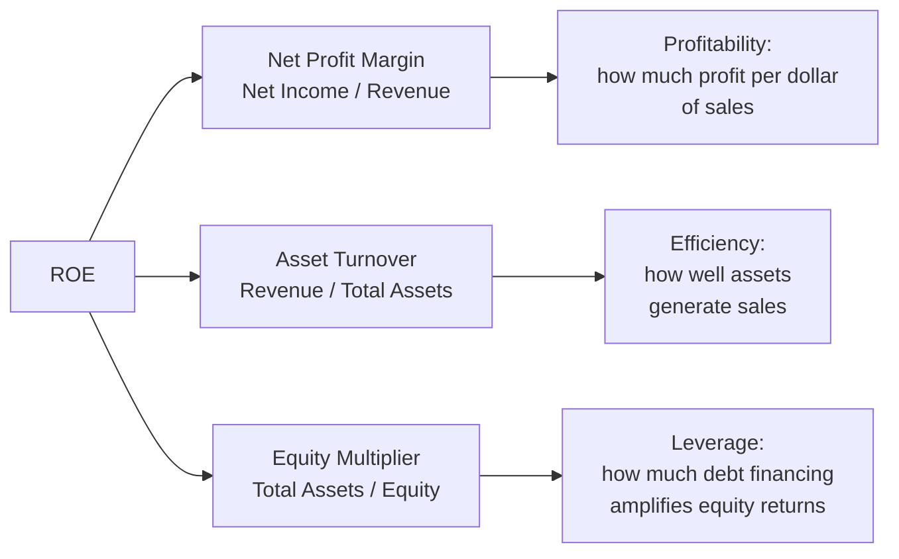

## DuPont Decomposition of Return on Equity

### Overview

The DuPont decomposition (originally developed by the DuPont Corporation in the 1920s) breaks Return on Equity (ROE) into its constituent drivers, revealing *why* a company generates the returns it does — whether through profitability, asset efficiency, or financial leverage. Rather than treating ROE as a single opaque number, the DuPont framework disaggregates it into multiplicative components that can each be analyzed and benchmarked independently.

### The Core Identity

Standard ROE is calculated as:

$$ROE = \frac{NetIncome}{ShareholdersEquity}$$

DuPont analysis restates this using algebraic identity, multiplying by Revenue and Total Assets (which cancel out) to expose intermediate drivers:

$$ROE = \frac{NetIncome}{Revenue} \times \frac{Revenue}{TotalAssets} \times \frac{TotalAssets}{Equity}$$

### 3-Factor (Classic) DuPont Model

$$ROE = \underbrace{\frac{NetIncome}{Revenue}}_{\text{Net Profit Margin}} \times \underbrace{\frac{Revenue}{TotalAssets}}_{\text{Asset Turnover}} \times \underbrace{\frac{TotalAssets}{Equity}}_{\text{Equity Multiplier}}$$

**Key Points**

- **Net Profit Margin** — measures operating and financial efficiency; how much of each revenue dollar becomes profit after all expenses, interest, and taxes
- **Asset Turnover** — measures asset utilization efficiency; how effectively assets are deployed to generate revenue
- **Equity Multiplier** — measures financial leverage; $\frac{TotalAssets}{Equity} = \frac{1}{1 - \frac{Debt}{TotalAssets}}$, so a higher multiplier means more assets are financed by debt relative to equity

### Worked Example: 3-Factor DuPont

A company reports: Revenue = $2,000,000; Net Income = $160,000; Total Assets = $1,600,000; Shareholders' Equity = $800,000.

**Step 1 — Net Profit Margin**

$$NetMargin = \frac{\$160{,}000}{\$2{,}000{,}000} = 8.0\%$$

**Step 2 — Asset Turnover**

$$AssetTurnover = \frac{\$2{,}000{,}000}{\$1{,}600{,}000} = 1.25x$$

**Step 3 — Equity Multiplier**

$$EquityMultiplier = \frac{\$1{,}600{,}000}{\$800{,}000} = 2.0x$$

**Step 4 — Combine**

$$ROE = 0.08 \times 1.25 \times 2.0 = 0.20 = 20.0\%$$

**Verification** (direct calculation):

$$ROE = \frac{\$160{,}000}{\$800{,}000} = 20.0\%$$

Both methods agree — the decomposition is an algebraic identity, not an approximation.

### 5-Factor (Extended) DuPont Model

The 5-factor model further splits Net Profit Margin into three components — Tax Burden, Interest Burden, and Operating (EBIT) Margin — providing finer diagnostic granularity, particularly useful for separating operating performance from financing and tax effects.

$$ROE = \underbrace{\frac{NetIncome}{PretaxIncome}}_{\text{Tax Burden}} \times \underbrace{\frac{PretaxIncome}{EBIT}}_{\text{Interest Burden}} \times \underbrace{\frac{EBIT}{Revenue}}_{\text{Operating Margin}} \times \underbrace{\frac{Revenue}{TotalAssets}}_{\text{Asset Turnover}} \times \underbrace{\frac{TotalAssets}{Equity}}_{\text{Equity Multiplier}}$$

**Key Points**

- **Tax Burden** $= \frac{NetIncome}{PretaxIncome}$ — the proportion of pretax income retained after taxes; equals $(1 - EffectiveTaxRate)$
- **Interest Burden** $= \frac{PretaxIncome}{EBIT}$ — the proportion of operating earnings retained after interest expense; a lower ratio indicates heavier debt servicing costs
- **Operating Margin** $= \frac{EBIT}{Revenue}$ — pure operating profitability, isolated from financing and tax effects
- This decomposition isolates capital-structure and tax-policy effects from core operating performance, which the 3-factor model bundles together inside Net Margin

### Worked Example: 5-Factor DuPont

Using the same company, with additional data: EBIT = $220,000; Interest Expense = $20,000; Pretax Income = $200,000; Tax Expense = $40,000; Net Income = $160,000.

**Tax Burden**

$$\frac{\$160{,}000}{\$200{,}000} = 0.80$$

**Interest Burden**

$$\frac{\$200{,}000}{\$220{,}000} = 0.909$$

**Operating Margin**

$$\frac{\$220{,}000}{\$2{,}000{,}000} = 0.11 = 11.0\%$$

**Asset Turnover** (unchanged) $= 1.25x$

**Equity Multiplier** (unchanged) $= 2.0x$

**Combine**

$$ROE = 0.80 \times 0.909 \times 0.11 \times 1.25 \times 2.0$$

$$ROE = 0.20 = 20.0\%$$

The result matches the 3-factor model, confirming consistency, while now revealing that the 8% Net Margin in the simpler model was itself a product of an 80% tax retention rate, a 90.9% interest retention rate, and an 11% operating margin.

### Interpreting DuPont Trends

**Key Points**

- Rising ROE driven by improving Net Margin or Asset Turnover generally reflects genuine operational improvement (higher-quality growth)
- Rising ROE driven primarily by an increasing Equity Multiplier reflects added financial leverage, not operational improvement — this raises financial risk without necessarily improving the underlying business
- A declining Interest Burden ratio (5-factor model) signals increasing debt-servicing costs eating into pretax income, often preceding credit stress
- Comparing two companies with identical ROE but different DuPont compositions (e.g., one high-margin/low-turnover retailer vs. one low-margin/high-turnover grocer) reveals fundamentally different business models achieving the same headline return

### DuPont Comparison Table (Illustrative)

| Component | Company A (High Margin) | Company B (High Leverage) |
| --- | --- | --- |
| Net Margin | 15% | 5% |
| Asset Turnover | 0.8x | 1.0x |
| Equity Multiplier | 1.67x | 4.0x |
| **ROE** | **20.0%** | **20.0%** |

Both companies report identical 20% ROE, but Company B achieves this largely through leverage rather than profitability — a materially different (and typically riskier) return profile than Company A's.

### Limitations

- DuPont decomposition relies entirely on accounting-based figures, inheriting the same limitations as the underlying financial statements (accounting policy choices, non-cash items, one-time charges)
- High Equity Multiplier values can reflect share buybacks funded by debt rather than deteriorating operational fundamentals, so leverage-driven ROE increases require further investigation before being judged negative
- The framework does not account for cost of capital — a high ROE achieved through excessive leverage may not exceed the company's cost of equity on a risk-adjusted basis
- [Inference] Because DuPont components can offset each other (e.g., falling margin masked by rising turnover), analysts typically track each component's trend separately over multiple periods rather than relying on a single-period snapshot

### Conclusion

The DuPont decomposition transforms ROE from a single summary statistic into a diagnostic tool, attributing return on equity to profitability, efficiency, and leverage (3-factor model), or further to tax burden, interest burden, operating margin, efficiency, and leverage (5-factor model). This granularity allows analysts to distinguish high-quality, operationally-driven returns from returns inflated by financial leverage, informing more rigorous comparative and risk analysis.

**Related Topics**

- Return on Invested Capital (ROIC) and its relationship to ROE
- Financial leverage and the debt-to-equity trade-off
- Weighted Average Cost of Capital (WACC) as a benchmark for ROE quality
- Operating leverage vs. financial leverage
- Sustainable growth rate modeling using ROE and retention ratio
- Peer benchmarking using DuPont component analysis