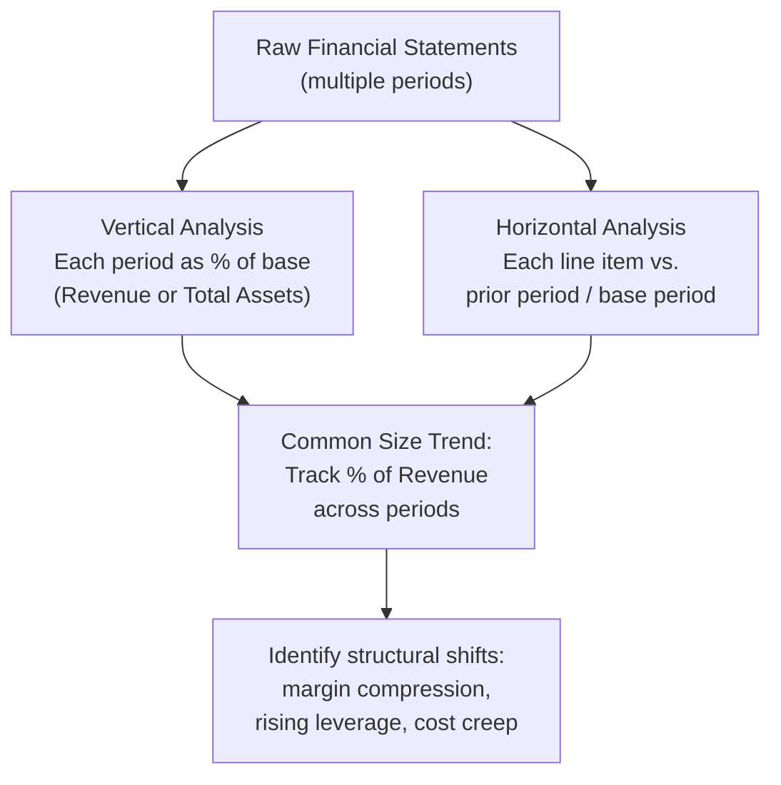

## Common Size and Trend Analysis

### Overview

Common size analysis and trend analysis are two complementary techniques for interpreting financial statements in relative, rather than absolute, terms. Common size analysis (vertical analysis) expresses each line item as a percentage of a base figure within a single period, while trend analysis (horizontal analysis) tracks how line items change over multiple periods. Together they normalize financial statements for scale and reveal directional patterns that raw dollar figures obscure.

### Common Size Analysis (Vertical Analysis)

Common size analysis converts each line item on a financial statement into a percentage of a chosen base figure, standardizing the statement regardless of company size.

**Key Points**

- On the Income Statement, the base is typically **Total Revenue** (Net Sales) — every line item is expressed as a percentage of revenue
- On the Balance Sheet, the base is typically **Total Assets** — every line item is expressed as a percentage of total assets
- Common size statements enable direct comparison between companies of vastly different scale (e.g., a $10M revenue firm vs. a $10B revenue firm)
- Also called "vertical analysis" because each period's statement is analyzed independently, moving vertically down the same column

**Common Size Income Statement Formula**

$$CommonSizeLineItem = \frac{LineItemValue}{TotalRevenue} \times 100\%$$

**Common Size Balance Sheet Formula**

$$CommonSizeLineItem = \frac{LineItemValue}{TotalAssets} \times 100\%$$

### Worked Example: Common Size Income Statement

| Line Item | Company A ($) | Company A (%) | Company B ($) | Company B (%) |
| --- | --- | --- | --- | --- |
| Revenue | 5,000,000 | 100.0% | 50,000,000 | 100.0% |
| COGS | 3,000,000 | 60.0% | 32,500,000 | 65.0% |
| Gross Profit | 2,000,000 | 40.0% | 17,500,000 | 35.0% |
| Operating Expenses | 1,200,000 | 24.0% | 10,000,000 | 20.0% |
| Operating Income (EBIT) | 800,000 | 16.0% | 7,500,000 | 15.0% |
| Interest Expense | 100,000 | 2.0% | 1,500,000 | 3.0% |
| Net Income | 525,000 | 10.5% | 4,500,000 | 9.0% |

Despite Company B being 10x larger in absolute revenue, the common size view shows Company A has a higher gross margin (40.0% vs. 35.0%) and net margin (10.5% vs. 9.0%), while Company B carries proportionally more debt (higher interest expense as % of revenue). This comparison would be far less immediately apparent from raw dollar figures alone.

### Worked Example: Common Size Balance Sheet

| Line Item | Amount ($) | % of Total Assets |
| --- | --- | --- |
| Cash | 200,000 | 10.0% |
| Accounts Receivable | 300,000 | 15.0% |
| Inventory | 400,000 | 20.0% |
| PP&E, net | 1,100,000 | 55.0% |
| **Total Assets** | **2,000,000** | **100.0%** |
| Accounts Payable | 250,000 | 12.5% |
| Long-Term Debt | 750,000 | 37.5% |
| Total Liabilities | 1,000,000 | 50.0% |
| Shareholders' Equity | 1,000,000 | 50.0% |

This view immediately shows the company's asset composition (55% tied up in fixed assets) and capital structure (50/50 split between liabilities and equity) without needing to reference absolute dollar amounts.

### Trend Analysis (Horizontal Analysis)

Trend analysis compares financial statement line items across multiple periods, expressing changes either as absolute dollar changes or as percentage changes relative to a base period.

**Key Points**

- Also called "horizontal analysis" because it moves horizontally across periods for the same line item
- Requires a consistent **base period** (often the earliest period in the dataset) against which all subsequent periods are indexed
- Reveals growth rates, seasonality, cyclicality, and inflection points that a single-period snapshot cannot show
- Commonly presented as either year-over-year (YoY) percentage change or indexed to 100 at the base period

**Period-over-Period Change Formula**

$$\%Change = \frac{CurrentPeriod - PriorPeriod}{PriorPeriod} \times 100\%$$

**Indexed Trend Formula (Base Year = 100)**

$$IndexValue_t = \frac{LineItem_t}{LineItem_{base}} \times 100$$

### Worked Example: Trend Analysis

| Year | Revenue ($) | YoY % Change | Indexed (Year 1 = 100) |
| --- | --- | --- | --- |
| Year 1 | 4,000,000 | — | 100.0 |
| Year 2 | 4,400,000 | +10.0% | 110.0 |
| Year 3 | 4,840,000 | +10.0% | 121.0 |
| Year 4 | 5,082,000 | +5.0% | 127.1 |
| Year 5 | 4,827,900 | −5.0% | 120.7 |

**Key Points**

- The consistent +10% growth in Years 2–3 followed by decelerating growth in Year 4 and outright decline in Year 5 signals a potential inflection point worth investigating (market saturation, competitive pressure, macroeconomic headwinds)
- The indexed column (base = 100) makes the cumulative effect immediately visible: despite two years of decline/deceleration, revenue is still 20.7% above the Year 1 base

### Compound Annual Growth Rate (CAGR)

A related trend metric that smooths multi-period growth into a single annualized rate:

$$CAGR = \left(\frac{EndingValue}{BeginningValue}\right)^{\frac{1}{n}} - 1$$

Where $n$ is the number of periods.

**Example**

Using the Year 1 to Year 5 data above:

$$CAGR = \left(\frac{\$4{,}827{,}900}{\$4{,}000{,}000}\right)^{\frac{1}{4}} - 1 = (1.207)^{0.25} - 1 \approx 4.8\%$$

Despite Year 5's decline, the CAGR shows an average annual growth rate of approximately 4.8% over the full period — useful for smoothing volatility but potentially masking the deceleration trend visible in the year-by-year view.

### Combining Common Size and Trend Analysis

The two techniques are often layered together — tracking a common size percentage (not just the absolute dollar figure) across multiple periods. This isolates structural shifts in cost structure or capital structure independent of overall revenue growth.

**Example**

| Year | COGS % of Revenue | Operating Exp % of Revenue | Net Margin |
| --- | --- | --- | --- |
| Year 1 | 60.0% | 22.0% | 12.0% |
| Year 2 | 61.5% | 22.5% | 10.8% |
| Year 3 | 63.0% | 23.0% | 9.5% |

Even if absolute revenue is growing, this combined view reveals steady margin compression: COGS is consuming a growing share of revenue each year, and net margin is eroding by roughly 1.0–1.3 percentage points annually — a structural trend that would be invisible from absolute dollar figures alone, since revenue growth could mask the underlying deterioration.

### Practical Applications

**Key Points**

- **Cross-company benchmarking** — common size statements allow direct comparison of cost structures and capital structures between competitors of different sizes
- **Identifying structural shifts** — combined common size + trend analysis flags gradual margin compression or expense creep before it shows up starkly in absolute net income
- **Forecasting inputs** — common size ratios (e.g., COGS as % of revenue) are frequently used as forecast drivers in financial models, holding the ratio constant or trending it based on historical patterns
- **Credit and equity analysis** — lenders and analysts use trend analysis on leverage ratios and coverage ratios to assess directional credit risk, not just point-in-time levels

### Limitations

- Common size analysis can mask absolute-dollar materiality — a small percentage-point shift in a very large revenue base may represent a large dollar swing
- Trend analysis is sensitive to the choice of base period; an unusually strong or weak base year can distort all subsequent percentage comparisons
- Neither technique adjusts for one-time or non-recurring items unless the analyst manually normalizes the underlying data first
- Comparisons across companies remain imperfect if underlying accounting policies differ (e.g., inventory costing methods, revenue recognition timing)
- [Inference] Because percentage-based metrics compress information, common size and trend analysis are generally most useful as a screening or diagnostic step, prompting further investigation into line items showing significant shifts, rather than as a standalone conclusion

### Conclusion

Common size analysis (vertical) and trend analysis (horizontal) transform absolute financial statement figures into relative, comparable metrics — the former standardizing for company size within a period, the latter revealing directional change across periods. Used together, they surface structural shifts in cost structure, margins, and capital structure that raw financial statements alone would leave hidden, making them foundational diagnostic tools in financial statement analysis.

**Related Topics**

- Financial ratio analysis (liquidity, solvency, efficiency, profitability, valuation)
- Normalizing financial statements for one-time and non-recurring items
- Forecasting techniques using common size drivers
- Peer group benchmarking and industry-relative analysis
- Compound Annual Growth Rate (CAGR) and other growth metrics
- Cost structure analysis (fixed vs. variable cost trends)