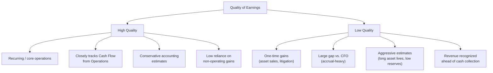

## Quality of Earnings and Accounting Adjustments

### Overview

Quality of Earnings (QoE) analysis evaluates whether reported earnings accurately reflect a company's sustainable, cash-generating operating performance, as opposed to being inflated or distorted by accounting choices, one-time items, or aggressive estimates. Accounting adjustments are the specific normalization techniques analysts apply to strip out non-recurring, non-cash, or discretionary items, arriving at an adjusted earnings figure that better represents ongoing economic reality.

### Why Quality of Earnings Matters

**Key Points**

- Reported Net Income under GAAP/IFRS reflects accrual accounting choices (timing of revenue recognition, estimates, capitalization policies) that can diverge meaningfully from underlying cash economics
- Management has discretion over certain estimates (bad debt reserves, warranty reserves, depreciation useful lives) that can be used to smooth or manage reported earnings
- QoE analysis is central to M&A due diligence, credit analysis, and equity valuation — acquirers routinely commission formal "Quality of Earnings reports" before closing a transaction
- High-quality earnings are characterized by being **recurring**, **cash-backed**, and **conservative** in the underlying estimates used to derive them

### Core Framework: High vs. Low Quality Earnings

### Key Diagnostic: Net Income vs. Cash Flow from Operations

The single most common QoE screening technique compares Net Income to Cash Flow from Operations (CFO) over time.

$$QoE\ Ratio = \frac{CFO}{NetIncome}$$

**Key Points**

- A ratio consistently near or above **1.0x** suggests earnings are well-backed by actual cash generation — generally a marker of high quality
- A ratio persistently **below 1.0x**, or declining over time, suggests earnings are increasingly driven by accruals (e.g., unbilled revenue, capitalized costs, reserve releases) rather than cash
- A single-period anomaly is less concerning than a multi-year divergence trend, which signals a structural, not cyclical, issue

**Example**

| Year | Net Income ($) | CFO ($) | QoE Ratio |
| --- | --- | --- | --- |
| Year 1 | 500,000 | 620,000 | 1.24x |
| Year 2 | 550,000 | 580,000 | 1.05x |
| Year 3 | 600,000 | 430,000 | 0.72x |

The declining QoE ratio from 1.24x to 0.72x over three years — even as Net Income continues to grow — is a red flag warranting investigation into working capital changes, revenue recognition practices, or aggressive capitalization of costs.

### Common Accounting Adjustments

Analysts typically build a "bridge" from reported Net Income (or EBITDA) to an adjusted figure by adding back or removing specific items.

**Non-Recurring / One-Time Items**

- Restructuring charges, severance costs
- Litigation settlements and legal fees
- Gains/losses on asset sales or divestitures
- Impairment and write-down charges
- Natural disaster or insurance-related losses
- Transaction costs related to M&A activity

**Non-Cash Items**

- Depreciation & Amortization (added back for EBITDA-style metrics)
- Stock-based compensation (SBC) — a genuine economic cost but non-cash; treatment is debated (see below)
- Unrealized gains/losses on investments or derivatives
- Deferred tax adjustments
- Goodwill and intangible asset impairments

**Discretionary Accounting Estimate Effects**

- Changes in depreciation useful life assumptions
- Changes in bad debt / allowance for doubtful accounts reserves
- Changes in warranty or inventory obsolescence reserves
- Revenue recognition timing changes (e.g., percentage-of-completion assumptions)

**Owner/Related-Party Adjustments** (common in private company / M&A QoE work)

- Above- or below-market owner compensation
- Personal expenses run through the business
- Related-party transactions at non-market rates

### Worked Example: EBITDA Adjustment Bridge

A common QoE deliverable in M&A due diligence is an "Adjusted EBITDA" bridge:

| Line Item | Amount ($) |
| --- | --- |
| Reported Net Income | 2,000,000 |
| (+) Interest Expense | 300,000 |
| (+) Taxes | 500,000 |
| (+) Depreciation & Amortization | 700,000 |
| **= Reported EBITDA** | **3,500,000** |
| (+) One-time litigation settlement | 250,000 |
| (+) Non-recurring restructuring charges | 180,000 |
| (−) Gain on sale of unused equipment | (120,000) |
| (+) Above-market owner compensation adjustment | 200,000 |
| **= Adjusted EBITDA** | **4,010,000** |

**Key Points**

- Each adjustment should be independently documented and justified — QoE work is scrutinized precisely because adjustments are easy to abuse in either direction (sell-side QoE reports have an incentive to inflate Adjusted EBITDA; buy-side reports have an incentive toward conservatism)
- The gap between Reported and Adjusted EBITDA ($510,000 in this example, or roughly 14.6% of reported EBITDA) should itself be scrutinized — very large adjustment gaps relative to reported figures warrant deeper diligence
- Adjustments should be **recurring-item-free** and **defensible with supporting documentation** (invoices, board minutes, contracts), not just management assertions

### Revenue Quality Red Flags

- **Channel stuffing** — shipping excess inventory to distributors near period-end to inflate reported revenue, often followed by elevated returns in the subsequent period
- **Bill-and-hold arrangements** — recognizing revenue before goods are actually delivered or shipped
- **Related-party revenue** — revenue derived from transactions with related entities, which may not reflect arm's-length economics
- **Rising Days Sales Outstanding (DSO)** — receivables growing faster than revenue can indicate loosening credit terms to pull sales forward, or difficulty collecting from customers
- **Aggressive percentage-of-completion estimates** — in long-term contract accounting, overstating project completion percentages accelerates revenue recognition ahead of actual delivery

### Expense Quality Red Flags

- **Capitalizing costs that should be expensed** — e.g., capitalizing routine maintenance or software development costs that don't meet capitalization criteria, which defers expense recognition and inflates current-period income
- **Reserve manipulation** — under-reserving for bad debts, warranties, or inventory obsolescence to boost current earnings, with the cost deferred to future periods
- **Extending useful life assumptions** — lengthening depreciation schedules reduces current period D&A expense without any change in the underlying asset's actual economic life
- **Aggressive inventory costing** — LIFO/FIFO choice and cost allocation methods can shift COGS and gross margin, particularly during inflationary periods

### The Stock-Based Compensation Debate

**Key Points**

- SBC is a real economic cost (it dilutes existing shareholders) but is a non-cash charge on the Income Statement
- Companies (particularly in technology) often present "Adjusted EBITDA" or "Non-GAAP" earnings that add back SBC entirely, which can materially overstate the comparability of earnings to peers that pay cash-based compensation instead
- [Unverified] Views differ among analysts and investors on whether SBC add-backs are appropriate; a common middle-ground approach forecasts SBC as an ongoing dilutive cost even while excluding it from cash-flow-based valuation metrics
- Best practice in rigorous QoE work is to treat SBC transparently — disclosing it as a separate line rather than silently burying it inside a blended "non-cash adjustments" bucket

### Cash Flow Statement Cross-Checks

Beyond the CFO/Net Income ratio, several Cash Flow Statement items serve as earnings-quality checks:

| Signal | What to Check | Interpretation |
| --- | --- | --- |
| Working capital changes | Are receivables/inventory growing faster than revenue? | Possible revenue quality or inventory issue |
| Capex vs. D&A | Is D&A consistently exceeding Capex over multiple years? | May signal underinvestment masking future capex needs |
| "Other" adjustments in CFO | Are unusual or growing non-cash addbacks appearing? | Warrants line-item investigation |
| Free Cash Flow vs. Net Income | Is FCF consistently below Net Income? | Possible low cash conversion / earnings quality concern |

### Quality of Earnings in M&A Due Diligence

**Key Points**

- Buy-side QoE reports (commissioned by the acquirer) typically focus on normalizing EBITDA to a sustainable run-rate, validating the target's own management-prepared adjustments, and identifying working capital normalization for purchase price mechanisms
- Sell-side QoE reports (commissioned by the seller/target pre-sale) aim to present a defensible, well-documented Adjusted EBITDA to support valuation in negotiations
- QoE findings frequently directly affect the purchase price through EBITDA multiple adjustments and working capital true-up mechanisms in the purchase agreement
- [Inference] Because QoE reports directly influence transaction economics, both buy-side and sell-side reports should be read with awareness of the commissioning party's inherent incentive, even when prepared by reputable independent accounting firms

### Conclusion

Quality of Earnings analysis moves beyond the headline Net Income figure to assess whether reported profitability is sustainable, cash-backed, and free from aggressive accounting discretion. By comparing Net Income to Cash Flow from Operations, systematically adjusting for non-recurring and non-cash items, and scrutinizing revenue and expense recognition practices, analysts arrive at a normalized earnings figure that better reflects a company's true ongoing economic performance — a discipline that is foundational to credible valuation, credit analysis, and M&A due diligence.

**Related Topics**

- Building an EBITDA adjustment bridge (Adjusted EBITDA methodology)
- Working capital normalization in M&A purchase agreements
- Revenue recognition standards (ASC 606 / IFRS 15) and their impact on earnings quality
- Free Cash Flow analysis and Cash Flow Statement linkages
- Forensic accounting and earnings manipulation detection techniques
- Non-GAAP vs. GAAP reporting and SEC disclosure requirements