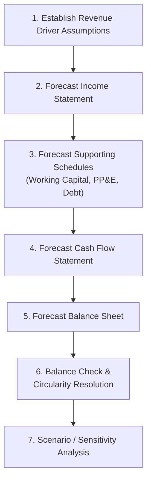

## Pro Forma Financial Statement Forecasting

### Overview

Pro forma financial statement forecasting is the process of projecting a company's future Income Statement, Balance Sheet, and Cash Flow Statement based on stated assumptions, historical trends, and operational drivers. Unlike historical financial statements, which report actual results, pro forma statements are forward-looking constructions used for budgeting, valuation, credit analysis, and scenario planning. The term "pro forma" (Latin: "as a matter of form") signals that the statements are hypothetical projections rather than audited actuals.

### Purpose and Use Cases

**Key Points**

- **Valuation** — discounted cash flow (DCF) models require projected Free Cash Flows derived from forecasted three-statement models
- **Budgeting and planning** — internal management uses pro forma statements to set targets and allocate capital
- **M&A analysis** — pro forma statements model the combined entity post-acquisition, including synergies and financing effects
- **Credit analysis** — lenders forecast debt-servicing capacity and covenant compliance under projected scenarios
- **Capital raising** — pro forma statements support investor presentations and loan applications by demonstrating projected financial capacity

### The Forecasting Framework

### Step 1: Revenue and Driver Assumptions

The starting point of any pro forma model is a defensible set of driver assumptions, typically built from historical trend analysis, management guidance, and industry benchmarks.

**Key Points**

- Revenue can be forecast top-down (applying a growth rate to prior revenue) or bottom-up (volume × price, unit economics, or segment-level build-ups)
- Common growth-rate approaches: historical CAGR extrapolation, regression against a macro driver (GDP, industry growth), or explicit management guidance
- Bottom-up approaches are generally considered more rigorous for detailed operating models, while top-down approaches are faster for high-level scenario work

**Revenue Forecast Formula (Growth Rate Method)**

$$Revenue_t = Revenue_{t-1} \times (1 + g_t)$$

**Revenue Forecast Formula (Unit Economics Method)**

$$Revenue_t = UnitVolume_t \times AverageSellingPrice_t$$

### Step 2: Forecasting the Income Statement

Most Income Statement line items below revenue are forecast as a **percentage of revenue**, using historical common-size ratios as a baseline (see common size analysis), adjusted for known changes.

| Line Item | Typical Forecasting Method |
| --- | --- |
| COGS | % of Revenue (based on historical Gross Margin trend) |
| SG&A | % of Revenue, or fixed cost + variable component |
| D&A | Driven by the PP&E/Capex schedule, not % of revenue |
| Interest Expense | Driven by the Debt schedule (average balance × rate) |
| Tax Expense | Effective tax rate × Pretax Income |

**Example**

Historical Gross Margin has averaged 42% over the past three years. Forecast Revenue for Year 1 is $10,000,000.

$$ForecastCOGS = \$10{,}000{,}000 \times (1 - 0.42) = \$5{,}800{,}000$$

$$ForecastGrossProfit = \$10{,}000{,}000 \times 0.42 = \$4{,}200{,}000$$

### Step 3: Forecasting Supporting Schedules

**Working Capital Schedule**

Working capital accounts are typically forecast using turnover ratios (Days Sales Outstanding, Days Inventory Outstanding, Days Payable Outstanding) derived from historical trend analysis, rather than as a direct percentage of revenue.

$$ForecastAR = \frac{DSO}{365} \times ForecastRevenue$$

$$ForecastInventory = \frac{DIO}{365} \times ForecastCOGS$$

$$ForecastAP = \frac{DPO}{365} \times ForecastCOGS$$

**PP&E and Depreciation Schedule**

$$PP\&E_t = PP\&E_{t-1} + Capex_t - Depreciation_t$$

Capex is often forecast as a percentage of revenue or tied to specific capacity expansion plans; depreciation follows the chosen method (straight-line being most common in forecasting) applied to the gross PP&E balance or by vintage/cohort.

**Debt Schedule**

The debt schedule forecasts scheduled principal repayments, any revolver draws/paydowns based on cash sweep mechanics, and resulting interest expense — this is the primary source of circularity in an integrated model (see Linking the Three Financial Statements).

### Step 4: Forecasting the Cash Flow Statement

Once the Income Statement and supporting schedules are built, the Cash Flow Statement is constructed using the standard indirect-method linkages:

$$CFO_t = NetIncome_t + D\&A_t - \Delta NWC_t$$

$$CFI_t = -Capex_t \pm \text{Asset Sales/Acquisitions}$$

$$CFF_t = \pm DebtIssuance/Repayment \pm EquityIssuance - Dividends$$

$$NetChangeInCash_t = CFO_t + CFI_t + CFF_t$$

### Step 5: Forecasting the Balance Sheet

Balance Sheet items roll forward from the prior period using the Cash Flow Statement and supporting schedule outputs:

- **Cash** rolls forward using the Net Change in Cash from the CFS
- **PP&E** rolls forward using the Capex/Depreciation schedule
- **Debt** rolls forward using the Debt schedule
- **Retained Earnings** rolls forward using $RE_t = RE_{t-1} + NetIncome_t - Dividends_t$
- **Working capital accounts** (AR, Inventory, AP) roll forward using the turnover-ratio-driven forecasts from Step 3

### Step 6: Balance Check and Circularity

**Key Points**

- After the full model is built, verify: $TotalAssets_t = TotalLiabilities_t + Equity_t$ in every forecast period
- A recurring imbalance typically traces to a missing linkage or sign error in one of the roll-forward schedules
- Circularity commonly arises when interest expense depends on average debt balances that themselves depend on cash flow (which depends on interest expense) — resolved via a circularity breaker switch or an average-balance convention
- Spreadsheet models often require enabling iterative calculation settings to resolve circular references, or restructuring the model to use beginning-of-period balances to break the loop entirely

### Step 7: Scenario and Sensitivity Analysis

Pro forma models are rarely built as single-point estimates; robust forecasting incorporates multiple scenarios to capture uncertainty in key assumptions.

**Common Scenario Frameworks**

- **Base / Upside / Downside cases** — varying growth rates, margins, and capital expenditure assumptions
- **Sensitivity tables** — two-way data tables showing how an output (e.g., terminal Free Cash Flow, Enterprise Value) responds to changes in two input assumptions simultaneously (e.g., revenue growth rate vs. gross margin)
- **Monte Carlo simulation** — [Unverified] more advanced practice in some contexts, randomizing multiple input assumptions simultaneously across probability distributions to generate a distribution of output outcomes, though this is less common in standard corporate finance pro forma work than in quantitative risk modeling

**Example Sensitivity Table Structure**

| Revenue Growth \ Gross Margin | 38% | 40% | 42% | 44% |
| --- | --- | --- | --- | --- |
| 5% | Low output |  |  |  |
| 8% |  | Base case |  |  |
| 12% |  |  |  | High output |

### Pro Forma in M&A Context

**Key Points**

- Pro forma combined financial statements model the merged entity as if the acquisition had already occurred, adjusting for purchase accounting effects (goodwill creation, intangible asset write-ups, elimination of intercompany transactions)
- Pro forma EPS accretion/dilution analysis compares the acquirer's standalone EPS to the pro forma combined EPS, a standard screening metric in M&A evaluation
- SEC regulations require public companies to file pro forma financial statements (Article 11 of Regulation S-X) following significant acquisitions or dispositions
- [Unverified] Specific SEC pro forma disclosure requirements and formats are subject to periodic regulatory updates; current filing requirements should be verified against the latest SEC guidance for any live transaction

### Key Assumptions Documentation

**Key Points**

- Every forecast assumption should be explicitly stated, sourced, and easy to locate (typically on a dedicated "Assumptions" tab in a spreadsheet model)
- Assumptions should distinguish between those derived from historical trends (backward-looking) and those reflecting forward-looking judgment (management guidance, market research, strategic plans)
- Sensitivity of the model's key outputs to each assumption should be understood — assumptions driving the largest output variance warrant the most rigorous support

### Common Forecasting Pitfalls

- Forecasting each Income Statement line item independently without maintaining internally consistent margin relationships
- Applying a single growth rate uniformly across all years without considering deceleration as a company scales or matures
- Failing to tie working capital forecasts to revenue/COGS growth, resulting in unrealistic cash flow projections
- Ignoring the circularity introduced by interest expense and debt paydown, leading to broken or non-balancing models
- Over-precision in far-out forecast years, presenting a false sense of accuracy for periods with inherently high uncertainty

### Conclusion

Pro forma financial statement forecasting builds a forward-looking, internally consistent set of Income Statement, Balance Sheet, and Cash Flow Statement projections by combining historical trend analysis, common-size ratios, and explicit driver assumptions. A rigorous pro forma model requires the same linkage discipline as historical statement analysis — the Balance Sheet must balance, working capital and debt schedules must tie correctly into the Cash Flow Statement — while additionally incorporating scenario analysis to capture the inherent uncertainty of any projection.

**Related Topics**

- Linking the three financial statements (mechanical integration)
- Discounted Cash Flow (DCF) valuation methodology
- Working capital forecasting using DSO/DIO/DPO drivers
- Debt schedule construction and circularity resolution techniques
- M&A accretion/dilution analysis and purchase accounting
- Scenario, sensitivity, and Monte Carlo simulation techniques in financial modeling