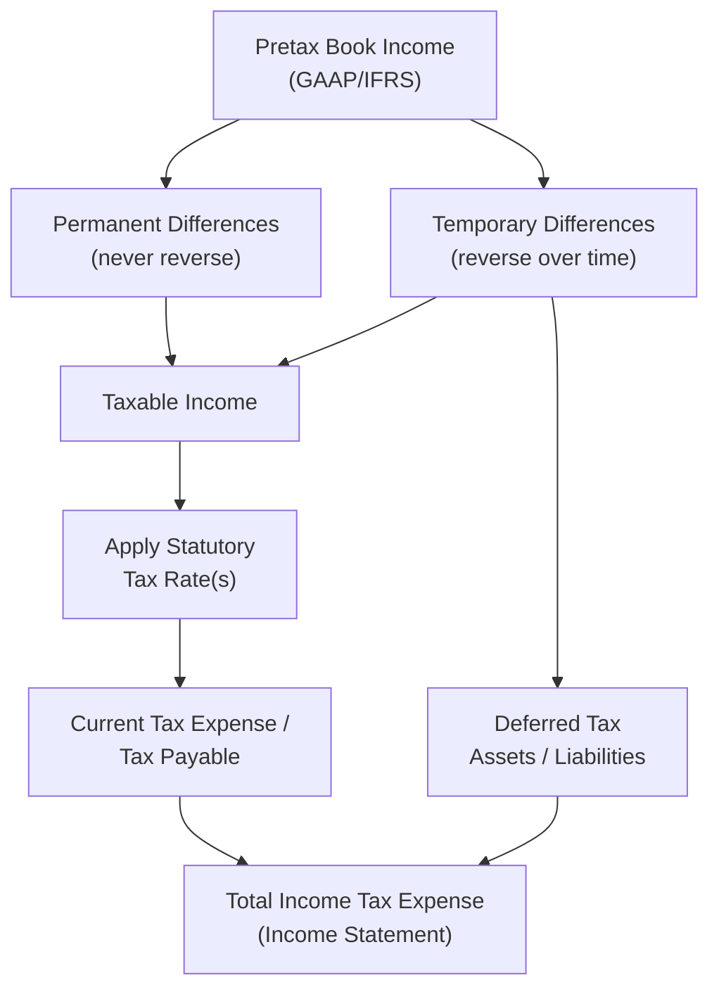

## Corporate Income Tax Fundamentals

### Overview

Corporate income tax is a levy imposed by governments on the profits earned by corporations. It directly affects a company's Net Income, cash flow, capital structure decisions, and investment returns, making it a foundational consideration in corporate financial planning. This topic covers the mechanics of computing corporate tax liability, key concepts distinguishing book income from taxable income, and how tax considerations feed into broader corporate finance decisions.

### The Corporate Tax Calculation Framework

### Book Income vs. Taxable Income

**Key Points**

- **Book income** (pretax accounting income) is calculated under GAAP or IFRS for financial reporting purposes, following accrual accounting principles
- **Taxable income** is calculated under the applicable tax code (e.g., the U.S. Internal Revenue Code) for the purpose of determining actual tax liability owed to tax authorities
- These two figures frequently diverge because accounting standards and tax law have different objectives — GAAP/IFRS aims for a fair representation of economic performance, while tax law aims for statutory revenue collection and often includes policy-driven incentives
- The divergence between book and taxable income is reconciled through **permanent differences** and **temporary differences**

### Permanent Differences

Items that create a difference between book and taxable income that will **never reverse** in future periods.

**Common Examples**

- Municipal bond interest income (often tax-exempt but included in book income)
- Fines and penalties (deductible for book purposes in some cases, but never tax-deductible)
- Life insurance proceeds on key employees (excluded from taxable income but may affect book income)
- A portion of meals and entertainment expenses that is non-deductible for tax purposes
- Certain officer compensation exceeding statutory deductibility caps

**Key Points**

- Permanent differences affect the **effective tax rate** but do not create deferred tax assets or liabilities, since they never reverse
- They represent a permanent divergence between the statutory tax rate and the company's actual effective tax rate

### Temporary Differences

Items that create a difference between book and taxable income in the current period, but which **reverse** in a future period — creating either a Deferred Tax Asset (DTA) or Deferred Tax Liability (DTL).

**Common Examples**

| Item | Book Treatment | Tax Treatment | Resulting Deferred Item |
| --- | --- | --- | --- |
| Depreciation | Straight-line (slower) | Accelerated (e.g., MACRS) | Deferred Tax Liability |
| Warranty reserves | Expensed when accrued | Deducted when paid | Deferred Tax Asset |
| Bad debt reserves | Expensed when estimated | Deducted when written off | Deferred Tax Asset |
| Net Operating Losses (NOLs) | N/A | Carried forward to offset future income | Deferred Tax Asset |
| Prepaid revenue | Deferred until earned | Taxed when received (in some jurisdictions) | Deferred Tax Liability (or Asset, depending on direction) |

**Deferred Tax Liability (DTL)** arises when a company recognizes less tax expense currently than it will owe in the future — most commonly from accelerated tax depreciation exceeding book depreciation in early asset life.

**Deferred Tax Asset (DTA)** arises when a company recognizes more tax expense currently than it will owe in the future, or has deductible amounts / loss carryforwards available to reduce future taxable income.

### Worked Example: Deferred Tax from Depreciation

A company purchases equipment for $100,000. Book depreciation uses straight-line over 5 years ($20,000/year); tax depreciation uses an accelerated method yielding $35,000 in Year 1.

**Year 1:**

- Book Depreciation: $20,000
- Tax Depreciation: $35,000
- Excess tax deduction: $15,000

At a 21% statutory tax rate:

$$DeferredTaxLiability = \$15{,}000 \times 0.21 = \$3{,}150$$

This $3,150 represents tax that has been deferred (not eliminated) — in later years, as tax depreciation falls below book depreciation, the DTL reverses and the deferred amount is paid.

### Current vs. Deferred Tax Expense

Total Income Tax Expense reported on the Income Statement consists of two components:

$$TotalTaxExpense = CurrentTaxExpense + DeferredTaxExpense$$

- **Current Tax Expense** — the actual tax liability owed to tax authorities for the current period, based on taxable income
- **Deferred Tax Expense (or Benefit)** — the change in net deferred tax assets/liabilities during the period, reflecting the future tax consequences of temporary differences

### Effective Tax Rate vs. Statutory Tax Rate

**Key Points**

- The **statutory tax rate** is the legally mandated tax rate set by the relevant tax jurisdiction (e.g., the U.S. federal corporate statutory rate)
- The **effective tax rate (ETR)** is the actual tax rate a company pays relative to its pretax book income, after accounting for permanent differences, tax credits, and jurisdictional mix

$$EffectiveTaxRate = \frac{TotalIncomeTaxExpense}{PretaxIncome}$$

- ETR commonly differs from the statutory rate due to: tax credits (R&D credits, foreign tax credits), permanent differences, differing tax rates across jurisdictions for multinational companies, and changes in valuation allowances against deferred tax assets
- Analysts frequently reconcile the statutory-to-effective tax rate gap ("tax rate reconciliation") disclosed in company financial statement footnotes to understand the drivers of a company's specific ETR

**Example**

A company has $1,000,000 pretax book income, applies a 21% statutory federal rate, but benefits from a $40,000 R&D tax credit and has $15,000 of non-deductible expenses (permanent difference):

$$TaxableIncome = \$1{,}000{,}000 + \$15{,}000 = \$1{,}015{,}000$$

$$TaxBeforeCredits = \$1{,}015{,}000 \times 0.21 = \$213{,}150$$

$$TaxAfterCredits = \$213{,}150 - \$40{,}000 = \$173{,}150$$

$$EffectiveTaxRate = \frac{\$173{,}150}{\$1{,}000{,}000} = 17.3\%$$

The effective rate of 17.3% is below the 21% statutory rate, primarily due to the R&D credit partially offset by the non-deductible expense add-back.

### Net Operating Losses (NOLs)

**Key Points**

- When a company's deductible expenses exceed taxable income in a given period, it generates a Net Operating Loss
- NOLs can generally be **carried forward** to offset taxable income in future profitable periods, reducing future tax liability
- [Unverified] Specific NOL carryforward/carryback rules, time limits, and percentage-of-income usage limitations vary significantly by jurisdiction and are subject to periodic legislative change; current rules should be verified against the applicable tax code for the relevant jurisdiction and tax year
- NOLs generate a Deferred Tax Asset, representing the future tax benefit of the loss carryforward
- A **valuation allowance** is recorded against a DTA (including NOL-based DTAs) when it is more likely than not that some or all of the deferred tax asset will not be realized — typically because the company lacks a reasonable expectation of sufficient future taxable income to utilize it

### Tax Considerations in Corporate Financial Decisions

**Key Points**

- **Capital structure** — interest expense is generally tax-deductible while dividend payments are not, creating a "tax shield" that makes debt financing relatively cheaper on an after-tax basis (see Modigliani-Miller with taxes)
- **Capital expenditure timing** — accelerated depreciation methods and tax incentives (e.g., bonus depreciation, Section 179 in the U.S. context) can influence the timing of capital investment decisions to maximize near-term tax deferral
- **M&A structuring** — asset acquisitions vs. stock acquisitions carry different tax consequences (step-up in tax basis, NOL carryforward preservation/limitation) that materially affect deal structuring and valuation
- **Multinational tax planning** — companies operating across jurisdictions must navigate transfer pricing rules, foreign tax credits, and repatriation tax consequences, which can meaningfully affect the geographic allocation of profit and investment

### Interest Tax Shield

The deductibility of interest expense creates a direct tax benefit that is central to capital structure theory:

$$InterestTaxShield = InterestExpense \times TaxRate$$

**Example**

A company has $500,000 of annual interest expense and a 21% tax rate:

$$InterestTaxShield = \$500{,}000 \times 0.21 = \$105{,}000$$

This $105,000 represents the annual reduction in tax liability attributable to the deductibility of interest expense, a key input in levered valuation frameworks such as Adjusted Present Value (APV).

### After-Tax Cash Flow Implications

**Key Points**

- Corporate finance valuation (DCF models) requires forecasting **after-tax** operating cash flows, using the effective or marginal tax rate applied to EBIT (unlevered free cash flow) or Net Income (levered free cash flow)
- Unlevered Free Cash Flow calculation: $UFCF = EBIT \times (1 - TaxRate) + D\&A - Capex - \Delta NWC$
- The choice between using the statutory rate, effective rate, or a normalized long-term marginal rate in valuation models is a judgment call that should be explicitly disclosed and justified, since it can materially affect valuation outputs

### Conclusion

Corporate income tax fundamentals require distinguishing book income from taxable income through permanent and temporary differences, understanding how deferred tax assets and liabilities arise and reverse, and recognizing the gap between statutory and effective tax rates. These mechanics extend directly into core corporate finance decisions — capital structure choices leverage the interest tax shield, capital expenditure timing responds to depreciation incentives, and valuation models depend critically on defensible after-tax cash flow assumptions.

**Related Topics**

- Deferred tax asset and liability accounting (ASC 740 / IAS 12)
- Interest tax shield and its role in capital structure theory (Modigliani-Miller with taxes)
- Net Operating Loss carryforward rules and valuation allowances
- M&A tax structuring (asset vs. stock deals, tax-free reorganizations)
- Transfer pricing and international tax planning for multinational corporations
- Unlevered vs. levered free cash flow in DCF valuation