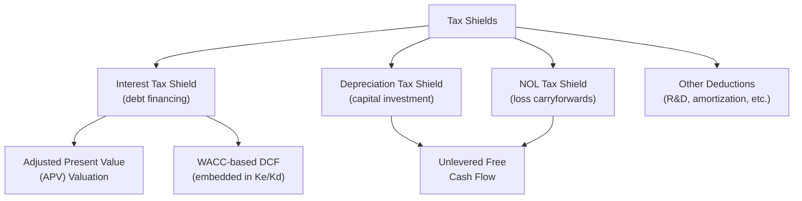
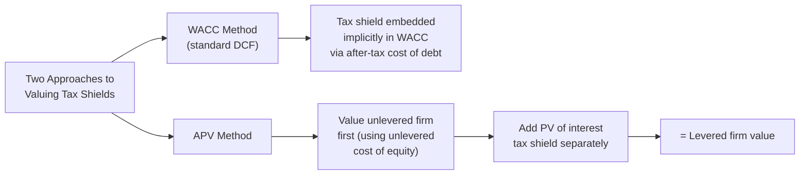

## Tax Shields and Their Effect on Valuation

### Overview

A tax shield is the reduction in taxable income — and consequently in tax liability — achieved through allowable deductions such as interest expense, depreciation, and other tax-deductible items. Because tax shields directly reduce cash taxes paid, they increase after-tax cash flow available to the firm, making them a critical input in corporate valuation, particularly in capital structure decisions and discounted cash flow analysis.

### The General Tax Shield Formula

For any deductible expense, the tax shield value is calculated as:

$$TaxShield = DeductibleExpense \times TaxRate$$

**Key Points**

- The tax shield represents cash saved, not merely an accounting adjustment — it directly increases after-tax free cash flow
- The higher the applicable tax rate, the more valuable a given dollar of deductible expense becomes
- Tax shields are a central reason why financing and investment decisions cannot be evaluated on a pretax basis alone

### Types of Tax Shields

### The Interest Tax Shield

Because interest expense is tax-deductible while dividends and equity returns are not, debt financing carries an inherent tax advantage over equity financing.

$$InterestTaxShield = InterestExpense \times TaxRate$$

**Example**

A company carries $4,000,000 of debt at a 6% interest rate, with a 21% corporate tax rate:

$$InterestExpense = \$4{,}000{,}000 \times 0.06 = \$240{,}000$$

$$InterestTaxShield = \$240{,}000 \times 0.21 = \$50{,}400$$

The company saves $50,400 in taxes annually purely due to the deductibility of interest — cash that would otherwise be paid to tax authorities if the same capital were raised through equity instead.

### Present Value of the Interest Tax Shield

Because the interest tax shield is a recurring benefit tied to the debt schedule, its value can be capitalized into a present value figure — a core concept in Modigliani-Miller's theory with taxes and in Adjusted Present Value (APV) analysis.

**Perpetuity Approach (Permanent, Constant Debt)**

If debt is assumed permanent and interest is constant, the present value of the tax shield, discounted at the cost of debt, simplifies to:

$$PV(TaxShield) = \frac{InterestExpense \times TaxRate}{K_d} = \frac{(D \times K_d) \times T_c}{K_d} = D \times T_c$$

Where $D$ is the amount of debt and $T_c$ is the corporate tax rate.

**Key Points**

- Under this simplified perpetuity assumption, the present value of the interest tax shield equals the debt amount multiplied by the tax rate — a clean, widely cited result from Modigliani-Miller's Proposition I with corporate taxes
- This is the basis for the Modigliani-Miller conclusion that firm value increases with leverage (in a world with taxes but no bankruptcy costs): $V_L = V_U + T_c \times D$
- [Unverified] The pure perpetuity formula assumes constant, permanent debt levels; in practice, most companies target a leverage ratio rather than a fixed debt amount, which changes the appropriate discount rate and formula for the tax shield's present value — this is a long-standing area of debate in corporate finance theory (see Miles-Ezzell and Harris-Pringle alternative formulations)

**Example**

A company carries $4,000,000 of permanent debt with a 21% tax rate:

$$PV(TaxShield) = \$4{,}000{,}000 \times 0.21 = \$840{,}000$$

This $840,000 represents the value added to the firm purely from the tax deductibility of debt financing, under the simplifying assumption of permanent leverage.

### Modigliani-Miller Firm Value Formula (With Taxes)

$$V_{Levered} = V_{Unlevered} + (T_c \times D)$$

Where:

- $V_{Levered}$ = value of the firm with debt in its capital structure
- $V_{Unlevered}$ = value of the identical firm financed entirely with equity
- $T_c \times D$ = present value of the interest tax shield

**Key Points**

- This formula implies that, absent other frictions, firm value rises monotonically with leverage due to the tax shield — a theoretical result later qualified by the trade-off theory, which balances the tax shield benefit against rising expected costs of financial distress and bankruptcy at high leverage levels
- The theoretical implication that firms should be financed almost entirely with debt is not observed in practice, which is precisely why financial distress costs, agency costs, and other real-world frictions are incorporated into extended capital structure models

### The Depreciation Tax Shield

Depreciation is a non-cash expense, but because it is tax-deductible, it generates a real cash tax saving each period.

$$DepreciationTaxShield = DepreciationExpense \times TaxRate$$

**Example**

A company has $300,000 in annual tax depreciation and a 21% tax rate:

$$DepreciationTaxShield = \$300{,}000 \times 0.21 = \$63{,}000$$

**Key Points**

- Accelerated depreciation methods (e.g., MACRS in the U.S. tax context) front-load deductions into earlier years, increasing the present value of the depreciation tax shield relative to straight-line depreciation, since a dollar of tax savings received sooner is worth more than the same dollar received later
- This is a key reason capital-intensive companies and capital budgeting analysis explicitly model the depreciation tax shield as a distinct cash flow line item, separate from the underlying capital expenditure outflow
- Bonus depreciation and Section 179-style immediate expensing provisions (where applicable under the relevant tax code) maximize the present value of the depreciation tax shield by allowing full deduction in the year of purchase

### Depreciation Tax Shield in Capital Budgeting

In a capital budgeting context (e.g., NPV analysis of a new equipment purchase), the depreciation tax shield is typically incorporated directly into the after-tax operating cash flow calculation:

$$AfterTaxCF = (Revenue - CashExpenses) \times (1 - T_c) + (Depreciation \times T_c)$$

This formulation isolates the "depreciation tax shield" as its own additive term, making its contribution to project value explicit and separately analyzable.

**Example**

A project generates $500,000 in annual pretax operating cash flow (before depreciation) and has $100,000 in annual depreciation, with a 25% tax rate:

$$AfterTaxCF = \$500{,}000 \times (1 - 0.25) + (\$100{,}000 \times 0.25)$$

$$AfterTaxCF = \$375{,}000 + \$25{,}000 = \$400{,}000$$

The $25,000 depreciation tax shield increases after-tax cash flow above what pure pretax cash flow times $(1-T_c)$ alone would suggest.

### Tax Shields in DCF Valuation: WACC Method vs. APV Method

**WACC-Based DCF**

$$WACC = \left(\frac{E}{V}\right) \times K_e + \left(\frac{D}{V}\right) \times K_d \times (1 - T_c)$$

The term $(1 - T_c)$ applied to the cost of debt embeds the interest tax shield implicitly within the discount rate itself, rather than as a separate cash flow adjustment. Unlevered Free Cash Flow is then discounted at this tax-adjusted WACC.

**Adjusted Present Value (APV) Method**

$$APV = V_{Unlevered} + PV(TaxShield) - PV(FinancialDistressCosts)$$

APV separates the valuation into two explicit components: (1) the value of the firm as if entirely equity-financed, discounted at the unlevered cost of equity, and (2) the present value of financing side effects (primarily the interest tax shield, net of any expected distress costs), calculated separately.

**Key Points**

- The WACC method is more commonly used in practice for companies with a stable, targeted capital structure, since the tax shield is baked into a single discount rate
- The APV method is generally preferred for companies with **changing leverage over time** (e.g., leveraged buyouts with scheduled debt paydown), since it isolates the tax shield's value explicitly and allows it to be discounted period-by-period as debt balances change
- [Inference] Because LBO capital structures deliberately delever over the holding period, APV is frequently favored in private equity valuation contexts specifically because the WACC method's assumption of a constant capital structure poorly fits a rapidly changing debt schedule

### Net Operating Loss (NOL) Tax Shields

Loss carryforwards generate a tax shield in future profitable periods by offsetting otherwise-taxable income.

$$NOLTaxShield_t = \min(NOLBalance, TaxableIncome_t) \times T_c$$

**Key Points**

- NOL tax shields are particularly significant in M&A valuation of distressed or early-stage companies with accumulated historical losses
- [Unverified] The ability to fully utilize acquired NOLs post-transaction is often subject to statutory limitations tied to a change in ownership control, and specific limitation rules vary by jurisdiction — this should be verified against current applicable tax law for any specific transaction
- NOL tax shields are typically modeled as a declining balance, consumed against projected future taxable income until exhausted

### The Trade-Off Theory: Balancing Tax Shields Against Distress Costs

**Key Points**

- Pure Modigliani-Miller (with taxes) implies value rises continuously with leverage, which is not observed empirically
- The trade-off theory reconciles this by weighing the marginal tax shield benefit of additional debt against the marginal expected cost of financial distress (direct bankruptcy costs and indirect costs like lost customer/supplier confidence, key employee attrition, and underinvestment)
- This produces an implied "optimal" capital structure at the point where the marginal tax benefit of additional debt equals the marginal expected distress cost
- [Inference] In practice, most companies target a leverage range rather than a single optimal point, reflecting uncertainty in precisely quantifying distress costs and the tax shield's marginal value at different leverage levels

### Conclusion

Tax shields — primarily arising from interest expense, depreciation, and net operating loss carryforwards — represent real, quantifiable reductions in cash taxes paid that directly increase after-tax free cash flow and firm value. Their treatment differs by valuation methodology: WACC-based DCF embeds the interest tax shield implicitly within the discount rate, while APV isolates and values it explicitly, a distinction that becomes especially important when analyzing companies with changing capital structures, such as leveraged buyouts. Understanding tax shield mechanics is foundational to both capital structure theory and rigorous corporate valuation practice.

**Related Topics**

- Modigliani-Miller Propositions I and II (with and without taxes)
- Trade-off theory of capital structure and optimal leverage
- Adjusted Present Value (APV) vs. WACC-based DCF valuation
- Weighted Average Cost of Capital (WACC) calculation and components
- Leveraged buyout (LBO) modeling and debt paydown schedules
- Net Operating Loss carryforward limitations in M&A transactions