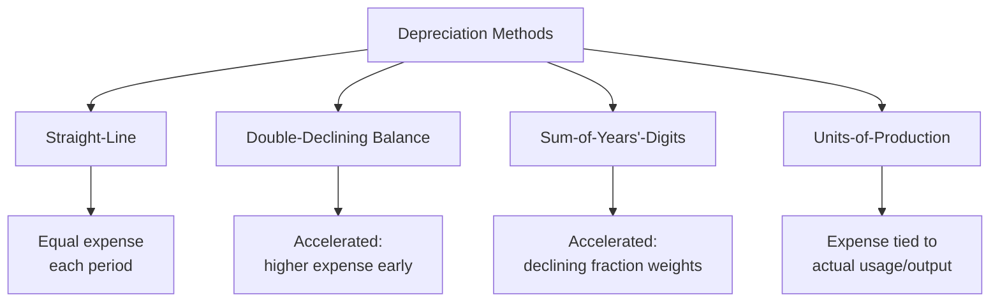
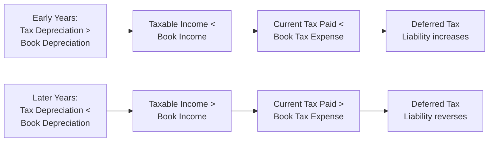

## Depreciation Methods and Tax Implications

### Overview

Depreciation is the systematic allocation of a tangible asset's cost over its useful life, reflecting the consumption of the asset's economic value over time. Different depreciation methods produce materially different patterns of expense recognition, which in turn affect reported Net Income, Book Value, and — critically — the timing of tax deductions and resulting cash tax liability. Because book depreciation (for financial reporting) and tax depreciation (for tax filing purposes) frequently use different methods, the divergence between the two creates temporary differences and deferred tax effects.

### Core Depreciation Concepts

**Key Points**

- **Depreciable Base** = Asset Cost − Salvage Value (the estimated residual value at the end of useful life)
- **Useful Life** = the estimated period over which the asset will generate economic benefit, used for book depreciation
- **Book Depreciation** follows GAAP/IFRS for financial statement reporting, generally favoring methods that best match expense to the pattern of economic benefit consumption
- **Tax Depreciation** follows the applicable tax code, which often prescribes specific accelerated methods and standardized recovery periods independent of the asset's actual economic useful life, as a matter of tax policy (to incentivize investment)

### Common Book Depreciation Methods

**Straight-Line Depreciation**

The simplest and most common method for financial reporting, allocating an equal expense amount each period.

$$AnnualDepreciation = \frac{Cost - SalvageValue}{UsefulLife}$$

**Example**

Equipment costs $120,000, has a $20,000 salvage value, and a 5-year useful life:

$$AnnualDepreciation = \frac{\$120{,}000 - \$20{,}000}{5} = \$20{,}000\ per\ year$$

**Double-Declining Balance (DDB)**

An accelerated method that applies a constant rate (double the straight-line rate) to the asset's declining net book value each period, ignoring salvage value until the final adjustment.

$$DDBRate = \frac{2}{UsefulLife}$$

$$AnnualDepreciation_t = DDBRate \times NetBookValue_{t-1}$$

**Example**

Same equipment ($120,000 cost, 5-year life). DDB Rate = $\frac{2}{5} = 40\%$

| Year | Beginning NBV | Depreciation (40% × Beg. NBV) | Ending NBV |
| --- | --- | --- | --- |
| 1 | $120,000 | $48,000 | $72,000 |
| 2 | $72,000 | $28,800 | $43,200 |
| 3 | $43,200 | $17,280 | $25,920 |
| 4 | $25,920 | $5,920* | $20,000 |
| 5 | $20,000 | $0 | $20,000 |

*Depreciation in Year 4 is capped so Net Book Value does not fall below the $20,000 salvage value; the standard DDB calculation is typically switched to straight-line for remaining periods once it would otherwise depreciate below salvage value.

**Sum-of-Years'-Digits (SYD)**

Another accelerated method using a declining fraction based on the sum of the years' digits.

$$SYD = \frac{n(n+1)}{2}$$

$$AnnualDepreciation_t = \frac{RemainingLife_t}{SYD} \times (Cost - SalvageValue)$$

**Example**

Same equipment, 5-year life: $SYD = \frac{5 \times 6}{2} = 15$

Year 1 fraction $= \frac{5}{15}$; Year 1 Depreciation $= \frac{5}{15} \times \$100{,}000 = \$33{,}333$

**Units-of-Production**

Ties depreciation expense directly to actual usage or output rather than the passage of time — most appropriate for assets whose wear is usage-driven (e.g., manufacturing equipment, vehicles).

$$DepreciationPerUnit = \frac{Cost - SalvageValue}{TotalEstimatedUnits}$$

$$AnnualDepreciation = DepreciationPerUnit \times UnitsProducedInPeriod$$

### Comparing Accelerated vs. Straight-Line Patterns

| Year | Straight-Line | Double-Declining Balance | SYD |
| --- | --- | --- | --- |
| 1 | $20,000 | $48,000 | $33,333 |
| 2 | $20,000 | $28,800 | $26,667 |
| 3 | $20,000 | $17,280 | $20,000 |
| 4 | $20,000 | $5,920 | $13,333 |
| 5 | $20,000 | $0 | $6,667 |
| **Total** | **$100,000** | **$100,000** | **$100,000** |

**Key Points**

- All methods depreciate the same total depreciable base ($100,000) over the asset's life — they differ only in the **timing** of expense recognition, not the total amount
- Accelerated methods (DDB, SYD) front-load expense, reducing Net Income and Book Value more heavily in early years and less heavily in later years, relative to straight-line

### Tax Depreciation: MACRS (U.S. Context)

In the United States, tax depreciation for most tangible property is computed under the Modified Accelerated Cost Recovery System (MACRS), which is distinct from any book depreciation method the company uses for financial reporting.

**Key Points**

- MACRS assigns assets to standardized **property classes** (e.g., 5-year property, 7-year property, 15-year property) based on IRS-defined asset categories, independent of the company's own estimate of economic useful life
- MACRS applies prescribed depreciation percentage tables (generally using a declining-balance method switching to straight-line) rather than requiring the company to calculate rates manually
- Salvage value is **not** subtracted from the depreciable base under MACRS — the full asset cost (subject to any applicable limitations) is depreciated
- [Unverified] Specific MACRS class lives, applicable percentage tables, and any bonus depreciation or Section 179 immediate-expensing thresholds are subject to periodic legislative change; current-year rules should be verified against the applicable IRS guidance for the relevant tax year, as these figures are frequently adjusted through tax legislation
- [Unverified] Similar accelerated tax depreciation regimes with jurisdiction-specific rules exist outside the U.S. (e.g., capital allowances in the UK, various systems across IFRS jurisdictions); tax depreciation rules are not internationally standardized and must be evaluated against the applicable local tax code

### Bonus Depreciation and Immediate Expensing

**Key Points**

- Many tax codes include provisions allowing full or partial immediate expensing of qualifying capital expenditures in the year of purchase, rather than depreciating over the standard recovery period
- These provisions (e.g., "bonus depreciation" and Section 179 expensing in the U.S. context) are policy tools intended to incentivize capital investment by accelerating the associated tax benefit
- [Unverified] Bonus depreciation percentages and Section 179 expensing limits have changed frequently through U.S. tax legislation in recent years and should be verified against current law for any specific tax year before being applied in analysis
- Immediate expensing maximizes the present value of the depreciation tax shield, since the full tax benefit is realized in year one rather than spread over multiple future years

### Book-Tax Depreciation Divergence and Deferred Taxes

Because tax depreciation (often MACRS, accelerated) frequently exceeds book depreciation (often straight-line) in early asset years, a temporary difference arises, generating a Deferred Tax Liability.

**Example**

Using the earlier example: Year 1 book (straight-line) depreciation is $20,000; Year 1 tax (DDB-style) depreciation is $48,000. Tax rate is 21%.

$$ExcessTaxDeduction = \$48{,}000 - \$20{,}000 = \$28{,}000$$

$$DeferredTaxLiability_{Year1} = \$28{,}000 \times 0.21 = \$5{,}880$$

This $5,880 is not tax avoided — it is tax **deferred**. As the asset ages and tax depreciation falls below book depreciation (typically after the crossover point where the accelerated method's declining rate falls below straight-line), the DTL begins reversing, with the deferred amount eventually paid in later years.

### Why Companies Use Different Methods for Book vs. Tax

**Key Points**

- **Book reporting objective**: present a fair, consistent representation of the asset's consumption pattern for investors and creditors, generally favoring straight-line for its simplicity and smooth income statement impact
- **Tax reporting objective**: minimize the present value of tax paid by accelerating deductions as early as legally permitted, taking full advantage of the time value of money — a dollar of tax deferred to a future year is less costly in present-value terms than a dollar paid today
- This dual-method approach is entirely legal and standard practice — it is not tax avoidance in an improper sense, but rather the intended function of accelerated tax depreciation incentives written into tax law specifically to encourage capital investment
- Maintaining separate book and tax depreciation schedules (and reconciling them through deferred tax accounting) is standard practice in corporate tax and financial reporting functions

### Depreciation's Role in Cash Flow and Valuation

**Key Points**

- Depreciation is a non-cash expense on the Income Statement but directly drives a real cash tax saving (the depreciation tax shield) — see Tax Shields and Their Effect on Valuation
- In the Cash Flow Statement, book depreciation is added back to Net Income in the CFO section since it reduced Net Income without consuming cash
- In DCF and capital budgeting analysis, the **tax depreciation schedule** (not book depreciation) is the relevant figure for computing actual cash tax savings, since it determines the company's real tax liability
- Analysts building detailed models sometimes must reconcile or approximate the tax depreciation schedule separately from the book depreciation schedule used for GAAP/IFRS reporting, particularly for capital-intensive companies where the book-tax gap is material

### Impairment vs. Depreciation

**Key Points**

- Depreciation is a systematic, planned allocation of cost over useful life; impairment is an unplanned, event-driven write-down when an asset's carrying value exceeds its recoverable amount
- Impairment charges are generally non-deductible for tax purposes until the loss is actually realized (e.g., through sale or disposal), creating a further temporary book-tax difference distinct from ordinary depreciation timing differences
- [Unverified] Specific impairment testing triggers and tax treatment of impairment losses vary by accounting standard (ASC 360 under U.S. GAAP vs. IAS 36 under IFRS) and by jurisdiction's tax code

### Conclusion

Depreciation methods determine not just the timing of expense recognition on the Income Statement, but — through the divergence between book depreciation (GAAP/IFRS, typically straight-line) and tax depreciation (statutory systems like MACRS, typically accelerated) — the timing of actual cash tax payments. This book-tax gap generates deferred tax liabilities that reverse over an asset's life, while the acceleration of tax deductions maximizes the present value of the depreciation tax shield, making depreciation method selection a genuinely consequential decision in tax planning, cash flow forecasting, and capital budgeting analysis.

**Related Topics**

- Tax shields and their effect on valuation (depreciation tax shield mechanics)
- Deferred tax asset and liability accounting (ASC 740 / IAS 12)
- Capital budgeting and NPV analysis incorporating after-tax cash flows
- Asset impairment testing and accounting treatment
- Bonus depreciation and Section 179 expensing provisions
- Capital expenditure planning and PP&E roll-forward schedules