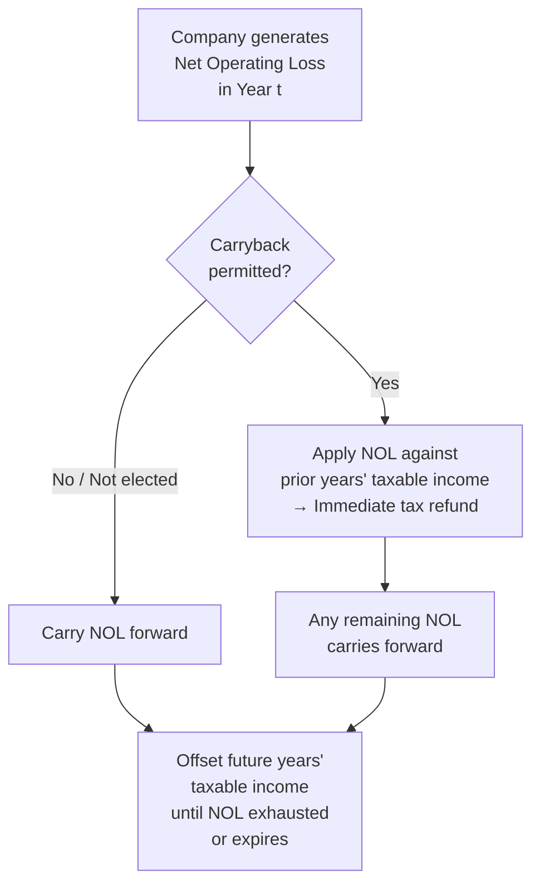
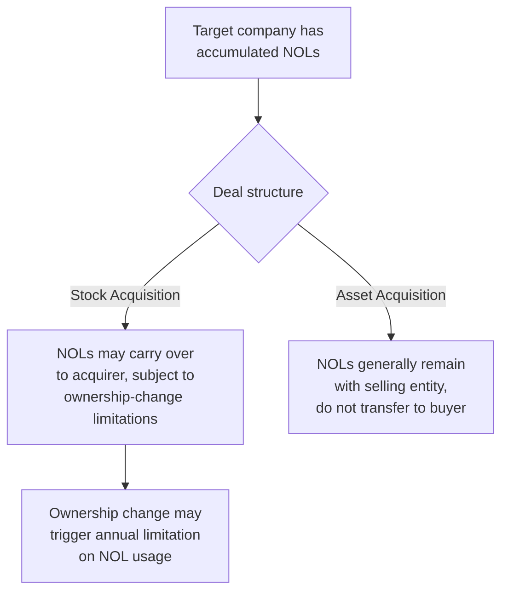

## Net Operating Losses and Tax Loss Carryforwards

### Overview

A Net Operating Loss (NOL) arises when a company's tax-deductible expenses exceed its taxable income in a given period, resulting in negative taxable income. Rather than allowing this loss to simply disappear, most tax codes permit companies to carry the loss forward (and in some cases backward) to offset taxable income in other periods, reducing tax liability in those years. NOLs are a significant consideration in tax planning, deferred tax accounting, and M&A valuation, particularly for early-stage, cyclical, or distressed companies.

### How an NOL Arises

$$NOL = TaxDeductibleExpenses - TaxableRevenue$$

When this figure is negative (i.e., deductible expenses exceed taxable revenue), the company has generated a Net Operating Loss for that tax year.

**Key Points**

- An NOL is a **tax concept**, computed under the applicable tax code, and does not necessarily equal a book (GAAP/IFRS) net loss for the same period, due to permanent and temporary book-tax differences
- Common drivers of NOLs include startup/early-stage losses before revenue scales, cyclical downturns in capital-intensive industries, large one-time deductions (e.g., accelerated depreciation, restructuring charges), and economic distress
- NOLs represent a genuine future economic benefit — the ability to reduce cash taxes owed in future profitable years — and are therefore recognized as a **Deferred Tax Asset (DTA)** on the Balance Sheet

### Carryforward and Carryback Mechanics

**Key Points**

- **Carryback**: applying the current year's loss against taxable income from prior years, generating an immediate cash tax refund for taxes previously paid
- **Carryforward**: applying the current year's loss against taxable income in future years, reducing future tax liability
- [Unverified] The availability of carryback treatment, the number of carryback/carryforward years permitted, and any percentage-of-income limitations on NOL usage in a given year vary significantly by jurisdiction and have changed materially over time through tax legislation (for example, U.S. federal NOL rules have been revised multiple times in recent decades); current rules must be verified against the applicable tax code for the relevant jurisdiction and tax year before being applied in any specific analysis
- Carryback treatment, where permitted, is generally more valuable on a present-value basis than carryforward treatment alone, since it generates an immediate cash refund rather than a benefit realized only in a future (uncertain) profitable period

### NOL as a Deferred Tax Asset

An NOL carryforward is recognized on the Balance Sheet as a Deferred Tax Asset, representing the present value of future tax savings the NOL is expected to generate.

$$NOL\ DTA = NOLBalance \times ApplicableTaxRate$$

**Example**

A company has accumulated $2,000,000 in NOL carryforwards and faces a 21% statutory tax rate:

$$NOL\ DTA = \$2{,}000{,}000 \times 0.21 = \$420{,}000$$

This $420,000 Deferred Tax Asset represents the total future tax savings the company expects to realize as it applies the NOL against future taxable income.

### Utilizing an NOL Against Future Taxable Income

$$NOLUsed_t = \min(NOLBalance_{t-1}, \ TaxableIncome_t \times UsageLimitation)$$

$$RemainingNOL_t = NOLBalance_{t-1} - NOLUsed_t$$

**Example**

A company has a $2,000,000 NOL carryforward balance entering Year 1. It generates $800,000 of taxable income in Year 1 (assume no percentage-of-income usage limitation applies for simplicity).

**Year 1:**

$$NOLUsed = \min(\$2{,}000{,}000, \$800{,}000) = \$800{,}000$$

$$TaxSavings = \$800{,}000 \times 0.21 = \$168{,}000$$

$$RemainingNOL = \$2{,}000{,}000 - \$800{,}000 = \$1{,}200{,}000$$

Without the NOL, the company would have owed $168,000 in tax on its $800,000 of taxable income; with the NOL applied, its cash tax liability for Year 1 is reduced to zero (assuming no other limitations).

### Percentage-of-Income Usage Limitations

**Key Points**

- Many tax codes limit the amount of NOL that can be used to offset taxable income in any single year to a percentage of that year's taxable income (rather than allowing 100% offset), particularly for NOLs generated after certain legislative changes
- [Unverified] The specific percentage limitation (where one applies), and whether it differs based on the vintage of the NOL (i.e., the year the loss was originally generated), are jurisdiction- and legislation-specific and should be verified against current applicable tax law
- Where such a limitation applies, a company with a large NOL balance may still owe some cash tax in a profitable year, even with substantial unused NOLs remaining, because only a capped percentage of that year's taxable income can be offset

### Valuation Allowance Against NOL Deferred Tax Assets

**Key Points**

- Accounting standards require companies to assess whether it is "more likely than not" that a deferred tax asset — including NOL-based DTAs — will actually be realized through future taxable income
- If realization is not more likely than not, a **valuation allowance** must be recorded, reducing the net carrying value of the DTA on the Balance Sheet
- Companies with a history of losses, no clear path to sustained profitability, or NOLs nearing expiration are more likely to require a full or partial valuation allowance
- Recording (or releasing) a valuation allowance flows through the Income Statement as an increase (or decrease) in tax expense, and can cause significant volatility in reported Net Income in periods where a company's profitability outlook materially changes

**Example**

A company has a $420,000 NOL-based DTA but management assesses that only 60% is more likely than not to be realized, based on projected future taxable income:

$$ValuationAllowance = \$420{,}000 \times (1 - 0.60) = \$168{,}000$$

$$NetDTA = \$420{,}000 - \$168{,}000 = \$252{,}000$$

### NOLs in M&A Transactions

**Key Points**

- Acquired NOLs represent potential value in an acquisition (future tax savings), but are frequently subject to statutory limitations triggered by a change in ownership control
- [Unverified] In the U.S. context, Section 382 of the Internal Revenue Code limits the annual usage of acquired NOLs following an ownership change exceeding specified thresholds, based on a formula involving the target's value at the time of the ownership change and a specified long-term tax-exempt rate; equivalent or analogous limitation regimes exist in other jurisdictions with their own specific rules — current applicable limitation rules should be verified for any specific transaction
- Deal structure (stock acquisition vs. asset acquisition) generally determines whether NOLs transfer to the acquirer at all, making this a material consideration in structuring and valuing acquisitions of loss-making targets
- NOL value in M&A is typically modeled as a capped, declining-balance benefit stream, reflecting both the ownership-change limitation and the time value of eventually realizing the tax savings

### NOLs and Enterprise Value Considerations

**Key Points**

- When valuing a company with significant NOL carryforwards, analysts often separately value the NOL's expected future tax shield and add it to the value derived from core operating cash flows, rather than assuming the NOL simply reduces the effective tax rate uniformly across the entire projection period
- This is particularly relevant in DCF valuation of companies emerging from a loss-making period, where near-term projected periods may show a 0% or reduced effective cash tax rate due to NOL utilization, before reverting to the full statutory/effective rate once the NOL balance is exhausted
- [Inference] Because NOL utilization affects near-term cash tax outflows directly, explicitly modeling the NOL balance and its year-by-year depletion (rather than applying a blended average tax rate across the full forecast period) generally produces a more accurate valuation for companies with a material NOL carryforward balance

### Worked Example: NOL Depletion Schedule in a Forecast

| Year | Beginning NOL | Taxable Income | NOL Used | Ending NOL | Cash Tax Paid |
| --- | --- | --- | --- | --- | --- |
| 1 | $1,000,000 | $400,000 | $400,000 | $600,000 | $0 |
| 2 | $600,000 | $500,000 | $500,000 | $100,000 | $0 |
| 3 | $100,000 | $600,000 | $100,000 | $0 | $105,000* |

*Year 3: only $100,000 of the $600,000 taxable income can be offset by the remaining NOL; the remaining $500,000 is taxed at the 21% rate: $\$500{,}000 \times 0.21 = \$105{,}000$

**Key Points**

- This schedule illustrates why cash taxes paid can be $0 in early profitable years despite positive taxable income, then jump sharply once the NOL balance is exhausted — a pattern that materially affects near-term free cash flow projections and should be explicitly modeled rather than smoothed with an average tax rate

### Conclusion

Net Operating Losses convert a period of negative taxable income into a genuine future economic asset — the ability to reduce cash taxes owed in profitable future periods through carryforward (and, where permitted, carryback) provisions. NOLs are recognized as Deferred Tax Assets, subject to valuation allowance assessment based on the likelihood of realization, and require careful, often capped and schedule-explicit modeling in both financial forecasting and M&A valuation, particularly given the ownership-change limitations frequently triggered in acquisition transactions.

**Related Topics**

- Deferred tax asset and liability accounting (ASC 740 / IAS 12)
- Tax shields and their effect on valuation
- Corporate income tax fundamentals (permanent vs. temporary differences)
- M&A tax structuring (asset vs. stock acquisitions)
- Valuation allowance assessment methodology
- DCF modeling with explicit NOL depletion schedules