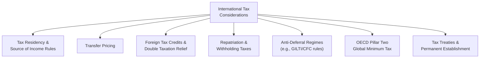
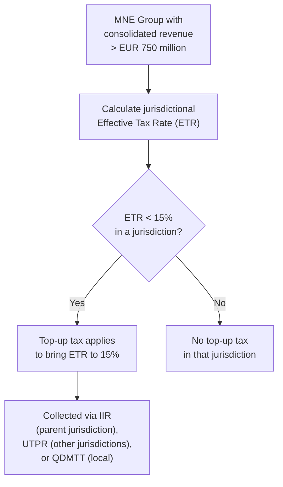

## International Tax Considerations for Corporations

### Overview

International tax considerations arise whenever a corporation earns income, holds assets, or conducts operations across more than one tax jurisdiction. Multinational enterprises (MNEs) must navigate overlapping and sometimes conflicting tax rules governing where profit is taxed, how cross-border transactions between related entities are priced, how foreign taxes already paid are credited against domestic tax liability, and — increasingly — a coordinated global minimum tax regime. These considerations materially affect effective tax rate, cash flow planning, deal structuring, and corporate valuation.

### Core Framework of International Tax Issues

### Tax Residency and Source of Income

**Key Points**

- Corporate tax residency rules determine which jurisdiction has primary taxing rights over a company's worldwide income — commonly based on place of incorporation, place of effective management, or a combination of both, depending on the jurisdiction
- **Source-of-income rules** determine which jurisdiction can tax income earned from cross-border activity, even for a non-resident entity — typically based on where the income-generating activity or asset is located
- Most countries apply either a **worldwide taxation system** (taxing resident corporations on global income, generally with relief mechanisms for double taxation) or a **territorial system** (taxing only domestic-source income), and the specific system materially shapes a multinational's tax planning approach
- [Unverified] The precise residency and source rules, and which system (worldwide vs. territorial, or a hybrid) a given country applies, are jurisdiction-specific and subject to legislative change; current rules should be verified for any specific country before being relied upon

### Permanent Establishment and Tax Treaties

**Key Points**

- A **Permanent Establishment (PE)** is a threshold concept — generally a fixed place of business, or in some cases a dependent agent conducting business — that triggers a taxing right for the jurisdiction where the PE is located, even absent formal local incorporation
- Bilateral tax treaties (often based on the OECD or UN Model Tax Convention) define PE thresholds, allocate taxing rights between treaty partner countries, and typically reduce withholding tax rates on cross-border payments (dividends, interest, royalties) between treaty jurisdictions relative to statutory domestic rates
- Treaty networks are a key input in structuring cross-border financing and licensing arrangements, since routing payments through a treaty-favorable jurisdiction can reduce withholding tax leakage
- [Unverified] PE thresholds and treaty-reduced withholding rates vary by specific treaty and are subject to renegotiation; applicable treaty terms should be verified for the specific pair of jurisdictions involved in any transaction

### Transfer Pricing

Transfer pricing governs how prices are set for transactions between related entities within the same corporate group operating across different tax jurisdictions (e.g., a parent company selling inventory to a foreign subsidiary, or licensing intellectual property to an affiliate).

**Key Points**

- The internationally accepted standard is the **arm's-length principle** — related-party transactions should be priced as if the parties were unrelated, independent entities negotiating under comparable market conditions
- Common transfer pricing methods include the Comparable Uncontrolled Price (CUP) method, Resale Price Method, Cost-Plus Method, Transactional Net Margin Method (TNMM), and Profit Split Method — the appropriate method depends on the nature of the transaction and availability of comparable market data
- Transfer pricing directly affects where profit is recognized across jurisdictions, and therefore where tax is ultimately paid — making it one of the most heavily scrutinized areas of international tax enforcement and a frequent source of cross-border tax disputes
- Tax authorities in most major jurisdictions require contemporaneous transfer pricing documentation justifying the arm's-length nature of related-party pricing, with significant penalties for non-compliance
- [Unverified] Specific documentation thresholds, penalty regimes, and country-by-country reporting requirements vary by jurisdiction and are subject to periodic update

### Double Taxation and Foreign Tax Credits

Without relief mechanisms, income earned abroad could be taxed twice — once by the foreign source jurisdiction and again by the home (residence) jurisdiction. Foreign Tax Credits (FTCs) are the primary mechanism for mitigating this.

$$ForeignTaxCredit = \min(ForeignTaxPaid, \ DomesticTaxLiabilityOnSameIncome)$$

**Key Points**

- The FTC generally caps the credit at the amount of domestic tax that would otherwise be owed on the same foreign-source income, preventing the credit from offsetting tax on unrelated domestic income
- Unused foreign tax credits (where foreign tax paid exceeds the domestic cap) may be subject to carryforward or carryback provisions, similar in concept to NOL carryforwards, though governed by separate rules
- An alternative or complementary relief mechanism is the **exemption method**, under which certain foreign-source income (e.g., dividends from foreign subsidiaries under a participation exemption regime) is excluded from domestic taxable income entirely, rather than taxed and then credited
- [Unverified] Specific FTC limitation calculations, "basketing" rules (categorizing foreign income into separate limitation baskets), and exemption regime eligibility criteria are jurisdiction-specific and subject to legislative change

### Anti-Deferral Regimes (Controlled Foreign Corporation Rules)

**Key Points**

- Many jurisdictions maintain **Controlled Foreign Corporation (CFC)** rules designed to prevent indefinite deferral of home-country tax by shifting income into low-tax foreign subsidiaries
- CFC regimes generally require the domestic parent to include certain categories of the foreign subsidiary's income (often passive income or specific base-eroding payment types) in current taxable income, even before that income is actually repatriated as a dividend
- [Unverified] The U.S. maintains a specific regime (Global Intangible Low-Taxed Income, "GILTI," enacted under 2017 tax legislation) requiring current inclusion of certain foreign subsidiary earnings; the applicable rate, deduction percentages, and calculation mechanics under this and comparable regimes in other jurisdictions have been subject to legislative revision and should be verified against current law before being applied in analysis
- CFC and anti-deferral regimes are a primary driver of effective tax rate complexity for multinational groups and a key input in tax provision (ASC 740/IAS 12) calculations

### Repatriation and Withholding Taxes

**Key Points**

- When a foreign subsidiary distributes profits (dividends) to its parent, the payment is frequently subject to **withholding tax** imposed by the subsidiary's jurisdiction, collected at the point of payment
- Withholding tax rates on dividends, interest, and royalties are often reduced under applicable bilateral tax treaties relative to standard statutory withholding rates
- The interaction between withholding tax at the source jurisdiction and foreign tax credit availability at the parent's home jurisdiction determines the effective total tax cost of repatriating foreign earnings
- Corporate treasury and tax planning functions routinely evaluate the tax-efficient sequencing and structuring of cross-border cash repatriation, balancing withholding tax costs against the parent company's liquidity needs

### OECD Pillar Two: Global Minimum Tax

The most significant recent development in international corporate taxation is the OECD/G20 Inclusive Framework's Pillar Two initiative, establishing a coordinated global minimum tax regime.

**Key Points**

- Pillar Two establishes a global minimum Effective Tax Rate of **15%**, applying to multinational groups with consolidated annual revenues exceeding **EUR 750 million**, designed to ensure multinational enterprises with consolidated annual revenues exceeding EUR 750 million are subject to a minimum effective tax rate of 15% in each jurisdiction in which they operate, with a top-up tax arising where the effective tax rate in a jurisdiction falls below this threshold [BDO](https://www.bdo.global/en-gb/insights/tax/international-tax/pillar-two-updates-status-of-implementation-around-the-world)
- The framework operates primarily through two interlocking mechanisms — the **Income Inclusion Rule (IIR)**, applied at the parent entity level, and the **Undertaxed Profits Rule (UTPR)**, applied by other jurisdictions as a backstop — with jurisdictions also permitted to implement a **Qualified Domestic Minimum Top-up Tax (QDMTT)** to collect any top-up tax locally rather than ceding that taxing right to another jurisdiction. [BDO](https://www.bdo.global/en-gb/insights/tax/international-tax/pillar-two-updates-status-of-implementation-around-the-world)
- Implementation status varies significantly by country and continues to evolve, with many jurisdictions having enacted legislation while others remain at earlier stages of development, including draft proposals [BDO](https://www.bdo.global/en-gb/insights/tax/international-tax/pillar-two-updates-status-of-implementation-around-the-world)
- In January 2026, the OECD Inclusive Framework agreed to a new package of administrative guidance, centered on a "Side-by-Side" Safe Harbor implementing a G7 political agreement to exclude US-parented multinational groups from the Income Inclusion Rule and Undertaxed Profits Rule, on the basis that existing U.S. tax law was viewed as sufficiently robust in taxing domestic and foreign profits [Mayer Brown](https://www.mayerbrown.com/en/insights/publications/2026/01/oecd-pillar-two-side-by-side-system-and-new-safe-harbors)
- [Unverified] Because Pillar Two implementation is actively evolving across jurisdictions — including country-specific registration deadlines, safe harbor mechanics, and the Side-by-Side package's ongoing integration into the OECD Model Rules — current compliance obligations should be verified against the most recent OECD guidance and applicable local legislation for any specific multinational group and jurisdiction

### Effective Tax Rate Impact of International Operations

**Key Points**

- Multinational corporations' effective tax rates are shaped by the blended mix of statutory rates across all jurisdictions in which they operate, the availability of tax incentives or holidays in specific countries, transfer pricing outcomes, and the interaction of anti-deferral and global minimum tax regimes
- Historically, companies could achieve a lower blended effective tax rate by shifting profit toward lower-tax jurisdictions through transfer pricing, intellectual property licensing structures, and financing arrangements — a practice significantly constrained by Pillar Two's global minimum tax floor and by intensified transfer pricing enforcement globally
- Tax rate reconciliation disclosures in financial statement footnotes typically break out the impact of foreign tax rate differentials, explaining a meaningful portion of the gap between a company's domestic statutory rate and its actual consolidated effective tax rate

### International Tax Considerations in Valuation and M&A

**Key Points**

- Cross-border M&A structuring must account for withholding tax leakage on future distributions, transfer pricing implications for post-acquisition intercompany transactions, and the target's existing international tax attributes (foreign tax credit carryforwards, CFC exposure, Pillar Two top-up tax liability)
- DCF valuation of multinational companies should reflect a realistic blended effective tax rate incorporating the jurisdictional mix of earnings, rather than applying a single domestic statutory rate uniformly to consolidated cash flows
- [Inference] Given the pace of change in global minimum tax implementation, valuation models for large multinational groups increasingly need an explicit Pillar Two top-up tax assumption as a distinct forecast line item, rather than folding its effect into a single blended effective tax rate assumption, particularly for groups operating in jurisdictions with sub-15% effective rates

### Practical Complexity for Multinational Tax Planning

**Key Points**

- International tax planning requires continuous coordination across transfer pricing policy, treaty network utilization, CFC/anti-deferral compliance, foreign tax credit optimization, and — since the Pillar Two rollout — jurisdiction-by-jurisdiction global minimum tax compliance and reporting
- Compliance obligations have expanded substantially with Pillar Two's information return and country-by-country reporting requirements, adding significant administrative burden alongside the substantive tax calculation itself
- [Unverified] Given the genuinely fast-moving and jurisdiction-specific nature of this area — encompassing frequent OECD administrative guidance updates, individual country legislative timelines, and evolving safe harbor provisions — any specific international tax position should be evaluated with current professional tax advice rather than relying solely on general frameworks

### Conclusion

International tax considerations for corporations span tax residency and source rules, transfer pricing between related entities, foreign tax credit mechanisms for double taxation relief, anti-deferral regimes targeting profit shifting, and — as the most significant recent structural change — the OECD's Pillar Two global minimum tax framework establishing a 15% effective tax rate floor for large multinational groups. Because this area is characterized by frequent legislative and administrative change across jurisdictions, multinational tax planning requires ongoing monitoring of both domestic law and coordinated international frameworks, with direct implications for effective tax rate, cash repatriation strategy, and cross-border M&A valuation.

**Related Topics**

- Transfer pricing methodologies and documentation requirements
- Corporate income tax fundamentals (permanent vs. temporary differences)
- Tax shields and their effect on valuation
- Cross-border M&A structuring and withholding tax planning
- OECD Pillar Two compliance and Qualified Domestic Minimum Top-up Tax mechanics
- Foreign tax credit limitation and carryforward planning