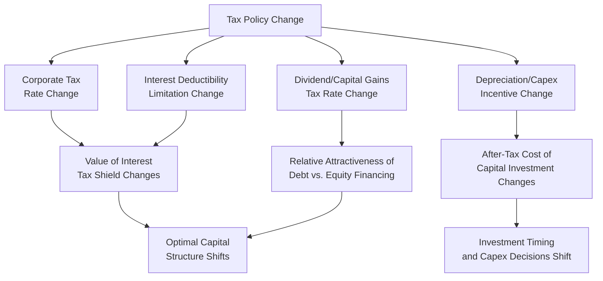
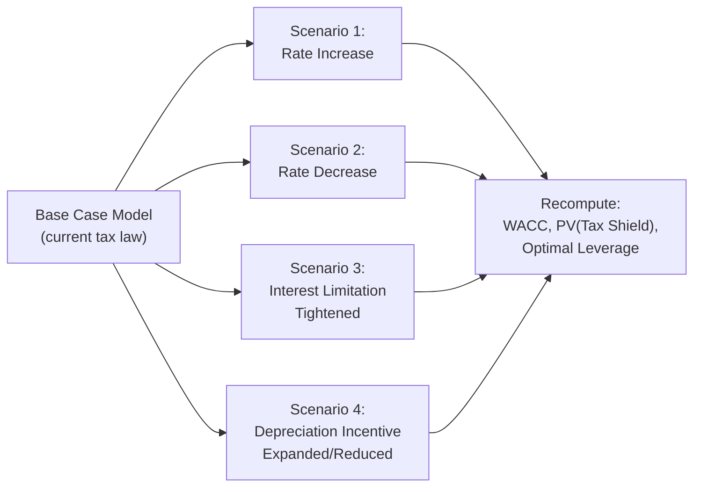

## Tax Policy Changes and Their Impact on Financing Decisions

### Overview

Tax policy is not a static backdrop to corporate finance — it is a dynamic input that directly shapes optimal capital structure, investment timing, and financing method selection. Because interest expense, depreciation, dividends, and capital gains are each taxed differently, changes to tax law (rate changes, deductibility limitations, incentive provisions) shift the relative after-tax cost of debt versus equity financing, alter the value of tax shields, and can materially change a company's optimal leverage and investment decisions. Corporate finance functions must continuously reassess financing strategy as tax policy evolves.

### The Transmission Mechanism: Tax Policy to Financing Decisions

### Corporate Tax Rate Changes and the Interest Tax Shield

**Key Points**

- The value of the interest tax shield is directly proportional to the statutory corporate tax rate: $InterestTaxShield = InterestExpense \times T_c$
- A **reduction** in the corporate tax rate mechanically reduces the value of the interest tax shield for any given level of debt, all else equal reducing the tax-driven incentive to use debt financing over equity
- Conversely, an **increase** in the corporate tax rate increases the value of the interest tax shield, strengthening the tax-driven case for leverage
- Under the simplified Modigliani-Miller perpetuity framework, $PV(TaxShield) = D \times T_c$ — a tax rate change directly and proportionally rescales the theoretical value of existing and prospective debt's tax benefit

**Example**

A company carries $10,000,000 of debt. Under a 35% corporate tax rate, versus a reduced 21% rate:

$$PV(TaxShield)_{35\%} = \$10{,}000{,}000 \times 0.35 = \$3{,}500{,}000$$

$$PV(TaxShield)_{21\%} = \$10{,}000{,}000 \times 0.21 = \$2{,}100{,}000$$

The reduction in statutory rate reduces the theoretical value attributable to the interest tax shield by $1,400,000 for the same debt balance — illustrating why major corporate tax rate cuts are typically followed by renewed analysis of target leverage ratios across affected industries.

### Interest Deductibility Limitations

**Key Points**

- Beyond the statutory rate itself, many tax codes impose limitations on the **amount** of interest expense that can be deducted in a given year, independent of the tax rate applied to what remains deductible
- A common limitation structure caps deductible net interest expense as a percentage of a measure of earnings (e.g., a percentage of EBITDA or EBIT), meaning that above a certain leverage level, additional interest expense generates no incremental tax shield at all
- [Unverified] Specific interest deductibility limitation thresholds, the earnings base used (EBITDA vs. EBIT), and any carryforward provisions for disallowed interest vary by jurisdiction and are subject to legislative change; current limitation rules should be verified against applicable law for the relevant jurisdiction and tax year
- Such limitations effectively cap the value of the interest tax shield at high leverage levels, creating a kink in the relationship between debt level and tax shield value — highly leveraged companies (e.g., post-LBO capital structures) are particularly sensitive to changes in these limitation rules, since a tightening of the limitation can convert previously deductible interest into non-deductible interest with no offsetting benefit

### Worked Example: Impact of an Interest Deductibility Cap

A company has EBITDA of $5,000,000 and a hypothetical interest deductibility limitation of 30% of EBITDA.

$$MaxDeductibleInterest = \$5{,}000{,}000 \times 0.30 = \$1{,}500{,}000$$

If the company's actual interest expense is $2,000,000:

$$DisallowedInterest = \$2{,}000{,}000 - \$1{,}500{,}000 = \$500{,}000$$

This $500,000 of interest expense generates **no current-period tax shield**, even though it is a real cash cost — a tightening of this limitation (e.g., a reduction from 30% to 20% of EBITDA) would proportionally reduce the deductible amount further, directly increasing the effective after-tax cost of the company's existing debt without any change in the debt itself.

### Depreciation and Capital Investment Incentive Changes

**Key Points**

- Changes to depreciation rules (bonus depreciation percentages, immediate expensing thresholds, MACRS class life adjustments) directly affect the present value of the depreciation tax shield and therefore the after-tax cost of capital investment
- Expansion of immediate expensing provisions accelerates the timing of tax deductions for capital expenditures, increasing the present value of the associated tax shield and generally incentivizing near-term investment timing (a "use it or lose it" dynamic if the incentive is scheduled to phase down or expire)
- Conversely, the scheduled phase-down or expiration of accelerated depreciation incentives creates an incentive to front-load capital expenditures into periods where the more favorable treatment is still available, a pattern often observed as companies rationally shift investment timing around known legislative sunset dates
- [Inference] Because capital investment decisions are frequently modeled using after-tax NPV analysis incorporating the depreciation tax shield explicitly, a scheduled or anticipated reduction in depreciation incentives should, in principle, be reflected in capital budgeting models as a declining tax shield benefit for investments made in later periods, which can shift the relative NPV ranking of otherwise similar projects based purely on timing

### Dividend and Capital Gains Tax Rate Changes

**Key Points**

- Changes to the tax treatment of dividends and capital gains at the **shareholder level** affect the relative after-tax attractiveness of different forms of shareholder return, influencing corporate payout policy (dividends vs. share buybacks) even though these taxes are paid by shareholders rather than the corporation itself
- A relative increase in dividend tax rates relative to capital gains tax rates (or vice versa) can shift corporate preference between dividend distributions and share repurchases, since repurchases generally allow shareholders to control the timing of capital gains realization (and potentially benefit from more favorable capital gains treatment) in a way that dividend distributions do not
- These shareholder-level tax considerations interact with, but are analytically distinct from, the corporate-level tax shield considerations governing debt versus equity financing decisions — payout policy and capital structure decisions are related but separate optimization problems

### Historical Pattern: How Major Tax Reforms Have Shifted Financing Behavior

**Key Points**

- Reductions in the statutory corporate tax rate have historically been associated with reduced reliance on debt financing at the margin, as the after-tax cost advantage of debt over equity narrows
- Simultaneous introduction of interest deductibility limitations alongside rate reductions (as has occurred in several major tax reforms) compounds this effect — the interest tax shield is reduced both in rate and in the maximum deductible amount, a double constraint on the value of leverage
- Expansion of immediate expensing provisions has historically been associated with accelerated near-term capital expenditure, as companies front-load investment to capture the more favorable tax treatment before any scheduled phase-down
- [Inference] Because these effects operate simultaneously and sometimes in offsetting directions (e.g., a lower rate reduces the interest tax shield's value while simultaneously reducing the after-tax cost of an investment's operating cash flows), the net effect of any specific tax reform package on a given company's optimal capital structure requires company-specific modeling rather than a generalized directional assumption

### Modeling Framework: Incorporating Tax Policy Sensitivity

**Key Points**

- Rigorous corporate finance practice models financing decisions under multiple tax policy scenarios rather than a single static assumption, particularly for long-lived capital structure decisions such as major debt issuances or leveraged transactions
- Sensitivity analysis on the corporate tax rate assumption is standard practice in DCF and LBO models, given that tax policy is subject to legislative change over a company's or transaction's holding period
- For transactions with an extended holding period (e.g., private equity leveraged buyouts with 5+ year holding periods), tax policy risk is a genuine structural consideration in underwriting the deal's return profile, since the assumed tax rate directly affects both the interest tax shield's value during the holding period and the exit valuation's after-tax cash flow basis

### Interaction with International Tax Policy

**Key Points**

- Multinational companies face an additional layer of tax policy sensitivity from international tax developments (see International Tax Considerations for Corporations), including the OECD Pillar Two global minimum tax framework, which can affect the incremental value of domestic tax shields for groups operating across multiple jurisdictions
- A domestic interest deduction that reduces a subsidiary's local effective tax rate below the Pillar Two 15% minimum may trigger an offsetting top-up tax in another jurisdiction, partially or fully neutralizing the intended benefit of the domestic tax shield at the consolidated group level
- [Inference] This interaction means that for large multinational groups, financing decisions increasingly require joint consideration of domestic tax shield value and global minimum tax consequences, rather than evaluating domestic tax policy effects on financing in isolation from the international tax framework

### Practical Implications for Corporate Finance Decision-Making

**Key Points**

- Treasury and corporate finance functions should reassess target capital structure and financing mix whenever material tax policy changes are enacted or become reasonably likely, rather than treating capital structure as a fixed, one-time decision
- Capital budgeting models should incorporate current depreciation and expensing rules explicitly, since the after-tax NPV of a given investment can shift meaningfully with changes to available incentives
- Debt covenant and credit agreement terms tied to after-tax metrics (e.g., interest coverage ratios) should be reviewed for sensitivity to tax policy changes, since a tightening of interest deductibility limitations increases the effective after-tax cost of debt service without any change in the underlying contractual terms
- [Unverified] Given that tax legislation is inherently subject to political and legislative processes that vary significantly by jurisdiction and over time, specific current-law parameters (rates, limitation thresholds, incentive provisions) referenced in any financing analysis should be verified against the most current applicable tax code before being relied upon for a live decision

### Conclusion

Tax policy is a first-order input into corporate financing decisions, not a fixed backdrop — changes to the corporate tax rate, interest deductibility limitations, depreciation incentives, and shareholder-level dividend/capital gains treatment each shift the relative after-tax attractiveness of debt versus equity financing, the value of tax shields, and the optimal timing of capital investment. Because tax law is subject to ongoing legislative change, and because these effects can operate in offsetting directions, robust corporate finance practice requires explicit scenario-based sensitivity analysis around tax policy assumptions, particularly for long-lived capital structure and investment decisions.

**Related Topics**

- Tax shields and their effect on valuation
- Trade-off theory and optimal capital structure
- International tax considerations for corporations (Pillar Two interaction)
- Depreciation methods and tax implications
- Leveraged buyout (LBO) modeling and tax policy sensitivity
- Corporate payout policy: dividends vs. share buybacks