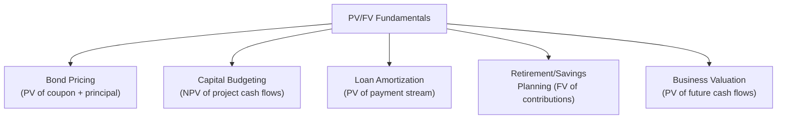

## Present Value and Future Value Fundamentals

### Overview

Present value (PV) and future value (FV) are the two foundational concepts underlying the time value of money — the principle that a dollar available today is worth more than a dollar available in the future, due to its potential earning capacity. Nearly every valuation, capital budgeting, and financing technique in corporate finance ultimately reduces to some application of discounting future cash flows to the present or compounding present cash flows to the future.

### The Core Principle: Time Value of Money

**Key Points**

- A dollar received today can be invested to earn a return, making it worth more than a dollar received at some future date
- The relationship between present and future value is governed by an interest (or discount) rate, reflecting the opportunity cost of capital, expected inflation, and risk
- Higher discount rates reduce the present value of future cash flows and increase the future value of present cash flows compounded forward
- This principle underlies virtually all valuation techniques: bond pricing, stock valuation, capital budgeting (NPV/IRR), loan amortization, and retirement/annuity planning

### The Relationship Between PV and FV

### Future Value Formula (Single Cash Flow)

Future value measures what a present sum will grow to after a specified period, given a rate of return, assuming compound interest.

$$FV = PV \times (1 + r)^n$$

Where:

- $PV$ = present value (initial amount)
- $r$ = interest rate (or rate of return) per period
- $n$ = number of periods

**Example**

$10,000 invested today at an 8% annual return for 5 years:

$$FV = \$10{,}000 \times (1 + 0.08)^5 = \$10{,}000 \times 1.4693 = \$14{,}693$$

### Present Value Formula (Single Cash Flow)

Present value measures what a future sum is worth today, discounted back at a given rate.

$$PV = \frac{FV}{(1 + r)^n}$$

**Example**

$14,693 to be received in 5 years, discounted at 8% annually:

$$PV = \frac{\$14{,}693}{(1 + 0.08)^5} = \frac{\$14{,}693}{1.4693} = \$10{,}000$$

**Key Points**

- Present value and future value are algebraic inverses of one another — the discount rate used to bring a future value back to the present is the same rate used to compound a present value forward, assuming no change in the rate over the holding period
- The formulas above assume a single lump-sum cash flow at a single point in time; multi-period cash flow streams (annuities, perpetuities) require extensions of this base formula

### Simple Interest vs. Compound Interest

**Key Points**

- **Simple interest** is calculated only on the original principal amount each period: $FV_{simple} = PV \times (1 + r \times n)$
- **Compound interest** is calculated on the principal plus any previously accumulated interest, causing growth to accelerate over time: $FV_{compound} = PV \times (1+r)^n$
- Virtually all corporate finance applications (valuation, capital budgeting, bond pricing) use compound interest as the standard convention, since it reflects the reality that earned returns themselves generate further returns if reinvested

**Example: Simple vs. Compound Comparison**

$10,000 at 8% for 10 years:

$$FV_{simple} = \$10{,}000 \times (1 + 0.08 \times 10) = \$10{,}000 \times 1.80 = \$18{,}000$$

$$FV_{compound} = \$10{,}000 \times (1.08)^{10} = \$10{,}000 \times 2.1589 = \$21{,}589$$

The $3,589 difference reflects the compounding effect — interest earned in early years itself earns interest in subsequent years under the compound method.

### Compounding Frequency

Interest can compound at different frequencies (annually, semi-annually, quarterly, monthly, daily), which affects the effective return even when the stated ("nominal") annual rate is identical.

$$FV = PV \times \left(1 + \frac{r}{m}\right)^{m \times n}$$

Where $m$ = number of compounding periods per year.

**Effective Annual Rate (EAR)**

$$EAR = \left(1 + \frac{r}{m}\right)^m - 1$$

**Example**

A nominal annual rate of 12%, compounded monthly ($m=12$):

$$EAR = \left(1 + \frac{0.12}{12}\right)^{12} - 1 = (1.01)^{12} - 1 = 0.1268 = 12.68\%$$

**Key Points**

- More frequent compounding at the same nominal rate always produces a higher effective annual rate — the limiting case as compounding frequency approaches infinity is continuous compounding
- Comparing loan or investment products with different stated compounding frequencies requires converting each to its Effective Annual Rate for an accurate apples-to-apples comparison

### Continuous Compounding

$$FV = PV \times e^{r \times n}$$

Where $e \approx 2.71828$ is the base of the natural logarithm.

**Key Points**

- Continuous compounding represents the theoretical limit of increasingly frequent compounding periods
- [Unverified] While a standard textbook concept, continuous compounding is used more frequently in derivatives pricing and academic finance theory than in typical day-to-day corporate finance applications, where discrete compounding (annual, monthly) more closely matches actual cash flow timing conventions

### The Discount Rate: What It Represents

**Key Points**

- The discount rate used in PV/FV calculations should reflect the **opportunity cost of capital** — the return that could be earned on an alternative investment of comparable risk
- Higher-risk cash flows warrant a higher discount rate, reducing their present value relative to lower-risk cash flows of the same nominal amount — this is the fundamental link between time value of money and risk-adjusted valuation
- In corporate finance applications, the appropriate discount rate varies by context: a company's Weighted Average Cost of Capital (WACC) for firm-level valuation, a project-specific hurdle rate for capital budgeting, or a risk-free rate plus credit spread for debt instruments
- [Inference] Because the discount rate choice directly and often significantly affects the calculated present value, sensitivity analysis around the discount rate assumption is standard practice in any PV-based valuation exercise

### Solving for the Unknown Variable

The PV/FV relationship can be algebraically rearranged to solve for any of the four core variables when the other three are known.

**Solving for the Interest Rate**

$$r = \left(\frac{FV}{PV}\right)^{\frac{1}{n}} - 1$$

**Solving for the Number of Periods**

$$n = \frac{\ln(FV/PV)}{\ln(1+r)}$$

**Example: Solving for Required Rate of Return**

An investment of $5,000 grows to $9,000 over 6 years. What rate of return does this imply?

$$r = \left(\frac{\$9{,}000}{\$5{,}000}\right)^{\frac{1}{6}} - 1 = (1.80)^{0.1667} - 1 \approx 10.28\%$$

**Example: Solving for Time (Rule of 72 Approximation)**

A commonly used mental shortcut for estimating how long it takes an investment to double at a given rate:

$$n \approx \frac{72}{r \times 100}$$

At an 8% annual return, an investment doubles in approximately $\frac{72}{8} = 9$ years. [Inference] This is a widely used approximation rather than an exact formula — the precise answer using the full logarithmic formula for doubling at 8% is approximately 9.01 years, and the Rule of 72's accuracy degrades somewhat at very high or very low interest rates.

### PV/FV in Practical Corporate Finance Applications

**Key Points**

- **Bond pricing** discounts the bond's future coupon payments and principal repayment back to present value using the market yield
- **Net Present Value (NPV)** analysis in capital budgeting discounts a project's future cash flows to determine whether the investment creates value in present-value terms
- **Business and equity valuation** (DCF models) discount projected future free cash flows to arrive at present enterprise or equity value
- **Loan and lease structuring** relies on present value calculations to determine payment amounts that equate to a specified principal amount at a given rate

### Common Errors in PV/FV Application

- Mismatching the discount rate's compounding period with the cash flow's periodicity (e.g., applying an annual rate directly to monthly cash flows without adjustment)
- Using a nominal rate when an effective rate is required for accurate comparison across different compounding conventions
- Failing to distinguish between cash flows occurring at the beginning versus the end of a period (a foundational distinction that becomes critical in annuity calculations)
- Applying a single discount rate uniformly across cash flows of meaningfully different risk profiles, when a risk-adjusted, cash-flow-specific rate would be more appropriate

### Conclusion

Present value and future value formulas — built on the compound interest relationship $FV = PV \times (1+r)^n$ — form the mathematical foundation of the time value of money and, by extension, of nearly all corporate finance valuation and decision-making techniques. Understanding the relationship between these two values, the role of compounding frequency, and the meaning of the discount rate as a reflection of opportunity cost and risk is prerequisite to more advanced applications including annuities, perpetuities, bond pricing, and discounted cash flow valuation.

**Related Topics**

- Annuities and perpetuities (ordinary vs. annuity-due)
- Net Present Value (NPV) and Internal Rate of Return (IRR) in capital budgeting
- Bond pricing and yield-to-maturity calculations
- Effective Annual Rate vs. nominal (stated) annual rate
- Discounted Cash Flow (DCF) valuation methodology
- Loan amortization schedule construction