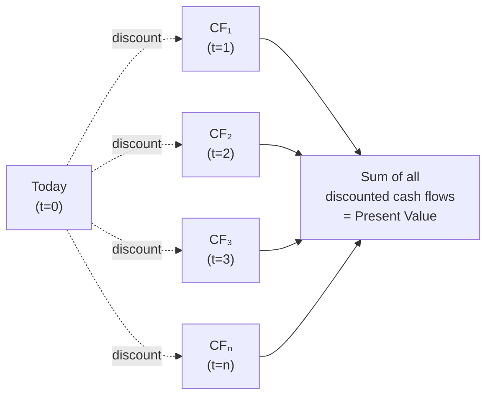
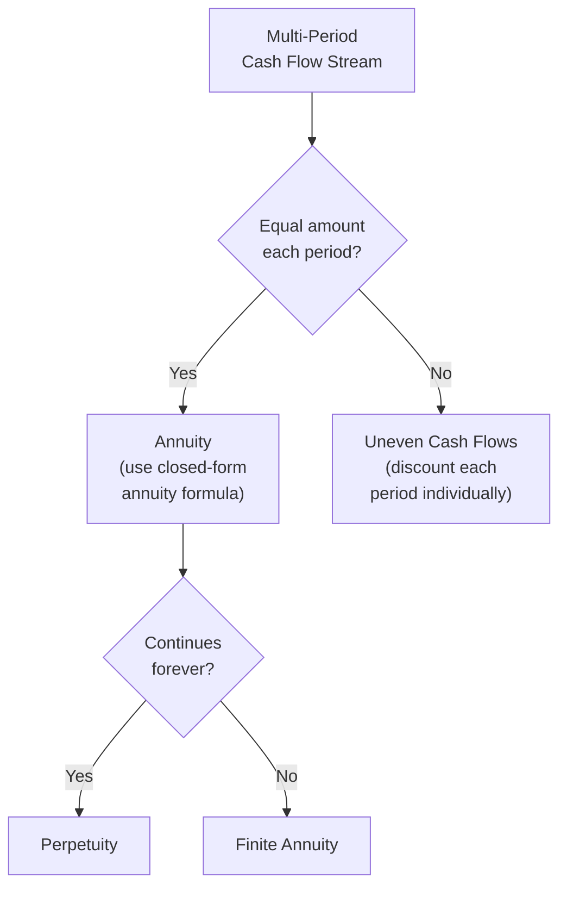

## Valuing Multiple and Uneven Cash Flows

### Overview

Real-world corporate finance rarely involves a single lump-sum cash flow. Investments, projects, and securities typically generate a series of cash flows over time — sometimes level and predictable (annuities), sometimes irregular in timing and amount (uneven cash flow streams). Valuing these multi-period cash flow series requires extending the single-period present value and future value formulas into a systematic framework: discounting or compounding each individual cash flow to a common point in time, then summing the results.

### The Fundamental Principle: Value Each Cash Flow Independently

**Key Points**

- Because money has time value, cash flows occurring at different points in time cannot simply be added together in their nominal (undiscounted) form
- The correct approach is to bring every cash flow to a **common reference point** (usually today, i.e., present value) using the appropriate discount rate, then sum the resulting present values
- This principle holds regardless of whether the cash flow stream is level (an annuity) or irregular (uneven cash flows) — the irregular case is simply the general formula applied without the simplifying assumption of equal payments

### General Formula for Valuing Multiple Cash Flows

$$PV = \sum_{t=1}^{n} \frac{CF_t}{(1+r)^t}$$

Where:

- $CF_t$ = cash flow occurring at time $t$
- $r$ = discount rate per period
- $n$ = total number of periods

### Worked Example: Uneven Cash Flow Stream

A project generates the following cash flows over 4 years, discounted at a 10% required rate of return:

| Year | Cash Flow | Discount Factor $\frac{1}{(1.10)^t}$ | Present Value |
| --- | --- | --- | --- |
| 1 | $3,000 | 0.9091 | $2,727.27 |
| 2 | $5,000 | 0.8264 | $4,132.23 |
| 3 | $2,000 | 0.7513 | $1,502.63 |
| 4 | $7,000 | 0.6830 | $4,781.09 |
| **Total** |  |  | **$13,143.22** |

$$PV = \frac{\$3{,}000}{(1.10)^1} + \frac{\$5{,}000}{(1.10)^2} + \frac{\$2{,}000}{(1.10)^3} + \frac{\$7{,}000}{(1.10)^4} = \$13{,}143.22$$

**Key Points**

- Each cash flow is discounted using its **own specific exponent** corresponding to how many periods away it occurs — this is what distinguishes uneven cash flow valuation from an annuity formula, which assumes identical timing intervals and identical payment amounts
- The nominal sum of the cash flows ($3,000 + $5,000 + $2,000 + $7,000 = $17,000) is materially higher than the present value ($13,143.22), illustrating the cumulative effect of discounting later, larger cash flows more heavily than earlier ones

### Future Value of Multiple Cash Flows

The same principle applies in reverse when compounding multiple cash flows forward to a common future date.

$$FV = \sum_{t=1}^{n} CF_t \times (1+r)^{(n-t)}$$

Each cash flow compounds forward only for the remaining number of periods between its occurrence and the target future date.

**Example**

Using the same cash flows, find the future value at the end of Year 4 (10% rate):

| Year | Cash Flow | Periods to Compound | Future Value |
| --- | --- | --- | --- |
| 1 | $3,000 | 3 | $3,000 × (1.10)³ = $3,993.00 |
| 2 | $5,000 | 2 | $5,000 × (1.10)² = $6,050.00 |
| 3 | $2,000 | 1 | $2,000 × (1.10)¹ = $2,200.00 |
| 4 | $7,000 | 0 | $7,000 × (1.10)⁰ = $7,000.00 |
| **Total** |  |  | **$19,243.00** |

**Verification**: Compounding the previously calculated present value ($13,143.22) forward 4 years at 10% should match:

$$\$13{,}143.22 \times (1.10)^4 = \$19{,}243.00 \checkmark$$

This confirms internal consistency between the present value and future value approaches to the same cash flow stream.

### Distinguishing Uneven Cash Flows from Annuities

**Key Points**

- When a cash flow series has **identical payment amounts at regular intervals**, the closed-form annuity formula (a simplified version of the general summation) can be used directly, avoiding the need to discount each period separately
- When cash flows are irregular — different amounts, or gaps/skipped periods — the general summation formula must be applied term-by-term, since no algebraic shortcut exists for an arbitrary sequence
- A common practical technique for a "mixed" cash flow stream (e.g., an irregular stretch followed by a long constant stream) is to value the irregular portion using the summation method and the constant portion using the annuity formula, then combine the two present values

### Handling Mixed Cash Flow Streams (Uneven + Annuity Combined)

Many real-world scenarios combine an irregular near-term cash flow stream with a longer, more predictable stream further out (e.g., a project with variable ramp-up cash flows followed by stable ongoing cash flows, or a terminal value calculation in DCF valuation).

**Example**

A project has irregular cash flows in Years 1–3, then a constant $4,000 per year from Years 4–10, discounted at 8%.

**Step 1** — Discount the irregular Years 1–3 cash flows individually using the summation method (as shown above).

**Step 2** — Value the Years 4–10 constant stream as an ordinary annuity as of the end of Year 3, then discount that lump-sum annuity value back to today.

$$PV_{annuity,\ as\ of\ Year\ 3} = \$4{,}000 \times \left[\frac{1 - (1.08)^{-7}}{0.08}\right] = \$4{,}000 \times 5.2064 = \$20{,}825.60$$

$$PV_{today} = \frac{\$20{,}825.60}{(1.08)^3} = \$16{,}533.75$$

**Step 3** — Sum the two components: PV of Years 1–3 (calculated via summation method) + PV of the annuity component ($16,533.75) = Total Project Present Value.

**Key Points**

- This "value the annuity as of the period just before it starts, then discount that lump sum back" technique is a standard and efficient approach for valuing deferred or mixed cash flow streams, avoiding the need to discount every single period of a long constant stream individually
- Care must be taken with the exponent used in the final discounting step — the annuity formula naturally produces a value "as of" one period before the first annuity payment, not as of today, so an additional discounting step back to time zero is required

### Cash Flow Timing Conventions

**Key Points**

- The general summation formula above assumes cash flows occur at the **end** of each period (ordinary/end-of-period convention), which is the standard default assumption in corporate finance unless otherwise specified
- If cash flows instead occur at the **beginning** of each period, each term's exponent shifts by one period, or equivalently, the entire ordinary-convention result can be multiplied by $(1+r)$ to convert to a beginning-of-period basis
- Financial modeling and capital budgeting contexts should explicitly state the cash flow timing convention being used, since even a one-period timing shift for a large cash flow can materially affect the calculated present value

### Practical Applications in Corporate Finance

**Key Points**

- **Capital budgeting (NPV analysis)** — nearly all real capital projects generate uneven cash flows (higher in some years due to seasonal demand, lower in ramp-up or wind-down years), requiring the general summation approach rather than a simplified annuity shortcut
- **Bond valuation with irregular coupon schedules** — while standard bonds pay level coupons (an annuity) plus a final principal repayment, some structured or amortizing debt instruments have irregular payment schedules requiring term-by-term discounting
- **DCF valuation** — explicit forecast period cash flows are typically uneven (reflecting projected growth, margin changes, and working capital shifts), discounted individually, with only the terminal value calculation typically relying on a simplified perpetuity or annuity-style formula
- **Lease and loan structuring with variable payments** — step-up or step-down payment schedules require the general summation method rather than a standard amortization formula

### Common Errors in Valuing Uneven Cash Flows

- Applying a single, blended discount factor to the sum of all cash flows rather than discounting each cash flow individually at its own specific time period
- Mistakenly applying the annuity formula to a cash flow stream that is not actually level, producing a materially incorrect valuation
- Failing to correctly identify the timing of each cash flow (particularly in projects with cash flows occurring at irregular intervals, not simply irregular amounts at regular intervals)
- Inconsistency in cash flow timing convention (mixing beginning-of-period and end-of-period assumptions within the same valuation without adjustment)

### Conclusion

Valuing multiple and uneven cash flows extends the single-period present value formula into a general summation framework, discounting each individual cash flow back to a common point in time based on its specific timing, then aggregating the results. While level cash flow streams can be valued more efficiently using closed-form annuity or perpetuity formulas, genuinely irregular cash flow streams — which characterize most real-world capital budgeting projects and DCF valuations — require this term-by-term discounting approach, often combined with annuity shortcuts for any embedded constant-payment segments.

**Related Topics**

- Present value and future value fundamentals
- Annuities and perpetuities (ordinary vs. annuity-due)
- Net Present Value (NPV) and Internal Rate of Return (IRR)
- Discounted Cash Flow (DCF) valuation and terminal value calculation
- Bond valuation with level and irregular payment structures
- Capital budgeting techniques for irregular project cash flows