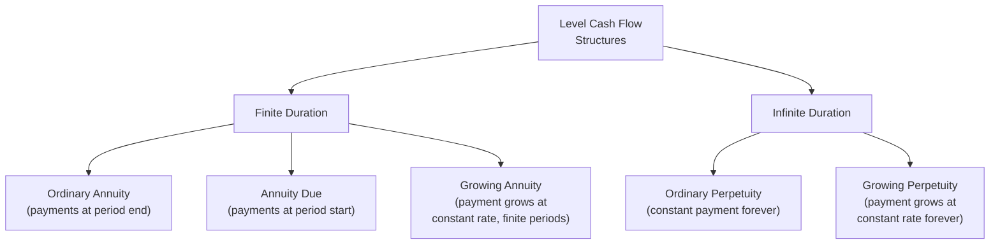
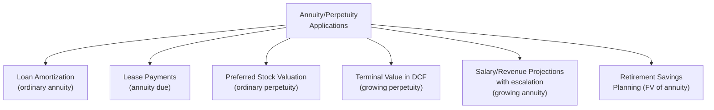

## Annuities and Perpetuities

### Overview

Annuities and perpetuities are specialized time value of money structures involving a series of equal, periodic cash flows. An annuity pays a level amount for a finite number of periods; a perpetuity pays a level amount forever. Because these cash flow patterns are so common in corporate finance — loan payments, lease payments, bond coupons, preferred stock dividends, and terminal value calculations — closed-form formulas exist to value them directly, avoiding the need to discount each individual cash flow separately as required for uneven cash flow streams.

### Classification of Level Cash Flow Structures

### Ordinary Annuity: Present Value

An ordinary annuity assumes equal cash flows occurring at the **end** of each period — the standard default convention in corporate finance.

$$PV_{Annuity} = CF \times \left[\frac{1 - (1+r)^{-n}}{r}\right]$$

Where:

- $CF$ = level cash flow per period
- $r$ = discount rate per period
- $n$ = number of periods

**Example**

A loan requires payments of $5,000 at the end of each year for 6 years, discounted at 7%:

$$PV = \$5{,}000 \times \left[\frac{1 - (1.07)^{-6}}{0.07}\right] = \$5{,}000 \times 4.7665 = \$23{,}832.50$$

### Ordinary Annuity: Future Value

$$FV_{Annuity} = CF \times \left[\frac{(1+r)^n - 1}{r}\right]$$

**Example**

Depositing $2,000 at the end of each year for 10 years, earning 6% annually:

$$FV = \$2{,}000 \times \left[\frac{(1.06)^{10} - 1}{0.06}\right] = \$2{,}000 \times 13.1808 = \$26{,}361.60$$

**Key Points**

- The bracketed term in each formula is often called the "annuity factor" (present value annuity factor or future value annuity factor) — many financial calculators and spreadsheet functions compute this factor directly
- Present value and future value annuity formulas are related by the same compounding relationship as single cash flows: $FV_{Annuity} = PV_{Annuity} \times (1+r)^n$

### Annuity Due: Payments at the Beginning of Each Period

An annuity due assumes cash flows occur at the **start** of each period rather than the end — common for lease payments and insurance premiums, which are typically paid in advance.

$$PV_{AnnuityDue} = PV_{OrdinaryAnnuity} \times (1+r)$$

$$FV_{AnnuityDue} = FV_{OrdinaryAnnuity} \times (1+r)$$

**Example**

Using the same $5,000/year, 6-year, 7% loan example, but with payments due at the start of each period:

$$PV_{AnnuityDue} = \$23{,}832.50 \times (1.07) = \$25{,}500.78$$

**Key Points**

- An annuity due is always worth more than an otherwise identical ordinary annuity, since each payment is received (or paid) one period earlier and therefore benefits from one additional period of compounding (for FV) or is discounted one fewer period (for PV)
- The multiplicative adjustment factor $(1+r)$ applies uniformly to both the present value and future value annuity formulas
- Failing to correctly identify whether a cash flow stream is an ordinary annuity or an annuity due is one of the most common sources of error in annuity-based valuation

### Perpetuities: Cash Flows That Continue Forever

A perpetuity is a special case of an annuity where the level cash flow stream has no defined end date — it continues indefinitely.

$$PV_{Perpetuity} = \frac{CF}{r}$$

**Example**

A preferred stock pays a constant $4 annual dividend in perpetuity, and investors require a 6% return:

$$PV = \frac{\$4}{0.06} = \$66.67$$

**Key Points**

- The perpetuity formula is derived as the limiting case of the ordinary annuity formula as $n \to \infty$: as $n$ grows large, $(1+r)^{-n}$ approaches zero, simplifying the annuity formula to $\frac{CF}{r}$
- No future value formula exists for a perpetuity, since a cash flow stream that never ends has no finite future value at any specific future date
- Perpetuities are a useful theoretical and practical simplification for valuing any sufficiently long-dated, stable cash flow stream, even when the cash flow does not literally continue forever — a common application in terminal value calculations within DCF models, where cash flows beyond the explicit forecast period are approximated as a perpetuity

### Growing Perpetuity

When the level cash flow instead grows at a constant rate indefinitely, the formula incorporates a growth rate term.

$$PV_{GrowingPerpetuity} = \frac{CF_1}{r - g}$$

Where:

- $CF_1$ = the cash flow expected in the **next** period (not the current period)
- $g$ = the constant growth rate per period
- This formula requires $r > g$; if growth exceeds the discount rate, the formula is mathematically undefined (produces a negative or nonsensical result) since the series would never converge to a finite present value

**Example**

A company is expected to pay a $3.00 dividend next year, growing at 4% per year indefinitely, with a required return of 9%:

$$PV = \frac{\$3.00}{0.09 - 0.04} = \frac{\$3.00}{0.05} = \$60.00$$

**Key Points**

- The growing perpetuity formula is the foundation of the **Gordon Growth Model** (also called the Dividend Discount Model in its simplest form), widely used for equity valuation and for calculating terminal value in DCF analysis
- Small changes in the assumed growth rate $g$ can produce disproportionately large changes in calculated present value, particularly as $g$ approaches $r$ — this sensitivity is a well-documented practical limitation of the model
- [Inference] Because the formula becomes highly sensitive (and eventually undefined) as $g$ approaches $r$, practitioners typically apply conservative, long-run-sustainable growth rate assumptions (often anchored to long-term GDP or inflation expectations) rather than extrapolating a company's historical high-growth rate indefinitely

### Growing Annuity

A finite-duration version of the growing perpetuity — cash flows grow at a constant rate for a specified number of periods, then stop.

$$PV_{GrowingAnnuity} = CF_1 \times \left[\frac{1 - \left(\frac{1+g}{1+r}\right)^n}{r - g}\right]$$

**Example**

A project generates a $10,000 cash flow next year, growing at 3% annually for 8 years, discounted at 10%:

$$PV = \$10{,}000 \times \left[\frac{1 - \left(\frac{1.03}{1.10}\right)^8}{0.10 - 0.03}\right] = \$10{,}000 \times \left[\frac{1 - 0.6035}{0.07}\right] = \$10{,}000 \times 5.664 = \$56{,}640$$

**Key Points**

- Growing annuities are less commonly encountered than the other three structures but are useful for valuing cash flow streams with a defined, predictable growth pattern over a limited horizon — for example, salary or revenue projections with an assumed constant annual escalation rate
- When $g = 0$, the growing annuity formula collapses to the standard ordinary annuity formula, confirming internal consistency

### Summary Comparison Table

| Structure | Duration | Growth | PV Formula |
| --- | --- | --- | --- |
| Ordinary Annuity | Finite ($n$ periods) | None (level) | $CF \times \frac{1-(1+r)^{-n}}{r}$ |
| Annuity Due | Finite ($n$ periods) | None (level) | $CF \times \frac{1-(1+r)^{-n}}{r} \times (1+r)$ |
| Ordinary Perpetuity | Infinite | None (level) | $\frac{CF}{r}$ |
| Growing Perpetuity | Infinite | Constant rate $g$ | $\frac{CF_1}{r-g}$ |
| Growing Annuity | Finite ($n$ periods) | Constant rate $g$ | $CF_1 \times \frac{1-\left(\frac{1+g}{1+r}\right)^n}{r-g}$ |

### Practical Applications

**Key Points**

- **Loan and mortgage amortization** relies directly on the ordinary annuity formula to determine level periodic payment amounts given a principal, rate, and term
- **Bond coupon valuation** treats the coupon payment stream as an ordinary annuity, combined with a single lump-sum present value calculation for the final principal repayment
- **Terminal value in DCF models** most commonly uses the growing perpetuity (Gordon Growth) formula to capture the value of all cash flows beyond the explicit forecast period
- **Preferred stock** with a fixed, non-growing dividend is a textbook application of the ordinary perpetuity formula

### Common Errors in Annuity/Perpetuity Application

- Confusing ordinary annuity and annuity due timing, leading to a systematic overstatement or understatement of value
- Using the current period's cash flow ($CF_0$) rather than the next period's cash flow ($CF_1$) in the growing perpetuity or growing annuity formula — the formula explicitly requires the **next** cash flow
- Applying a growing perpetuity formula where the assumed growth rate equals or exceeds the discount rate, producing a mathematically invalid or economically unrealistic result
- Mismatching the compounding period of the discount rate with the payment frequency of the annuity (e.g., applying an annual rate directly to monthly payments without converting to a monthly-equivalent rate)

### Conclusion

Annuities and perpetuities provide closed-form shortcuts for valuing level (or constantly growing) periodic cash flow streams, eliminating the need to discount each individual payment separately as required for uneven cash flows. Understanding the distinctions between ordinary annuities, annuities due, ordinary perpetuities, and growing perpetuities — and correctly matching the cash flow timing and growth assumptions to the appropriate formula — is foundational to loan structuring, bond and preferred stock valuation, and terminal value calculation in discounted cash flow analysis.

**Related Topics**

- Present value and future value fundamentals
- Valuing multiple and uneven cash flows
- Gordon Growth Model and terminal value in DCF valuation
- Bond pricing and yield-to-maturity calculations
- Loan amortization schedule construction
- Preferred stock valuation