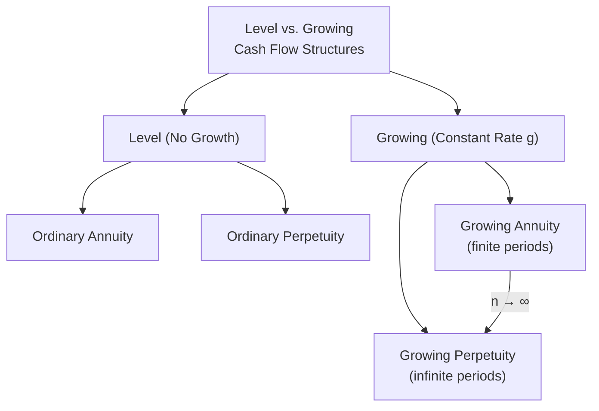
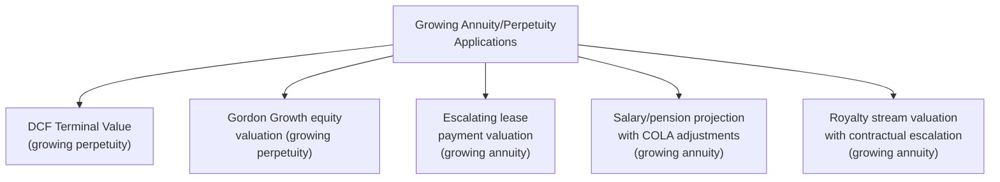

## Growing Annuities and Growing Perpetuities

### Overview

Growing annuities and growing perpetuities are extensions of the standard level-payment annuity and perpetuity structures, incorporating a constant periodic growth rate into the cash flow stream. Rather than assuming a fixed payment amount, these structures assume the cash flow grows by a constant percentage each period — a pattern that more realistically captures cash flow streams affected by inflation, business growth, or contractual escalation clauses. These formulas are foundational to equity valuation, terminal value calculation, and long-term financial planning involving growing cash flow streams.

### Positioning Within the Time Value of Money Framework

### Growing Perpetuity

A growing perpetuity is a cash flow stream that begins at some level, grows at a constant rate $g$ each period, and continues indefinitely.

$$PV_{GrowingPerpetuity} = \frac{CF_1}{r - g}$$

Where:

- $CF_1$ = the cash flow expected at the **end of the first period** (i.e., the next period, not the current or base period)
- $r$ = the discount rate per period
- $g$ = the constant growth rate per period, where $r > g$ is required for the formula to produce a finite, meaningful result

**Key Points**

- Using $CF_1$ (the next period's cash flow) rather than $CF_0$ (the current or base cash flow) is a critical and frequently misapplied detail — if only the base cash flow $CF_0$ is known, it must first be grown one period forward: $CF_1 = CF_0 \times (1+g)$
- The condition $r > g$ is mathematically necessary — if growth equals or exceeds the discount rate, the geometric series underlying the formula's derivation does not converge, and the formula produces either an undefined or economically meaningless result

**Example**

A company's most recently paid dividend ($CF_0$) was $2.50. Dividends are expected to grow at 3% annually forever, and investors require a 9% return.

**Step 1** — Grow the base dividend forward one period:

$$CF_1 = \$2.50 \times (1.03) = \$2.575$$

**Step 2** — Apply the growing perpetuity formula:

$$PV = \frac{\$2.575}{0.09 - 0.03} = \frac{\$2.575}{0.06} = \$42.92$$

### The Gordon Growth Model

The growing perpetuity formula is the mathematical foundation of the Gordon Growth Model (also known as the Dividend Discount Model in its simplest constant-growth form), one of the most widely taught approaches to equity valuation.

$$P_0 = \frac{D_1}{r - g}$$

Where $P_0$ is the current stock price, $D_1$ is next year's expected dividend, $r$ is the required rate of return on equity, and $g$ is the constant long-term dividend growth rate.

**Key Points**

- The Gordon Growth Model is most defensible for mature, stable companies with a long history of consistent dividend growth, since the model assumes a single constant growth rate extending indefinitely into the future
- The model is highly sensitive to the spread between $r$ and $g$ — as this spread narrows, calculated value rises sharply and non-linearly, making the model's output very sensitive to small changes in either input assumption
- [Inference] Because of this sensitivity, practitioners typically stress-test Gordon Growth Model outputs across a range of plausible $(r, g)$ combinations rather than relying on a single point estimate, particularly when the assumed growth rate is not clearly anchored to a long-run macroeconomic benchmark

### Growing Perpetuity in Terminal Value Calculations

**Key Points**

- Beyond direct equity valuation, the growing perpetuity formula is the standard method for calculating **terminal value** in a Discounted Cash Flow (DCF) model — representing the value of all cash flows occurring after the explicit forecast period
- $$TerminalValue_n = \frac{FCF_{n+1}}{WACC - g}$$
- The terminal growth rate $g$ used in this context is typically constrained to a conservative, long-run-sustainable rate (often anchored to expected long-term GDP growth or inflation), since assuming indefinite high growth would produce an unrealistically inflated terminal value
- Terminal value frequently represents a very large proportion of total DCF-derived enterprise value — often the majority — making the terminal growth rate assumption one of the single most consequential inputs in the entire valuation

### Growing Annuity

A growing annuity applies the same constant-growth-rate concept to a **finite** cash flow stream rather than an infinite one.

$$PV_{GrowingAnnuity} = CF_1 \times \left[\frac{1 - \left(\dfrac{1+g}{1+r}\right)^n}{r - g}\right]$$

Where $n$ is the finite number of periods over which the growing cash flow stream occurs.

**Key Points**

- Unlike the growing perpetuity, the growing annuity formula does **not** strictly require $r > g$ mathematically (since the series is finite and therefore converges regardless), though in most practical corporate finance applications $r$ is still assumed to exceed $g$
- As $n \to \infty$, the growing annuity formula converges to the growing perpetuity formula, since the term $\left(\frac{1+g}{1+r}\right)^n$ approaches zero when $r > g$ and $n$ becomes very large
- Growing annuities are useful for valuing any finite cash flow stream with a defined, predictable escalation pattern — salary projections with a fixed annual raise, lease payments with a contractual escalation clause, or a business segment with an explicit limited-duration growth phase

### Worked Example: Growing Annuity

An executive's compensation package specifies a base salary of $150,000 next year, with a contractual 4% annual increase for the next 10 years, discounted at a 7% personal discount rate to determine present value.

$$PV = \$150{,}000 \times \left[\frac{1 - \left(\dfrac{1.04}{1.07}\right)^{10}}{0.07 - 0.04}\right]$$

$$\left(\frac{1.04}{1.07}\right)^{10} = (0.97196)^{10} \approx 0.7519$$

$$PV = \$150{,}000 \times \left[\frac{1 - 0.7519}{0.03}\right] = \$150{,}000 \times 8.2700 = \$1{,}240{,}500$$

### Growing Annuity Future Value

The future value of a growing annuity can also be derived, representing the accumulated value of the growing payment stream at the end of the period:

$$FV_{GrowingAnnuity} = CF_1 \times \left[\frac{(1+r)^n - (1+g)^n}{r-g}\right]$$

**Example**

Using the same base parameters ($150,000 initial payment growing at 4%, 10 years, 7% rate), the future value at the end of Year 10:

$$FV = \$150{,}000 \times \left[\frac{(1.07)^{10} - (1.04)^{10}}{0.07 - 0.04}\right] = \$150{,}000 \times \left[\frac{1.9672 - 1.4802}{0.03}\right] = \$150{,}000 \times 16.233 = \$2{,}434{,}950$$

**Verification**: Compounding the previously calculated present value forward should approximately match:

$$\$1{,}240{,}500 \times (1.07)^{10} \approx \$2{,}440{,}000$$

(Minor rounding differences arise from intermediate rounding in the exponent calculations above.)

### Special Case: When Growth Equals the Discount Rate

**Key Points**

- If $g = r$ in a growing annuity, the standard formula involves division by zero and is undefined; the correct formula in this special case simplifies to $PV = n \times \frac{CF_1}{1+r}$, since each period's discounted value becomes identical when growth exactly offsets discounting
- [Unverified] This edge case is a standard textbook derivation but arises infrequently in applied practice, since assuming growth exactly equal to the discount rate over an extended period is an unusual and generally coincidental modeling assumption

### Comparison: Growing Perpetuity vs. Growing Annuity

| Feature | Growing Perpetuity | Growing Annuity |
| --- | --- | --- |
| Duration | Infinite | Finite ($n$ periods) |
| Convergence requirement | Requires $r > g$ | Converges for any $r, g$ (finite sum) |
| Typical application | Terminal value, stable dividend stocks | Escalating salary/lease/limited-life projects |
| Formula | $\frac{CF_1}{r-g}$ | $CF_1 \times \frac{1-\left(\frac{1+g}{1+r}\right)^n}{r-g}$ |

### Practical Applications

### Common Errors and Pitfalls

- Using the base-period cash flow ($CF_0$) instead of the next-period cash flow ($CF_1$) directly in the formula, without first growing it forward one period
- Applying a growing perpetuity assumption with $g \geq r$, producing a mathematically invalid or economically absurd (infinite or negative) valuation
- Assuming an indefinitely high growth rate for terminal value calculations, materially overstating enterprise value — terminal growth assumptions should generally not exceed a reasonable long-run economic growth benchmark
- Confusing the growing annuity's finite-period convergence (which works for any $r, g$ combination) with the growing perpetuity's strict requirement that $r > g$

### Conclusion

Growing annuities and growing perpetuities extend the standard time value of money toolkit to handle cash flow streams that increase at a constant rate over time — the growing perpetuity valuing an indefinitely continuing, constantly growing stream (most notably underlying the Gordon Growth Model and DCF terminal value calculations), and the growing annuity valuing an analogous but finite-duration stream. Correct application requires careful attention to using the next-period cash flow in the formula, respecting the $r > g$ convergence condition for perpetuities, and recognizing the outsized sensitivity of calculated value to the assumed growth rate — particularly as it approaches the discount rate.

**Related Topics**

- Annuities and perpetuities (level, non-growing structures)
- Gordon Growth Model and Dividend Discount Model valuation
- Discounted Cash Flow (DCF) valuation and terminal value methodology
- Present value and future value fundamentals
- Sensitivity analysis on discount rate and growth rate assumptions
- Weighted Average Cost of Capital (WACC) as the terminal value discount rate