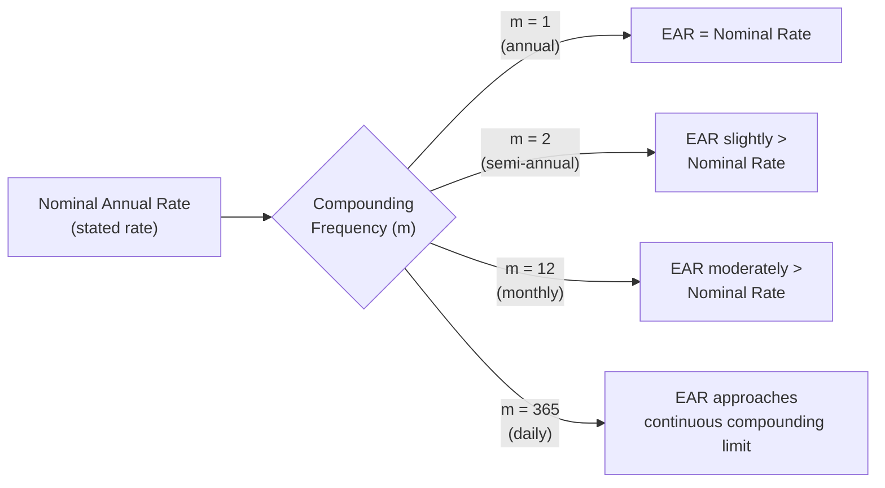
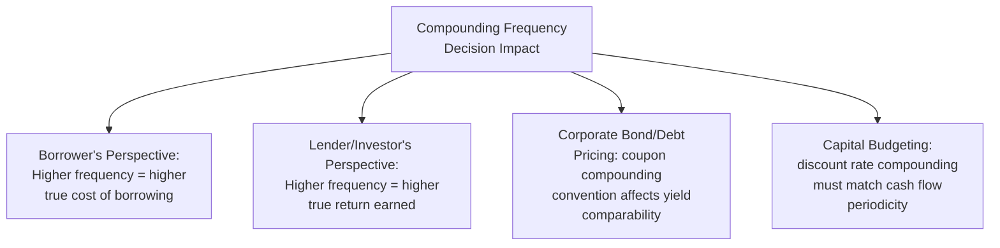

## Compounding Frequency and Effective Annual Rates

### Overview

Interest rates are frequently quoted as a nominal (stated) annual rate, but the actual return earned or cost incurred depends critically on how often that rate compounds within the year. Compounding frequency and the Effective Annual Rate (EAR) concept together provide the tools needed to accurately compare financial products — loans, deposits, bonds — that quote rates using different compounding conventions, ensuring an apples-to-apples comparison of true economic cost or return.

### Nominal Rate vs. Effective Rate: The Core Distinction

**Key Points**

- The **nominal annual rate** (also called the stated rate or Annual Percentage Rate, APR, in many contexts) is the quoted yearly interest rate without adjusting for compounding frequency within the year
- The **Effective Annual Rate (EAR)**, also called the Effective Annual Yield, reflects the actual annual rate of return or cost after accounting for the effect of compounding more frequently than once per year
- Whenever compounding occurs more than once annually, the EAR is always greater than the nominal rate — more frequent compounding means interest earned in earlier sub-periods itself begins earning interest sooner within the same year
- Comparing financial products by nominal rate alone can be misleading if the products use different compounding frequencies; the EAR is the correct basis for comparison

### The Effective Annual Rate Formula

$$EAR = \left(1 + \frac{r_{nominal}}{m}\right)^m - 1$$

Where:

- $r_{nominal}$ = the stated (nominal) annual interest rate
- $m$ = the number of compounding periods per year

### Worked Example: Same Nominal Rate, Different Compounding Frequencies

A nominal annual rate of 12% compounded at different frequencies:

| Compounding Frequency | $m$ | EAR Calculation | EAR |
| --- | --- | --- | --- |
| Annual | 1 | $(1 + 0.12/1)^1 - 1$ | 12.00% |
| Semi-Annual | 2 | $(1 + 0.12/2)^2 - 1$ | 12.36% |
| Quarterly | 4 | $(1 + 0.12/4)^4 - 1$ | 12.55% |
| Monthly | 12 | $(1 + 0.12/12)^{12} - 1$ | 12.68% |
| Daily | 365 | $(1 + 0.12/365)^{365} - 1$ | 12.75% |

**Key Points**

- Even though every row uses the identical 12% nominal (stated) rate, the actual effective annual return ranges from 12.00% to 12.75% depending purely on compounding frequency
- The marginal increase in EAR diminishes as compounding frequency increases — the jump from annual to monthly compounding (12.00% → 12.68%) is much larger than the jump from monthly to daily (12.68% → 12.75%), illustrating diminishing returns as frequency approaches the continuous compounding limit

### Converting Between Nominal Rate and EAR

**Solving for EAR given the nominal rate** (shown above):

$$EAR = \left(1 + \frac{r_{nominal}}{m}\right)^m - 1$$

**Solving for the nominal rate given a target EAR**:

$$r_{nominal} = m \times \left[(1+EAR)^{\frac{1}{m}} - 1\right]$$

**Example**

A bank wants to offer a product with an EAR of 10%, compounded monthly. What nominal rate should be quoted?

$$r_{nominal} = 12 \times \left[(1.10)^{\frac{1}{12}} - 1\right] = 12 \times [1.00797 - 1] = 12 \times 0.00797 = 9.57\%$$

The bank would quote a nominal rate of approximately 9.57%, compounded monthly, to achieve an effective annual yield of 10%.

### Continuous Compounding

As the compounding frequency $m$ increases toward infinity, the EAR formula converges to the continuous compounding limit.

$$EAR_{continuous} = e^{r_{nominal}} - 1$$

**Example**

A nominal rate of 12%, compounded continuously:

$$EAR_{continuous} = e^{0.12} - 1 = 1.1275 - 1 = 12.75\%$$

**Key Points**

- This matches the daily compounding result from the earlier table almost exactly (12.75%), confirming that daily compounding closely approximates the continuous compounding limit for typical interest rate magnitudes
- Continuous compounding represents the theoretical upper bound of EAR for any given nominal rate — no compounding frequency can produce an EAR higher than the continuous compounding result
- [Unverified] While a standard and mathematically elegant concept, continuous compounding is applied more frequently in derivatives pricing, academic finance, and certain fixed income analytics than in everyday consumer or corporate lending products, which typically use discrete compounding conventions (monthly, daily) that more directly match actual payment or accrual schedules

### Adjusting Cash Flow Formulas for Compounding Frequency

When applying present value, future value, or annuity formulas to a scenario where compounding frequency differs from the payment frequency, the discount rate and number of periods must both be adjusted to match the actual compounding interval.

$$FV = PV \times \left(1 + \frac{r_{nominal}}{m}\right)^{m \times n}$$

**Example**

$8,000 invested for 5 years at a 9% nominal annual rate, compounded quarterly:

$$FV = \$8{,}000 \times \left(1 + \frac{0.09}{4}\right)^{4 \times 5} = \$8{,}000 \times (1.0225)^{20} = \$8{,}000 \times 1.5605 = \$12{,}484$$

**Key Points**

- The period rate becomes $\frac{r_{nominal}}{m}$, and the total number of compounding periods becomes $m \times n$ — both the rate and the exponent must be adjusted consistently, not just one or the other
- This same period-and-rate adjustment applies to annuity and perpetuity formulas whenever payment frequency matches the compounding frequency (e.g., a monthly-payment loan with monthly compounding uses a monthly period rate and a total period count of $m \times n$ months)

### APR vs. EAR: A Practical Distinction

**Key Points**

- In consumer lending contexts, the **Annual Percentage Rate (APR)** is commonly disclosed as a nominal rate, which does not itself reflect the effect of intra-year compounding — this is a frequent source of confusion for borrowers comparing loan offers
- [Unverified] Specific regulatory disclosure requirements regarding APR calculation methodology (including whether certain fees must be incorporated into the disclosed APR) vary by jurisdiction and loan type, and should be verified against applicable consumer lending regulations for the relevant jurisdiction
- The EAR (sometimes called Annual Percentage Yield, APY, particularly in the context of savings and deposit products) is the more economically accurate figure for comparing the true cost of borrowing or true yield of an investment across products with different compounding conventions
- When comparing two loan or deposit offers, converting both to EAR (rather than comparing nominal/APR figures directly) is the financially correct approach whenever the compounding frequencies differ

### Impact of Compounding Frequency on Financial Decision-Making

**Key Points**

- From a borrower's perspective, more frequent compounding on a given nominal rate increases the true (effective) cost of the loan
- From a lender's or investor's perspective, more frequent compounding on a given nominal rate increases the true (effective) yield earned
- In corporate finance capital budgeting and valuation, ensuring the discount rate's compounding convention matches the periodicity of the cash flows being discounted is essential for internally consistent results — mismatched conventions (e.g., applying an annually-compounded WACC to monthly cash flows without adjustment) introduce a systematic valuation error

### Worked Example: Comparing Two Loan Offers Using EAR

A borrower is comparing two loan offers:

- **Offer A**: 8.00% nominal rate, compounded monthly
- **Offer B**: 8.05% nominal rate, compounded annually

At first glance, Offer A appears cheaper due to its lower nominal rate. Converting both to EAR:

$$EAR_A = \left(1 + \frac{0.08}{12}\right)^{12} - 1 = 8.30\%$$

$$EAR_B = \left(1 + \frac{0.0805}{1}\right)^{1} - 1 = 8.05\%$$

**Key Points**

- Despite Offer A's lower quoted nominal rate, its more frequent (monthly) compounding results in a higher true effective cost (8.30%) than Offer B's effective cost (8.05%) — the borrower should select Offer B, contrary to what the nominal rates alone would suggest
- This example illustrates precisely why nominal rate comparisons can be financially misleading, and why converting to a common EAR basis is the financially rigorous approach to comparing rate-based financial products

### Common Errors in Applying Compounding Frequency

- Comparing nominal (stated) rates directly across products with different compounding frequencies, rather than first converting each to EAR
- Failing to divide the nominal rate by the compounding frequency $m$ when calculating the period rate, or failing to multiply the number of years by $m$ when calculating the total number of periods
- Confusing payment frequency with compounding frequency — these are conceptually related but not always identical in every financial product, and mismatches between the two require more advanced adjustment techniques
- Applying continuous compounding formulas in contexts where the underlying financial product actually uses discrete compounding, introducing a small but potentially material discrepancy

### Conclusion

Compounding frequency determines how often interest is calculated and added to principal within a year, and the Effective Annual Rate (EAR) formula converts any nominal rate and compounding frequency combination into a single, comparable annual figure reflecting the true economic return or cost. Because nominal rate comparisons alone can be misleading whenever compounding frequencies differ across products, converting to EAR is the financially correct basis for comparing loans, deposits, bonds, and other rate-based financial instruments — a foundational skill underlying accurate time value of money analysis throughout corporate finance.

**Related Topics**

- Present value and future value fundamentals
- Annuities and perpetuities
- Bond pricing and yield-to-maturity calculations
- Loan amortization schedule construction
- Weighted Average Cost of Capital (WACC) and discount rate consistency
- Continuous compounding in derivatives and fixed income pricing