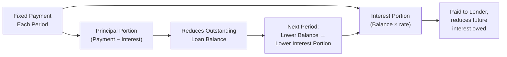
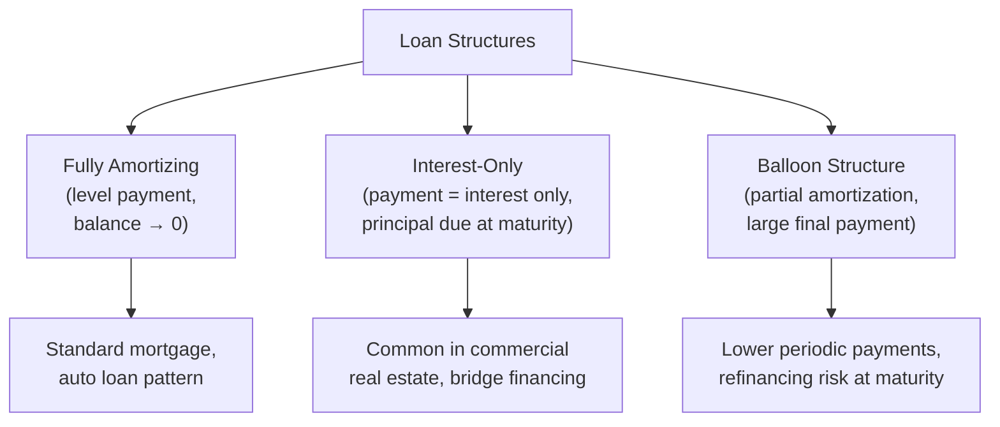

## Loan Amortization Schedules

### Overview

A loan amortization schedule details the periodic breakdown of a loan's repayment over its life, separating each fixed payment into its interest and principal components and tracking the declining loan balance over time. Amortization schedules are a direct application of the ordinary annuity present value formula, and understanding their mechanics is essential for structuring debt instruments, analyzing interest costs, and forecasting cash flow obligations in corporate and personal finance contexts.

### The Foundational Formula: Solving for the Payment Amount

A fully amortizing loan (one that pays down to a zero balance by the end of its term through equal periodic payments) treats the payment stream as an ordinary annuity whose present value equals the loan principal.

$$Payment = \frac{Principal \times r}{1 - (1+r)^{-n}}$$

Where:

- $Principal$ = the original loan amount
- $r$ = the periodic interest rate (annual rate divided by the number of periods per year)
- $n$ = the total number of payment periods

This is simply the ordinary annuity present value formula, $PV = CF \times \left[\frac{1-(1+r)^{-n}}{r}\right]$, rearranged to solve for the payment amount $CF$, given a known present value (the loan principal).

**Example**

A $300,000 loan at a 6% annual rate (0.5% monthly), amortized over 30 years (360 monthly payments):

$$Payment = \frac{\$300{,}000 \times 0.005}{1 - (1.005)^{-360}} = \frac{\$1{,}500}{1 - 0.16604} = \frac{\$1{,}500}{0.83396} = \$1{,}798.65$$

### The Amortization Mechanism: Splitting Each Payment

Each level payment consists of two components that shift proportionally over the life of the loan:

$$InterestPortion_t = Balance_{t-1} \times r$$

$$PrincipalPortion_t = Payment - InterestPortion_t$$

$$Balance_t = Balance_{t-1} - PrincipalPortion_t$$

**Key Points**

- Because the payment amount is fixed but the outstanding balance declines each period, the interest portion of each payment shrinks over time while the principal portion grows — even though the total payment stays constant
- Early in the loan's life, the majority of each payment goes toward interest; late in the loan's life, the majority goes toward principal — this pattern is a direct mathematical consequence of applying a constant rate to a declining balance
- This shifting composition has significant tax and cash flow planning implications, since interest expense is often tax-deductible while principal repayment is not

### Worked Example: Amortization Schedule (First 5 Periods)

Using a simplified example: $50,000 loan, 8% annual rate (compounded/paid annually for simplicity), 5-year term.

**Payment Calculation:**

$$Payment = \frac{\$50{,}000 \times 0.08}{1 - (1.08)^{-5}} = \frac{\$4{,}000}{1 - 0.6806} = \frac{\$4{,}000}{0.3194} = \$12{,}523.87$$

| Year | Beginning Balance | Payment | Interest Portion | Principal Portion | Ending Balance |
| --- | --- | --- | --- | --- | --- |
| 1 | $50,000.00 | $12,523.87 | $4,000.00 | $8,523.87 | $41,476.13 |
| 2 | $41,476.13 | $12,523.87 | $3,318.09 | $9,205.78 | $32,270.35 |
| 3 | $32,270.35 | $12,523.87 | $2,581.63 | $9,942.24 | $22,328.11 |
| 4 | $22,328.11 | $12,523.87 | $1,786.25 | $10,737.62 | $11,590.49 |
| 5 | $11,590.49 | $12,523.87 | $927.24 | $11,596.63* | $0.00 |

*Minor rounding adjustment in the final period to bring the balance exactly to zero.

**Key Points**

- The interest portion declines from $4,000.00 in Year 1 to $927.24 in Year 5, while the principal portion rises from $8,523.87 to $11,596.63 — the total payment remains constant at $12,523.87 throughout
- Total interest paid over the life of this loan: $\$4{,}000.00 + \$3{,}318.09 + \$2{,}581.63 + \$1{,}786.25 + \$927.24 = \$12{,}613.21$
- Total payments over the life of the loan: $5 \times \$12{,}523.87 = \$62{,}619.35$, of which $50,000 is principal repayment and $12,619.35 is cumulative interest (small variance from the sum above due to rounding)

### Amortization Balance at Any Point in Time

The outstanding balance after any given number of payments can be calculated directly, without constructing the full schedule, using the present value of the **remaining** payment stream.

$$Balance_t = Payment \times \left[\frac{1 - (1+r)^{-(n-t)}}{r}\right]$$

**Example**

Using the earlier $300,000, 30-year, 6% mortgage example, what is the remaining balance after 10 years (120 payments) of the 360 total monthly payments?

$$Balance_{120} = \$1{,}798.65 \times \left[\frac{1-(1.005)^{-(360-120)}}{0.005}\right] = \$1{,}798.65 \times \left[\frac{1-(1.005)^{-240}}{0.005}\right]$$

$$Balance_{120} = \$1{,}798.65 \times 139.5808 \approx \$251{,}054$$

**Key Points**

- After 10 years (one-third of the loan term) of payments on this 30-year mortgage, the balance has declined by only about $48,946 (from $300,000 to approximately $251,054) — far less than one-third of the original principal, directly illustrating the front-loaded interest, back-loaded principal pattern characteristic of long-term amortizing loans

### Total Interest Cost Over the Loan Life

$$TotalInterestPaid = (Payment \times n) - Principal$$

**Example**

Using the $300,000, 30-year, 6% mortgage:

$$TotalPayments = \$1{,}798.65 \times 360 = \$647{,}514$$

$$TotalInterestPaid = \$647{,}514 - \$300{,}000 = \$347{,}514$$

**Key Points**

- Over the full 30-year term, total interest paid ($347,514) actually exceeds the original principal borrowed ($300,000) — a striking but mathematically expected result of long-term amortization at typical interest rates
- This total interest figure is highly sensitive to both the interest rate and the loan term — extending the term reduces the periodic payment but substantially increases total interest paid over the life of the loan, while shortening the term has the opposite effect

### Amortizing vs. Interest-Only and Balloon Structures

**Key Points**

- **Fully amortizing loans** — the standard structure covered above, where equal payments fully retire the principal by the final period
- **Interest-only loans** — periodic payments cover only the interest portion, with the entire original principal remaining due (typically as a single balloon payment) at maturity; this structure is common in certain commercial real estate and bridge financing contexts
- **Balloon/partially amortizing loans** — payments are calculated based on a longer amortization schedule (e.g., 30 years) than the loan's actual term (e.g., 7 years), resulting in a lower periodic payment but a large remaining balance due at maturity, which must typically be refinanced or paid off in a lump sum
- [Inference] Because balloon and interest-only structures defer principal repayment, they carry refinancing risk at maturity that a fully amortizing loan does not — a consideration relevant to credit analysis and debt structuring decisions

### Amortization Schedule in Corporate Debt Analysis

**Key Points**

- Corporate debt schedules used in three-statement and LBO financial models rely on the same amortization mechanics to project interest expense and principal repayment cash outflows period by period
- Accurately separating interest and principal within each debt payment is essential for correctly linking the debt schedule to the Income Statement (interest expense) and the Cash Flow Statement (principal repayment within financing activities), since only the interest portion flows through the Income Statement
- Prepayment options, cash sweep mechanisms (directing excess free cash flow toward accelerated principal paydown), and variable-rate resets all modify the standard fixed-payment amortization schedule and require more complex, often iterative modeling approaches
- [Unverified] Specific amortization conventions (e.g., day-count basis, payment timing assumptions) can vary by loan agreement and jurisdiction; the exact schedule for any specific credit facility should be verified against its governing loan agreement terms

### Extra Principal Payments and Accelerated Amortization

**Key Points**

- Making payments in excess of the scheduled amount, applied entirely to principal, reduces the outstanding balance faster than the standard schedule, which correspondingly reduces all future interest charges (since interest is calculated on the declining balance) and shortens the effective loan term
- Because interest in early periods represents a larger share of the payment on a long-term amortizing loan, extra principal payments made **earlier** in the loan term generate substantially greater total interest savings than equivalent extra payments made later, due to the greater number of remaining periods over which the reduced balance avoids accruing interest

### Common Errors in Amortization Analysis

- Applying an annual interest rate directly to a monthly payment schedule without first converting to the correct periodic (monthly) rate
- Confusing the total payment amount with the principal repayment amount, particularly in early-period analysis where interest dominates the payment
- Failing to account for balloon or interest-only structures when assuming a loan is fully self-amortizing by its stated maturity date
- Ignoring the compounding period mismatch when the loan's stated compounding frequency differs from its payment frequency, which requires an Effective Annual Rate conversion for accurate analysis

### Conclusion

Loan amortization schedules apply the ordinary annuity present value formula to determine a fixed periodic payment that fully retires a loan's principal over a specified term, then decompose each payment into its shifting interest and principal components based on the declining outstanding balance. Understanding this mechanism — including the front-loaded interest pattern inherent in long-term amortizing debt, and the distinctions between fully amortizing, interest-only, and balloon structures — is essential for accurately modeling debt schedules, forecasting interest expense, and analyzing total borrowing costs in both corporate and personal finance contexts.

**Related Topics**

- Annuities and perpetuities (the mathematical foundation of amortization)
- Compounding frequency and effective annual rates
- Debt schedule construction in three-statement financial models
- Bond pricing and yield-to-maturity calculations
- Leveraged buyout (LBO) debt paydown modeling
- Present value and future value fundamentals