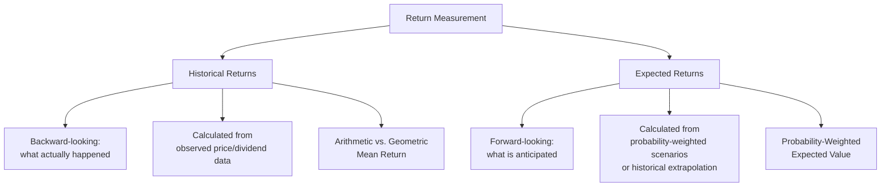

## Measuring Historical and Expected Returns

### Overview

Return measurement is the foundation of risk and asset pricing analysis in corporate finance. Historical returns quantify what an investment actually earned over a past period, while expected returns represent a forward-looking estimate of what an investment is anticipated to earn, typically derived from probability-weighted scenarios or historical data extrapolation. Both measures are essential inputs to portfolio construction, cost of capital estimation, and investment decision-making, though they answer fundamentally different questions and require different calculation techniques.

### Historical vs. Expected Returns: The Core Distinction

**Key Points**

- Historical returns are objective, calculated directly from observed past price and income data — there is a single, verifiable correct answer given the data
- Expected returns are inherently subjective estimates of the future, requiring either a probability distribution over future outcomes or an assumption that historical patterns will persist going forward
- Analysts frequently use historical returns as a starting point or proxy for estimating expected returns, but this substitution embeds an assumption that historical patterns are representative of future conditions — an assumption that should be made explicitly, not implicitly

### Calculating a Single-Period Holding Period Return

The basic building block for return measurement is the holding period return (HPR) for a single period.

$$HPR = \frac{P_1 - P_0 + D_1}{P_0}$$

Where:

- $P_0$ = beginning price
- $P_1$ = ending price
- $D_1$ = any income (dividends, interest) received during the period

**Example**

A stock is purchased at $50, pays a $1.50 dividend during the year, and ends the year at $54:

$$HPR = \frac{\$54 - \$50 + \$1.50}{\$50} = \frac{\$5.50}{\$50} = 11.0\%$$

### Arithmetic Mean Return

When measuring average return across multiple historical periods, the arithmetic mean is the simple average of each period's individual return.

$$ArithmeticMean = \frac{1}{n}\sum_{t=1}^{n} r_t$$

**Example**

A stock has annual returns of 10%, -5%, 15%, and 8% over four years:

$$ArithmeticMean = \frac{10\% + (-5\%) + 15\% + 8\%}{4} = \frac{28\%}{4} = 7.0\%$$

### Geometric Mean Return

The geometric mean return reflects the actual compound growth rate achieved over the full multi-period holding period, correctly accounting for the compounding effect of sequential returns.

$$GeometricMean = \left[\prod_{t=1}^{n}(1+r_t)\right]^{\frac{1}{n}} - 1$$

**Example**

Using the same returns (10%, -5%, 15%, 8%):

$$GeometricMean = \left[(1.10)(0.95)(1.15)(1.08)\right]^{\frac{1}{4}} - 1$$

$$= [1.3007]^{0.25} - 1 = 1.0678 - 1 = 6.78\%$$

**Key Points**

- The geometric mean (6.78%) is always less than or equal to the arithmetic mean (7.0%) for any series with return variability — the two are equal only when all periodic returns are identical
- This gap, sometimes called "variance drain" or "volatility drag," widens as the variability (standard deviation) of periodic returns increases — more volatile return series show a larger divergence between arithmetic and geometric means
- The **geometric mean is the correct measure for describing actual historical compound performance** over a multi-period holding period — it answers "what constant annual return would have produced this actual ending value"
- The **arithmetic mean is generally the more appropriate measure for estimating expected return in a single future period**, since it represents the simple average of possible one-period outcomes without the compounding distortion

### When to Use Arithmetic vs. Geometric Mean

| Purpose | Appropriate Measure | Rationale |
| --- | --- | --- |
| Describing actual historical multi-year performance | Geometric Mean | Reflects true compound growth achieved |
| Estimating expected return for a single future period | Arithmetic Mean | Unbiased estimator of one-period expected value |
| Estimating expected return over a long future multi-year horizon | [Unverified] Debated; often geometric or a blend | Long-horizon compounding effects and estimation uncertainty are both relevant considerations |

**Key Points**

- [Unverified] The appropriate choice for long-horizon expected return estimation (as opposed to single-period or purely historical description) remains a genuinely debated topic in finance theory and practice, with reasonable arguments and practitioner approaches supporting both arithmetic-based and geometric-based methods depending on the specific application and time horizon involved

### Expected Return: Probability-Weighted Approach

When explicit future scenarios and their probabilities are specified (rather than relying solely on historical data), expected return is calculated as a probability-weighted average of possible outcomes.

$$E(R) = \sum_{i=1}^{n} p_i \times r_i$$

Where $p_i$ is the probability of scenario $i$ and $r_i$ is the return under that scenario.

**Example**

An analyst estimates three economic scenarios for a stock's return next year:

| Scenario | Probability | Return |
| --- | --- | --- |
| Recession | 20% | -10% |
| Normal Growth | 50% | 8% |
| Strong Growth | 30% | 18% |

$$E(R) = (0.20 \times -10\%) + (0.50 \times 8\%) + (0.30 \times 18\%)$$

$$E(R) = -2.0\% + 4.0\% + 5.4\% = 7.4\%$$

**Key Points**

- This probability-weighted approach requires the assigned probabilities to sum to 100% and requires the analyst to specify a complete, mutually exclusive set of scenarios — in practice, this is a simplification of a continuous range of possible outcomes into a manageable discrete set
- The quality of a probability-weighted expected return estimate depends entirely on the quality and reasonableness of the underlying scenario probabilities and return assumptions, which are inherently subjective judgments

### Annualizing Returns from Sub-Annual Periods

When returns are measured over periods shorter than a year (monthly, quarterly), they are typically annualized for comparison purposes.

$$AnnualizedReturn = (1+r_{period})^{periods\ per\ year} - 1$$

**Example**

A fund returns 2% in a single quarter. The annualized equivalent, assuming this rate compounds consistently across all four quarters:

$$AnnualizedReturn = (1.02)^4 - 1 = 1.0824 - 1 = 8.24\%$$

**Key Points**

- This calculation assumes the quarterly return rate would be sustained consistently across all four quarters — a simplifying assumption, not a guarantee of actual future performance
- Annualizing based on a single observed sub-period return can be misleading if that period was unusually strong or weak relative to a typical period; annualizing an average of multiple historical sub-periods (rather than extrapolating from a single period) generally provides a more robust estimate

### Real vs. Nominal Returns

**Key Points**

- **Nominal returns** reflect the raw, unadjusted percentage change in value plus income, as conventionally quoted
- **Real returns** adjust the nominal return for the effect of inflation, reflecting the actual change in purchasing power
- The approximate relationship: $RealReturn \approx NominalReturn - InflationRate$
- The more precise (Fisher) relationship: $$1 + RealReturn = \frac{1+NominalReturn}{1+InflationRate}$$
- Distinguishing real from nominal returns is particularly important when comparing returns across different time periods with materially different inflation environments, or when making long-horizon retirement or capital budgeting projections

**Example**

A nominal return of 8% during a period with 3% inflation:

**Approximate:** $RealReturn \approx 8\% - 3\% = 5\%$

**Precise (Fisher):** $1 + RealReturn = \frac{1.08}{1.03} = 1.0485 \Rightarrow RealReturn = 4.85%$

### Risk-Adjusted Return Context

**Key Points**

- Raw historical or expected return figures, viewed in isolation, provide an incomplete picture of investment quality — a higher return achieved with substantially higher risk (variability) may not represent superior risk-adjusted performance
- Return measurement is typically paired with risk measurement (standard deviation, variance, beta) to produce risk-adjusted performance metrics such as the Sharpe ratio, which are more informative for comparing investments of differing risk profiles
- [Inference] Because return and risk are jointly determined by the same underlying data, robust investment and capital budgeting analysis generally reports expected or historical return alongside an explicit risk measure, rather than return figures in isolation

### Using Historical Data to Estimate Expected Returns

**Key Points**

- A common practical approach estimates expected return for an asset class or security by calculating the historical arithmetic (or sometimes geometric) mean return over a sufficiently long historical period, under the assumption that this historical average is a reasonable proxy for future expected performance
- This approach embeds a significant assumption — that the future return-generating process resembles the historical period observed — which may not hold, particularly over shorter historical windows, following structural market changes, or for asset classes/companies whose fundamental characteristics have shifted materially
- [Inference] Given this embedded assumption, the choice of historical lookback period (e.g., 5 years vs. 30 years vs. since-inception) can materially affect the resulting expected return estimate, and this sensitivity should generally be acknowledged and, where practical, tested via sensitivity analysis across multiple lookback windows rather than relying on a single historical period

### Conclusion

Measuring historical and expected returns requires distinguishing between backward-looking, objectively calculable historical performance (using arithmetic mean for period-by-period averaging and geometric mean for describing actual compound growth) and forward-looking, inherently subjective expected return estimates (derived from probability-weighted scenarios or extrapolated from historical data under an explicit or implicit stationarity assumption). These return measures form the essential input layer for subsequent risk and asset pricing analysis, including portfolio construction, the Capital Asset Pricing Model, and cost of capital estimation.

**Related Topics**

- Risk measurement: standard deviation, variance, and beta
- Capital Asset Pricing Model (CAPM) and required return estimation
- Sharpe ratio and other risk-adjusted performance measures
- Portfolio diversification and modern portfolio theory
- Weighted Average Cost of Capital (WACC) estimation
- Equity risk premium estimation methodologies