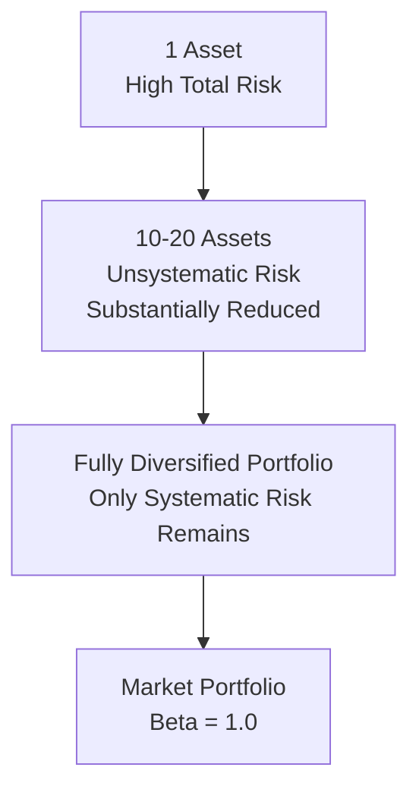

## Diversification and Portfolio Risk

### Overview

Diversification is the strategy of combining multiple assets into a portfolio to reduce total risk without proportionally sacrificing expected return. This works because individual asset price movements are not perfectly correlated, allowing some fluctuations to offset one another. Understanding diversification requires decomposing total risk into its systematic and unsystematic components.

### Decomposing Total Risk

**Key Points**

- **Total Risk** = Systematic Risk + Unsystematic Risk
- **Systematic Risk** (market risk, non-diversifiable risk): Affects all assets in the market to varying degrees — e.g., interest rate changes, recessions, geopolitical shocks
- **Unsystematic Risk** (idiosyncratic, firm-specific, diversifiable risk): Affects a single company or industry — e.g., a factory fire, a product recall, a lawsuit, management turnover

$$\sigma_i^2 = \underbrace{\beta_i^2 \sigma_m^2}_{\text{Systematic}} + \underbrace{\sigma_{\epsilon}^2}_{\text{Unsystematic}}$$

Where $\beta_i$ is the asset's beta, $\sigma_m^2$ is market variance, and $\sigma_\epsilon^2$ is the variance of the firm-specific (residual) component.

### Two-Asset Portfolio Variance

For a portfolio of two assets A and B with weights $w_A$ and $w_B$ (where $w_A + w_B = 1$):

$$\sigma_p^2 = w_A^2\sigma_A^2 + w_B^2\sigma_B^2 + 2w_Aw_B\,\text{Cov}(R_A,R_B)$$

Since covariance can be expressed via the correlation coefficient $\rho_{A,B}$:

$$\text{Cov}(R_A,R_B) = \rho_{A,B}\,\sigma_A\,\sigma_B$$

The formula becomes:

$$\sigma_p^2 = w_A^2\sigma_A^2 + w_B^2\sigma_B^2 + 2w_Aw_B\,\rho_{A,B}\,\sigma_A\,\sigma_B$$

Portfolio standard deviation is the square root of this expression:

$$\sigma_p = \sqrt{w_A^2\sigma_A^2 + w_B^2\sigma_B^2 + 2w_Aw_B\,\rho_{A,B}\,\sigma_A\,\sigma_B}$$

### The Critical Role of Correlation ($\rho$)

**Key Points**

- $\rho = +1$: Perfect positive correlation — no diversification benefit; portfolio risk is a simple weighted average of individual risks
- $\rho = 0$: No correlation — some diversification benefit; portfolio risk is less than the weighted average
- $\rho = -1$: Perfect negative correlation — maximum diversification benefit; it is theoretically possible to construct a zero-risk portfolio
- Most real-world asset pairs have $-1 < \rho < 1$, typically positive but less than 1, which still provides meaningful risk reduction

### Worked Example

Consider two stocks:

| Asset | Weight | Expected Return | Standard Deviation |
| --- | --- | --- | --- |
| Stock A | 60% | 10% | 20% |
| Stock B | 40% | 15% | 30% |

Assume $\rho_{A,B} = 0.3$.

**Step 1 — Portfolio Expected Return**

$$E(R_p) = w_A E(R_A) + w_B E(R_B) = 0.6(0.10) + 0.4(0.15) = 0.06 + 0.06 = 0.12$$

$E(R_p) = 12\%$

**Step 2 — Portfolio Variance**

$$\sigma_p^2 = (0.6)^2(0.20)^2 + (0.4)^2(0.30)^2 + 2(0.6)(0.4)(0.3)(0.20)(0.30)$$

$$\sigma_p^2 = (0.36)(0.04) + (0.16)(0.09) + 2(0.24)(0.3)(0.06)$$

$$\sigma_p^2 = 0.0144 + 0.0144 + 0.00864 = 0.03744$$

**Step 3 — Portfolio Standard Deviation**

$$\sigma_p = \sqrt{0.03744} \approx 0.1935$$

**Output**

- Portfolio Expected Return: 12%
- Portfolio Standard Deviation: ≈19.35%

Note that 19.35% is lower than the simple weighted average of the individual standard deviations ($0.6 \times 20\% + 0.4 \times 30\% = 24\%$), illustrating the diversification benefit even at a modest positive correlation of 0.3.

### Comparing Correlation Scenarios (Same Weights and Assets)

| Correlation ($\rho$) | Portfolio Std Dev |
| --- | --- |
| +1.0 | 24.00% |
| +0.3 | 19.35% |
| 0.0 | 16.65% |
| -1.0 | 0.00% |

This table demonstrates that as correlation decreases, portfolio risk falls, even though expected return remains unchanged at 12%.

### The Diversification Curve

As the number of assets in a portfolio increases, unsystematic risk is progressively diversified away, while systematic risk remains regardless of how many assets are added.

<svg xmlns="http://www.w3.org/2000/svg" viewBox="0 0 600 350" font-family="Arial, sans-serif">
<text x="300" y="20" text-anchor="middle" font-size="14" font-weight="bold">Diversification and Number of Assets (svg_diagram)</text>
<line x1="60" y1="300" x2="560" y2="300" stroke="black" stroke-width="1" />
<line x1="60" y1="300" x2="60" y2="40" stroke="black" stroke-width="1" />
<text x="300" y="330" text-anchor="middle" font-size="12">Number of Assets in Portfolio</text>
<text x="25" y="170" text-anchor="middle" font-size="12" transform="rotate(-90 25 170)">Portfolio Risk</text>
<path d="M 60 60 Q 150 120 250 220 Q 350 270 560 275" fill="none" stroke="#2c6fbb" stroke-width="2.5" />
<line x1="60" y1="275" x2="560" y2="275" stroke="#c0392b" stroke-width="2" stroke-dasharray="6,3" />
<text x="450" y="250" font-size="11" fill="#2c6fbb">Total Risk</text>
<text x="450" y="290" font-size="11" fill="#c0392b">Systematic Risk (irreducible)</text>
<text x="100" y="55" font-size="11" fill="#555">Unsystematic Risk</text>
<line x1="150" y1="60" x2="150" y2="230" stroke="#888" stroke-dasharray="2,2" />
</svg>

### Number of Assets and Diversification Benefit

[Inference] Empirical studies commonly cited in finance textbooks suggest that a portfolio of approximately 20-30 randomly selected domestic stocks captures most of the diversifiable risk reduction available within a single asset class, though the exact number varies by market, time period, and correlation structure across the specific assets chosen.

### Systematic Risk and Beta

Since diversification eliminates unsystematic risk, investors are only compensated for bearing systematic risk. This is measured by beta ($\beta$):

$$\beta_i = \frac{\text{Cov}(R_i, R_m)}{\sigma_m^2}$$

Where $R_m$ is the market return. Beta quantifies an asset's sensitivity to market-wide movements and is the risk measure used in the Capital Asset Pricing Model (CAPM) — because unsystematic risk can be diversified away at no cost, it is not priced (i.e., not rewarded with additional expected return).

### Efficient Frontier Concept

Combining assets across the full range of possible weights produces a set of portfolios; plotting expected return against standard deviation traces out the feasible set. The efficient frontier represents the subset of portfolios offering the highest expected return for each level of risk (or, equivalently, the lowest risk for each level of expected return).

### International and Asset-Class Diversification

**Key Points**

- Diversifying across asset classes (equities, bonds, real estate, commodities) reduces risk more than diversifying only within one asset class, since cross-asset-class correlations tend to be lower
- International diversification can further reduce risk when foreign markets are not perfectly correlated with the domestic market
- [Unverified] Global diversification benefits may diminish during systemic crises, when correlations across asset classes and geographies tend to rise ("correlations go to 1 in a crisis"), reducing the protective effect precisely when it is most needed

### Limitations of Diversification

- Cannot eliminate systematic risk regardless of the number of assets held
- Transaction costs and taxes can reduce the practical benefit of holding many small positions
- Over-diversification may dilute returns without meaningfully reducing risk beyond a certain portfolio size
- Correlations are not static and estimating them from historical data introduces estimation risk; correlations can shift, especially during market stress

### Applications in Corporate Finance

- **Portfolio Construction**: Asset managers use covariance/correlation matrices to build portfolios along the efficient frontier
- **Capital Budgeting**: Firms may evaluate whether a new project is correlated with existing operations, since low-correlation projects can reduce firm-level cash flow volatility
- **Mergers & Acquisitions**: Conglomerate diversification arguments are debated, since shareholders can often diversify more cheaply themselves by holding a portfolio of stocks
- **Risk Management**: Diversification principles inform hedging strategy design and enterprise risk management frameworks

**Next Steps**

- Covariance and correlation coefficient calculation
- The efficient frontier and Modern Portfolio Theory (Markowitz)
- Capital Asset Pricing Model (CAPM) and the Security Market Line
- Beta estimation and its determinants
- Capital Market Line vs. Security Market Line
- Multi-asset (n-asset) portfolio variance-covariance matrix formulation
- International portfolio diversification and currency risk