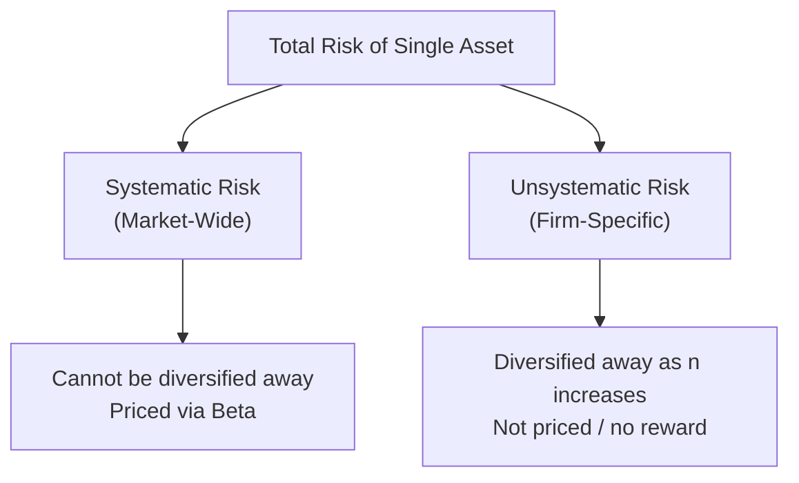

## Systematic Versus Unsystematic Risk

### Overview

Total risk borne by an investor holding a single asset can be split into two fundamentally different components: risk that affects the entire market (systematic) and risk that is specific to an individual company or industry (unsystematic). This distinction is central to modern asset pricing theory because only one of these components is rewarded with a risk premium.

### Definitions

**Systematic Risk** (also called market risk, non-diversifiable risk, or undiversifiable risk): Risk arising from factors that affect the broad market or economy as a whole. It cannot be eliminated through diversification because it affects all assets simultaneously, to varying degrees.

**Unsystematic Risk** (also called idiosyncratic risk, firm-specific risk, diversifiable risk, or residual risk): Risk arising from factors specific to a single company, industry, or small group of assets. It can be substantially reduced or eliminated by holding a well-diversified portfolio.

### Total Risk Decomposition

$$\sigma_i^2 = \beta_i^2\sigma_m^2 + \sigma_{\epsilon_i}^2$$

| Component | Symbol | Description |
| --- | --- | --- |
| Total Variance | $\sigma_i^2$ | Overall variance of asset $i$'s returns |
| Systematic Variance | $\beta_i^2\sigma_m^2$ | Portion of variance explained by market movements |
| Unsystematic Variance | $\sigma_{\epsilon_i}^2$ | Residual, firm-specific variance (the error term in a market model regression) |

This decomposition derives from the single-index (market) model:

$$R_i = \alpha_i + \beta_i R_m + \epsilon_i$$

Where $\epsilon_i$ is the firm-specific residual, assumed uncorrelated with $R_m$ and with residuals of other assets.

### Sources of Systematic Risk

**Key Points**

- Interest rate changes (affecting discount rates and borrowing costs economy-wide)
- Inflation and monetary policy shifts
- Recessions and broad economic cycles
- Geopolitical events (wars, trade policy shifts)
- Changes in GDP growth expectations
- Currency and exchange rate fluctuations (for multinational exposure)
- Broad regulatory or tax policy changes affecting all firms

### Sources of Unsystematic Risk

**Key Points**

- Management decisions and executive turnover
- Product recalls, litigation, or reputational events specific to one company
- Labor strikes at a specific firm or plant
- A single competitor entering or exiting the market
- Technological obsolescence of one company's product line
- Supply chain disruption affecting one firm or narrow industry
- Credit rating downgrade specific to an issuer

### Why Unsystematic Risk Can Be Diversified Away

When firm-specific shocks are largely uncorrelated across companies, combining many assets causes these idiosyncratic effects to average out. Formally, for an equally weighted portfolio of $n$ assets with average unsystematic variance $\bar{\sigma}_\epsilon^2$:

$$\sigma_{\epsilon,p}^2 = \frac{\bar{\sigma}_\epsilon^2}{n}$$

As $n \to \infty$, $\sigma_{\epsilon,p}^2 \to 0$. Systematic risk, in contrast, does not diminish with $n$ because $\beta_i^2\sigma_m^2$ terms are correlated by construction (all tied to the same market factor).

<svg viewBox="0 0 600 320" xmlns="http://www.w3.org/2000/svg" font-family="Arial, sans-serif">
<text x="300" y="20" text-anchor="middle" font-size="14" font-weight="bold">Risk Reduction as Portfolio Size Grows (svg_diagram)</text>
<line x1="60" y1="270" x2="560" y2="270" stroke="black" stroke-width="1"/>
<line x1="60" y1="270" x2="60" y2="40" stroke="black" stroke-width="1"/>
<text x="300" y="300" text-anchor="middle" font-size="12">Number of Assets (n)</text>
<text x="25" y="150" text-anchor="middle" font-size="12" transform="rotate(-90 25 150)">Portfolio Risk</text>
<path d="M 60 60 Q 140 130 220 200 Q 300 240 560 245" fill="none" stroke="#2c6fbb" stroke-width="2.5" fill="none"/>
<line x1="60" y1="245" x2="560" y2="245" stroke="#c0392b" stroke-width="2" stroke-dasharray="6,3"/>
<text x="420" y="225" font-size="11" fill="#2c6fbb">Total Risk (declining)</text>
<text x="420" y="262" font-size="11" fill="#c0392b">Systematic Risk (flat floor)</text>
</svg>

### Why Only Systematic Risk Is Priced

Because unsystematic risk can be eliminated at no cost simply by holding a diversified portfolio, rational, diversified investors do not require compensation for bearing it. If two assets had identical systematic risk but different total risk (due to differing unsystematic risk), a diversified investor could hold both to eliminate the unsystematic component, so market pricing does not reward it. This principle underlies the Capital Asset Pricing Model (CAPM):

$$E(R_i) = R_f + \beta_i\left(E(R_m) - R_f\right)$$

Only $\beta_i$ (the standardized measure of systematic risk) appears in the pricing equation — total standard deviation ($\sigma_i$) does not.

### Worked Example

A stock has a total return standard deviation of $\sigma_i = 35\%$. Regression against the market index yields $\beta_i = 1.2$, and the market's standard deviation is $\sigma_m = 18\%$.

**Step 1 — Systematic Variance**

$$\text{Systematic Variance} = \beta_i^2\sigma_m^2 = (1.2)^2(0.18)^2 = 1.44 \times 0.0324 = 0.046656$$

**Step 2 — Total Variance**

$$\sigma_i^2 = (0.35)^2 = 0.1225$$

**Step 3 — Unsystematic Variance (residual)**

$$\sigma_{\epsilon}^2 = \sigma_i^2 - \beta_i^2\sigma_m^2 = 0.1225 - 0.046656 = 0.075844$$

**Output**

- Total Variance: 0.1225
- Systematic Variance: 0.046656 (≈38.1% of total)
- Unsystematic Variance: 0.075844 (≈61.9% of total)

This indicates that a majority of this particular stock's total risk is firm-specific and would be substantially reduced if held within a diversified portfolio rather than in isolation.

### R-Squared as a Measure of Systematic Risk Proportion

The $R^2$ from the market model regression directly measures the proportion of total variance explained by systematic (market) factors:

$$R^2 = \frac{\beta_i^2\sigma_m^2}{\sigma_i^2}$$

Using the example above:

$$R^2 = \frac{0.046656}{0.1225} \approx 0.381$$

An $R^2$ of approximately 38.1% confirms that systematic factors explain about 38% of this stock's return variance, with the remaining ~62% attributable to firm-specific factors — consistent with the earlier decomposition.

### Comparative Summary Table

| Attribute | Systematic Risk | Unsystematic Risk |
| --- | --- | --- |
| Source | Market/economy-wide factors | Firm/industry-specific factors |
| Diversifiable? | No | Yes |
| Measured by | Beta ($\beta$) | Residual standard deviation ($\sigma_\epsilon$) |
| Priced in CAPM? | Yes | No |
| Behavior as $n$ increases | Remains constant | Approaches zero |
| Examples | Recession, interest rate hikes | Lawsuit, product recall, CEO scandal |

### Limitations and Caveats

- The clean separation into two components relies on the single-index market model; real-world return generation may involve multiple systematic factors (as in multi-factor models like Fama-French)
- [Inference] Beta estimates are sensitive to the choice of market proxy, estimation window, and return frequency used in the regression, so a stock's measured beta can vary meaningfully depending on methodology
- Correlations among "unsystematic" residuals are assumed to be zero for the diversification argument to hold perfectly; in practice, some cross-firm correlation in residuals may exist (e.g., within the same industry), which slows the rate of unsystematic risk reduction
- Behavior of beta over time is not guaranteed to remain stable; a firm's business mix, leverage, or industry conditions can change its systematic risk exposure

### Applications in Corporate Finance

- **Cost of Equity Estimation**: CAPM uses beta (systematic risk only) to estimate required return on equity for capital budgeting discount rates
- **Capital Structure Decisions**: Financial leverage increases equity beta (levered beta), amplifying systematic risk borne by shareholders
- **Performance Attribution**: Distinguishing alpha (skill) from beta (market exposure) in evaluating portfolio manager performance
- **Risk Management**: Corporate hedging programs typically target unsystematic and specific operational risks (e.g., commodity price hedges), while systematic/market risk exposure is often deliberately retained since equity holders are compensated for bearing it

**Related Topics**

- Beta estimation via regression (market model)
- Capital Asset Pricing Model (CAPM) and the Security Market Line
- Multi-factor models (Fama-French three-factor and five-factor models)
- Levered vs. unlevered beta and the effect of financial leverage
- Diversification and the number of assets needed to eliminate unsystematic risk
- Arbitrage Pricing Theory (APT)