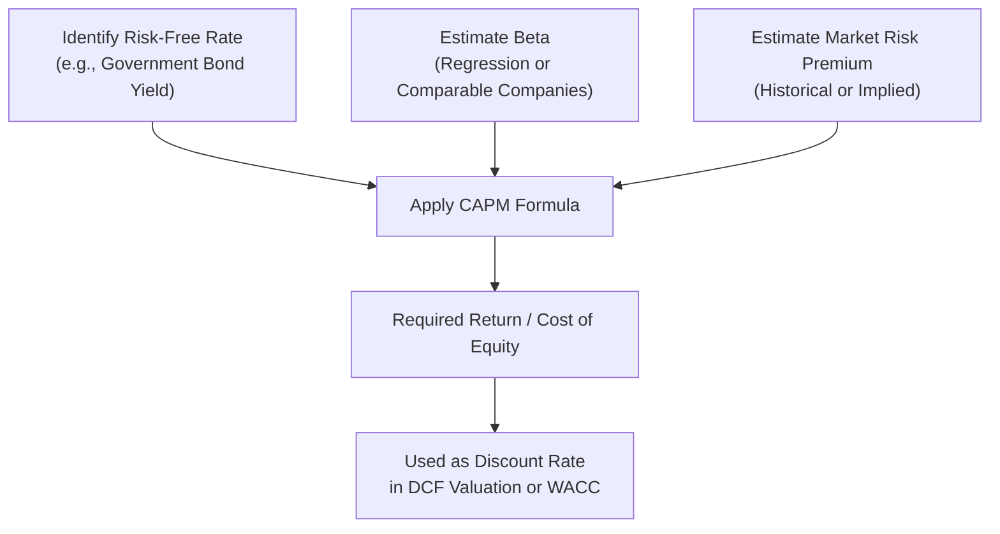

## The Capital Asset Pricing Model

### Overview

The Capital Asset Pricing Model (CAPM) is a foundational asset pricing framework that describes the relationship between systematic risk and expected return for an asset. Developed independently by William Sharpe, John Lintner, and Jan Mossin building on Harry Markowitz's portfolio theory, CAPM provides a formula for calculating the required (expected) rate of return on an asset given its level of non-diversifiable risk.

### The CAPM Formula

$$E(R_i) = R_f + \beta_i\left(E(R_m) - R_f\right)$$

| Symbol | Meaning |
| --- | --- |
| $E(R_i)$ | Expected (required) return on asset $i$ |
| $R_f$ | Risk-free rate |
| $\beta_i$ | Beta of asset $i$ (systematic risk measure) |
| $E(R_m)$ | Expected return on the market portfolio |
| $E(R_m) - R_f$ | Market risk premium (equity risk premium) |

The term $\beta_i\left(E(R_m) - R_f\right)$ represents the risk premium specific to asset $i$, scaled by its sensitivity to market movements.

### Core Assumptions

**Key Points**

- Investors are rational, risk-averse, and seek to maximize expected utility of terminal wealth
- Markets are frictionless: no taxes, no transaction costs, no restrictions on short selling
- All investors have homogeneous expectations regarding expected returns, variances, and covariances
- Investors can borrow and lend unlimited amounts at the risk-free rate
- All assets are infinitely divisible and perfectly liquid
- Investors hold diversified portfolios, so only systematic risk is relevant and priced
- A single-period investment horizon is assumed for all investors

[Inference] Many of these assumptions are simplifications that do not hold precisely in real markets (e.g., borrowing and lending rates typically differ, and investor expectations are rarely fully homogeneous), which is a common critique used to explain observed deviations between CAPM predictions and empirical asset returns.

### Deriving Beta

Beta measures an asset's covariance with the market relative to the market's own variance:

$$\beta_i = \frac{\text{Cov}(R_i, R_m)}{\text{Var}(R_m)} = \frac{\rho_{i,m}\,\sigma_i\,\sigma_m}{\sigma_m^2} = \rho_{i,m}\frac{\sigma_i}{\sigma_m}$$

**Interpretation of Beta Values**

| Beta Value | Interpretation |
| --- | --- |
| $\beta = 0$ | No correlation with market; theoretically same risk profile as the risk-free asset |
| $0 < \beta < 1$ | Less volatile than the market (defensive stock) |
| $\beta = 1$ | Moves in line with the market |
| $\beta > 1$ | More volatile than the market (aggressive stock) |
| $\beta < 0$ | Moves inversely to the market (rare; e.g., some gold miners or inverse ETFs) |

### The Security Market Line (SML)

The SML is the graphical representation of CAPM, plotting expected return against beta. It is linear by construction, passing through the risk-free rate at $\beta = 0$ and the market return at $\beta = 1$.

<svg xmlns="http://www.w3.org/2000/svg" viewBox="0 0 600 400" font-family="Arial, sans-serif">
<text x="300" y="20" text-anchor="middle" font-size="14" font-weight="bold">Security Market Line (svg_diagram)</text>
<line x1="70" y1="340" x2="560" y2="340" stroke="black" stroke-width="1" />
<line x1="70" y1="340" x2="70" y2="40" stroke="black" stroke-width="1" />
<text x="315" y="375" text-anchor="middle" font-size="12">Beta (β)</text>
<text x="30" y="190" text-anchor="middle" font-size="12" transform="rotate(-90 30 190)">Expected Return</text>
<line x1="70" y1="300" x2="530" y2="80" stroke="#2c6fbb" stroke-width="2.5" />
<circle cx="70" cy="300" r="4" fill="#2c6fbb" />
<text x="55" y="320" font-size="11">Rf</text>
<circle cx="300" cy="190" r="4" fill="#c0392b" />
<text x="290" y="215" font-size="11">Market (β=1)</text>
<line x1="300" y1="340" x2="300" y2="190" stroke="#888" stroke-dasharray="3,3" />
<circle cx="450" cy="115" r="5" fill="#27ae60" />
<text x="420" y="105" font-size="11" fill="#27ae60">Undervalued (above SML)</text>
<circle cx="450" cy="230" r="5" fill="#e67e22" />
<text x="420" y="255" font-size="11" fill="#e67e22">Overvalued (below SML)</text>
<text x="500" y="360" font-size="12">β = 2</text>
<text x="80" y="360" font-size="12">β = 0</text>
</svg>

Assets plotting **above** the SML are considered undervalued (offering higher return than warranted by their risk, so the market is expected to bid up their price), while assets plotting **below** the SML are considered overvalued.

### Worked Example

Given:

- Risk-free rate ($R_f$) = 4%
- Expected market return ($E(R_m)$) = 11%
- Beta of Stock X ($\beta_X$) = 1.4

**Step 1 — Market Risk Premium**

$$E(R_m) - R_f = 0.11 - 0.04 = 0.07$$

**Step 2 — Apply CAPM Formula**

$$E(R_X) = 0.04 + 1.4(0.07) = 0.04 + 0.098 = 0.138$$

**Output**

- Required Return on Stock X: 13.8%

This 13.8% represents the minimum return investors should demand for holding Stock X, given its systematic risk level, and is commonly used as the cost of equity in discounted cash flow valuation.

### Estimating Beta in Practice

Beta is typically estimated via linear regression of an asset's historical excess returns against the market's excess returns:

$$R_i - R_f = \alpha_i + \beta_i(R_m - R_f) + \epsilon_i$$

**Key Points**

- Commonly uses 3-5 years of monthly return data against a broad market index (e.g., S&P 500)
- $\alpha_i$ (the intercept) represents historical excess return not explained by market exposure
- Betas are often "adjusted" toward 1.0 (e.g., using the Blume adjustment: $\beta_{adjusted} = 0.67\beta_{raw} + 0.33(1.0)$) based on the empirical tendency of betas to revert toward the market average over time
- [Unverified] The degree of mean reversion in beta varies across studies, time periods, and industries, so the specific adjustment weights used in practice are somewhat convention-based rather than universally derived constants

### Levered vs. Unlevered Beta

Financial leverage amplifies equity risk, so betas must often be adjusted when comparing firms with different capital structures (e.g., in comparable company analysis).

**Unlevering (Hamada Equation):**

$$\beta_{unlevered} = \frac{\beta_{levered}}{1 + (1-t)\dfrac{D}{E}}$$

**Relevering for a target capital structure:**

$$\beta_{levered} = \beta_{unlevered}\left[1 + (1-t)\dfrac{D}{E}\right]$$

Where $t$ is the corporate tax rate, $D$ is market value of debt, and $E$ is market value of equity.

### Worked Example — Unlevering and Relevering Beta

A comparable firm has a levered beta of 1.5, debt-to-equity ratio of 0.8, and a tax rate of 25%.

**Step 1 — Unlever the Beta**

$$\beta_{unlevered} = \frac{1.5}{1 + (1-0.25)(0.8)} = \frac{1.5}{1 + 0.6} = \frac{1.5}{1.6} = 0.9375$$

**Step 2 — Relever for Target Firm** (assume target D/E = 0.5, same tax rate)

$$\beta_{levered,target} = 0.9375\left[1 + (0.75)(0.5)\right] = 0.9375(1.375) \approx 1.289$$

**Output**

- Unlevered (asset) Beta: 0.9375
- Relevered Beta for Target Capital Structure: ≈1.289

### CAPM Application Workflow

### Uses in Corporate Finance

- **Cost of Equity Estimation**: CAPM is the most widely used method to estimate the cost of equity ($r_e$) for the Weighted Average Cost of Capital (WACC)
- **Capital Budgeting**: Provides the discount rate for project-specific or firm-wide NPV analysis
- **Performance Evaluation**: Used to compute Jensen's Alpha, measuring risk-adjusted excess portfolio return:

$$\alpha_p = R_p - \left[R_f + \beta_p(R_m - R_f)\right]$$

- **Capital Structure Analysis**: Beta relevering supports valuation of private companies or divisions lacking their own market-traded beta

### Empirical Critiques and Limitations

**Key Points**

- Empirical tests (e.g., Fama and French, 1992, 1993) found that beta alone has limited power in explaining cross-sectional variation in average stock returns, motivating the development of multi-factor models
- The Fama-French three-factor model adds size (SMB) and value (HML) factors to the market factor; later extensions add profitability and investment factors (five-factor model)
- CAPM relies on an unobservable "true" market portfolio (theoretically encompassing all risky assets globally); in practice, a proxy index is substituted, which is a source of measurement error (Roll's Critique)
- Single-period model assumption does not capture multi-period investment horizons or changing risk premia over time
- [Inference] Despite these critiques, CAPM remains widely used in practice for its simplicity and intuitive framework, particularly for cost of capital estimation in corporate finance, even though more sophisticated multi-factor models may offer improved empirical explanatory power

### CAPM vs. Alternative Models (Summary Comparison)

| Model | Risk Factor(s) | Complexity |
| --- | --- | --- |
| CAPM | Market risk (beta) only | Low |
| Fama-French 3-Factor | Market, size, value | Moderate |
| Fama-French 5-Factor | + Profitability, investment | Higher |
| Arbitrage Pricing Theory (APT) | Multiple unspecified macroeconomic factors | Flexible/Variable |

**Next Steps**

- Weighted Average Cost of Capital (WACC) and its components
- Security Market Line vs. Capital Market Line distinctions
- Fama-French multi-factor models
- Arbitrage Pricing Theory (APT)
- Beta estimation methodologies and adjustment techniques
- Equity risk premium estimation approaches (historical vs. implied)
- Applying CAPM in discounted cash flow (DCF) valuation