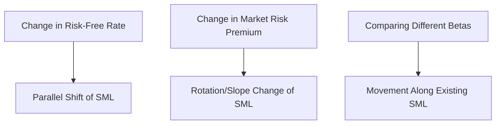

## The Security Market Line and Beta Estimation

### Overview

The Security Market Line (SML) is the graphical expression of the Capital Asset Pricing Model, plotting an asset's required return against its systematic risk (beta). Beta itself must be estimated statistically, since it is not directly observable. This section covers the construction and interpretation of the SML, alongside the practical methodologies used to estimate beta.

### The Security Market Line Equation

The SML is defined by the CAPM equation, treating beta as the independent variable:

$$E(R_i) = R_f + \beta_i\left(E(R_m) - R_f\right)$$

This is a straight line with:

- **Y-intercept**: $R_f$ (the risk-free rate, at $\beta = 0$)
- **Slope**: $E(R_m) - R_f$ (the market risk premium)
- **X-axis**: Beta ($\beta$)
- **Y-axis**: Expected/required return

### Constructing the SML

<svg xmlns="http://www.w3.org/2000/svg" viewBox="0 0 620 400" font-family="Arial, sans-serif">
<text x="310" y="20" text-anchor="middle" font-size="14" font-weight="bold">Security Market Line Construction (svg_diagram)</text>
<line x1="80" y1="340" x2="580" y2="340" stroke="black" stroke-width="1" />
<line x1="80" y1="340" x2="80" y2="40" stroke="black" stroke-width="1" />
<text x="330" y="375" text-anchor="middle" font-size="12">Beta (β)</text>
<text x="35" y="190" text-anchor="middle" font-size="12" transform="rotate(-90 35 190)">Required Return E(R)</text>
<line x1="80" y1="300" x2="540" y2="80" stroke="#2c6fbb" stroke-width="2.5" />
<circle cx="80" cy="300" r="4" fill="black" />
<text x="60" y="320" font-size="11">Rf (β=0)</text>
<circle cx="310" cy="190" r="4" fill="#c0392b" />
<line x1="310" y1="340" x2="310" y2="190" stroke="#888" stroke-dasharray="3,3" />
<text x="290" y="360" font-size="11">β=1</text>
<text x="320" y="185" font-size="11">E(Rm)</text>
<line x1="80" y1="300" x2="310" y2="300" stroke="#888" stroke-dasharray="3,3" />
<text x="330" y="305" font-size="11">Slope = Market Risk Premium</text>
</svg>

### Mispricing Relative to the SML

**Key Points**

- Assets plotting **above** the SML offer a higher expected return than warranted by their beta — considered undervalued; expected market correction is a price increase (and thus lower future expected return) as demand rises
- Assets plotting **below** the SML offer a lower expected return than warranted by their beta — considered overvalued; expected correction is a price decrease
- Assets plotting exactly **on** the SML are considered fairly priced given their systematic risk
- This deviation is captured quantitatively by Jensen's Alpha:

$$\alpha_i = R_i - \left[R_f + \beta_i(R_m - R_f)\right]$$

A positive $\alpha_i$ indicates the asset performed above what CAPM would predict (plotting above the SML, historically); a negative $\alpha_i$ indicates underperformance relative to its risk level.

### SML Shifts vs. Movements Along the SML

**Key Points**

- A movement **along** the SML occurs when comparing assets with different betas at a given point in time — this is simply comparing different risk levels, not a change in market conditions
- A **shift** in the SML occurs when either $R_f$ or the market risk premium $(E(R_m) - R_f)$ changes:
  - An increase in $R_f$ shifts the entire line upward (parallel shift)
  - An increase in the market risk premium increases the slope, rotating the line steeper around the $R_f$ intercept
  - A change in inflation expectations, monetary policy, or risk aversion in the economy can drive such shifts

### Beta: Conceptual Definition

Beta measures the sensitivity of an asset's returns to movements in the overall market:

$$\beta_i = \frac{\text{Cov}(R_i, R_m)}{\text{Var}(R_m)}$$

### Beta Estimation via Regression

In practice, beta is estimated using ordinary least squares (OLS) regression of an asset's historical returns against a market index's returns:

$$R_{i,t} = \alpha_i + \beta_i R_{m,t} + \epsilon_{i,t}$$

Here, $\beta_i$ is the regression slope coefficient, $\alpha_i$ is the intercept (Jensen's Alpha when using excess returns), and $\epsilon_{i,t}$ is the residual (unsystematic) component at time $t$.

**Standard Estimation Choices**

| Parameter | Common Convention |
| --- | --- |
| Return frequency | Monthly (also weekly or daily) |
| Estimation window | 3-5 years of historical data |
| Market proxy | Broad-based index (e.g., S&P 500, Russell 3000, MSCI World) |
| Return type | Total returns (including dividends), often in excess-of-risk-free-rate form |

[Inference] Different combinations of frequency, window length, and market proxy can produce meaningfully different beta estimates for the same stock, since these choices affect the sample of underlying data and reflect a genuine methodological convention rather than a single universally agreed-upon standard.

### Worked Example — Manual Beta Calculation

Given five years of annual return data for Stock Y and the market:

| Year | Stock Y Return | Market Return |
| --- | --- | --- |
| 1 | 12% | 8% |
| 2 | -5% | -2% |
| 3 | 20% | 15% |
| 4 | 8% | 5% |
| 5 | 15% | 10% |

**Step 1 — Calculate Means**

$$\bar{R}_Y = \frac{12-5+20+8+15}{5} = \frac{50}{5} = 10\%$$

$$\bar{R}_m = \frac{8-2+15+5+10}{5} = \frac{36}{5} = 7.2\%$$

**Step 2 — Calculate Covariance**

$$\text{Cov}(R_Y,R_m) = \frac{1}{n-1}\sum(R_{Y,t}-\bar{R}_Y)(R_{m,t}-\bar{R}_m)$$

| Year | $(R_Y - \bar{R}_Y)$ | $(R_m - \bar{R}_m)$ | Product |
| --- | --- | --- | --- |
| 1 | 2 | 0.8 | 1.6 |
| 2 | -15 | -9.2 | 138.0 |
| 3 | 10 | 7.8 | 78.0 |
| 4 | -2 | -2.2 | 4.4 |
| 5 | 5 | 2.8 | 14.0 |

$$\text{Sum} = 1.6 + 138.0 + 78.0 + 4.4 + 14.0 = 236.0$$

$$\text{Cov}(R_Y,R_m) = \frac{236.0}{5-1} = 59.0$$

**Step 3 — Calculate Market Variance**

$$\text{Var}(R_m) = \frac{1}{n-1}\sum(R_{m,t}-\bar{R}_m)^2$$

| Year | $(R_m - \bar{R}_m)^2$ |
| --- | --- |
| 1 | 0.64 |
| 2 | 84.64 |
| 3 | 60.84 |
| 4 | 4.84 |
| 5 | 7.84 |

$$\text{Sum} = 0.64+84.64+60.84+4.84+7.84 = 158.8$$

$$\text{Var}(R_m) = \frac{158.8}{4} = 39.7$$

**Step 4 — Calculate Beta**

$$\beta_Y = \frac{\text{Cov}(R_Y,R_m)}{\text{Var}(R_m)} = \frac{59.0}{39.7} \approx 1.486$$

**Output**

- Beta of Stock Y: ≈1.49

This indicates Stock Y is approximately 49% more volatile than the market with respect to systematic movements, based on this five-year sample.

### Adjusted (Blume-Adjusted) Beta

Raw regression betas tend to exhibit mean reversion toward 1.0 over time. A commonly applied adjustment weights the raw beta and the market average beta of 1.0:

$$\beta_{adjusted} = \frac{2}{3}\beta_{raw} + \frac{1}{3}(1.0)$$

Applying this to the example above:

$$\beta_{adjusted} = \frac{2}{3}(1.486) + \frac{1}{3}(1.0) = 0.9907 + 0.3333 \approx 1.324$$

**Output**

- Adjusted Beta: ≈1.32

[Unverified] The specific 2/3 and 1/3 weighting is a widely cited convention (attributed to Marshall Blume's research), but some data providers and practitioners use different weighting schemes or proprietary adjustment methodologies.

### Fundamental (Bottom-Up) Beta Estimation

An alternative to regression-based beta uses industry/comparable-company betas, unlevered and relevered to the target firm's specific capital structure — particularly useful for private companies, IPOs, or divisions without sufficient trading history.

### Standard Error and Statistical Reliability of Beta

**Key Points**

- Regression beta estimates carry a standard error, meaning the "true" beta lies within a confidence interval rather than being known with certainty
- A wider standard error (common with shorter estimation windows or more volatile stocks) implies greater uncertainty about the true systematic risk
- $R^2$ of the regression indicates what proportion of the stock's total variance is explained by market movements (systematic risk proportion), with the remainder attributable to firm-specific (unsystematic) factors
- [Inference] Practitioners often cross-check regression betas against industry averages or bottom-up betas precisely because single-company regression estimates can be statistically noisy, particularly for thinly traded or newly listed stocks

### Applications in Corporate Finance

- **Cost of Equity Estimation**: Beta is the key input differentiating firm-specific required returns within the CAPM framework
- **Comparable Company Analysis**: Unlevered/relevered beta bridges valuation across firms with different leverage
- **Capital Budgeting**: Project-specific betas (rather than firm-wide beta) may be used when a project's risk profile differs materially from the firm's overall business
- **Portfolio Construction**: Beta informs portfolio-level systematic risk exposure and hedging decisions (e.g., using beta to determine index futures hedge ratios)

**Related Topics**

- Capital Asset Pricing Model (CAPM) formula and assumptions
- Levered and unlevered beta (Hamada equation)
- Multi-factor models as alternatives to single-factor beta
- Weighted Average Cost of Capital (WACC) construction
- Equity risk premium estimation methods
- Regression diagnostics and standard errors in finance applications