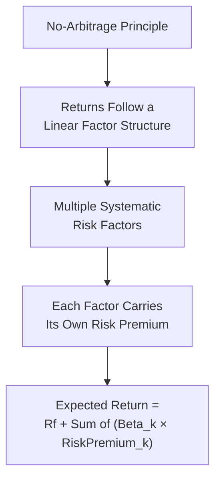

## Multi Factor Models and Arbitrage Pricing Theory

### Overview

While CAPM explains expected returns using a single systematic risk factor (the market), empirical evidence has shown that a single factor often fails to fully explain the cross-section of asset returns. Multi-factor models extend the framework by incorporating additional risk factors, while Arbitrage Pricing Theory (APT) provides the theoretical foundation for using multiple, unspecified factors in an arbitrage-free framework.

### Arbitrage Pricing Theory (APT)

Developed by Stephen Ross (1976), APT is a general asset pricing framework based on the principle of no-arbitrage rather than the mean-variance optimization assumptions underlying CAPM.

$$E(R_i) = R_f + \beta_{i1}RP_1 + \beta_{i2}RP_2 + \cdots + \beta_{ik}RP_k$$

Where:

- $\beta_{ik}$ is the sensitivity of asset $i$ to factor $k$
- $RP_k$ is the risk premium associated with factor $k$
- $k$ factors are unspecified by the theory itself — APT does not identify what the factors are, only that they exist

### Core Assumptions of APT

**Key Points**

- Returns can be described by a linear factor model
- There are sufficient assets to diversify away firm-specific (idiosyncratic) risk
- Well-functioning markets do not allow arbitrage opportunities to persist
- Unlike CAPM, APT does not require the existence of a mean-variance efficient market portfolio, nor does it require assumptions about investor utility functions

### CAPM vs. APT: Structural Comparison

| Feature | CAPM | APT |
| --- | --- | --- |
| Number of factors | Single (market) | Multiple (unspecified number) |
| Theoretical basis | Mean-variance portfolio optimization | No-arbitrage condition |
| Market portfolio required | Yes (theoretically all risky assets) | No |
| Investor assumptions | Homogeneous expectations, utility maximization | Minimal; primarily no-arbitrage |
| Factor identification | Market risk premium only | Factors must be empirically or theoretically identified |
| Flexibility | Rigid single-factor structure | Flexible; can incorporate any priced risk factor |

### The Arbitrage Argument Underlying APT

If an asset's actual expected return deviates from what the factor model predicts, investors can theoretically construct a portfolio (long the mispriced asset, short a replicating portfolio of correctly priced assets with identical factor exposures) to earn a riskless arbitrage profit. Market forces are assumed to eliminate mispricing quickly, pushing expected returns back in line with the factor model relationship. This mechanism—rather than a specific equilibrium argument as in CAPM—is what disciplines pricing in the APT framework.

### The Fama-French Three-Factor Model

Developed by Eugene Fama and Kenneth French (1992, 1993), this widely used multi-factor model augments the market factor with two additional empirically motivated factors: size and value.

$$E(R_i) - R_f = \alpha_i + \beta_{i,MKT}(R_m - R_f) + \beta_{i,SMB}(SMB) + \beta_{i,HML}(HML) + \epsilon_i$$

| Factor | Meaning | Construction |
| --- | --- | --- |
| $R_m - R_f$ | Market risk premium | Same as CAPM |
| SMB (Small Minus Big) | Size premium | Return of small-cap stocks minus large-cap stocks |
| HML (High Minus Low) | Value premium | Return of high book-to-market (value) stocks minus low book-to-market (growth) stocks |

**Key Points**

- Small-cap stocks have historically earned higher average returns than large-cap stocks (the "size effect")
- Value stocks (high book-to-market ratio) have historically earned higher average returns than growth stocks (the "value effect")
- [Inference] Fama and French interpreted SMB and HML as proxies for underlying risk factors not captured by market beta alone, though the precise economic explanation for these premia has been debated in academic literature, with some researchers attributing part of the effect to behavioral mispricing rather than pure risk compensation

### The Fama-French Five-Factor Model

An extension (Fama and French, 2015) adding two further factors:

$$E(R_i) - R_f = \alpha_i + \beta_{MKT}(R_m-R_f) + \beta_{SMB}(SMB) + \beta_{HML}(HML) + \beta_{RMW}(RMW) + \beta_{CMA}(CMA) + \epsilon_i$$

| Additional Factor | Meaning |
| --- | --- |
| RMW (Robust Minus Weak) | Profitability premium — robust (high) minus weak (low) operating profitability |
| CMA (Conservative Minus Aggressive) | Investment premium — conservative (low) minus aggressive (high) corporate investment/asset growth |

### Worked Example — Three-Factor Model Application

Given the following inputs for Stock Z:

- $R_f = 3\%$
- Market risk premium $(R_m - R_f) = 6\%$; $\beta_{MKT} = 1.1$
- SMB premium $= 2.5\%$; $\beta_{SMB} = 0.4$
- HML premium $= 3.0\%$; $\beta_{HML} = -0.2$ (indicating growth-tilted exposure)

**Step 1 — Compute Each Factor Contribution**

$$\text{Market Contribution} = 1.1 \times 6\% = 6.6\%$$

$$\text{SMB Contribution} = 0.4 \times 2.5\% = 1.0\%$$

$$\text{HML Contribution} = -0.2 \times 3.0\% = -0.6\%$$

**Step 2 — Sum Contributions and Add Risk-Free Rate**

$$E(R_Z) = 3\% + 6.6\% + 1.0\% + (-0.6\%) = 10.0\%$$

**Output**

- Expected Return on Stock Z (Three-Factor Model): 10.0%

This demonstrates how a stock's negative HML loading (indicating growth-stock characteristics) can reduce its required return contribution relative to a pure CAPM-based estimate, while positive size exposure increases it.

### Macroeconomic Multi-Factor Models

Alternative multi-factor specifications use macroeconomic variables directly as factors rather than empirically constructed portfolios. A commonly cited example is the Chen, Roll, and Ross (1986) model, which incorporates factors such as:

**Key Points**

- Unexpected changes in industrial production
- Unexpected changes in inflation
- Changes in the yield spread between long and short-term government bonds (term structure)
- Changes in the default spread between corporate and government bonds (credit risk premium)

[Unverified] The specific macroeconomic factors found to be statistically significant vary across studies, time periods, and countries, so there is no single universally agreed-upon macroeconomic factor set analogous to the standardized Fama-French factors.

### Estimating Multi-Factor Betas

Similar to single-factor beta estimation, multi-factor betas are typically estimated via multiple linear regression:

$$R_{i,t} - R_{f,t} = \alpha_i + \beta_1 F_{1,t} + \beta_2 F_{2,t} + \cdots + \beta_k F_{k,t} + \epsilon_{i,t}$$

**Key Points**

- Requires time-series data for the asset's returns and each factor's realized values over the same period
- Multicollinearity between factors (if factors are correlated with one another) can complicate interpretation of individual factor coefficients
- Standard factor data (e.g., Fama-French factors) is often sourced from academic data libraries maintained by researchers such as Kenneth French, updated regularly with historical factor returns

### Applications in Corporate Finance

- **Cost of Equity Refinement**: Multi-factor models can provide a more empirically grounded cost of equity estimate than single-factor CAPM, particularly for firms with pronounced size or value characteristics
- **Performance Attribution**: Fund managers' returns are often decomposed into factor exposures to distinguish genuine skill (alpha) from exposure to known risk premia (factor "beta")
- **Risk Management**: Multi-factor exposure analysis helps identify unintended risk concentrations within a portfolio (e.g., unintentional value or size tilts)
- **Smart Beta / Factor Investing**: Investment products increasingly target specific factor premia (value, size, momentum, quality, low-volatility) directly, drawing on multi-factor model research

### Limitations of Multi-Factor Models

- APT does not specify which factors matter, or how many — factor selection is an empirical, sometimes ad hoc process
- Multi-factor models generally require more data and more complex estimation than single-factor CAPM
- [Inference] There is an ongoing risk of "data mining" bias, where factors are identified because they explained historical returns well within the specific sample studied, but the same factor's power to explain future returns is not certain, since it may partly reflect sample-specific patterns rather than a persistent structural risk premium
- Different factor models can produce meaningfully different cost of equity estimates for the same firm, introducing model selection uncertainty into valuation work

### Comparative Summary

| Model | Number of Factors | Factors Used |
| --- | --- | --- |
| CAPM | 1 | Market |
| Fama-French 3-Factor | 3 | Market, Size (SMB), Value (HML) |
| Fama-French 5-Factor | 5 | + Profitability (RMW), Investment (CMA) |
| Carhart 4-Factor | 4 | Fama-French 3-Factor + Momentum (UMD) |
| APT (General) | $k$ (unspecified) | Any theoretically or empirically justified factors |

**Related Topics**

- Capital Asset Pricing Model (CAPM) and the Security Market Line
- Beta estimation and regression methodology
- Momentum and the Carhart four-factor model
- Factor investing and "smart beta" strategies
- Cost of equity and Weighted Average Cost of Capital (WACC)
- Efficient Market Hypothesis and its relationship to factor-based return predictability