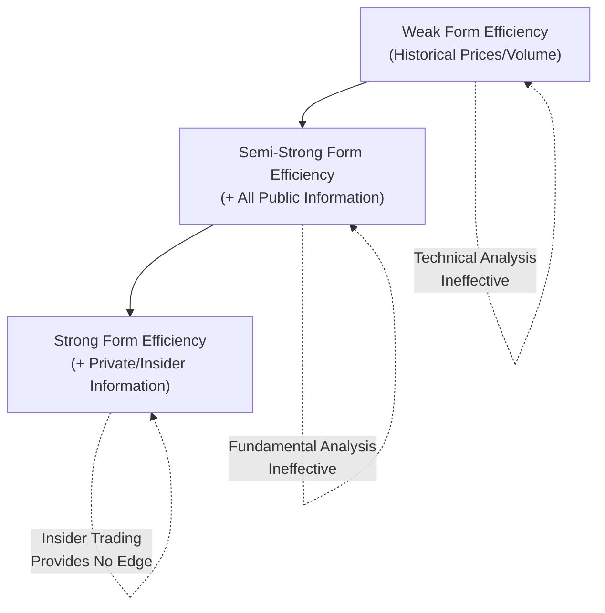
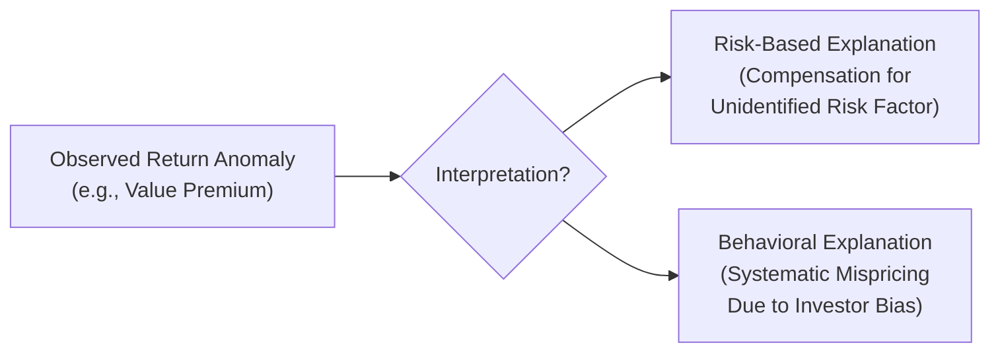

## Market Efficiency and Behavioral Critiques

### Overview

Market efficiency describes the degree to which asset prices fully and accurately reflect all available information. The Efficient Market Hypothesis (EMH) has been central to asset pricing theory, underpinning the assumption that prices are "fair" and that consistent outperformance is not achievable through information analysis alone. Behavioral finance emerged as a significant body of critique, documenting systematic patterns in investor behavior and asset prices that challenge strict efficiency assumptions.

### The Efficient Market Hypothesis (EMH)

Formalized by Eugene Fama (1970), EMH states that security prices fully reflect all available information at any given time, such that it is not possible to consistently achieve risk-adjusted returns above the market average through any information-based strategy.

### Three Forms of Market Efficiency

| Form | Information Set Reflected in Prices | Implication |
| --- | --- | --- |
| Weak Form | All historical price and volume data | Technical analysis cannot generate consistent excess returns |
| Semi-Strong Form | All publicly available information (financial statements, news, announcements) | Fundamental analysis of public information cannot generate consistent excess returns |
| Strong Form | All information, including private/insider information | Even insider information cannot generate consistent excess returns |

**Key Points**

- Each successive form subsumes the prior one — strong form implies semi-strong form, which implies weak form
- [Inference] Empirical evidence broadly supports weak-form efficiency in most developed markets (historical price patterns generally show limited predictive power), while evidence on semi-strong and strong form efficiency is more mixed and has been the subject of extensive ongoing academic debate
- Strong-form efficiency is widely regarded as unrealistic in practice, given documented cases of profitable insider trading before legal enforcement, and the existence of insider trading laws themselves implicitly acknowledges that private information can be valuable

### Theoretical Basis for Efficiency

**Key Points**

- Prices adjust rapidly to new information as profit-seeking arbitrageurs trade on any perceived mispricing
- Competition among sophisticated investors is assumed to drive prices toward fundamental (intrinsic) value
- Under EMH, price changes should follow a random walk, since only new (unpredictable) information should move prices
- If EMH holds strictly, active management (stock picking, market timing) cannot outperform passive indexing on a consistent, risk-adjusted, after-cost basis

### Random Walk Hypothesis

Closely tied to weak-form efficiency, this posits that price changes are independent and identically distributed, such that past price movements provide no information about future price movements:

$$P_t = P_{t-1} + \epsilon_t$$

Where $\epsilon_t$ is a random, unpredictable error term with mean zero.

### Empirical Anomalies Challenging EMH

**Key Points**

- **Size Effect**: Small-cap stocks have historically shown higher risk-adjusted returns than large-cap stocks
- **Value Effect**: High book-to-market (value) stocks have historically outperformed low book-to-market (growth) stocks
- **Momentum Effect**: Stocks that have performed well over the past 3-12 months tend to continue performing well in the near term, contradicting a pure random walk
- **January Effect**: Historically documented tendency for small-cap stock returns to be higher in January than other months
- **Post-Earnings Announcement Drift**: Stock prices have been observed to continue drifting in the direction of an earnings surprise for weeks after the announcement, rather than adjusting instantaneously
- **Equity Premium Puzzle**: The historical excess return of equities over risk-free assets has been argued by some researchers to be larger than standard risk-aversion models would predict

[Inference] These anomalies are documented in numerous academic studies, but their persistence, magnitude, and whether they represent genuine market inefficiency versus omitted risk factors (as multi-factor model proponents argue) remain actively debated in the finance literature.

### Behavioral Finance: Core Critique

Behavioral finance argues that investors are not always rational, and that systematic psychological biases can cause prices to deviate from fundamental value for extended periods, sometimes without a clear, efficient arbitrage mechanism to correct them.

### Key Behavioral Biases

| Bias | Description |
| --- | --- |
| Overconfidence | Investors overestimate the accuracy of their own judgments and information |
| Loss Aversion | Losses are felt more intensely than equivalent gains (a concept central to Prospect Theory) |
| Herding | Investors follow the actions of a larger group rather than independent analysis |
| Anchoring | Over-reliance on an initial reference point (e.g., purchase price) when evaluating new information |
| Confirmation Bias | Seeking information that confirms existing beliefs while discounting contradictory evidence |
| Representativeness | Judging probability based on similarity to a familiar pattern rather than statistical base rates |
| Disposition Effect | Tendency to sell winning investments too early and hold losing investments too long |
| Mental Accounting | Treating money differently depending on its source or intended use, rather than as fungible |

### Prospect Theory

Developed by Daniel Kahneman and Amos Tversky (1979), Prospect Theory is a foundational behavioral finance framework describing how individuals evaluate potential gains and losses, challenging the expected utility theory assumption underlying traditional finance models.

**Key Points**

- Value is assessed relative to a reference point (e.g., purchase price), not in terms of absolute final wealth
- The value function is concave for gains (risk-averse) and convex for losses (risk-seeking), producing asymmetric risk attitudes depending on framing
- Losses loom larger than equivalent gains (loss aversion), typically estimated at roughly twice the psychological weight of gains in various studies
- Probabilities are often subjectively weighted rather than treated according to their objective values, with small probabilities frequently overweighted and moderate/large probabilities underweighted

<svg xmlns="http://www.w3.org/2000/svg" viewBox="0 0 600 400" font-family="Arial, sans-serif">
<text x="300" y="20" text-anchor="middle" font-size="14" font-weight="bold">Prospect Theory Value Function (svg_diagram)</text>
<line x1="80" y1="200" x2="560" y2="200" stroke="black" stroke-width="1" />
<line x1="320" y1="40" x2="320" y2="360" stroke="black" stroke-width="1" />
<text x="540" y="220" font-size="11">Gains</text>
<text x="90" y="220" font-size="11">Losses</text>
<text x="330" y="50" font-size="11">Value</text>
<path d="M 320 200 Q 400 100 560 80" fill="none" stroke="#2c6fbb" stroke-width="2.5" />
<path d="M 320 200 Q 240 320 80 350" fill="none" stroke="#c0392b" stroke-width="2.5" />
<text x="400" y="110" font-size="11" fill="#2c6fbb">Concave (risk-averse)</text>
<text x="120" y="330" font-size="11" fill="#c0392b">Convex, steeper (risk-seeking, loss-averse)</text>
</svg>

### Limits to Arbitrage

Behavioral finance also explains why observed mispricing may persist rather than being immediately corrected, despite the theoretical existence of arbitrageurs:

**Key Points**

- **Fundamental risk**: Arbitrage positions still carry risk if the mispricing worsens before it corrects
- **Noise trader risk**: Irrational investors may push prices further from fundamental value in the short run, potentially forcing arbitrageurs to unwind positions at a loss before convergence occurs
- **Implementation costs**: Transaction costs, short-selling constraints, and margin requirements can make exploiting mispricing costly or impractical
- [Unverified] The relative importance of each limiting factor varies by asset class, market structure, and time period, and is difficult to measure precisely in practice

### CAPM and EMH: Relationship and Tension

**Key Points**

- CAPM assumes markets are informationally efficient and that prices reflect fundamental value, consistent with EMH
- Empirical anomalies used to challenge EMH (size, value, momentum effects) are often the same anomalies that motivated the development of multi-factor models as extensions to CAPM
- A key interpretive debate is whether these anomalies represent (a) genuine market inefficiency exploitable by behaviorally-informed investors, or (b) compensation for additional, unidentified risk factors not captured by a single-factor CAPM beta — this is sometimes referred to as the "joint hypothesis problem," since any test of market efficiency is simultaneously a test of the particular asset pricing model assumed

### Applications in Corporate Finance

- **Capital Budgeting and Valuation**: If markets are efficient, current market prices are the best estimate of fair value, supporting market-based valuation approaches (e.g., using current stock price as a valuation benchmark)
- **Capital Structure and Signaling**: Semi-strong efficiency underlies signaling theories in capital structure — since prices react to new public information, corporate announcements (e.g., dividend changes, buybacks) are studied as information-conveying events
- **Behavioral Corporate Finance**: A growing subfield examines how managerial biases (e.g., overconfidence in M&A decisions, herding in capital investment) affect corporate decision-making, applying behavioral insights beyond just investor behavior
- **Event Studies**: Semi-strong form efficiency is the theoretical basis for event study methodology, used to measure the market's reaction to corporate announcements (mergers, earnings, spin-offs)
- **Investment Strategy**: The debate between efficiency and behavioral critiques underlies the broader active-versus-passive management discussion in asset management

### Summary Comparison: Traditional vs. Behavioral View

| Aspect | Traditional (EMH) View | Behavioral Finance View |
| --- | --- | --- |
| Investor Rationality | Fully rational, utility-maximizing | Subject to systematic cognitive biases |
| Price Formation | Reflects fundamental value | Can deviate from fundamental value, sometimes for extended periods |
| Arbitrage | Assumed to correct mispricing quickly | Limited by risk, costs, and constraints |
| Excess Returns | Not consistently achievable | Potentially achievable by exploiting documented biases/anomalies |
| Anomalies | Attributed to risk factors or data mining | Attributed to genuine, persistent mispricing |

**Next Steps**

- Event study methodology and abnormal return calculation
- Fama-French multi-factor models as risk-based explanations for anomalies
- Behavioral corporate finance and managerial biases
- Prospect Theory and expected utility theory comparison
- Momentum and reversal strategies in equity markets
- Limits to arbitrage and noise trader models