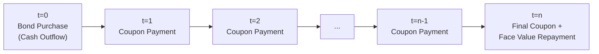
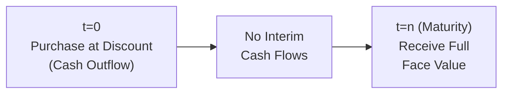
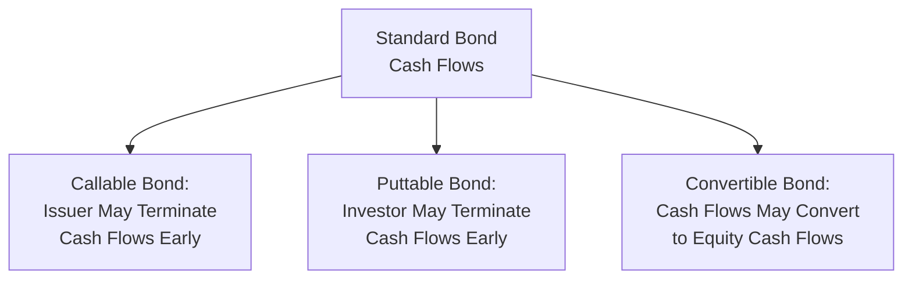

## Bond Terminology and Cash Flow Structures

### Overview

Bonds are fixed-income securities representing a loan from an investor to an issuer, entitling the holder to a defined stream of cash flows. Understanding bond terminology and the mechanics of their cash flow structures is foundational to fixed-income valuation, since bond prices are ultimately the present value of these contractually specified cash flows.

### Core Bond Terminology

| Term | Definition |
| --- | --- |
| Face Value (Par Value) | The principal amount repaid at maturity, typically $1,000 for corporate bonds |
| Coupon Rate | The stated annual interest rate paid on the face value |
| Coupon Payment | The periodic dollar interest payment: Coupon Rate × Face Value / payments per year |
| Maturity Date | The date on which the issuer repays the face value to the bondholder |
| Issuer | The entity borrowing funds by issuing the bond (corporation, government, municipality) |
| Yield to Maturity (YTM) | The internal rate of return earned if the bond is held to maturity, given its current market price |
| Indenture | The legal contract specifying the bond's terms, covenants, and issuer obligations |
| Par, Premium, Discount | Bond trading at face value, above face value, or below face value, respectively |

### Basic Bond Cash Flow Structure

A standard (plain vanilla) coupon bond generates two types of cash flows:

1. Periodic coupon payments (typically semiannual for corporate/government bonds in the U.S.)
2. A single principal repayment (face value) at maturity

$$\text{Coupon Payment} = \frac{\text{Coupon Rate} \times \text{Face Value}}{\text{Payments per Year}}$$

### Bond Cash Flow Timeline (Visual)

<svg xmlns="http://www.w3.org/2000/svg" viewBox="0 0 620 220" font-family="Arial, sans-serif">
<text x="310" y="20" text-anchor="middle" font-size="14" font-weight="bold">Standard Coupon Bond Cash Flow Timeline (svg_diagram)</text>
<line x1="50" y1="120" x2="580" y2="120" stroke="black" stroke-width="1.5" />
<line x1="50" y1="110" x2="50" y2="130" stroke="black" />
<text x="50" y="150" text-anchor="middle" font-size="11">t=0</text>
<text x="50" y="100" text-anchor="middle" font-size="10" fill="#c0392b">-Price</text>
<line x1="150" y1="110" x2="150" y2="130" stroke="black" />
<text x="150" y="150" text-anchor="middle" font-size="11">t=1</text>
<text x="150" y="100" text-anchor="middle" font-size="10" fill="#2c6fbb">+Coupon</text>
<line x1="250" y1="110" x2="250" y2="130" stroke="black" />
<text x="250" y="150" text-anchor="middle" font-size="11">t=2</text>
<text x="250" y="100" text-anchor="middle" font-size="10" fill="#2c6fbb">+Coupon</text>
<line x1="350" y1="110" x2="350" y2="130" stroke="black" />
<text x="350" y="150" text-anchor="middle" font-size="11">...</text>
<line x1="450" y1="110" x2="450" y2="130" stroke="black" />
<text x="450" y="150" text-anchor="middle" font-size="11">t=n-1</text>
<text x="450" y="100" text-anchor="middle" font-size="10" fill="#2c6fbb">+Coupon</text>
<line x1="560" y1="105" x2="560" y2="135" stroke="black" stroke-width="2" />
<text x="560" y="155" text-anchor="middle" font-size="11">t=n</text>
<text x="560" y="90" text-anchor="middle" font-size="10" fill="#27ae60">+Coupon+Face Value</text>
</svg>

### Common Bond Cash Flow Structures

**Key Points**

- **Bullet Bond**: Standard structure — periodic coupons plus a single lump-sum principal repayment at maturity (the most common structure)
- **Zero-Coupon Bond**: No periodic coupon payments; sold at a discount to face value, with the entire return coming from price appreciation to par at maturity
- **Amortizing Bond**: Principal is repaid gradually over the bond's life alongside interest, rather than in a single lump sum at maturity (common in mortgage-backed securities and some structured products)
- **Perpetual Bond (Perpetuity/Consol)**: Pays coupons indefinitely with no maturity date and no principal repayment
- **Callable Bond**: Issuer retains the right to redeem the bond before maturity at a specified call price, typically after a call protection period
- **Puttable Bond**: Bondholder retains the right to sell the bond back to the issuer before maturity at a specified price
- **Floating Rate Note (FRN)**: Coupon rate resets periodically based on a reference rate (e.g., SOFR) plus a spread, rather than remaining fixed
- **Convertible Bond**: Grants the holder the option to convert the bond into a specified number of the issuer's common shares

### Zero-Coupon Bond Cash Flow Structure

### Coupon Frequency Conventions

**Key Points**

- U.S. corporate and Treasury bonds: typically semiannual coupon payments
- Many international government bonds: often annual coupon payments
- Money market instruments and some structured notes: may use quarterly or monthly payment frequency
- Coupon frequency directly affects the periodic discount rate used in present value calculations: the annual YTM must be divided by the number of payments per year, and the number of periods multiplied accordingly

### Worked Example — Cash Flow Schedule for a Standard Bond

Consider a bond with:

- Face Value = $1,000
- Coupon Rate = 6% (paid semiannually)
- Maturity = 3 years

**Step 1 — Determine Periodic Coupon**

$$\text{Semiannual Coupon} = \frac{6\% \times \$1{,}000}{2} = \$30$$

**Step 2 — Determine Number of Periods**

$$n = 3 \text{ years} \times 2 \text{ payments/year} = 6 \text{ periods}$$

**Step 3 — Construct Cash Flow Schedule**

| Period | Time (Years) | Cash Flow |
| --- | --- | --- |
| 1 | 0.5 | $30 |
| 2 | 1.0 | $30 |
| 3 | 1.5 | $30 |
| 4 | 2.0 | $30 |
| 5 | 2.5 | $30 |
| 6 | 3.0 | $30 + $1,000 = $1,030 |

**Output**

- Total Cash Flows Over Life of Bond: 5 × $30 + $1,030 = $1,180
- This schedule forms the basis for computing the bond's present value (price) at a given discount rate (covered under bond pricing)

### Accrued Interest and Clean vs. Dirty Price

**Key Points**

- **Clean Price**: The quoted bond price excluding accrued interest since the last coupon payment date
- **Dirty Price (Full/Invoice Price)**: The actual price paid by a buyer, equal to clean price plus accrued interest
- Accrued interest compensates the seller for the portion of the current coupon period they held the bond

$$\text{Accrued Interest} = \text{Coupon Payment} \times \frac{\text{Days Since Last Coupon}}{\text{Days in Coupon Period}}$$

$$\text{Dirty Price} = \text{Clean Price} + \text{Accrued Interest}$$

### Day Count Conventions

**Key Points**

- **30/360**: Assumes each month has 30 days and each year has 360 days; commonly used for U.S. corporate and municipal bonds
- **Actual/Actual**: Uses actual calendar days in both the numerator and denominator; commonly used for U.S. Treasury bonds
- **Actual/360**: Uses actual days elapsed divided by a 360-day year; common in money markets
- [Inference] The specific day count convention used affects the precise accrued interest calculation, and market participants must confirm the applicable convention for a given bond, since it is not universal across all bond types and jurisdictions

### Bond Ratings and Classification Context

**Key Points**

- **Investment Grade**: Bonds rated BBB-/Baa3 or higher by major rating agencies (S&P, Moody's, Fitch), indicating relatively lower default risk
- **High Yield (Junk) Bonds**: Bonds rated below investment grade, carrying higher default risk and correspondingly higher coupon rates
- **Secured vs. Unsecured**: Secured bonds are backed by specific collateral; unsecured bonds (debentures) rely on the general creditworthiness of the issuer
- **Seniority**: Determines repayment priority in the event of issuer bankruptcy or liquidation (senior secured > senior unsecured > subordinated)

### Embedded Options and Their Cash Flow Impact

**Key Points**

- Callable bonds typically carry higher coupon rates to compensate investors for reinvestment risk if the bond is called early (usually when interest rates decline)
- Puttable bonds typically carry lower coupon rates since the embedded option benefits the investor
- Convertible bonds typically carry lower coupon rates than comparable straight bonds, reflecting the value of the conversion option to equity

### Applications in Corporate Finance

- **Debt Issuance Structuring**: Corporate treasurers select coupon structure, maturity, and embedded options based on funding needs and market conditions
- **Cost of Debt Estimation**: Understanding cash flow structure is a prerequisite for computing yield to maturity, used as an input to the cost of debt in WACC calculations
- **Balance Sheet Management**: Amortizing vs. bullet structures affect a firm's debt repayment schedule and refinancing risk profile
- **Capital Structure Planning**: Choice between fixed-rate and floating-rate debt affects a firm's interest rate risk exposure

**Next Steps**

- Bond pricing and the present value of cash flows
- Yield to maturity calculation and interpretation
- Duration and convexity as interest rate risk measures
- The term structure of interest rates and the yield curve
- Credit spreads and default risk pricing
- Callable and convertible bond valuation techniques