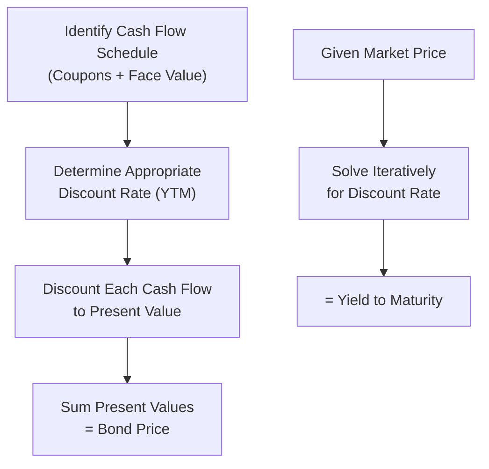

## Bond Pricing and Yield to Maturity

### Overview

Bond pricing applies the principle of discounted cash flow valuation: a bond's price equals the present value of its expected future cash flows (coupons and face value repayment), discounted at the market-required rate of return. Yield to maturity (YTM) is the discount rate that equates the bond's present value of cash flows to its current market price, functioning as the bond's internal rate of return.

### The Bond Pricing Formula

For a standard coupon bond with $n$ periods to maturity:

$$P = \sum_{t=1}^{n} \frac{C}{(1+r)^t} + \frac{F}{(1+r)^n}$$

Where:

- $P$ = current bond price
- $C$ = periodic coupon payment
- $r$ = periodic discount rate (YTM per period)
- $F$ = face value
- $n$ = number of periods to maturity

Using the annuity present value formula for the coupon stream, this can be rewritten as:

$$P = C\left[\frac{1-(1+r)^{-n}}{r}\right] + \frac{F}{(1+r)^n}$$

### Relationship Between Price, Coupon Rate, and YTM

| Relationship | Bond Trades At |
| --- | --- |
| Coupon Rate = YTM | Par (Price = Face Value) |
| Coupon Rate > YTM | Premium (Price > Face Value) |
| Coupon Rate < YTM | Discount (Price < Face Value) |

**Key Points**

- Bond prices and yields move inversely: as market interest rates (YTM) rise, bond prices fall, and vice versa
- This inverse relationship arises directly from the discounting mechanism — a higher discount rate reduces the present value of fixed future cash flows
- As a bond approaches maturity, its price converges toward face value, regardless of whether it began at a premium or discount ("pull to par")

<svg xmlns="http://www.w3.org/2000/svg" viewBox="0 0 600 350" font-family="Arial, sans-serif">
<text x="300" y="20" text-anchor="middle" font-size="14" font-weight="bold">Bond Price vs. Yield to Maturity (svg_diagram)</text>
<line x1="70" y1="300" x2="560" y2="300" stroke="black" stroke-width="1" />
<line x1="70" y1="300" x2="70" y2="40" stroke="black" stroke-width="1" />
<text x="315" y="330" text-anchor="middle" font-size="12">Yield to Maturity</text>
<text x="30" y="170" text-anchor="middle" font-size="12" transform="rotate(-90 30 170)">Bond Price</text>
<path d="M 90 60 Q 250 100 320 180 Q 400 260 540 290" fill="none" stroke="#2c6fbb" stroke-width="2.5" />
<line x1="320" y1="180" x2="320" y2="300" stroke="#888" stroke-dasharray="3,3" />
<line x1="70" y1="180" x2="320" y2="180" stroke="#888" stroke-dasharray="3,3" />
<text x="330" y="175" font-size="11">Par Value (Coupon = YTM)</text>
<text x="100" y="80" font-size="11" fill="#2c6fbb">Premium region</text>
<text x="420" y="280" font-size="11" fill="#2c6fbb">Discount region</text>
</svg>

### Worked Example — Bond Pricing

Price a bond with:

- Face Value = $1,000
- Coupon Rate = 8%, paid semiannually
- Maturity = 5 years
- Market YTM = 10% (annual, compounded semiannually)

**Step 1 — Determine Periodic Inputs**

$$C = \frac{8\% \times \$1{,}000}{2} = \$40 \quad\quad r = \frac{10\%}{2} = 5\% \quad\quad n = 5 \times 2 = 10$$

**Step 2 — Present Value of Coupon Annuity**

$$PV_{coupons} = 40\left[\frac{1-(1.05)^{-10}}{0.05}\right] = 40 \times 7.7217 \approx \$308.87$$

**Step 3 — Present Value of Face Value**

$$PV_{face} = \frac{1{,}000}{(1.05)^{10}} = \frac{1{,}000}{1.6289} \approx \$613.91$$

**Step 4 — Sum Components**

$$P = 308.87 + 613.91 = \$922.78$$

**Output**

- Bond Price: ≈$922.78
- Since the coupon rate (8%) is less than the YTM (10%), the bond correctly prices at a discount to face value, consistent with the price-yield relationship above.

### Yield to Maturity: Definition and Solving Method

YTM is the single discount rate that equates the present value of all future cash flows to the bond's current market price. Unlike bond pricing (solving for $P$ given $r$), computing YTM requires solving for $r$ given $P$ — this generally requires an iterative or numerical approach, since the equation cannot be algebraically rearranged to isolate $r$ directly for coupon-bearing bonds.

$$P = \sum_{t=1}^{n} \frac{C}{(1+r)^t} + \frac{F}{(1+r)^n}$$

**Key Points**

- Financial calculators and spreadsheet functions (e.g., Excel's `YIELD` or `RATE` functions) solve for YTM using iterative numerical methods
- YTM assumes that all coupon payments are reinvested at the same YTM rate over the life of the bond — a simplifying assumption that may not hold in practice if reinvestment rates change
- YTM is quoted as an annualized rate; for semiannual-pay bonds, the per-period rate is typically doubled (a "bond-equivalent yield" convention) rather than compounded into an effective annual rate

### Worked Example — Approximating YTM

A bond with Face Value = $1,000, Coupon Rate = 7% (semiannual), 4 years to maturity, currently trades at $950.

**Approximation Formula (Quick Estimate):**

$$YTM \approx \frac{C + \dfrac{F-P}{n}}{\dfrac{F+P}{2}}$$

**Step 1 — Determine Inputs**

$$C = \$35 \text{ (semiannual)} \quad F = \$1{,}000 \quad P = \$950 \quad n = 8 \text{ periods}$$

**Step 2 — Apply Approximation**

$$YTM_{period} \approx \frac{35 + \dfrac{1000-950}{8}}{\dfrac{1000+950}{2}} = \frac{35 + 6.25}{975} = \frac{41.25}{975} \approx 0.0423$$

**Step 3 — Annualize**

$$YTM_{annual} \approx 0.0423 \times 2 \approx 8.46\%$$

**Output**

- Approximate YTM: ≈8.46% (annualized)

[Inference] This approximation formula provides a reasonably close estimate but is not exact; precise YTM requires iterative solving (e.g., via financial calculator, spreadsheet function, or numerical methods such as Newton-Raphson), and the approximation's accuracy diminishes for bonds with longer maturities or larger premium/discount magnitudes.

### Related Yield Measures

| Measure | Description |
| --- | --- |
| Current Yield | $\dfrac{\text{Annual Coupon Payment}}{\text{Current Bond Price}}$ — ignores capital gain/loss and time value |
| Yield to Call (YTC) | Same methodology as YTM, but assumes redemption at the call date and call price rather than maturity |
| Yield to Worst (YTW) | The lowest of all possible yield outcomes (YTM, YTC across all call dates) — used as a conservative estimate for callable bonds |
| Effective Annual Yield (EAY) | Annualized yield accounting for compounding effects, computed as $(1+r_{period})^{m} - 1$ where $m$ is periods per year |
| Bond Equivalent Yield (BEY) | Semiannual rate simply doubled (market convention), which does not account for compounding |

### Bond Pricing Between Coupon Dates

When a bond is purchased between coupon payment dates, the price calculation must account for the fractional period, and the price is typically split into clean price and accrued interest components:

$$\text{Dirty Price} = P_{t} = \sum \frac{CF_t}{(1+r)^{t-f}}$$

Where $f$ represents the fraction of the current coupon period that has already elapsed, adjusting the discounting exponents accordingly.

### Bond Pricing Workflow

### Sensitivity of Price to Time to Maturity and Coupon Rate

**Key Points**

- For a given change in YTM, bonds with longer maturities generally experience larger price changes than bonds with shorter maturities, holding coupon rate constant
- For a given change in YTM, bonds with lower coupon rates generally experience larger percentage price changes than higher-coupon bonds of the same maturity
- These sensitivity relationships are formalized more precisely through the concept of duration, which quantifies price sensitivity to yield changes

### Applications in Corporate Finance

- **Cost of Debt Estimation**: YTM on a firm's outstanding traded debt is a standard market-based proxy for its current cost of debt, used in WACC calculations
- **Debt Issuance Pricing**: Underwriters price new bond issues by referencing the YTM of comparable outstanding bonds with similar credit quality and maturity
- **Fixed-Income Portfolio Management**: Bond pricing and yield calculations underpin portfolio valuation, performance measurement, and relative value analysis
- **Credit Analysis**: Comparing a bond's YTM against a risk-free benchmark yield of similar maturity isolates the credit spread, reflecting the market's assessment of default risk

### Limitations and Caveats

- YTM assumes the bond is held to maturity and all cash flows are received as scheduled — realized return will differ if the bond is sold early or if coupons are reinvested at rates other than the YTM
- YTM does not account for the possibility of default; it reflects the yield assuming all promised cash flows are paid in full [Inference] — actual realized yield on defaultable bonds may differ materially from stated YTM if default risk materializes
- For bonds with embedded options (callable, puttable, convertible), simple YTM calculations do not capture the value of the embedded option, requiring option-adjusted pricing methodologies for accurate valuation

**Related Topics**

- Duration and convexity as interest rate risk measures
- The term structure of interest rates and yield curve construction
- Credit spreads and default risk pricing
- Callable bond valuation and yield to call
- Cost of debt estimation for WACC
- Floating rate note pricing and reset mechanics