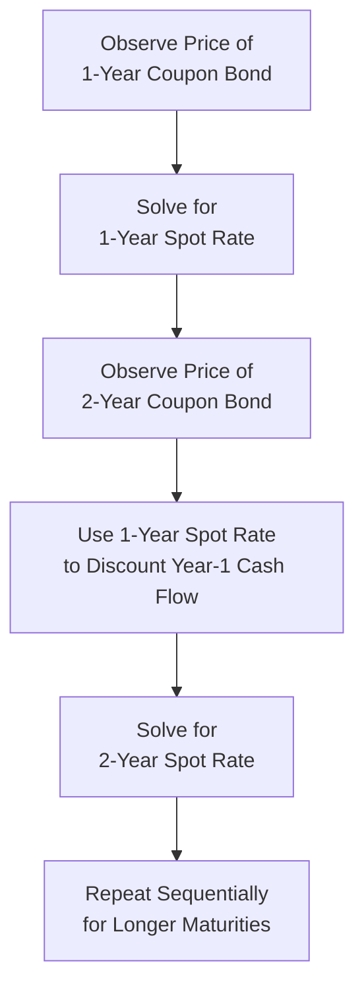

## The Term Structure of Interest Rates

### Overview

The term structure of interest rates describes the relationship between the yields of bonds of similar credit quality and their time to maturity. This relationship, commonly visualized as the yield curve, is central to fixed-income valuation, monetary policy analysis, and macroeconomic forecasting.

### The Yield Curve

The yield curve plots yield to maturity against time to maturity for bonds of comparable credit quality, typically using government securities (e.g., U.S. Treasuries) as the benchmark since they are considered free of default risk.

**Common Yield Curve Shapes**

| Shape | Description | Typical Interpretation |
| --- | --- | --- |
| Normal (Upward-Sloping) | Long-term yields higher than short-term yields | Most common shape; reflects positive term premium and/or expectations of economic growth |
| Inverted (Downward-Sloping) | Short-term yields higher than long-term yields | Historically associated with expectations of economic slowdown or recession |
| Flat | Similar yields across maturities | Often observed during transitional periods between normal and inverted curve regimes |
| Humped | Medium-term yields higher than both short- and long-term yields | Less common; can reflect specific supply/demand dynamics at intermediate maturities |

<svg xmlns="http://www.w3.org/2000/svg" viewBox="0 0 620 380" font-family="Arial, sans-serif">
<text x="310" y="20" text-anchor="middle" font-size="14" font-weight="bold">Yield Curve Shapes (svg_diagram)</text>
<line x1="70" y1="330" x2="580" y2="330" stroke="black" stroke-width="1" />
<line x1="70" y1="330" x2="70" y2="50" stroke="black" stroke-width="1" />
<text x="325" y="360" text-anchor="middle" font-size="12">Time to Maturity</text>
<text x="30" y="190" text-anchor="middle" font-size="12" transform="rotate(-90 30 190)">Yield</text>
<path d="M 90 280 Q 250 220 540 100" fill="none" stroke="#2c6fbb" stroke-width="2.5" />
<text x="440" y="90" font-size="11" fill="#2c6fbb">Normal</text>
<path d="M 90 130 Q 250 200 540 280" fill="none" stroke="#c0392b" stroke-width="2.5" />
<text x="440" y="295" font-size="11" fill="#c0392b">Inverted</text>
<path d="M 90 210 L 540 205" fill="none" stroke="#27ae60" stroke-width="2.5" />
<text x="440" y="195" font-size="11" fill="#27ae60">Flat</text>
</svg>

### Spot Rates and the Term Structure

The term structure is most precisely represented by spot rates: the yield on a zero-coupon bond of a given maturity. Spot rates are the theoretically correct discount rates for valuing individual cash flows at each corresponding maturity.

$$P = \sum_{t=1}^{n} \frac{CF_t}{(1+z_t)^t}$$

Where $z_t$ is the spot rate applicable to a cash flow occurring at time $t$. This differs from using a single YTM to discount all cash flows of a coupon bond, since YTM represents a blended average of the spot rates across all the bond's cash flow dates.

### Bootstrapping the Spot Rate Curve

Since zero-coupon bonds are not always available at every maturity, spot rates are commonly derived ("bootstrapped") from the prices of coupon-bearing bonds, working sequentially from the shortest to longest maturity.

### Worked Example — Bootstrapping

Given the following par bonds (annual coupons, Face Value = $1,000):

| Maturity | Coupon Rate | Price |
| --- | --- | --- |
| 1-Year | 4% | $1,000.00 (trades at par) |
| 2-Year | 5% | $1,000.00 (trades at par) |

**Step 1 — Solve for the 1-Year Spot Rate**

Since the 1-year bond trades at par with a 4% coupon, its YTM equals its coupon rate:

$$z_1 = 4\%$$

**Step 2 — Solve for the 2-Year Spot Rate**

The 2-year bond's price equation, using $z_1$ for the first cash flow:

$$1{,}000 = \frac{50}{(1+0.04)^1} + \frac{1{,}050}{(1+z_2)^2}$$

$$1{,}000 = 48.08 + \frac{1{,}050}{(1+z_2)^2}$$

$$\frac{1{,}050}{(1+z_2)^2} = 951.92$$

$$(1+z_2)^2 = \frac{1{,}050}{951.92} = 1.1030$$

$$1+z_2 = \sqrt{1.1030} \approx 1.0503$$

$$z_2 \approx 5.03\%$$

**Output**

- 1-Year Spot Rate: 4.00%
- 2-Year Spot Rate: ≈5.03%

Note that the 2-year spot rate (5.03%) is slightly higher than the 2-year bond's coupon rate (5%), illustrating why spot rates and YTM diverge for coupon-bearing instruments once the underlying spot curve is not flat.

### Forward Rates

A forward rate is the interest rate for a future period implied by the current term structure of spot rates — effectively, the rate the market expects (under certain theories) to prevail for a loan beginning at a future date.

$$(1+z_2)^2 = (1+z_1)(1+f_{1,2})$$

Solving for the one-year forward rate one year from now ($f_{1,2}$):

$$f_{1,2} = \frac{(1+z_2)^2}{(1+z_1)} - 1$$

**Worked Example — Forward Rate Calculation**

Using $z_1 = 4\%$ and $z_2 = 5.03\%$ from above:

$$f_{1,2} = \frac{(1.0503)^2}{1.04} - 1 = \frac{1.1031}{1.04} - 1 = 1.0607 - 1 = 0.0607$$

**Output**

- Implied 1-Year Forward Rate (starting in Year 1): ≈6.07%

This represents the interest rate the market is implicitly pricing for a one-year loan originating one year from today, consistent with the no-arbitrage relationship between spot and forward rates.

### Theories Explaining the Term Structure

**1. Pure Expectations Theory**

Long-term rates are determined solely by the market's expectations of future short-term rates. Under this theory, forward rates are unbiased predictors of future spot rates.

$$(1+z_n)^n = (1+z_1)(1+E[r_2])(1+E[r_3])\cdots(1+E[r_n])$$

**2. Liquidity Preference Theory**

Investors demand a liquidity premium for holding longer-maturity bonds, since longer maturities carry greater price risk and reduced liquidity. This implies forward rates are biased upward estimates of expected future spot rates, and helps explain why yield curves are normal (upward-sloping) more often than inverted.

**3. Market Segmentation Theory**

Different investor clienteles (e.g., banks favoring short maturities, pension funds and insurers favoring long maturities) operate largely within preferred maturity segments, with limited substitution across segments. Under this theory, yields at each maturity are determined primarily by the independent supply and demand within that specific segment, rather than by expectations of future rates.

**4. Preferred Habitat Theory**

A moderated version of market segmentation: investors have preferred maturity ranges but will shift outside them if compensated with a sufficient yield premium, allowing some cross-segment influence while still permitting preferences to affect the curve's shape.

| Theory | Key Driver of Term Structure | Curve Implication |
| --- | --- | --- |
| Pure Expectations | Expected future short-term rates | Can explain any shape based purely on rate expectations |
| Liquidity Preference | Expectations + liquidity premium | Biases curve toward upward slope |
| Market Segmentation | Independent supply/demand per maturity segment | Curve shape driven by segment-specific factors |
| Preferred Habitat | Segment preference + yield-premium-driven flexibility | Blends segmentation with some expectations influence |

[Inference] No single theory is universally regarded as fully explaining observed term structure behavior; most practitioners view the actual yield curve as reflecting a combination of rate expectations, liquidity/risk premia, and supply-demand dynamics across maturity segments, though the relative weight of each factor is debated and can vary over time.

### The Yield Curve as an Economic Indicator

**Key Points**

- An inverted yield curve (particularly the spread between long-term and short-term Treasury yields, such as the 10-year minus 2-year or 10-year minus 3-month spread) has historically preceded many U.S. recessions
- [Unverified] While inversion has preceded most recent recessions historically, the lead time between inversion and recession onset has varied considerably across cycles, and not every inversion has been followed by a recession within a consistent timeframe, so its predictive reliability going forward is not guaranteed
- Central bank monetary policy actions (e.g., short-term rate hikes to combat inflation) directly influence the short end of the curve, while long-term rates are more influenced by growth and inflation expectations, which can drive flattening or inversion

### Applications in Corporate Finance

- **Bond Valuation**: Spot rates derived from the term structure provide the theoretically correct discount rates for valuing individual cash flows of any fixed-income security
- **Cost of Debt Estimation**: The shape of the term structure informs the appropriate benchmark rate for debt of a given maturity when estimating a firm's cost of debt
- **Capital Budgeting**: Project discount rates may reference term-structure-consistent risk-free rates matched to the project's cash flow horizon
- **Interest Rate Risk Management**: Corporate treasurers use term structure analysis to inform decisions on the maturity structure of debt issuance and interest rate hedging (e.g., swaps)
- **Derivatives Pricing**: Forward rates derived from the term structure are essential inputs for pricing interest rate derivatives, including forward rate agreements and interest rate swaps

**Related Topics**

- Bond pricing and yield to maturity
- Duration and convexity as interest rate risk measures
- Interest rate swaps and forward rate agreements
- Credit spreads and default risk pricing
- Monetary policy and its transmission to the yield curve
- The expectations hypothesis and empirical tests of term structure theories