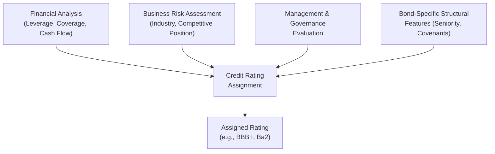

## Credit Risk and Bond Ratings

### Overview

Credit risk is the risk that a bond issuer fails to make timely interest or principal payments as promised. Bond ratings, assigned by independent credit rating agencies, provide a standardized assessment of this risk, directly influencing a bond's required yield, pricing, and market accessibility.

### Components of Credit Risk

**Key Points**

- **Default Risk**: The probability that the issuer fails to make a scheduled payment of interest or principal
- **Loss Given Default (LGD)**: The proportion of the bond's value expected to be lost if default occurs, after accounting for any recovery
- **Recovery Rate**: The percentage of face value (or claim amount) that bondholders can expect to recover in the event of default, often through bankruptcy proceedings ($\text{Recovery Rate} = 1 - LGD$)
- **Credit Spread Risk**: The risk that the yield spread over a benchmark risk-free rate widens due to a perceived increase in credit risk, even absent an actual default, causing a mark-to-market price decline

### Major Credit Rating Agencies

| Agency | Highest Rating | Notes |
| --- | --- | --- |
| S&P Global Ratings | AAA | Uses letter-grade scale with +/- modifiers |
| Moody's Investors Service | Aaa | Uses letter-grade scale with numerical modifiers (1, 2, 3) |
| Fitch Ratings | AAA | Uses letter-grade scale similar to S&P |

### Rating Scale Comparison

| S&P / Fitch | Moody's | Category |
| --- | --- | --- |
| AAA | Aaa | Investment Grade — Highest Quality |
| AA+/AA/AA- | Aa1/Aa2/Aa3 | Investment Grade — High Quality |
| A+/A/A- | A1/A2/A3 | Investment Grade — Upper Medium |
| BBB+/BBB/BBB- | Baa1/Baa2/Baa3 | Investment Grade — Lower Medium |
| BB+/BB/BB- | Ba1/Ba2/Ba3 | Speculative (High Yield) — Non-Investment Grade |
| B+/B/B- | B1/B2/B3 | Speculative — Higher Risk |
| CCC and below | Caa and below | Highly Speculative / Substantial Risk |
| D | C | In Default |

**Key Points**

- **Investment Grade**: BBB-/Baa3 or higher — generally associated with lower default probability and broader institutional investor eligibility (many pension funds and insurers have investment-grade-only mandates)
- **High Yield (Junk Bonds)**: BB+/Ba1 or lower — carry higher default risk and correspondingly higher coupon rates to compensate investors
- The boundary between investment grade and high yield (the "BBB-/BB+" threshold) is closely watched, since a downgrade below investment grade ("fallen angel" status) can trigger forced selling by mandate-constrained institutional holders

### Factors Considered in Credit Rating Analysis

**Key Points**

- **Financial Metrics**: Leverage ratios (Debt/EBITDA), interest coverage ratios (EBITDA/Interest Expense), profitability margins, cash flow generation and stability
- **Business Risk**: Industry cyclicality, competitive position, market share, diversification of revenue streams
- **Management and Governance**: Track record, strategic consistency, corporate governance practices
- **Macroeconomic and Industry Environment**: Sector-wide regulatory or cyclical pressures affecting the issuer
- **Structural Features of the Bond**: Seniority, collateral/security, covenants, and structural subordination within the capital structure

### Credit Spreads

The credit spread is the additional yield a corporate (or other non-risk-free) bond offers over a comparable-maturity risk-free benchmark (typically a government bond), compensating investors for bearing credit risk.

$$\text{Credit Spread} = YTM_{corporate} - YTM_{risk-free, matched maturity}$$

**Key Points**

- Credit spreads widen during economic downturns or periods of heightened risk aversion, and narrow ("compress") during periods of economic optimism or strong risk appetite
- Spreads are generally wider for lower-rated bonds, reflecting higher perceived default risk
- Spreads also incorporate a liquidity premium, since lower-rated or smaller issues often trade less frequently, adding an additional yield component beyond pure default compensation

### Worked Example — Estimating a Default-Risk-Adjusted Required Return

A 5-year BBB-rated corporate bond has a YTM of 6.5%. The 5-year U.S. Treasury yield is 4.0%.

**Step 1 — Calculate the Credit Spread**

$$\text{Credit Spread} = 6.5\% - 4.0\% = 2.5\%$$

**Output**

- Credit Spread: 2.5% (or 250 basis points)

This 250 basis point spread compensates the bondholder for the combination of default risk and any liquidity premium associated with this specific BBB-rated issuer relative to the risk-free benchmark.

### Simplified Expected Return Framework Incorporating Default Risk

A bond's promised YTM assumes full payment of all contractual cash flows. The expected return, accounting for default probability, can be approximated as:

$$E(R) \approx YTM - \left[P(\text{default}) \times LGD\right]$$

**Worked Example**

A bond has a promised YTM of 9%, an estimated annual default probability of 3%, and a loss given default of 60% (i.e., 40% recovery rate).

$$E(R) \approx 9\% - (0.03 \times 0.60) = 9\% - 1.8\% = 7.2\%$$

**Output**

- Expected Return (Default-Adjusted): ≈7.2%

[Inference] This is a simplified single-period approximation; more rigorous credit risk models (e.g., structural models like Merton's model, or reduced-form intensity models) account for the term structure of default probabilities, correlation across default events, and more complex recovery assumptions.

### Structural vs. Reduced-Form Credit Risk Models

| Model Type | Approach | Example |
| --- | --- | --- |
| Structural Models | Model default as occurring when firm asset value falls below a debt threshold, using option-pricing theory | Merton Model (1974) |
| Reduced-Form Models | Model default as a statistically modeled random event (a "hazard rate" or intensity process), without explicitly modeling firm asset value | Jarrow-Turnbull, Duffie-Singleton frameworks |

**Key Points**

- The Merton Model treats corporate equity as analogous to a call option on the firm's assets, with the debt's face value as the strike price, allowing default probability to be derived from option-pricing mathematics
- [Unverified] The relative predictive accuracy of structural versus reduced-form models varies by study, market segment, and time period, and practitioners often use both approaches for different applications (e.g., structural models for equity-implied credit risk, reduced-form models for pricing credit derivatives)

### Bond Covenants as Credit Risk Mitigants

**Key Points**

- **Affirmative Covenants**: Require the issuer to take specific actions (e.g., maintain insurance, provide financial statements)
- **Negative Covenants**: Restrict issuer actions (e.g., limits on additional debt issuance, restrictions on asset sales, dividend restrictions)
- **Financial Covenants**: Require maintenance of specific financial ratios (e.g., maximum leverage ratio, minimum interest coverage ratio)
- Covenant violations can trigger technical default, potentially accelerating repayment obligations even absent a missed payment

### Rating Migration and Watch Lists

**Key Points**

- Ratings are not static; agencies periodically review and can upgrade or downgrade issuers as credit conditions change
- **Credit Watch / Rating Watch**: A formal indication that a rating is under review for potential change, often triggered by a specific event (e.g., announced M&A, regulatory action)
- **Rating Outlook**: A longer-term directional indicator (Positive, Negative, Stable, Developing) reflecting the agency's view on the likely direction of a future rating change, distinct from an imminent watch-list action

### Applications in Corporate Finance

- **Cost of Debt Estimation**: Bond ratings and associated credit spreads directly inform the cost of debt used in WACC calculations, particularly for firms without extensive publicly traded debt history
- **Capital Structure Decisions**: Firms often manage leverage with an eye toward maintaining a target credit rating, since rating changes affect borrowing costs and market access
- **Debt Covenant Negotiation**: Understanding rating agency criteria helps firms negotiate covenant packages that balance lender protection with operational flexibility
- **Credit Risk Management**: Banks and institutional lenders use rating frameworks (internal or external) as part of loan pricing and portfolio risk management
- **Regulatory Capital Requirements**: Bank and insurance regulatory capital frameworks often reference credit ratings to determine risk-weighted asset calculations

### Limitations and Criticisms of Credit Ratings

- Ratings are inherently backward- and forward-looking assessments subject to agency judgment, and rating agencies have faced criticism historically for lag in downgrading issuers ahead of realized defaults (notably scrutinized following the 2008 financial crisis regarding structured credit products)
- Issuer-pays business models (where the rated entity pays the rating agency) have raised conflict-of-interest concerns in academic and regulatory discussions
- [Inference] Ratings represent a relative ranking of credit quality rather than a precise, guaranteed probability of default; actual default experience within a given rating category can vary across economic cycles and is not a fixed, immutable statistic

**Related Topics**

- Bond pricing and yield to maturity
- The term structure of interest rates and credit spread curves
- Merton's structural credit risk model
- Cost of debt estimation for WACC
- Bond covenants and indenture provisions
- Credit default swaps and credit derivatives